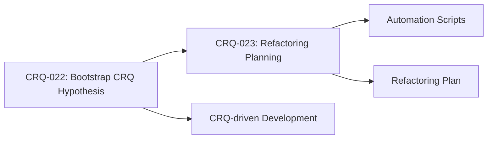

### **User description**
# CRQ-023-Refactoring_Planning_and_Automation.md

## Change Request: Refactoring Planning and Automation Script Development

### Objective

To plan the systematic refactoring of the existing codebase into CRQ-driven branches, aligning with the "Bootstrap CRQ Hypothesis" (`CRQ-022`), and to develop automation scripts that streamline this process, ensuring each additional change resides in its own dedicated branch.

### Description

This CRQ initiates the practical implementation phase of the "Bootstrap CRQ Hypothesis." It involves:

1.  **Refactoring Planning:**
    *   Analyzing the current codebase to identify logical units, features, or components that can be encapsulated within individual CRQs and their corresponding branches.
    *   Defining a sequence or dependency graph for these refactoring CRQs, ensuring a safe and incremental transition.
    *   Establishing clear criteria for what constitutes a "100% ready" feature for merging, as per `CRQ-022`.

2.  **Automation Script Development:**
    *   Developing shell scripts (or other suitable automation) to assist in the refactoring process. These scripts will aim to:
        *   Automate the creation of new branches for each refactoring CRQ.
        *   Facilitate the migration of existing code into these new, CRQ-specific branches.
        *   Assist in the creation of Pull Requests for these refactoring branches.
        *   Potentially integrate with existing tools like `gh cli` to manage the workflow.

This effort will ensure that all future development, including the refactoring of legacy code, adheres to the principle of "each additional change to be in its own branch," thereby constructing the system in a step-by-step and safe manner.

### Expected Outcome

*   A detailed plan for refactoring the existing codebase into CRQ-driven branches.
*   A set of automation scripts that reduce manual effort in branch creation, code migration, and PR management for refactoring tasks.
*   Clear guidelines for future development to ensure adherence to the "Bootstrap CRQ Hypothesis."

### Justification/Benefit

*   **Systematic Refactoring:** Provides a structured approach to a potentially complex refactoring effort.
*   **Increased Efficiency:** Automation reduces the overhead of managing numerous small, CRQ-specific branches.
*   **Enhanced Safety:** Ensures that refactoring changes are isolated, reviewed, and integrated incrementally.
*   **Adherence to Philosophy:** Directly supports the implementation of the "Bootstrap CRQ Hypothesis" and the "One-to-One CRQ to Branch and PR" mapping.

### Dependencies

*   Understanding and acceptance of `CRQ-022-Bootstrap_CRQ_Hypothesis.md`.
*   Access to the existing codebase for analysis.
*   Development environment with Git and `gh cli` configured.

___

### **PR Type**
Documentation

___

### **Description**
- Add CRQ-022 Bootstrap CRQ Hypothesis documentation

- Add CRQ-023 Refactoring Planning and Automation documentation

- Establish CRQ-driven development methodology framework

- Define systematic refactoring approach for existing codebase

___

### Diagram Walkthrough

 
<h3> File Walkthrough</h3>

<table><thead><tr><th></th><th align="left">Relevant files</th></tr></thead><tbody><tr><td><strong>Documentation</strong></td><td><table>
<tr>
  <td>
    

      
<strong>CRQ-022-Bootstrap_CRQ_Hypothesis.md</strong><dd><code>Bootstrap CRQ Hypothesis documentation</code>&nbsp; &nbsp; &nbsp; &nbsp; &nbsp; &nbsp; &nbsp; &nbsp; &nbsp; &nbsp; &nbsp; &nbsp; &nbsp; &nbsp; &nbsp; &nbsp; &nbsp; &nbsp; &nbsp; </dd>

docs/crq/CRQ-022-Bootstrap_CRQ_Hypothesis.md

<ul><li>Define Bootstrap CRQ Hypothesis for system construction  <li> Establish CRQ-driven development paradigm  <li> Outline refactoring approach into CRQ-branches  <li> Specify 100% readiness criteria for merging</ul>

  </td>
  <td><a href="https://github.com/meta-introspector/git-submodules-rs-nix/pull/2/files#diff-00f2adf174fa6ab1e651e13e270b1648fe016faa8a0eabf1d4b3b7e739a1b03a">+44/-0</a>&nbsp; &nbsp; </td>

</tr>

<tr>
  <td>
    

      
<strong>CRQ-023-Refactoring_Planning_and_Automation.md</strong><dd><code>Refactoring planning and automation documentation</code>&nbsp; &nbsp; &nbsp; &nbsp; &nbsp; &nbsp; &nbsp; &nbsp; </dd>

docs/crq/CRQ-023-Refactoring_Planning_and_Automation.md

<ul><li>Define refactoring planning objectives and approach  <li> Outline automation script development requirements  <li> Establish CRQ-specific branch creation workflow  <li> Specify integration with <code>gh cli</code> tools</ul>

  </td>
  <td><a href="https://github.com/meta-introspector/git-submodules-rs-nix/pull/2/files#diff-6ab5d8c051e69b2564e739f4908f728b267fe4282499d6dca9982fb6e1ee81c8">+44/-0</a>&nbsp; &nbsp; </td>

</tr>
</table></td></tr></tr></tbody></table>

___

<!-- This is an auto-generated comment: release notes by coderabbit.ai -->

## Summary by CodeRabbit

- Documentation
  - Introduced a formal “Bootstrap CRQ Hypothesis” describing a CRQ-driven development and refactoring blueprint, expected outcomes (modularity, traceability, auditable evolution), and dependencies.
  - Added guidance for refactoring planning: mapping code into CRQ-scoped units, safe incremental sequencing, and clear merge readiness criteria.
  - Documented an automation approach for creating CRQ branches and PRs to streamline refactoring workflows, with optional CLI integration and environment prerequisites.
  - No changes to public APIs or application behavior.

<!-- end of auto-generated comment: release notes by coderabbit.ai -->
