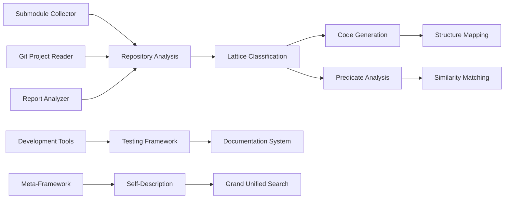

### **User description**
# CRQ-40-crq-009-grand-unified-framework.md

## Change Request: crq 009 grand unified framework
**Change Request (CRQ)**

**Title:** Current Task Alignment with Grand Unified Project Framework

**Description:**
This change requests a formal review and analysis of the current task's role and contribution within the context of the project's "Grand Unified Framework" (GUF). The GUF represents the overarching, integrated vision or system that encompasses all aspects of the project. This review aims to explicitly articulate how the current task serves as an essential component of the GUF, contributes to its coherence, and advances its ultimate objectives. The process will involve mapping the task's inputs, outputs, and functionalities to the broader framework, ensuring its seamless integration and maximizing its impact within the unified system.

**Justification/Business Value:**
*   **Strategic Clarity**: Provides a clear understanding of how the current task fits into the larger project vision, enhancing strategic alignment.
*   **Optimized Contribution**: Ensures the task is designed and executed in a way that maximizes its value to the overall framework, avoiding isolated or redundant efforts.
*   **Improved Integration**: Facilitates seamless integration of the task's outcomes with other components of the GUF.
*   **Enhanced Motivation**: Team members gain a deeper appreciation for their work's significance within the grand scheme of the project.
*   **Risk Mitigation**: Identifying potential misalignments early can prevent costly rework or architectural conflicts.

**Scope:**
*   **Included**:
    *   Articulation of the project's "Grand Unified Framework" (GUF) or its core components.
    *   Detailed analysis of the current task's objectives, deliverables, and dependencies.
    *   Mapping of the current task's functionalities and interfaces to the GUF.
    *   Documentation of the task's role, contribution, and alignment within the GUF.
    *   Recommendations for optimizing the task's design or execution to better serve the GUF.
*   **Excluded**:
    *   Redefinition of the entire Grand Unified Framework itself (this process assumes an existing or evolving GUF).
    *   Detailed technical implementation of the current task (focus is on its strategic placement).
    *   Philosophical debates on the nature of "unity" beyond its practical application to project architecture.

**Impact:**
*   **Positive**: Leads to a more cohesive, purposeful, and efficiently executed project, with each task contributing optimally to the grand vision.
*   **Negative**: Requires dedicated time for high-level conceptual analysis and potentially adjustments to the task's scope or design.

**Dependencies:**
*   A defined or evolving understanding of the project's "Grand Unified Framework."
*   Clear objectives and scope for the "current task."
*   Collaboration with project architects and stakeholders.

**Effort/Timeline:**
*   **Estimated Effort**: Medium. Involves conceptual mapping and strategic analysis.
*   **Estimated Timeline**: To be determined based on the complexity of the GUF and the current task.

**Verification:**
*   The current task's contribution to the GUF is clearly articulated and understood by stakeholders.
*   The task's outcomes seamlessly integrate into the broader framework.
*   Future tasks are consistently reviewed and aligned with the GUF, leading to a more coherent project evolution.

___

### **PR Type**
Enhancement, Documentation

___

### **Description**
• **Core Framework Implementation**: Comprehensive lattice-based code analysis framework with multiple Rust applications for repository classification, code generation, and similarity matching
• **Repository Analysis Tools**: New submodule collector, Git project reader, and report analyzer with string/organization analysis capabilities
• **Code Generation System**: Lattice code generator with procedural macros, structure generators, and automated code creation for hierarchical organization
• **Development Infrastructure**: Enhanced Nix flake with extensive development tools, GitHub CLI wrapper scripts, and comprehensive testing framework
• **Documentation & Methodology**: Structured testing framework, scalable analysis methodology, and standardized CRQ documentation system
• **Meta-Framework Components**: Self-referential meta-model implementation and grand unified search system conceptual framework
• **Generated Code Structures**: Complete set of generated lattice types, traits, and layer implementations with generic support

___

### Diagram Walkthrough

 
<h3> File Walkthrough</h3>

<table><thead><tr><th></th><th align="left">Relevant files</th></tr></thead><tbody><tr><td><strong>Configuration changes</strong></td><td>

2 files
<table>
<tr>
  <td>
    

      
<strong>flake.nix</strong><dd><code>Enhanced Nix flake with submodule-collector and development tools</code></dd>

flake.nix

• Removed empty line at the beginning of the file  • Added new  <code>submodule-collector</code> derivation with Rust build configuration  • Added  development tools including jq, valgrind, and extensive Emacs packages  for Rust/OCaml development  • Added shell formatting tools like  shellcheck, shfmt, and nixpkgs-fmt

  </td>
  <td><a href="https://github.com/meta-introspector/git-submodules-rs-nix/pull/17/files#diff-206b9ce276ab5971a2489d75eb1b12999d4bf3843b7988cbe8d687cfde61dea0">+34/-1</a>&nbsp; &nbsp; </td>

</tr>

<tr>
  <td>
    

      
<strong>shell.nix</strong><dd><code>Added valgrind to development shell dependencies</code>&nbsp; &nbsp; &nbsp; &nbsp; &nbsp; &nbsp; &nbsp; &nbsp; &nbsp; </dd>

shell.nix

• Added `pkgs.valgrind` to the buildInputs for the development shell

  </td>
  <td><a href="https://github.com/meta-introspector/git-submodules-rs-nix/pull/17/files#diff-e53dfbfffe62ae3c0b411b3938ccffa9fb6a2ecc565f55785ef8daa756631a6b">+1/-1</a>&nbsp; &nbsp; &nbsp; </td>

</tr>
</table>
</td></tr><tr><td><strong>Enhancement</strong></td><td>

51 files
<table>
<tr>
  <td>
    

      
<strong>lib.rs</strong><dd><code>New lattice code generation library with procedural macros</code></dd>

lattice_code_generator/src/lib.rs

• Created comprehensive code generation library for lattice structures   • Implements functions to generate ValueType enums, traits, and  structs using <code>proc_macro2</code> and <code>quote</code>  • Includes test suite for  validating generated code structure  • Provides main demonstration  function showing code generation capabilities

  </td>
  <td><a href="https://github.com/meta-introspector/git-submodules-rs-nix/pull/17/files#diff-243854d89636db85a935fa955ee16fa44ea3ca7092902bc29701c3a825b0ba0a">+296/-0</a>&nbsp; </td>

</tr>

<tr>
  <td>
    

      
<strong>main.rs</strong><dd><code>New submodule collector tool for Git repository analysis</code>&nbsp; </dd>

submodule-collector/src/main.rs

• Created command-line tool for scanning Git repositories and  submodules  • Implements recursive submodule processing with detailed  JSON reporting  • Includes error handling and resilient processing of  failed repositories  • Uses <code>clap</code>, <code>serde</code>, <code>git2</code>, and <code>walkdir</code> for  comprehensive Git analysis

  </td>
  <td><a href="https://github.com/meta-introspector/git-submodules-rs-nix/pull/17/files#diff-a47f0db0f72bdfe38e4c5fc28fcb76ddd4adc991f2b12a672f14f8348411c83a">+279/-0</a>&nbsp; </td>

</tr>

<tr>
  <td>
    

      
<strong>main.rs</strong><dd><code>New project file lattice builder with predicate classification</code></dd>

project_file_lattice_builder/src/main.rs

• Created conceptual lattice builder for project file classification  •  Implements predicate-based file analysis and classification system  •  Includes comprehensive test suite for predicate extraction logic  •  Demonstrates mapping files into lattice hierarchy based on content  analysis

  </td>
  <td><a href="https://github.com/meta-introspector/git-submodules-rs-nix/pull/17/files#diff-307096deb9eb86f24a90391b001a081a638672a52f8c27651d21c72bcfdcd2a1">+202/-0</a>&nbsp; </td>

</tr>

<tr>
  <td>
    

      
<strong>lattice_mapper_app.rs</strong><dd><code>New lattice mapper for code similarity matching</code>&nbsp; &nbsp; &nbsp; &nbsp; &nbsp; &nbsp; &nbsp; &nbsp; &nbsp; &nbsp; </dd>

src/lattice_mapper_app.rs

• Created application demonstrating code mapping into pre-generated  lattice structures  • Implements similarity-based matching using  predicate analysis  • Bridges lattice structure generation with  repository classification  • Shows conceptual "generate and then match"  process for code organization

  </td>
  <td><a href="https://github.com/meta-introspector/git-submodules-rs-nix/pull/17/files#diff-d4b10dc90da2ebd2e54c216c08faf398915f797cc4bf2e94185cd40832762c62">+209/-0</a>&nbsp; </td>

</tr>

<tr>
  <td>
    

      
<strong>lattice_types.rs</strong><dd><code>Core lattice type system with generic structures</code>&nbsp; &nbsp; &nbsp; &nbsp; &nbsp; &nbsp; &nbsp; &nbsp; &nbsp; </dd>

src/lattice_types.rs

• Defined comprehensive type system for lattice framework  implementation  • Includes ValueType enum, traits, and generic  structures for instances and layers  • Implements demonstration of  conceptual lattice usage with different value types  • Provides  foundation types for the lattice idea framework

  </td>
  <td><a href="https://github.com/meta-introspector/git-submodules-rs-nix/pull/17/files#diff-b4cbc31fe99d9b693a12612fdfbcbb6a05afbab7836ee96ef34759a80eea2dfc">+196/-0</a>&nbsp; </td>

</tr>

<tr>
  <td>
    

      
<strong>repo_search_simulator.rs</strong><dd><code>Repository search simulator with predicate-based matching</code></dd>

src/repo_search_simulator.rs

• Created repository search simulator using predicate-based  classification  • Implements "search by example" functionality across  mock repositories  • Demonstrates lattice framework application to  large codebase analysis  • Includes similarity scoring and conceptual  lattice integration

  </td>
  <td><a href="https://github.com/meta-introspector/git-submodules-rs-nix/pull/17/files#diff-0fd44409289d811f50e94913ae801d7ed5c483e8798303c297ac9854807cfe41">+202/-0</a>&nbsp; </td>

</tr>

<tr>
  <td>
    

      
<strong>meta_lattice_model.rs</strong><dd><code>Meta-model implementation with self-referential analysis</code>&nbsp; </dd>

src/meta_lattice_model.rs

• Implemented self-referential meta-model of the lattice idea  framework  • Creates conceptual representation with self-analysis  capabilities  • Demonstrates framework's capacity for meta-modeling and  similarity finding  • Includes multi-layered concept organization and  comparison logic

  </td>
  <td><a href="https://github.com/meta-introspector/git-submodules-rs-nix/pull/17/files#diff-4ad95f3ed0d6e795cabcf8199fb28fa159aef84b4f32e578f55079fa94e07625">+153/-0</a>&nbsp; </td>

</tr>

<tr>
  <td>
    

      
<strong>analyze_strings.rs</strong><dd><code>String analysis module with n-gram and emoji ontology</code>&nbsp; &nbsp; &nbsp; &nbsp; </dd>

report-analyzer-rs/src/analyze_strings.rs

• Created string analysis module for token frequency and n-gram  analysis  • Implements iterative emoji ontology application with  convergence checking  • Includes token collection from repository  reports and suggested rule generation  • Provides comprehensive text  analysis for repository classification

  </td>
  <td><a href="https://github.com/meta-introspector/git-submodules-rs-nix/pull/17/files#diff-2972c1dbf1387f1fc356a8a7315beb271dcacb9eb512719d2ac60d15084a7c1a">+171/-0</a>&nbsp; </td>

</tr>

<tr>
  <td>
    

      
<strong>lattice_classifier_app.rs</strong><dd><code>Lattice classifier application with predicate-based text analysis</code></dd>

src/lattice_classifier_app.rs

• Created lattice-based classification application for text snippets  •  Implements predicate-based classification with WordPredicate  structures  • Demonstrates "search by example" functionality using  generated lattice types  • Includes comprehensive lattice layer and  instance management

  </td>
  <td><a href="https://github.com/meta-introspector/git-submodules-rs-nix/pull/17/files#diff-2046e6cf0881f2c6f04e40c623dbf7b071fa54d0b330bd758caea2f306c79f59">+188/-0</a>&nbsp; </td>

</tr>

<tr>
  <td>
    

      
<strong>lib.rs</strong><dd><code>Git project reader library with status and file tracking</code>&nbsp; </dd>

git_project_reader/src/lib.rs

• Created library for reading Git project information including  tracked files  • Implements git status parsing and repository analysis  functionality  • Includes comprehensive test suite with temporary  repository setup  • Provides structured data collection from Git  repositories

  </td>
  <td><a href="https://github.com/meta-introspector/git-submodules-rs-nix/pull/17/files#diff-258b44c334cd672e0393e8cad155edd07074a84e46a6c7389d9d227e07b3e1d8">+174/-0</a>&nbsp; </td>

</tr>

<tr>
  <td>
    

      
<strong>grand_unified_search.rs</strong><dd><code>Grand unified search system conceptual framework</code>&nbsp; &nbsp; &nbsp; &nbsp; &nbsp; &nbsp; &nbsp; &nbsp; &nbsp; </dd>

src/grand_unified_search.rs

• Created conceptual outline for grand unified search system  •  Implements self-parsing, LLM interaction, and submodule tool  integration concepts  • Demonstrates theoretical framework for semantic  code analysis  • Includes placeholder implementations for complex  functionality

  </td>
  <td><a href="https://github.com/meta-introspector/git-submodules-rs-nix/pull/17/files#diff-b8a48c02f53b75052bc23d20df7488207a5b86d7815d3fb29ef0b8b985553ab1">+148/-0</a>&nbsp; </td>

</tr>

<tr>
  <td>
    

      
<strong>lattice_model.rs</strong><dd><code>Core lattice model with value types and predicate classification</code></dd>

src/lattice_model.rs

• Created core lattice model with ValueType enum and trait definitions   • Implements HasValueCount trait and generic Instance/LatticeLayer  structures  • Includes PredicateClassifier for text-based predicate  extraction  • Provides foundation types for lattice-based  classification systems

  </td>
  <td><a href="https://github.com/meta-introspector/git-submodules-rs-nix/pull/17/files#diff-780a4d5fb95789264d299113f8c45e066dafc4aa039180f7494020e35c5246b6">+136/-0</a>&nbsp; </td>

</tr>

<tr>
  <td>
    

      
<strong>word_predicate_analyzer.rs</strong><dd><code>Word predicate analyzer with n-gram lattice integration</code>&nbsp; &nbsp; </dd>

src/word_predicate_analyzer.rs

• Created word predicate analyzer using lattice type definitions  •  Implements text tokenization and n-gram analysis on predicate  representations  • Demonstrates vocabulary-based predicate extraction  and analysis  • Integrates with conceptual lattice structure for text  processing

  </td>
  <td><a href="https://github.com/meta-introspector/git-submodules-rs-nix/pull/17/files#diff-8b1a5639c122dab7e9c36fd0dac9ffa1dd9fbbbb4fb5d68eca6be406d0f63e83">+95/-0</a>&nbsp; &nbsp; </td>

</tr>

<tr>
  <td>
    

      
<strong>main.rs</strong><dd><code>Lattice structure generator with hierarchical organization</code></dd>

lattice_structure_generator/src/main.rs

• Created lattice structure generator for hierarchical code  organization  • Implements directory-based lattice structure creation  with layered instances  • Demonstrates conceptual mapping of existing  code into generated structure  • Uses lattice code generator library  for structured output

  </td>
  <td><a href="https://github.com/meta-introspector/git-submodules-rs-nix/pull/17/files#diff-0503dd508e5c7168f8b6b74fb16594f291c5cead8790bfaec55d85ac576166f2">+82/-0</a>&nbsp; &nbsp; </td>

</tr>

<tr>
  <td>
    

      
<strong>lib.rs</strong><dd><code>Added ZOS lattice builder for project file classification</code></dd>

src/lib.rs

• Added <code>build_zos_lattice</code> function for project file classification  •  Integrates lattice model for comprehensive file analysis and  categorization  • Implements multi-layer classification based on file  types and content  • Provides main library interface for lattice-based  project organization

  </td>
  <td><a href="https://github.com/meta-introspector/git-submodules-rs-nix/pull/17/files#diff-b1a35a68f14e696205874893c07fd24fdb88882b47c23cc0e0c80a30c7d53759">+78/-0</a>&nbsp; &nbsp; </td>

</tr>

<tr>
  <td>
    

      
<strong>main.rs</strong><dd><code>Lattice generator application for code structure creation</code></dd>

lattice_generator_app/src/main.rs

• Created application for generating lattice code structures  •  Implements file-based code generation using lattice code generator  library  • Generates comprehensive set of lattice-related Rust code  files  • Provides organized output structure for generated lattice  components

  </td>
  <td><a href="https://github.com/meta-introspector/git-submodules-rs-nix/pull/17/files#diff-ba3c74e9dedda9c826a5198e4fb1879be1cc3251ad2be3b8bd4cef25d22bf646">+56/-0</a>&nbsp; &nbsp; </td>

</tr>

<tr>
  <td>
    

      
<strong>lattice_layer_struct.rs</strong><dd><code>Generated lattice layer structure implementation</code>&nbsp; &nbsp; &nbsp; &nbsp; &nbsp; &nbsp; &nbsp; &nbsp; &nbsp; </dd>

generated_lattice_code/lattice_layer_struct.rs

• Generated lattice layer structure code as single-line output  •  Contains LatticeLayer struct implementation with generic type support   • Includes methods for layer creation, instance addition, and  description

  </td>
  <td><a href="https://github.com/meta-introspector/git-submodules-rs-nix/pull/17/files#diff-0aacd04a7a621f806b54ffa94092f874682700841e03474720504945ec824126">+1/-0</a>&nbsp; &nbsp; &nbsp; </td>

</tr>

<tr>
  <td>
    

      
<strong>main.rs</strong><dd><code>Refactor main function and integrate string analysis</code>&nbsp; &nbsp; &nbsp; &nbsp; &nbsp; </dd>

report-analyzer-rs/src/main.rs

• Restructured main function to handle command-line arguments and file  loading directly  • Commented out calls to missing processing functions   • Added call to analyze_strings module for string analysis with emoji  ontology

  </td>
  <td><a href="https://github.com/meta-introspector/git-submodules-rs-nix/pull/17/files#diff-0c621fee3c56e03aa11c26e9371c0d100ee91ec12c43746c6cf2eb8f687bdeac">+50/-0</a>&nbsp; &nbsp; </td>

</tr>

<tr>
  <td>
    

      
<strong>program_self_description.rs</strong><dd><code>Add self-describing program demonstration</code>&nbsp; &nbsp; &nbsp; &nbsp; &nbsp; &nbsp; &nbsp; &nbsp; &nbsp; &nbsp; &nbsp; &nbsp; &nbsp; &nbsp; &nbsp; &nbsp; </dd>

src/program_self_description.rs

• Created a new Rust program demonstrating self-description concept  •  Implements functions to describe itself and find similar programs  •  Includes meta-assertion about the theoretical framework

  </td>
  <td><a href="https://github.com/meta-introspector/git-submodules-rs-nix/pull/17/files#diff-386ecf0f7a94fde9c182bd08fe96599c8620c47e849ed27d5ffd2d799bf30060">+37/-0</a>&nbsp; &nbsp; </td>

</tr>

<tr>
  <td>
    

      
<strong>lcp.rs</strong><dd><code>Add longest common prefix analysis module</code>&nbsp; &nbsp; &nbsp; &nbsp; &nbsp; &nbsp; &nbsp; &nbsp; &nbsp; &nbsp; &nbsp; &nbsp; &nbsp; &nbsp; &nbsp; &nbsp; </dd>

report-analyzer-rs/src/lcp.rs

• Implements longest common prefix analysis for repository paths and  URLs  • Provides functions to find LCP and perform analysis on report  data  • Includes printing functionality for LCP results

  </td>
  <td><a href="https://github.com/meta-introspector/git-submodules-rs-nix/pull/17/files#diff-b21ab373ab1b39d083a90c0171119e10f283f4af3edb4ab1148d439b9eda1101">+51/-0</a>&nbsp; &nbsp; </td>

</tr>

<tr>
  <td>
    

      
<strong>my_profiling_bench.rs</strong><dd><code>Add performance benchmarking with iai_callgrind</code>&nbsp; &nbsp; &nbsp; &nbsp; &nbsp; &nbsp; &nbsp; &nbsp; &nbsp; &nbsp; </dd>

benches/my_profiling_bench.rs

• Created benchmarking setup using <code>iai_callgrind</code> for performance  profiling  • Includes benchmarks for <code>add</code> function and dummy git config  parsing  • Sets up library benchmark group for performance testing

  </td>
  <td><a href="https://github.com/meta-introspector/git-submodules-rs-nix/pull/17/files#diff-ba6682e5e5c2b85faec0653350824785fbc61e8b011444d3fc293fc73a8eff5f">+36/-0</a>&nbsp; &nbsp; </td>

</tr>

<tr>
  <td>
    

      
<strong>types.rs</strong><dd><code>Define core data structures and CLI arguments</code>&nbsp; &nbsp; &nbsp; &nbsp; &nbsp; &nbsp; &nbsp; &nbsp; &nbsp; &nbsp; &nbsp; &nbsp; </dd>

report-analyzer-rs/src/types.rs

• Defines core data structures for submodule reporting  • Includes  <code>Args</code>, <code>Report</code>, <code>Ontology</code> structs with proper serialization  • Adds  command-line argument parsing with <code>clap</code>

  </td>
  <td><a href="https://github.com/meta-introspector/git-submodules-rs-nix/pull/17/files#diff-70a32aaec9d7a33bba7859aaec9a648355cf4a92b9a1c688430f60fd0b1ad036">+47/-0</a>&nbsp; &nbsp; </td>

</tr>

<tr>
  <td>
    

      
<strong>analyze_names.rs</strong><dd><code>Add repository name analysis functionality</code>&nbsp; &nbsp; &nbsp; &nbsp; &nbsp; &nbsp; &nbsp; &nbsp; &nbsp; &nbsp; &nbsp; &nbsp; &nbsp; &nbsp; &nbsp; </dd>

report-analyzer-rs/src/analyze_names.rs

• Implements repository name analysis from URLs and submodule data  •  Extracts and counts repository names using regex patterns  • Provides  frequency analysis of repository and submodule names

  </td>
  <td><a href="https://github.com/meta-introspector/git-submodules-rs-nix/pull/17/files#diff-ece2606d6df195d4968ecc9276f8faa6fb13f2dfbd036a099bdef2995f9eac1d">+30/-0</a>&nbsp; &nbsp; </td>

</tr>

<tr>
  <td>
    

      
<strong>value_type.rs</strong><dd><code>Generate value type enum with prime variants</code>&nbsp; &nbsp; &nbsp; &nbsp; &nbsp; &nbsp; &nbsp; &nbsp; &nbsp; &nbsp; &nbsp; &nbsp; &nbsp; </dd>

generated_lattice_code/value_type.rs

• Generated Rust code defining <code>ValueType</code> enum with prime value  variants  • Implements methods for value counting and zos sequence  generation  • Single-line compressed format for generated code

  </td>
  <td><a href="https://github.com/meta-introspector/git-submodules-rs-nix/pull/17/files#diff-4534ce506bbc5e0a512da2a9f61948dc44575940029777e3be9fa6f1ce706735">+1/-0</a>&nbsp; &nbsp; &nbsp; </td>

</tr>

<tr>
  <td>
    

      
<strong>analyze_orgs.rs</strong><dd><code>Add GitHub organization analysis functionality</code>&nbsp; &nbsp; &nbsp; &nbsp; &nbsp; &nbsp; &nbsp; &nbsp; &nbsp; &nbsp; &nbsp; </dd>

report-analyzer-rs/src/analyze_orgs.rs

• Implements organization analysis from GitHub URLs  • Extracts  organization names using regex patterns  • Provides frequency counting  of organizations in repositories

  </td>
  <td><a href="https://github.com/meta-introspector/git-submodules-rs-nix/pull/17/files#diff-dfc5e43d786c558598103c88d48bb1cfc40e246b3ba904ae455a340f1c5d7e0a">+26/-0</a>&nbsp; &nbsp; </td>

</tr>

<tr>
  <td>
    

      
<strong>lattice_struct.rs</strong><dd><code>Generate main lattice structure definitions</code>&nbsp; &nbsp; &nbsp; &nbsp; &nbsp; &nbsp; &nbsp; &nbsp; &nbsp; &nbsp; &nbsp; &nbsp; &nbsp; &nbsp; </dd>

generated_lattice_code/lattice_struct.rs

• Generated Rust code for main <code>Lattice</code> struct and trait definitions  •  Implements lattice layer management with dynamic trait objects  •  Single-line compressed format for generated code

  </td>
  <td><a href="https://github.com/meta-introspector/git-submodules-rs-nix/pull/17/files#diff-79d9dfa1f549d761bf956b17120979d037243e9dc1f10ebb9402e5b62ff5cf46">+1/-0</a>&nbsp; &nbsp; &nbsp; </td>

</tr>

<tr>
  <td>
    

      
<strong>instance_struct.rs</strong><dd><code>Generate instance structure with generic support</code>&nbsp; &nbsp; &nbsp; &nbsp; &nbsp; &nbsp; &nbsp; &nbsp; &nbsp; </dd>

generated_lattice_code/instance_struct.rs

• Generated Rust code for <code>Instance</code> struct with generic type parameter   • Implements instance creation and description methods  • Single-line  compressed format for generated code

  </td>
  <td><a href="https://github.com/meta-introspector/git-submodules-rs-nix/pull/17/files#diff-d3a134be5da73893ad11cfba2741e995cb5385d116f305bb9f90ba03072271f8">+1/-0</a>&nbsp; &nbsp; &nbsp; </td>

</tr>

<tr>
  <td>
    

      
<strong>lattice_layer_struct.rs</strong><dd><code>Generate lattice layer structure with generics</code>&nbsp; &nbsp; &nbsp; &nbsp; &nbsp; &nbsp; &nbsp; &nbsp; &nbsp; &nbsp; &nbsp; </dd>

generated_lattice_structure/lattice_layer_struct.rs

• Generated Rust code for <code>LatticeLayer</code> struct with generic support  •  Implements layer management and instance addition methods  •  Single-line compressed format for generated code

  </td>
  <td><a href="https://github.com/meta-introspector/git-submodules-rs-nix/pull/17/files#diff-8732c80f707e0ab6b869ea056076368c8830979c489e8c25c0b1d63a05affb3b">+1/-0</a>&nbsp; &nbsp; &nbsp; </td>

</tr>

<tr>
  <td>
    

      
<strong>duplicates.rs</strong><dd><code>Add duplicate repository URL analysis</code>&nbsp; &nbsp; &nbsp; &nbsp; &nbsp; &nbsp; &nbsp; &nbsp; &nbsp; &nbsp; &nbsp; &nbsp; &nbsp; &nbsp; &nbsp; &nbsp; &nbsp; &nbsp; &nbsp; &nbsp; </dd>

report-analyzer-rs/src/duplicates.rs

• Implements duplicate URL detection in repository data  • Provides  analysis and printing functions for duplicate repositories  • Maps URLs  to multiple paths for duplicate identification

  </td>
  <td><a href="https://github.com/meta-introspector/git-submodules-rs-nix/pull/17/files#diff-4d80fd66c8b316d5012d6352dd781de56fe14903a0f5394e6ce2fa81ee99e035">+25/-0</a>&nbsp; &nbsp; </td>

</tr>

<tr>
  <td>
    

      
<strong>input.rs</strong><dd><code>Add input handling and data loading utilities</code>&nbsp; &nbsp; &nbsp; &nbsp; &nbsp; &nbsp; &nbsp; &nbsp; &nbsp; &nbsp; &nbsp; &nbsp; </dd>

report-analyzer-rs/src/input.rs

• Implements command-line argument parsing and data loading  • Handles  JSON file reading for reports and ontology data  • Provides error  handling for file operations

  </td>
  <td><a href="https://github.com/meta-introspector/git-submodules-rs-nix/pull/17/files#diff-e9ea32f3583a31e364d9ff7d6c37296c5c56f4c8fe8b359a4693368182e54e3b">+22/-0</a>&nbsp; &nbsp; </td>

</tr>

<tr>
  <td>
    

      
<strong>apply_emojis.rs</strong><dd><code>Add emoji ontology text transformation</code>&nbsp; &nbsp; &nbsp; &nbsp; &nbsp; &nbsp; &nbsp; &nbsp; &nbsp; &nbsp; &nbsp; &nbsp; &nbsp; &nbsp; &nbsp; &nbsp; &nbsp; &nbsp; &nbsp; </dd>

report-analyzer-rs/src/apply_emojis.rs

• Implements emoji ontology application to text  • Replaces text  patterns with corresponding emojis from ontology  • Handles optional  ontology parameter gracefully

  </td>
  <td><a href="https://github.com/meta-introspector/git-submodules-rs-nix/pull/17/files#diff-b046d9b03ffcc74bc7362f658297d45a8141ccff9481915e5a8348b7f49a2297">+18/-0</a>&nbsp; &nbsp; </td>

</tr>

<tr>
  <td>
    

      
<strong>names_analysis.rs</strong><dd><code>Add name analysis printing with emoji support</code>&nbsp; &nbsp; &nbsp; &nbsp; &nbsp; &nbsp; &nbsp; &nbsp; &nbsp; &nbsp; &nbsp; &nbsp; </dd>

report-analyzer-rs/src/names_analysis.rs

• Implements printing functionality for repository name analysis  •  Sorts names by frequency and applies emoji ontology  • Displays top 10  most frequent repository/submodule names

  </td>
  <td><a href="https://github.com/meta-introspector/git-submodules-rs-nix/pull/17/files#diff-300b8fb41eee786eabd0188c0030f81f88dfc1cee7f998e57e62b26ff2a14c37">+14/-0</a>&nbsp; &nbsp; </td>

</tr>

<tr>
  <td>
    

      
<strong>org_analysis.rs</strong><dd><code>Add organization analysis printing with emoji support</code>&nbsp; &nbsp; &nbsp; &nbsp; </dd>

report-analyzer-rs/src/org_analysis.rs

• Implements printing functionality for organization analysis  • Sorts  organizations by frequency and applies emoji ontology  • Displays top  10 most frequent organizations

  </td>
  <td><a href="https://github.com/meta-introspector/git-submodules-rs-nix/pull/17/files#diff-5bc7fdd91e1797253239ee186eacd73c931025fcd10b5880906a97a8400fbdcc">+13/-0</a>&nbsp; &nbsp; </td>

</tr>

<tr>
  <td>
    

      
<strong>main.rs</strong><dd><code>Add Git repository testing utility</code>&nbsp; &nbsp; &nbsp; &nbsp; &nbsp; &nbsp; &nbsp; &nbsp; &nbsp; &nbsp; &nbsp; &nbsp; &nbsp; &nbsp; &nbsp; &nbsp; &nbsp; &nbsp; &nbsp; &nbsp; &nbsp; &nbsp; &nbsp; </dd>

git_test_repo/src/main.rs

• Creates simple Git repository testing program using <code>git2</code> crate  •  Opens current directory as Git repository and prints path information   • Basic error handling for Git operations

  </td>
  <td><a href="https://github.com/meta-introspector/git-submodules-rs-nix/pull/17/files#diff-8b9cadcb87746c34dbbc19f46f1ef3a55b401e70c5dba9cf5f2af4f9877fa594">+10/-0</a>&nbsp; &nbsp; </td>

</tr>

<tr>
  <td>
    

      
<strong>has_value_count_impls.rs</strong><dd><code>Generate HasValueCount trait implementation for bool</code>&nbsp; &nbsp; &nbsp; &nbsp; &nbsp; </dd>

generated_lattice_code/has_value_count_impls.rs

• Generated trait implementation for <code>HasValueCount</code> on <code>bool</code> type  •  Single-line compressed format for generated code  • Provides value  count of 2 for boolean type

  </td>
  <td><a href="https://github.com/meta-introspector/git-submodules-rs-nix/pull/17/files#diff-fc27ee60e32d05c14ba49d85ee4b7d8e66ac5c101ad0dbe3e5d349b4b9303ac8">+1/-0</a>&nbsp; &nbsp; &nbsp; </td>

</tr>

<tr>
  <td>
    

      
<strong>has_value_count_trait.rs</strong><dd><code>Generate HasValueCount trait definition</code>&nbsp; &nbsp; &nbsp; &nbsp; &nbsp; &nbsp; &nbsp; &nbsp; &nbsp; &nbsp; &nbsp; &nbsp; &nbsp; &nbsp; &nbsp; &nbsp; &nbsp; &nbsp; </dd>

generated_lattice_code/has_value_count_trait.rs

• Generated trait definition for <code>HasValueCount</code>  • Single-line  compressed format for generated code  • Defines interface for value  counting functionality

  </td>
  <td><a href="https://github.com/meta-introspector/git-submodules-rs-nix/pull/17/files#diff-cf0ba0ca0358cab475d52e9b5edf475682f4cd05a5cd4d554b917677343ec3b1">+1/-0</a>&nbsp; &nbsp; &nbsp; </td>

</tr>

<tr>
  <td>
    

      
<strong>standardize_and_move_crqs.sh</strong><dd><code>Add CRQ standardization and organization script</code>&nbsp; &nbsp; &nbsp; &nbsp; &nbsp; &nbsp; &nbsp; &nbsp; &nbsp; &nbsp; </dd>

tools/gh_scripts/standardize_and_move_crqs.sh

• Comprehensive bash script for standardizing CRQ file naming and  headers  • Implements dry-run mode and robust CRQ number calculation  •  Handles file renaming, header updates, and directory organization

  </td>
  <td><a href="https://github.com/meta-introspector/git-submodules-rs-nix/pull/17/files#diff-8c55bddfb101eb3114069c644947a8dd51e359934e566113c182d18a2dfd27ea">+149/-0</a>&nbsp; </td>

</tr>

<tr>
  <td>
    

      
<strong>create_crq_workflow.sh</strong><dd><code>Add CRQ workflow automation script</code>&nbsp; &nbsp; &nbsp; &nbsp; &nbsp; &nbsp; &nbsp; &nbsp; &nbsp; &nbsp; &nbsp; &nbsp; &nbsp; &nbsp; &nbsp; &nbsp; &nbsp; &nbsp; &nbsp; &nbsp; &nbsp; &nbsp; &nbsp; </dd>

tools/gh_scripts/create_crq_workflow.sh

• Bash script for creating GitHub workflow from CRQ files  • Automates  branch creation, task.md generation, and PR creation  • Integrates with  GitHub CLI for workflow automation

  </td>
  <td><a href="https://github.com/meta-introspector/git-submodules-rs-nix/pull/17/files#diff-6c8f66bef77ee7fde8332f1252ae40263db8cf2753250002be768b877a1ea40e">+79/-0</a>&nbsp; &nbsp; </td>

</tr>

<tr>
  <td>
    

      
<strong>boot.sh</strong><dd><code>Add main boot orchestration script</code>&nbsp; &nbsp; &nbsp; &nbsp; &nbsp; &nbsp; &nbsp; &nbsp; &nbsp; &nbsp; &nbsp; &nbsp; &nbsp; &nbsp; &nbsp; &nbsp; &nbsp; &nbsp; &nbsp; &nbsp; &nbsp; &nbsp; &nbsp; </dd>

boot.sh

• Main orchestration script for tmux session recording with asciinema   • Implements crash recovery checks and log processing  • Coordinates  session management and logging infrastructure

  </td>
  <td><a href="https://github.com/meta-introspector/git-submodules-rs-nix/pull/17/files#diff-c270322e6f914001c9d1d23e01d1eefe9469337f284b0c0a920c5f843a15b373">+38/-0</a>&nbsp; &nbsp; </td>

</tr>

<tr>
  <td>
    

      
<strong>gh_extract_actors.sh</strong><dd><code>Add GitHub actor extraction utility</code>&nbsp; &nbsp; &nbsp; &nbsp; &nbsp; &nbsp; &nbsp; &nbsp; &nbsp; &nbsp; &nbsp; &nbsp; &nbsp; &nbsp; &nbsp; &nbsp; &nbsp; &nbsp; &nbsp; &nbsp; &nbsp; &nbsp; </dd>

tools/gh_scripts/gh_extract_actors.sh

• Script to extract unique GitHub actors from issues and comments  •  Uses GitHub CLI and jq for JSON processing  • Provides comprehensive  actor analysis functionality

  </td>
  <td><a href="https://github.com/meta-introspector/git-submodules-rs-nix/pull/17/files#diff-460ff5ab5242fc20792c70a204e82ad028e958e7a97a454d0146104b9c11c60d">+41/-0</a>&nbsp; &nbsp; </td>

</tr>

<tr>
  <td>
    

      
<strong>gh_workflows_view.sh</strong><dd><code>Add GitHub workflow viewing utility</code>&nbsp; &nbsp; &nbsp; &nbsp; &nbsp; &nbsp; &nbsp; &nbsp; &nbsp; &nbsp; &nbsp; &nbsp; &nbsp; &nbsp; &nbsp; &nbsp; &nbsp; &nbsp; &nbsp; &nbsp; &nbsp; &nbsp; </dd>

tools/gh_scripts/gh_workflows_view.sh

• Simple wrapper script for viewing GitHub Actions workflow runs  •  Provides usage validation and passes arguments to <code>gh run view</code>  • Basic  utility for workflow inspection

  </td>
  <td><a href="https://github.com/meta-introspector/git-submodules-rs-nix/pull/17/files#diff-b0c94629d1fb360d50c2e90b6727366e24932da3280fe67fba264b2557c5813d">+7/-0</a>&nbsp; &nbsp; &nbsp; </td>

</tr>

<tr>
  <td>
    

      
<strong>gh_workflows_rerun.sh</strong><dd><code>Add GitHub workflow rerun utility</code>&nbsp; &nbsp; &nbsp; &nbsp; &nbsp; &nbsp; &nbsp; &nbsp; &nbsp; &nbsp; &nbsp; &nbsp; &nbsp; &nbsp; &nbsp; &nbsp; &nbsp; &nbsp; &nbsp; &nbsp; &nbsp; &nbsp; &nbsp; &nbsp; </dd>

tools/gh_scripts/gh_workflows_rerun.sh

• Simple wrapper script for re-running GitHub Actions workflows  •  Provides usage validation and passes arguments to <code>gh run rerun</code>  • Basic  utility for workflow management

  </td>
  <td><a href="https://github.com/meta-introspector/git-submodules-rs-nix/pull/17/files#diff-e0c1712ffe488bdadbc0d62c565cf16af06d40f4e687e0934dbed1d7bbbc5355">+7/-0</a>&nbsp; &nbsp; &nbsp; </td>

</tr>

<tr>
  <td>
    

      
<strong>gh_issues_view.sh</strong><dd><code>Add GitHub issue viewing utility</code>&nbsp; &nbsp; &nbsp; &nbsp; &nbsp; &nbsp; &nbsp; &nbsp; &nbsp; &nbsp; &nbsp; &nbsp; &nbsp; &nbsp; &nbsp; &nbsp; &nbsp; &nbsp; &nbsp; &nbsp; &nbsp; &nbsp; &nbsp; &nbsp; &nbsp; </dd>

tools/gh_scripts/gh_issues_view.sh

• Simple wrapper script for viewing GitHub issues  • Provides usage  validation and passes arguments to <code>gh issue view</code>  • Basic utility for  issue inspection

  </td>
  <td><a href="https://github.com/meta-introspector/git-submodules-rs-nix/pull/17/files#diff-ceee01b16affa23014471597e8bfa4e7093a08cae0010e80d6e417f64eb4bd73">+7/-0</a>&nbsp; &nbsp; &nbsp; </td>

</tr>

<tr>
  <td>
    

      
<strong>gh_prs_view.sh</strong><dd><code>Add GitHub PR viewing utility</code>&nbsp; &nbsp; &nbsp; &nbsp; &nbsp; &nbsp; &nbsp; &nbsp; &nbsp; &nbsp; &nbsp; &nbsp; &nbsp; &nbsp; &nbsp; &nbsp; &nbsp; &nbsp; &nbsp; &nbsp; &nbsp; &nbsp; &nbsp; &nbsp; &nbsp; &nbsp; &nbsp; &nbsp; </dd>

tools/gh_scripts/gh_prs_view.sh

• Simple wrapper script for viewing GitHub pull requests  • Provides  usage validation and passes arguments to <code>gh pr view</code>  • Basic utility  for PR inspection

  </td>
  <td><a href="https://github.com/meta-introspector/git-submodules-rs-nix/pull/17/files#diff-ab1b2cdb0af702cfdded4516d0729e6dfd7e8344593d60c4f8e18391e97ad237">+7/-0</a>&nbsp; &nbsp; &nbsp; </td>

</tr>

<tr>
  <td>
    

      
<strong>gh_prs_checkout.sh</strong><dd><code>Add GitHub PR checkout utility</code>&nbsp; &nbsp; &nbsp; &nbsp; &nbsp; &nbsp; &nbsp; &nbsp; &nbsp; &nbsp; &nbsp; &nbsp; &nbsp; &nbsp; &nbsp; &nbsp; &nbsp; &nbsp; &nbsp; &nbsp; &nbsp; &nbsp; &nbsp; &nbsp; &nbsp; &nbsp; &nbsp; </dd>

tools/gh_scripts/gh_prs_checkout.sh

• Simple wrapper script for checking out GitHub pull requests locally   • Provides usage validation and passes arguments to <code>gh pr checkout</code>  •  Basic utility for PR local checkout

  </td>
  <td><a href="https://github.com/meta-introspector/git-submodules-rs-nix/pull/17/files#diff-d28d93bffaad9e849d93396c98a560026fe56ab83bb1b6970b7c861a88374ac8">+7/-0</a>&nbsp; &nbsp; &nbsp; </td>

</tr>

<tr>
  <td>
    

      
<strong>gh_prs_create.sh</strong><dd><code>Add GitHub PR creation utility</code>&nbsp; &nbsp; &nbsp; &nbsp; &nbsp; &nbsp; &nbsp; &nbsp; &nbsp; &nbsp; &nbsp; &nbsp; &nbsp; &nbsp; &nbsp; &nbsp; &nbsp; &nbsp; &nbsp; &nbsp; &nbsp; &nbsp; &nbsp; &nbsp; &nbsp; &nbsp; &nbsp; </dd>

tools/gh_scripts/gh_prs_create.sh

• Simple wrapper script for creating GitHub pull requests  • Passes all  arguments directly to <code>gh pr create</code>  • Basic utility for PR creation

  </td>
  <td><a href="https://github.com/meta-introspector/git-submodules-rs-nix/pull/17/files#diff-a93576bdc2590454343302cb71a046eb7c93a47d55a26aae5ec37b2b338c6c04">+3/-0</a>&nbsp; &nbsp; &nbsp; </td>

</tr>

<tr>
  <td>
    

      
<strong>gh_issues_create.sh</strong><dd><code>Add GitHub issue creation utility</code>&nbsp; &nbsp; &nbsp; &nbsp; &nbsp; &nbsp; &nbsp; &nbsp; &nbsp; &nbsp; &nbsp; &nbsp; &nbsp; &nbsp; &nbsp; &nbsp; &nbsp; &nbsp; &nbsp; &nbsp; &nbsp; &nbsp; &nbsp; &nbsp; </dd>

tools/gh_scripts/gh_issues_create.sh

• Simple wrapper script for creating GitHub issues  • Passes all  arguments directly to <code>gh issue create</code>  • Basic utility for issue  creation

  </td>
  <td><a href="https://github.com/meta-introspector/git-submodules-rs-nix/pull/17/files#diff-3f1da69ae9e8e9fa5053e313adcb1682a01433effadbcd20c25a9861161f75ba">+3/-0</a>&nbsp; &nbsp; &nbsp; </td>

</tr>

<tr>
  <td>
    

      
<strong>gh_workflows_list.sh</strong><dd><code>Add GitHub workflow listing utility</code>&nbsp; &nbsp; &nbsp; &nbsp; &nbsp; &nbsp; &nbsp; &nbsp; &nbsp; &nbsp; &nbsp; &nbsp; &nbsp; &nbsp; &nbsp; &nbsp; &nbsp; &nbsp; &nbsp; &nbsp; &nbsp; &nbsp; </dd>

tools/gh_scripts/gh_workflows_list.sh

• Simple wrapper script for listing GitHub Actions workflow runs  •  Passes all arguments directly to <code>gh run list</code>  • Basic utility for  workflow listing

  </td>
  <td><a href="https://github.com/meta-introspector/git-submodules-rs-nix/pull/17/files#diff-c778abc6dfa41fde8a4a81403f113532ca4e7bf3ca3a3e365ed7ddad0542ae7b">+3/-0</a>&nbsp; &nbsp; &nbsp; </td>

</tr>

<tr>
  <td>
    

      
<strong>gh_prs_list.sh</strong><dd><code>Add GitHub PR listing utility</code>&nbsp; &nbsp; &nbsp; &nbsp; &nbsp; &nbsp; &nbsp; &nbsp; &nbsp; &nbsp; &nbsp; &nbsp; &nbsp; &nbsp; &nbsp; &nbsp; &nbsp; &nbsp; &nbsp; &nbsp; &nbsp; &nbsp; &nbsp; &nbsp; &nbsp; &nbsp; &nbsp; &nbsp; </dd>

tools/gh_scripts/gh_prs_list.sh

• Simple wrapper script for listing GitHub pull requests  • Passes all  arguments directly to <code>gh pr list</code>  • Basic utility for PR listing

  </td>
  <td><a href="https://github.com/meta-introspector/git-submodules-rs-nix/pull/17/files#diff-11073f60f2b49e29a5c3f078aaf23c113fcf8a427b0a5dfa818e5d87f4e51b6f">+3/-0</a>&nbsp; &nbsp; &nbsp; </td>

</tr>

<tr>
  <td>
    

      
<strong>gh_issues_list.sh</strong><dd><code>Add GitHub issue listing utility</code>&nbsp; &nbsp; &nbsp; &nbsp; &nbsp; &nbsp; &nbsp; &nbsp; &nbsp; &nbsp; &nbsp; &nbsp; &nbsp; &nbsp; &nbsp; &nbsp; &nbsp; &nbsp; &nbsp; &nbsp; &nbsp; &nbsp; &nbsp; &nbsp; &nbsp; </dd>

tools/gh_scripts/gh_issues_list.sh

• Simple wrapper script for listing GitHub issues  • Passes all  arguments directly to <code>gh issue list</code>  • Basic utility for issue listing

  </td>
  <td><a href="https://github.com/meta-introspector/git-submodules-rs-nix/pull/17/files#diff-ade836d0f144c9482760f27efe6ca79a5c14a45c3006bcd9fada06b845f822fe">+3/-0</a>&nbsp; &nbsp; &nbsp; </td>

</tr>

<tr>
  <td>
    

      
<strong>emacs.sh</strong><dd><code>Add Emacs development environment launcher</code>&nbsp; &nbsp; &nbsp; &nbsp; &nbsp; &nbsp; &nbsp; &nbsp; &nbsp; &nbsp; &nbsp; &nbsp; &nbsp; &nbsp; &nbsp; </dd>

emacs.sh

• Simple nix-shell command for launching Emacs with Rust development  packages  • Includes magit, rustic, cargo-mode, rust-mode, and lsp-mode  packages  • One-liner development environment setup

  </td>
  <td><a href="https://github.com/meta-introspector/git-submodules-rs-nix/pull/17/files#diff-534f77f5b047055c0423d42b1e91e507f9a4c0deb6e5639d61ef765b4be3f4e8">+1/-0</a>&nbsp; &nbsp; &nbsp; </td>

</tr>
</table>
</td></tr><tr><td><strong>Tests</strong></td><td>

3 files
<table>
<tr>
  <td>
    

      
<strong>git-config-parser.rs</strong><dd><code>Added comprehensive tests for git config parser</code>&nbsp; &nbsp; &nbsp; &nbsp; &nbsp; &nbsp; &nbsp; &nbsp; &nbsp; &nbsp; </dd>

src/bin/git-config-parser.rs

• Added comprehensive test suite for git config and modules parsing  •  Includes tests for empty configs, comments, multiple sections, and  submodules  • Validates parsing functionality for various git  configuration scenarios

  </td>
  <td><a href="https://github.com/meta-introspector/git-submodules-rs-nix/pull/17/files#diff-c6637247fafdce9d1d89c2b644040bf28a6f3f2adac43f626011adbf1cb6a975">+131/-1</a>&nbsp; </td>

</tr>

<tr>
  <td>
    

      
<strong>main_execution_test.rs</strong><dd><code>Add integration test for lattice builder binary</code>&nbsp; &nbsp; &nbsp; &nbsp; &nbsp; &nbsp; &nbsp; &nbsp; &nbsp; &nbsp; </dd>

project_file_lattice_builder/tests/main_execution_test.rs

• Creates integration test for project_file_lattice_builder binary  execution  • Verifies binary exists and runs successfully  • Checks for  expected output content in stdout

  </td>
  <td><a href="https://github.com/meta-introspector/git-submodules-rs-nix/pull/17/files#diff-5a0c5a5a81a37ae68fa3cf8f8eec11ab88deb61bcb9ceaa24ba914cb69b8d915">+23/-0</a>&nbsp; &nbsp; </td>

</tr>

<tr>
  <td>
    

      
<strong>main_execution_test.rs</strong><dd><code>Add integration test for submodule collector binary</code>&nbsp; &nbsp; &nbsp; &nbsp; &nbsp; &nbsp; </dd>

submodule-collector/tests/main_execution_test.rs

• Creates integration test for submodule-collector binary execution  •  Tests binary with --help flag to verify basic functionality  •  Validates expected help message content in output

  </td>
  <td><a href="https://github.com/meta-introspector/git-submodules-rs-nix/pull/17/files#diff-f0ca198a718b31ebcb98cfb1b258adf263175cf536d8c8883def9223df093fdb">+24/-0</a>&nbsp; &nbsp; </td>

</tr>
</table>
</td></tr><tr><td><strong>Miscellaneous</strong></td><td>

9 files
<table>
<tr>
  <td>
    

      
<strong>value_type.rs</strong><dd><code>Duplicate value type structure definition</code>&nbsp; &nbsp; &nbsp; &nbsp; &nbsp; &nbsp; &nbsp; &nbsp; &nbsp; &nbsp; &nbsp; &nbsp; &nbsp; &nbsp; &nbsp; &nbsp; </dd>

generated_lattice_structure/value_type.rs

• Duplicate of generated lattice code for value type definitions  •  Same compressed single-line format as the code version  • Contains  identical <code>ValueType</code> enum implementation

  </td>
  <td><a href="https://github.com/meta-introspector/git-submodules-rs-nix/pull/17/files#diff-0e397496f4650bd5f8a1aaa402b4f095cc1ebfec730fb80a60040684b1e76798">+1/-0</a>&nbsp; &nbsp; &nbsp; </td>

</tr>

<tr>
  <td>
    

      
<strong>lattice_struct.rs</strong><dd><code>Duplicate main lattice structure definition</code>&nbsp; &nbsp; &nbsp; &nbsp; &nbsp; &nbsp; &nbsp; &nbsp; &nbsp; &nbsp; &nbsp; &nbsp; &nbsp; &nbsp; </dd>

generated_lattice_structure/lattice_struct.rs

• Duplicate of generated lattice code for main structure  • Identical  compressed single-line format  • Same <code>Lattice</code> struct and trait  implementations

  </td>
  <td><a href="https://github.com/meta-introspector/git-submodules-rs-nix/pull/17/files#diff-d0b1a7887fc4298e093cd2bfb55016adcc95a93c94f2f6df94699f5fb9f43180">+1/-0</a>&nbsp; &nbsp; &nbsp; </td>

</tr>

<tr>
  <td>
    

      
<strong>instance_struct.rs</strong><dd><code>Duplicate instance structure definition</code>&nbsp; &nbsp; &nbsp; &nbsp; &nbsp; &nbsp; &nbsp; &nbsp; &nbsp; &nbsp; &nbsp; &nbsp; &nbsp; &nbsp; &nbsp; &nbsp; &nbsp; &nbsp; </dd>

generated_lattice_structure/instance_struct.rs

• Duplicate of generated instance structure code  • Same compressed  single-line format and functionality  • Identical <code>Instance</code> struct  implementation

  </td>
  <td><a href="https://github.com/meta-introspector/git-submodules-rs-nix/pull/17/files#diff-2a3695aa0e91eed81596edd58de20843bbebe8a9e7ddddae052cc7f695267747">+1/-0</a>&nbsp; &nbsp; &nbsp; </td>

</tr>

<tr>
  <td>
    

      
<strong>instance_0.rs</strong><dd><code>Add placeholder for k=2 layer instance 0</code>&nbsp; &nbsp; &nbsp; &nbsp; &nbsp; &nbsp; &nbsp; &nbsp; &nbsp; &nbsp; &nbsp; &nbsp; &nbsp; &nbsp; &nbsp; &nbsp; &nbsp; </dd>

generated_lattice_structure/layer_k_2/instance_0.rs

• Placeholder code for specific lattice layer instance  • Comments  describing 2-value type implementation structure  • Template for  layer-specific instance implementations

  </td>
  <td><a href="https://github.com/meta-introspector/git-submodules-rs-nix/pull/17/files#diff-990ad20f4685e1e62b47bcdc403066dc9a6a5cd320f109f452149c676da95d77">+3/-0</a>&nbsp; &nbsp; &nbsp; </td>

</tr>

<tr>
  <td>
    

      
<strong>instance_1.rs</strong><dd><code>Add placeholder for k=2 layer instance 1</code>&nbsp; &nbsp; &nbsp; &nbsp; &nbsp; &nbsp; &nbsp; &nbsp; &nbsp; &nbsp; &nbsp; &nbsp; &nbsp; &nbsp; &nbsp; &nbsp; &nbsp; </dd>

generated_lattice_structure/layer_k_2/instance_1.rs

• Placeholder code for second instance in k=2 layer  • Comments  describing 2-value type implementation structure  • Template for  layer-specific instance implementations

  </td>
  <td><a href="https://github.com/meta-introspector/git-submodules-rs-nix/pull/17/files#diff-df8632b2498c76b1d518d069119ef059ccb029cdcabff4a67066bd7b537542ca">+3/-0</a>&nbsp; &nbsp; &nbsp; </td>

</tr>

<tr>
  <td>
    

      
<strong>instance_0.rs</strong><dd><code>Add placeholder for k=3 layer instance 0</code>&nbsp; &nbsp; &nbsp; &nbsp; &nbsp; &nbsp; &nbsp; &nbsp; &nbsp; &nbsp; &nbsp; &nbsp; &nbsp; &nbsp; &nbsp; &nbsp; &nbsp; </dd>

generated_lattice_structure/layer_k_3/instance_0.rs

• Placeholder code for specific lattice layer instance  • Comments  describing 3-value type implementation structure  • Template for  layer-specific instance implementations

  </td>
  <td><a href="https://github.com/meta-introspector/git-submodules-rs-nix/pull/17/files#diff-45a15a4ed78fb935970c9dfb064319535f48d88aa3eeaaf6724236295ad8bc36">+3/-0</a>&nbsp; &nbsp; &nbsp; </td>

</tr>

<tr>
  <td>
    

      
<strong>instance_1.rs</strong><dd><code>Add placeholder for k=3 layer instance 1</code>&nbsp; &nbsp; &nbsp; &nbsp; &nbsp; &nbsp; &nbsp; &nbsp; &nbsp; &nbsp; &nbsp; &nbsp; &nbsp; &nbsp; &nbsp; &nbsp; &nbsp; </dd>

generated_lattice_structure/layer_k_3/instance_1.rs

• Placeholder code for second instance in k=3 layer  • Comments  describing 3-value type implementation structure  • Template for  layer-specific instance implementations

  </td>
  <td><a href="https://github.com/meta-introspector/git-submodules-rs-nix/pull/17/files#diff-f985fd8aeb2357840bce2296c2e55547376810292136d6b105ebb782f0c2bea1">+3/-0</a>&nbsp; &nbsp; &nbsp; </td>

</tr>

<tr>
  <td>
    

      
<strong>has_value_count_impls.rs</strong><dd><code>Duplicate HasValueCount trait implementation</code>&nbsp; &nbsp; &nbsp; &nbsp; &nbsp; &nbsp; &nbsp; &nbsp; &nbsp; &nbsp; &nbsp; &nbsp; &nbsp; </dd>

generated_lattice_structure/has_value_count_impls.rs

• Duplicate of generated trait implementation code  • Same compressed  single-line format  • Identical <code>HasValueCount</code> implementation for <code>bool</code>

  </td>
  <td><a href="https://github.com/meta-introspector/git-submodules-rs-nix/pull/17/files#diff-bfde8abac89de5011df90cbcb78cbcd164b872180cfb65270be5126f86444644">+1/-0</a>&nbsp; &nbsp; &nbsp; </td>

</tr>

<tr>
  <td>
    

      
<strong>has_value_count_trait.rs</strong><dd><code>Duplicate HasValueCount trait definition</code>&nbsp; &nbsp; &nbsp; &nbsp; &nbsp; &nbsp; &nbsp; &nbsp; &nbsp; &nbsp; &nbsp; &nbsp; &nbsp; &nbsp; &nbsp; &nbsp; &nbsp; </dd>

generated_lattice_structure/has_value_count_trait.rs

• Duplicate of generated trait definition code  • Same compressed  single-line format  • Identical <code>HasValueCount</code> trait definition

  </td>
  <td><a href="https://github.com/meta-introspector/git-submodules-rs-nix/pull/17/files#diff-ef800ec7554c85081358a5d3b43129aedea930cf2edbc44915c73ff89d7f767e">+1/-0</a>&nbsp; &nbsp; &nbsp; </td>

</tr>
</table>
</td></tr><tr><td><strong>Documentation</strong></td><td>

5 files
<table>
<tr>
  <td>
    

      
<strong>submodule_report.json</strong><dd><code>Complete submodule inventory and dependency mapping report</code></dd>

submodule_report.json

• Added comprehensive JSON report documenting 2021 lines of repository  and submodule information  • Contains detailed metadata for hundreds of  repositories including paths, URLs, and nested submodule structures  •  Includes major projects like Apache Arrow, WebAssembly testsuite, Rust  compiler, and various meta-introspector repositories  • Documents  complex dependency relationships across the entire project ecosystem

  </td>
  <td><a href="https://github.com/meta-introspector/git-submodules-rs-nix/pull/17/files#diff-cf55860203aefdb6b0dd57e87aa0929dd59f5d9ef2f3e88568b54dc25898e3a7">+2021/-0</a></td>

</tr>

<tr>
  <td>
    

      
<strong>structured_testing_framework.md</strong><dd><code>Structured testing framework for lattice-based knowledge extraction</code></dd>

docs/structured_testing_framework.md

• Introduced lattice-guided test case generation methodology for  systematic knowledge extraction  • Defined predicate-driven assertions  and layered evaluation approach for testing complex systems  • Outlined  test construction for different lattice layers from bit-based  predicates to multi-layered complexity  • Established automated  execution and analysis framework with lattice mapping of results

  </td>
  <td><a href="https://github.com/meta-introspector/git-submodules-rs-nix/pull/17/files#diff-9f5eb85b0a07c965e710e4da924aa3748a0d39a6bdabf23e67b320caed5ec658">+38/-0</a>&nbsp; &nbsp; </td>

</tr>

<tr>
  <td>
    

      
<strong>CRQ-003-deep-dive-and-reflection-on-nix-development-environment-graph.md</strong><dd><code>Nix development environment graph analysis framework</code>&nbsp; &nbsp; &nbsp; &nbsp; &nbsp; </dd>

docs/crq_standardized/CRQ-003-deep-dive-and-reflection-on-nix-development-environment-graph.md

• Defined comprehensive analysis methodology for Nix development  environment dependency graphs  • Outlined systematic examination of  nodes, edges, and transitive dependencies in <code>devshell_graph.dot</code>  •  Established reflection and documentation requirements for  understanding build complexity  • Documented partial progress on graph  generation and initial observations

  </td>
  <td><a href="https://github.com/meta-introspector/git-submodules-rs-nix/pull/17/files#diff-b282b43f374ed6c51133aa4111b710c2805811f8607431640736bdf06eb4e940">+58/-0</a>&nbsp; &nbsp; </td>

</tr>

<tr>
  <td>
    

      
<strong>CRQ-53-recursive-decomposition.md</strong><dd><code>Recursive decomposition methodology for nested n-gram analysis</code></dd>

docs/crq_standardized/CRQ-53-recursive-decomposition.md

• Elaborated recursive decomposition concept for nested n-gram  analysis within lattice framework  • Provided concrete examples using  <code>zos</code> prime sequence for hierarchical pattern breakdown  • Explained  significance for unpacking complexity and identifying fundamental  building blocks  • Demonstrated cross-layer grounding and algorithmic  discovery capabilities

  </td>
  <td><a href="https://github.com/meta-introspector/git-submodules-rs-nix/pull/17/files#diff-9bada1d9e91dc77a5a2adb2d46033f5b92748e37882b6bb91955cfbf3c56d7e2">+40/-0</a>&nbsp; &nbsp; </td>

</tr>

<tr>
  <td>
    

      
<strong>scalable_analysis_of_large_repositories.md</strong><dd><code>Scalable repository analysis framework for large-scale code </code> <code>understanding</code></dd>

docs/scalable_analysis_of_large_repositories.md

• Addressed scalability challenges for analyzing massive code  repositories with lattice framework  • Introduced "1 repo needs 1000 to  understand" principle for contextual grounding  • Outlined hierarchical  decomposition, efficient predicate extraction, and distributed  processing strategies  • Described fixed point search methodology for  optimal classification convergence

  </td>
  <td><a href="https://github.com/meta-introspector/git-submodules-rs-nix/pull/17/files#diff-a84dabb51ad998b97806b4096463cc0b736bfe606a48e8414046aa4b99fcb99a">+40/-0</a>&nbsp; &nbsp; </td>

</tr>
</table>
</td></tr><tr><td><strong>Additional files</strong></td><td>

101 files
<table>
<tr>
  <td><strong>.git_commit_message.txt</strong></td>
  <td><a href="https://github.com/meta-introspector/git-submodules-rs-nix/pull/17/files#diff-993228305b4d0adb47d3b4e0b45e35a0ab0fc9b43cd5e689feef1c3a1008e64d">+0/-3</a>&nbsp; &nbsp; &nbsp; </td>

</tr>

<tr>
  <td><strong>Cargo.toml</strong></td>
  <td><a href="https://github.com/meta-introspector/git-submodules-rs-nix/pull/17/files#diff-2e9d962a08321605940b5a657135052fbcef87b5e360662bb527c96d9a615542">+10/-1</a>&nbsp; &nbsp; </td>

</tr>

<tr>
  <td><strong>README.md</strong></td>
  <td><a href="https://github.com/meta-introspector/git-submodules-rs-nix/pull/17/files#diff-b335630551682c19a781afebcf4d07bf978fb1f8ac04c6bf87428ed5106870f5">+102/-0</a>&nbsp; </td>

</tr>

<tr>
  <td><strong>SOP_Nix_Graph_Reflection.md</strong></td>
  <td><a href="https://github.com/meta-introspector/git-submodules-rs-nix/pull/17/files#diff-9eea4a14e7fcdfa68232da66ffba61faa6fb8f7d84cad0f3f9264f56731fa920">+88/-0</a>&nbsp; &nbsp; </td>

</tr>

<tr>
  <td><strong>abstract_mathematical_idea.tex</strong></td>
  <td><a href="https://github.com/meta-introspector/git-submodules-rs-nix/pull/17/files#diff-69622bfa494d6fe61c7698baf13b5efc26d6672adef2ec3e0efa0d3e6555f3a5">+76/-0</a>&nbsp; &nbsp; </td>

</tr>

<tr>
  <td><strong>concept_word_as_predicate.md</strong></td>
  <td><a href="https://github.com/meta-introspector/git-submodules-rs-nix/pull/17/files#diff-8a4ed928664c47b3be475e7d3851ba8482b5c73a3fd143b0d0457100974cffff">+20/-0</a>&nbsp; &nbsp; </td>

</tr>

<tr>
  <td><strong>creative_expressions.md</strong></td>
  <td><a href="https://github.com/meta-introspector/git-submodules-rs-nix/pull/17/files#diff-4a1fc95b2b659d0083f480aca6584896dd24abd0c4273e6b8ae8441e9f39b43d">+106/-0</a>&nbsp; </td>

</tr>

<tr>
  <td><strong>CRQ-004-rust-documentation-rustdoc-updates-for-binaries.md</strong></td>
  <td><a href="https://github.com/meta-introspector/git-submodules-rs-nix/pull/17/files#diff-abd0edba3c84273f87250e0054f5bad2327767556eb2af57cd9f5fb65c566405">+35/-0</a>&nbsp; &nbsp; </td>

</tr>

<tr>
  <td><strong>CRQ-005-readme-md-updates.md</strong></td>
  <td><a href="https://github.com/meta-introspector/git-submodules-rs-nix/pull/17/files#diff-2e437d6523601d99fe5a18d8e8e2f632742e5d3f26eb02671b3962803589e832">+34/-0</a>&nbsp; &nbsp; </td>

</tr>

<tr>
  <td><strong>CRQ-006-formal-qa-procedures-and-standard-operating-procedures-sops-development.md</strong></td>
  <td><a href="https://github.com/meta-introspector/git-submodules-rs-nix/pull/17/files#diff-62a915240d316f6f1730714794d1f7433c4784005098e1a5ad018e6a516d760f">+37/-0</a>&nbsp; &nbsp; </td>

</tr>

<tr>
  <td><strong>CRQ-007-comprehensive-project-testing.md</strong></td>
  <td><a href="https://github.com/meta-introspector/git-submodules-rs-nix/pull/17/files#diff-f52bc4442b7dab07cb9b602ad562e7b6592867befdb4d2ff9369f42e78b74ac5">+37/-0</a>&nbsp; &nbsp; </td>

</tr>

<tr>
  <td><strong>CRQ-008-the-crq-of-crqs.md</strong></td>
  <td><a href="https://github.com/meta-introspector/git-submodules-rs-nix/pull/17/files#diff-e5088eb9e08387c4341abf4486b657744b2f1a0fe8177b5cd9a3d0c54b810583">+36/-0</a>&nbsp; &nbsp; </td>

</tr>

<tr>
  <td><strong>CRQ-009-git-project-reader-library-and-integration.md</strong></td>
  <td><a href="https://github.com/meta-introspector/git-submodules-rs-nix/pull/17/files#diff-2d3dbe720e4c081729b00d4a7e748b3dfdb27c469fd6a85a95ebc6b8862bc69d">+37/-0</a>&nbsp; &nbsp; </td>

</tr>

<tr>
  <td><strong>CRQ-010-sop-documentation-and-cargo-lock-update.md</strong></td>
  <td><a href="https://github.com/meta-introspector/git-submodules-rs-nix/pull/17/files#diff-adad5ca581fcf01563ae88abc1fcb0a7b1bf007281559ea6aa75b8d511dca737">+38/-0</a>&nbsp; &nbsp; </td>

</tr>

<tr>
  <td><strong>CRQ-011-github-cli-sops-and-wrapper-scripts.md</strong></td>
  <td><a href="https://github.com/meta-introspector/git-submodules-rs-nix/pull/17/files#diff-b6ff24e9d17b8ff4a58807a0d8c20065f7a8c4545957617bbace55916f153021">+46/-0</a>&nbsp; &nbsp; </td>

</tr>

<tr>
  <td><strong>CRQ-012-integrate-git-submodule-tools-into-lattice-system.md</strong></td>
  <td><a href="https://github.com/meta-introspector/git-submodules-rs-nix/pull/17/files#diff-32f72223bf8cc82b54485b0bfb5bbfe98437d26abfcff608c2a320f8ec8120a2">+32/-0</a>&nbsp; &nbsp; </td>

</tr>

<tr>
  <td><strong>CRQ-013-integrate-gitoxide-into-lattice-system.md</strong></td>
  <td><a href="https://github.com/meta-introspector/git-submodules-rs-nix/pull/17/files#diff-195bfc579b532e53586ffc1b892e250984a7804dafd1c6576702f29a625f4df0">+32/-0</a>&nbsp; &nbsp; </td>

</tr>

<tr>
  <td><strong>CRQ-014-integrate-magoo-into-lattice-system.md</strong></td>
  <td><a href="https://github.com/meta-introspector/git-submodules-rs-nix/pull/17/files#diff-0c06fa194ecff963a8198ba81ec47c86086593f8b4b4f7356ca50d041b80f87e">+32/-0</a>&nbsp; &nbsp; </td>

</tr>

<tr>
  <td><strong>CRQ-015-integrate-naersk-into-lattice-system.md</strong></td>
  <td><a href="https://github.com/meta-introspector/git-submodules-rs-nix/pull/17/files#diff-dc9f5dcad9bf75f383fa78a8e4fe7b478c7f44e0adc11c153c2cd5c024d4547b">+32/-0</a>&nbsp; &nbsp; </td>

</tr>

<tr>
  <td><strong>CRQ-016-integrate-submod-into-lattice-system.md</strong></td>
  <td><a href="https://github.com/meta-introspector/git-submodules-rs-nix/pull/17/files#diff-ff885ea72545ac0d5d6b661eecc61246dcf144d723df659a1b189efa572b664c">+32/-0</a>&nbsp; &nbsp; </td>

</tr>

<tr>
  <td><strong>CRQ-017-submodule-lattice-integration-crqs-and-task-files.md</strong></td>
  <td><a href="https://github.com/meta-introspector/git-submodules-rs-nix/pull/17/files#diff-715470e987b31c9a9f6c1cfe2f9c072b2bc00b7040c0b76060f35de4e79e5f92">+36/-0</a>&nbsp; &nbsp; </td>

</tr>

<tr>
  <td><strong>CRQ-018-the-branch-as-a-holistic-development-unit.md</strong></td>
  <td><a href="https://github.com/meta-introspector/git-submodules-rs-nix/pull/17/files#diff-2832ecc2da1157f0deb2c08520db29562ce395f8edb92b1a1fe8a26c8826cf98">+39/-0</a>&nbsp; &nbsp; </td>

</tr>

<tr>
  <td><strong>CRQ-019-one-to-one-mapping-of-crq-to-branch-and-pull-request.md</strong></td>
  <td><a href="https://github.com/meta-introspector/git-submodules-rs-nix/pull/17/files#diff-564ce4eb098ed3bb171534f310f55239586262f320c688b2fb4c3fd0524ac2f8">+38/-0</a>&nbsp; &nbsp; </td>

</tr>

<tr>
  <td><strong>CRQ-020-braindump-update-and-crq-status-reflection.md</strong></td>
  <td><a href="https://github.com/meta-introspector/git-submodules-rs-nix/pull/17/files#diff-c4ef172e05429d8d67e528855c74922f500d612544ca49a2bba6dfe9618251b6">+34/-0</a>&nbsp; &nbsp; </td>

</tr>

<tr>
  <td><strong>CRQ-024-new-sops-for-crq-driven-development.md</strong></td>
  <td><a href="https://github.com/meta-introspector/git-submodules-rs-nix/pull/17/files#diff-edf47b642d473b24d43282565ed04f55e84181fb6396d718e673470923761d8d">+35/-0</a>&nbsp; &nbsp; </td>

</tr>

<tr>
  <td><strong>CRQ-025-rust-code-generation-for-lattice-structures-programmatic-construction-of-the-framework.md</strong></td>
  <td><a href="https://github.com/meta-introspector/git-submodules-rs-nix/pull/17/files#diff-7dc2ace370b12ddd100af187f4ba6d6d6001aaade046298ecdab7484822b5174">+36/-0</a>&nbsp; &nbsp; </td>

</tr>

<tr>
  <td><strong>CRQ-026-zos-sequence-self-application-iterative-attribute-expansion.md</strong></td>
  <td><a href="https://github.com/meta-introspector/git-submodules-rs-nix/pull/17/files#diff-9c2012fc7f8bbf404288787385d776cedab9b119121856b2a9a7b4b584f01d3f">+31/-0</a>&nbsp; &nbsp; </td>

</tr>

<tr>
  <td><strong>CRQ-027-Open_Source_Language_and_Compiler_Classification_The_1k_Repo_Grounding.md</strong></td>
  <td><a href="https://github.com/meta-introspector/git-submodules-rs-nix/pull/17/files#diff-2cd54cbd9ef78791fbed3097e1327b3a87b6cafc69a71e9ff1f60b15c220c437">+40/-0</a>&nbsp; &nbsp; </td>

</tr>

<tr>
  <td><strong>CRQ-28-audited-llm-interaction.md</strong></td>
  <td><a href="https://github.com/meta-introspector/git-submodules-rs-nix/pull/17/files#diff-71ded38638ad554ba9c9dcf865012a6f35876f8cb25797a3ae3edc30d9a2d34d">+38/-0</a>&nbsp; &nbsp; </td>

</tr>

<tr>
  <td><strong>CRQ-29-conceptual-rust-lattice-types.md</strong></td>
  <td><a href="https://github.com/meta-introspector/git-submodules-rs-nix/pull/17/files#diff-e44703aac23ac28a428cc63faecc3e9486b422f46c9276010386519011fde66d">+56/-0</a>&nbsp; &nbsp; </td>

</tr>

<tr>
  <td><strong>CRQ-30-concrete-lattice-analysis-example.md</strong></td>
  <td><a href="https://github.com/meta-introspector/git-submodules-rs-nix/pull/17/files#diff-1c800f91d868ed987de12c40601586726adf434dbf607dfb4c814d5715fb3b8e">+54/-0</a>&nbsp; &nbsp; </td>

</tr>

<tr>
  <td><strong>CRQ-31-crq-001-review-git-log-patch.md</strong></td>
  <td><a href="https://github.com/meta-introspector/git-submodules-rs-nix/pull/17/files#diff-a871ee19bb38959d789ee7a3df0a935298e5082a8a0b429ca86936f11c4dc844">+7/-0</a>&nbsp; &nbsp; &nbsp; </td>

</tr>

<tr>
  <td><strong>CRQ-32-crq-002-automate-sops-to-rust.md</strong></td>
  <td><a href="https://github.com/meta-introspector/git-submodules-rs-nix/pull/17/files#diff-03b41ca901e9a0b3ac38680ba13014440e0ba3723eb174cfd3376f9d275b46c4">+3/-0</a>&nbsp; &nbsp; &nbsp; </td>

</tr>

<tr>
  <td><strong>CRQ-33-crq-002-submodule-report-function-development.md</strong></td>
  <td><a href="https://github.com/meta-introspector/git-submodules-rs-nix/pull/17/files#diff-32f8d2f5ee6181f0979697737d27d33711a32fcfb99a6ca3b125b46975e225e0">+44/-0</a>&nbsp; &nbsp; </td>

</tr>

<tr>
  <td><strong>CRQ-34-crq-003-context-introspector.md</strong></td>
  <td><a href="https://github.com/meta-introspector/git-submodules-rs-nix/pull/17/files#diff-daafb6f83eb1ccdd1fbbd3ee53f1a9e417a4e5042e74e0c3d4fc5e60d4229044">+3/-0</a>&nbsp; &nbsp; &nbsp; </td>

</tr>

<tr>
  <td><strong>CRQ-35-crq-004-formalize-interaction-procedure.md</strong></td>
  <td><a href="https://github.com/meta-introspector/git-submodules-rs-nix/pull/17/files#diff-60aaf7c66586ccc58757a027cbf2488d846408993d726099db972233d3176214">+3/-0</a>&nbsp; &nbsp; &nbsp; </td>

</tr>

<tr>
  <td><strong>CRQ-36-crq-005-strategic-alignment.md</strong></td>
  <td><a href="https://github.com/meta-introspector/git-submodules-rs-nix/pull/17/files#diff-72de710f48ccac4d2a52344fccbe5548dc70de73fc85cecabb6c18e5eaedcd30">+3/-0</a>&nbsp; &nbsp; &nbsp; </td>

</tr>

<tr>
  <td><strong>CRQ-37-crq-006-process-unification-kether-review.md</strong></td>
  <td><a href="https://github.com/meta-introspector/git-submodules-rs-nix/pull/17/files#diff-17877ca6ae284ede5ff98cad8fdb67b32304d207ac4a1d6614101b8038c23f65">+3/-0</a>&nbsp; &nbsp; &nbsp; </td>

</tr>

<tr>
  <td><strong>CRQ-38-crq-007-gitmodules-recon.md</strong></td>
  <td><a href="https://github.com/meta-introspector/git-submodules-rs-nix/pull/17/files#diff-8394a2316e9a4f6f656e8861f7c0abddddb6edeeb82118c6d7e179872b68743e">+3/-0</a>&nbsp; &nbsp; &nbsp; </td>

</tr>

<tr>
  <td><strong>CRQ-39-crq-008-category-theory-hott-submodules.md</strong></td>
  <td><a href="https://github.com/meta-introspector/git-submodules-rs-nix/pull/17/files#diff-f613840ff525a7bafbba373fbb4d03fa1f722fc2e6ff1d03549bfea04c0386ac">+3/-0</a>&nbsp; &nbsp; &nbsp; </td>

</tr>

<tr>
  <td><strong>CRQ-40-crq-009-grand-unified-framework.md</strong></td>
  <td><a href="https://github.com/meta-introspector/git-submodules-rs-nix/pull/17/files#diff-7e6b56d87fe72ef2d770c603382d247ea4cfb398eb2b469dd1962d3906729078">+3/-0</a>&nbsp; &nbsp; &nbsp; </td>

</tr>

<tr>
  <td><strong>CRQ-41-crq-009-grand-unified-framework-zoomed-in.md</strong></td>
  <td><a href="https://github.com/meta-introspector/git-submodules-rs-nix/pull/17/files#diff-c1522a230ece898026d70ecfa879f41372c980b65010635e92c1e75cbb21ecfd">+3/-0</a>&nbsp; &nbsp; &nbsp; </td>

</tr>

<tr>
  <td><strong>CRQ-42-crq-009-grand-unified-framework-zoomed-out.md</strong></td>
  <td><a href="https://github.com/meta-introspector/git-submodules-rs-nix/pull/17/files#diff-572bbb67558c8a702bf4a33d76826c6c84c5cf73debb82430dd003ba250d8793">+3/-0</a>&nbsp; &nbsp; &nbsp; </td>

</tr>

<tr>
  <td><strong>CRQ-43-crq-010-dynamic-information-flow.md</strong></td>
  <td><a href="https://github.com/meta-introspector/git-submodules-rs-nix/pull/17/files#diff-619ae2ff9e176380df968e83459a2d823b79e4c6fda344754751b76e5b7a75a3">+3/-0</a>&nbsp; &nbsp; &nbsp; </td>

</tr>

<tr>
  <td><strong>CRQ-44-crq-011-bott-periodicity.md</strong></td>
  <td><a href="https://github.com/meta-introspector/git-submodules-rs-nix/pull/17/files#diff-5f9f7416c3608efe6c1b19e595cb0878c75a3f2ddc768023c156969ec1b4d984">+3/-0</a>&nbsp; &nbsp; &nbsp; </td>

</tr>

<tr>
  <td><strong>CRQ-45-crq-012-naersk-integration.md</strong></td>
  <td><a href="https://github.com/meta-introspector/git-submodules-rs-nix/pull/17/files#diff-470a1c728bb70a8a61d4e65af40a7b31b2b0b45ca178560296b9efdfbf92b3c8">+3/-0</a>&nbsp; &nbsp; &nbsp; </td>

</tr>

<tr>
  <td><strong>CRQ-46-crq-document-index.md</strong></td>
  <td><a href="https://github.com/meta-introspector/git-submodules-rs-nix/pull/17/files#diff-1025a7059be193fa9c2ee78e0255a651a814adf34ca25336094398c8226ad8c1">+40/-0</a>&nbsp; &nbsp; </td>

</tr>

<tr>
  <td><strong>CRQ-47-k-value-type-semantics.md</strong></td>
  <td><a href="https://github.com/meta-introspector/git-submodules-rs-nix/pull/17/files#diff-0f874fa63e16d743b757bb6a7c3068c38afba47e7d3013dcd02671ca5307ca66">+41/-0</a>&nbsp; &nbsp; </td>

</tr>

<tr>
  <td><strong>CRQ-48-lattice-and-quine-relay.md</strong></td>
  <td><a href="https://github.com/meta-introspector/git-submodules-rs-nix/pull/17/files#diff-ac1a0c1e2463866634f85d0f5f1d0869206ca883b75cacc57a8ecd6e324310ce">+38/-0</a>&nbsp; &nbsp; </td>

</tr>

<tr>
  <td><strong>CRQ-49-lattice-code-generation-and-mapping.md</strong></td>
  <td><a href="https://github.com/meta-introspector/git-submodules-rs-nix/pull/17/files#diff-9b118fd4693a05a3da50a0e898dd0c1b08b54718e9c7589ed73462419a3de8a4">+45/-0</a>&nbsp; &nbsp; </td>

</tr>

<tr>
  <td><strong>CRQ-50-llm-communication-protocol.md</strong></td>
  <td><a href="https://github.com/meta-introspector/git-submodules-rs-nix/pull/17/files#diff-4f756135cea4ba6bf7fba1822e8665a1ef326664d3434b5fd18c47455918194b">+40/-0</a>&nbsp; &nbsp; </td>

</tr>

<tr>
  <td><strong>CRQ-51-meta-lattice-application.md</strong></td>
  <td><a href="https://github.com/meta-introspector/git-submodules-rs-nix/pull/17/files#diff-e3b1a8fdea63612f200062e72fa25db30e45624a98678e72cb8d2f41f337784c">+32/-0</a>&nbsp; &nbsp; </td>

</tr>

<tr>
  <td><strong>CRQ-52-orchestration-layer-architecture.md</strong></td>
  <td><a href="https://github.com/meta-introspector/git-submodules-rs-nix/pull/17/files#diff-da8bd15db6da5c9a2b7a63a28305682987e8ded82d1be1223a264f3a613ec881">+50/-0</a>&nbsp; &nbsp; </td>

</tr>

<tr>
  <td><strong>grand_unified_search_architecture.md</strong></td>
  <td><a href="https://github.com/meta-introspector/git-submodules-rs-nix/pull/17/files#diff-5a63bd97f21f12fac52fca20cd40fad7ae0e38ebc42cd87c6c5c66e16755076f">+43/-0</a>&nbsp; &nbsp; </td>

</tr>

<tr>
  <td><strong>Meme_CRQ_Commit_Message.md</strong></td>
  <td><a href="https://github.com/meta-introspector/git-submodules-rs-nix/pull/17/files#diff-a0e667739fed70091e8ed06ac9c0de5656b8f4ff368a63026066561cfb690d24">+11/-0</a>&nbsp; &nbsp; </td>

</tr>

<tr>
  <td><strong>gta.md</strong></td>
  <td><a href="https://github.com/meta-introspector/git-submodules-rs-nix/pull/17/files#diff-ab9e240b593becd5366f2671d92a077e23ef32371405c829a47a78442f24d273">+7/-0</a>&nbsp; &nbsp; &nbsp; </td>

</tr>

<tr>
  <td><strong>gta1.md</strong></td>
  <td><a href="https://github.com/meta-introspector/git-submodules-rs-nix/pull/17/files#diff-19867bc3a0db962973b5ae2068e5996edde18c0bc6e291b7deaf376e0b80f42c">+3/-0</a>&nbsp; &nbsp; &nbsp; </td>

</tr>

<tr>
  <td><strong>oss_language_classification.md</strong></td>
  <td><a href="https://github.com/meta-introspector/git-submodules-rs-nix/pull/17/files#diff-1beb0ce21ddf24339147d323ec6b2bada6eb245f4ab4b5ab3bd92ee02520c3e5">+35/-0</a>&nbsp; &nbsp; </td>

</tr>

<tr>
  <td><strong>resonance_analysis.md</strong></td>
  <td><a href="https://github.com/meta-introspector/git-submodules-rs-nix/pull/17/files#diff-81fd0277e6c643b5840b226540f5a1bc2c5bdb58bf2cc6da3886a4920f0eb648">+29/-0</a>&nbsp; &nbsp; </td>

</tr>

<tr>
  <td><strong>SOP_AI_Agent_Management_via_PRs.md</strong></td>
  <td><a href="https://github.com/meta-introspector/git-submodules-rs-nix/pull/17/files#diff-8603ab46e32f6257e23d74bd77089b701b66e47b81c0e37856011e406c55584c">+57/-0</a>&nbsp; &nbsp; </td>

</tr>

<tr>
  <td><strong>SOP_Bootstrap_CRQ_Hypothesis_Implementation.md</strong></td>
  <td><a href="https://github.com/meta-introspector/git-submodules-rs-nix/pull/17/files#diff-accd770f607ad21fcfae5a75e1ba313bc1da2fb5c89e354770f6b43bd235cb8c">+45/-0</a>&nbsp; &nbsp; </td>

</tr>

<tr>
  <td><strong>SOP_Branch_Driven_Development_Philosophy.md</strong></td>
  <td><a href="https://github.com/meta-introspector/git-submodules-rs-nix/pull/17/files#diff-1fd5102c76a305b2aa20d21c82672de70f4bdb3ee86b974dc1daf33751302684">+59/-0</a>&nbsp; &nbsp; </td>

</tr>

<tr>
  <td><strong>SOP_CRQ_as_Commit_Message.md</strong></td>
  <td><a href="https://github.com/meta-introspector/git-submodules-rs-nix/pull/17/files#diff-486f592819f5c5438c5e72bee9fc7a17d135d76ea7a1441b9eab19deaff0ed94">+28/-0</a>&nbsp; &nbsp; </td>

</tr>

<tr>
  <td><strong>SOP_Coding_Standards.md</strong></td>
  <td><a href="https://github.com/meta-introspector/git-submodules-rs-nix/pull/17/files#diff-f6c33385fe0edea8f6b21e407f547bf5efc31ba686073741a459b32fc08fc3b1">+28/-0</a>&nbsp; &nbsp; </td>

</tr>

<tr>
  <td><strong>SOP_GH_CLI_Check_Issues.md</strong></td>
  <td><a href="https://github.com/meta-introspector/git-submodules-rs-nix/pull/17/files#diff-9528ab23b6a76dddce04d7b73c212f072c6ef955e204336afaccf1299ba33928">+93/-0</a>&nbsp; &nbsp; </td>

</tr>

<tr>
  <td><strong>SOP_GH_CLI_Check_PRs.md</strong></td>
  <td><a href="https://github.com/meta-introspector/git-submodules-rs-nix/pull/17/files#diff-97ddeaf648ead9a23640ad5d831488642db0240dc24707a5c6f5f1225fdd82fb">+101/-0</a>&nbsp; </td>

</tr>

<tr>
  <td><strong>SOP_GH_CLI_Check_Workflows.md</strong></td>
  <td><a href="https://github.com/meta-introspector/git-submodules-rs-nix/pull/17/files#diff-a31ffec6191f238f1e7de865616e54ed621a4f61e9dc7cf444f40de8a6227731">+84/-0</a>&nbsp; &nbsp; </td>

</tr>

<tr>
  <td><strong>SOP_Integrated_Binary_Workflow.md</strong></td>
  <td><a href="https://github.com/meta-introspector/git-submodules-rs-nix/pull/17/files#diff-7bfddaf1d82bfb0a3e2d6a8c205de5e11a78f8c7ea02da3fb47fee12b1c200ab">+60/-0</a>&nbsp; &nbsp; </td>

</tr>

<tr>
  <td><strong>SOP_Refactoring_with_CRQ_Branches.md</strong></td>
  <td><a href="https://github.com/meta-introspector/git-submodules-rs-nix/pull/17/files#diff-7ad3e2d44a5fa234edc31be9d0ed24f07ff7cf40cd6fbb310e2022128bbd8faa">+49/-0</a>&nbsp; &nbsp; </td>

</tr>

<tr>
  <td><strong>SOP_Using_Git_Config_Parser.md</strong></td>
  <td><a href="https://github.com/meta-introspector/git-submodules-rs-nix/pull/17/files#diff-89bb95d26366ba09a24bee5e7bc4570cba40e71fe9fb13f6147fb6a2214dcf62">+62/-0</a>&nbsp; &nbsp; </td>

</tr>

<tr>
  <td><strong>SOP_Using_Project_File_Lattice_Builder.md</strong></td>
  <td><a href="https://github.com/meta-introspector/git-submodules-rs-nix/pull/17/files#diff-d36a7db64a85b219553e54ab4c451d46fba7f6b7b58dcc4811d9680a7d9308cb">+49/-0</a>&nbsp; &nbsp; </td>

</tr>

<tr>
  <td><strong>SOP_Using_Submodule_Collector.md</strong></td>
  <td><a href="https://github.com/meta-introspector/git-submodules-rs-nix/pull/17/files#diff-199699cfacae5a09dec7a2187531b49ac558a72acadb0e16ad75819c773ab0e2">+52/-0</a>&nbsp; &nbsp; </td>

</tr>

<tr>
  <td><strong>sops-debugging-submodule-counting.md</strong></td>
  <td><a href="https://github.com/meta-introspector/git-submodules-rs-nix/pull/17/files#diff-3f6742a18af12b0f3f01974399fb1e911992886dd0ff8a89aaa9b701eb1bb499">+68/-0</a>&nbsp; &nbsp; </td>

</tr>

<tr>
  <td><strong>sops-github-issue-workflow.md</strong></td>
  <td><a href="https://github.com/meta-introspector/git-submodules-rs-nix/pull/17/files#diff-7de47923c2bf9a825d19da3cdd0918b8e5754adbb29bd5aba4decaee3dd71b0f">+44/-0</a>&nbsp; &nbsp; </td>

</tr>

<tr>
  <td><strong>sops-herding-ai-flock.md</strong></td>
  <td><a href="https://github.com/meta-introspector/git-submodules-rs-nix/pull/17/files#diff-52a8aa9a904b5f7b9261d9bee5c9caab3c30345f12bab0173bd00b94fb69f778">+59/-0</a>&nbsp; &nbsp; </td>

</tr>

<tr>
  <td><strong>sops-whistle-while-you-work.md</strong></td>
  <td><a href="https://github.com/meta-introspector/git-submodules-rs-nix/pull/17/files#diff-edef4b4c77c2a84eaf1ce74861e613ec31123f9c6f4a81778306c0439cfc8dbf">+71/-0</a>&nbsp; &nbsp; </td>

</tr>

<tr>
  <td><strong>task_git-submodule-tools_lattice_integration.md</strong></td>
  <td><a href="https://github.com/meta-introspector/git-submodules-rs-nix/pull/17/files#diff-805dde15da29f98488f393266be818e29104c7c6fbf2b827babd7dfedc4f82da">+21/-0</a>&nbsp; &nbsp; </td>

</tr>

<tr>
  <td><strong>task_gitoxide_lattice_integration.md</strong></td>
  <td><a href="https://github.com/meta-introspector/git-submodules-rs-nix/pull/17/files#diff-449e6fb6fd1aa0070d7d18f20eed0191f3743be483943f3d1326bfa4ead33951">+23/-0</a>&nbsp; &nbsp; </td>

</tr>

<tr>
  <td><strong>task_magoo_lattice_integration.md</strong></td>
  <td><a href="https://github.com/meta-introspector/git-submodules-rs-nix/pull/17/files#diff-fcf7a444a3f680fbbff7c0bc580424734c6fc8a53422f4d78f7dd1e64a8fa974">+15/-0</a>&nbsp; &nbsp; </td>

</tr>

<tr>
  <td><strong>task_naersk_lattice_integration.md</strong></td>
  <td><a href="https://github.com/meta-introspector/git-submodules-rs-nix/pull/17/files#diff-7e08032db04782a693e7826ef4359578614c3fc63fb1029e18d909d72c022d29">+22/-0</a>&nbsp; &nbsp; </td>

</tr>

<tr>
  <td><strong>task_submod_lattice_integration.md</strong></td>
  <td><a href="https://github.com/meta-introspector/git-submodules-rs-nix/pull/17/files#diff-a7bb6df28c91a0b221e14e0cafc2b9558a040c2615c269338d2eecce87f9bd3f">+15/-0</a>&nbsp; &nbsp; </td>

</tr>

<tr>
  <td><strong>Cargo.toml</strong></td>
  <td><a href="https://github.com/meta-introspector/git-submodules-rs-nix/pull/17/files#diff-c0303cdd6d5a5a6919f33ed3f01c3a28aa5262a96f992d9b1e7d288e310f11ee">+15/-0</a>&nbsp; &nbsp; </td>

</tr>

<tr>
  <td><strong>Cargo.toml</strong></td>
  <td><a href="https://github.com/meta-introspector/git-submodules-rs-nix/pull/17/files#diff-6c61dbe9a4f7b1f7a8bffef6dccd67c079aa7703dfde6e60b7c19b757d4b85f6">+7/-0</a>&nbsp; &nbsp; &nbsp; </td>

</tr>

<tr>
  <td><strong>gitoxide</strong></td>
  <td><a href="https://github.com/meta-introspector/git-submodules-rs-nix/pull/17/files#diff-d7383a3c87f95d3fae5a555361451ec6b16dc4b327d9e7c9e7ad275777262aa1">+1/-1</a>&nbsp; &nbsp; &nbsp; </td>

</tr>

<tr>
  <td><strong>section_combinatorial_analysis.tex</strong></td>
  <td><a href="https://github.com/meta-introspector/git-submodules-rs-nix/pull/17/files#diff-3646ce5a11b71777a52dbc5f181e436eb541da3a4632bde07a0f2bff69625451">+2/-0</a>&nbsp; &nbsp; &nbsp; </td>

</tr>

<tr>
  <td><strong>section_conclusion.tex</strong></td>
  <td><a href="https://github.com/meta-introspector/git-submodules-rs-nix/pull/17/files#diff-5f8033a65ea84bfb69d315dae5eb94e6d101ceaf187e3455ccae4e38a68a6962">+6/-0</a>&nbsp; &nbsp; &nbsp; </td>

</tr>

<tr>
  <td><strong>section_functions_and_enumeration.tex</strong></td>
  <td><a href="https://github.com/meta-introspector/git-submodules-rs-nix/pull/17/files#diff-803ea9393262acf11bfd67b5decd49d851fe798a7e7ad225c48b62caff31988d">+4/-0</a>&nbsp; &nbsp; &nbsp; </td>

</tr>

<tr>
  <td><strong>section_instances_and_algebraic_composition.tex</strong></td>
  <td><a href="https://github.com/meta-introspector/git-submodules-rs-nix/pull/17/files#diff-bf19a91081009cf80b8faee0110b17bf1d6aa018ee06d0acef2f37da71e5d41a">+17/-0</a>&nbsp; &nbsp; </td>

</tr>

<tr>
  <td><strong>section_introduction.tex</strong></td>
  <td><a href="https://github.com/meta-introspector/git-submodules-rs-nix/pull/17/files#diff-c974d37af9bcf3681da665bc357f393bd5e50d905583842010abbe71bf43f0ef">+2/-0</a>&nbsp; &nbsp; &nbsp; </td>

</tr>

<tr>
  <td><strong>section_multi_layered_model.tex</strong></td>
  <td><a href="https://github.com/meta-introspector/git-submodules-rs-nix/pull/17/files#diff-7f1bb672f9f024a8b5b1d9a83fc2a768a9a13971e43d82d3b48040bea8ed5ea5">+11/-0</a>&nbsp; &nbsp; </td>

</tr>

<tr>
  <td><strong>section_n_grams_and_core_topologies.tex</strong></td>
  <td><a href="https://github.com/meta-introspector/git-submodules-rs-nix/pull/17/files#diff-a3c3767286f647a92a7de73605ffdd0638af67ef5965bbd62bfa7fae9f59ad24">+14/-0</a>&nbsp; &nbsp; </td>

</tr>

<tr>
  <td><strong>section_primorial_base_sequence.tex</strong></td>
  <td><a href="https://github.com/meta-introspector/git-submodules-rs-nix/pull/17/files#diff-952ffd581a0b423ca55658259ad09a1f3c86f5cffedc7a4a587882443d53e89b">+4/-0</a>&nbsp; &nbsp; &nbsp; </td>

</tr>

<tr>
  <td><strong>section_proposed_application.tex</strong></td>
  <td><a href="https://github.com/meta-introspector/git-submodules-rs-nix/pull/17/files#diff-918927ada8b201ebd441977e8d8b7d0acac60c9538ffcdf583ccf42777cc86ad">+11/-0</a>&nbsp; &nbsp; </td>

</tr>

<tr>
  <td><strong>Cargo.toml</strong></td>
  <td><a href="https://github.com/meta-introspector/git-submodules-rs-nix/pull/17/files#diff-28317b0ec6fadf9345d39a7a1e5f36177b311097a9f8a933635c8e6765dea3e5">+9/-0</a>&nbsp; &nbsp; &nbsp; </td>

</tr>

<tr>
  <td><strong>Cargo.toml</strong></td>
  <td><a href="https://github.com/meta-introspector/git-submodules-rs-nix/pull/17/files#diff-9b04a9f4b3c5e9500f2130bbdc4621d875768f7699ea8bba0f051c0cf8747b75">+9/-0</a>&nbsp; &nbsp; &nbsp; </td>

</tr>

<tr>
  <td><strong>Cargo.toml</strong></td>
  <td><a href="https://github.com/meta-introspector/git-submodules-rs-nix/pull/17/files#diff-1f9c02d855ce59798ba92f3435043aa92257f7dfd8d612cfa26e403cbb83bac5">+9/-0</a>&nbsp; &nbsp; &nbsp; </td>

</tr>

<tr>
  <td><strong>memes.md</strong></td>
  <td><a href="https://github.com/meta-introspector/git-submodules-rs-nix/pull/17/files#diff-79362d7c276348610d7a1e36e181fcaca7ab2b1225489ec8800c00d3528ae8d1">+3/-0</a>&nbsp; &nbsp; &nbsp; </td>

</tr>

<tr>
  <td><strong>ontology.json</strong></td>
  <td><a href="https://github.com/meta-introspector/git-submodules-rs-nix/pull/17/files#diff-ad0d3a368707e3d1b401472896ee86bdd45b2b3a05857d0fa583c3ce71babe9b">+63/-0</a>&nbsp; &nbsp; </td>

</tr>

<tr>
  <td><strong>Cargo.toml</strong></td>
  <td><a href="https://github.com/meta-introspector/git-submodules-rs-nix/pull/17/files#diff-6772f1e1b5bcef201773b1277d5722fa95bed417327608c22b6528706d98403f">+7/-0</a>&nbsp; &nbsp; &nbsp; </td>

</tr>

<tr>
  <td><strong>Cargo.toml</strong></td>
  <td><a href="https://github.com/meta-introspector/git-submodules-rs-nix/pull/17/files#diff-c466c7cec1ff6e78740368af9de198c62334462b8b001082989c87aaa0a640e5">+10/-0</a>&nbsp; &nbsp; </td>

</tr>

<tr>
  <td><strong>Additional files not shown</strong></td>
  <td></td>

</tr>
</table>
</td></tr></tr></tbody></table>

___
