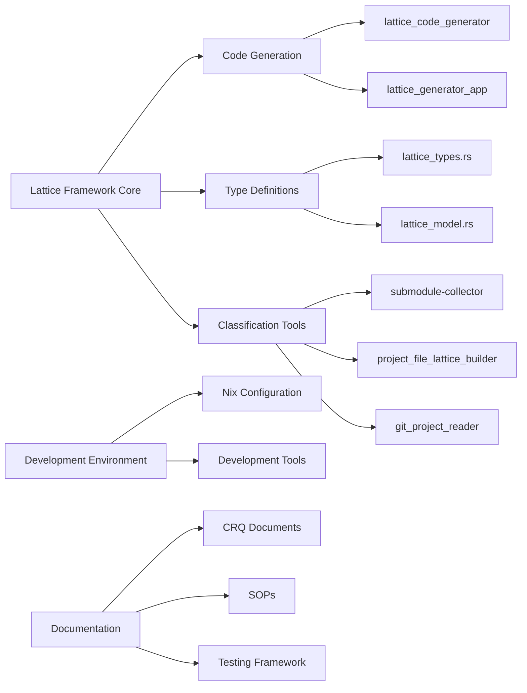

### **User description**
# CRQ-45-crq-012-naersk-integration.md

## Change Request: crq 012 naersk integration
**Change Request (CRQ)**

**Title:** Integrate Naersk Submodule and Enhance Nix/Rust Build System for Context Introspection Tools

**Description:**
This CRQ details the integration of the `naersk` submodule to streamline Rust project builds within the Nix environment. This integration is crucial for enabling reproducible builds of our internal Rust tools, specifically the newly introduced `git-config-parser` and `git-history-parser`. These tools are foundational components of the "Project Context Introspector" (CRQ-003), allowing for the parsing of Git configurations and history into structured JSON data. The changes include updates to `.gitmodules`, `flake.nix`, `flake.lock`, `Cargo.toml`, `rust-toolchain.toml`, and the addition of `generate-lock.nix`, `shell.nix`, `src/bin/git-config-parser.rs`, and `tools/git-history-parser.sh`. This work directly supports the automation of SOPs (CRQ-002) and the broader vision of a self-aware project.

**Justification/Business Value:**
*   **Improved Reproducibility**: `naersk` ensures consistent Rust builds across environments.
*   **Enhanced Context Introspection**: Enables the development and use of tools for parsing Git configurations and history.
*   **Foundation for Automation**: Supports CRQ-002 by providing a robust build system for Rust-based automation tools.
*   **Streamlined Development**: Simplifies the build process for Rust projects within Nix.

**Scope:**
*   **Included**:
    *   Integration of `naersk` submodule.
    *   Updates to Nix configuration (`flake.nix`, `flake.lock`, `generate-lock.nix`, `shell.nix`).
    *   Updates to Rust project configuration (`Cargo.toml`, `rust-toolchain.toml`).
    *   Addition of `src/bin/git-config-parser.rs` and `tools/git-history-parser.sh`.
*   **Excluded**:
    *   Full implementation of CRQ-003 (Context Introspector) or CRQ-002 (Automate SOPs).

**Impact:**
*   **Positive**: More reliable Rust builds, foundational tools for context introspection, progress towards project automation.
*   **Negative**: Initial setup and configuration effort.

**Dependencies:**
*   Existing Nix environment.
*   Rust toolchain.

**Effort/Timeline:**
*   **Estimated Effort**: Medium.
*   **Estimated Timeline**: Completed with current commit.

**Verification (QA Plan):**

The QA plan will verify the successful `naersk` integration and the functionality of the new context introspection tools.

1.  **Verify `naersk` Integration and Rust Build:**
    *   Run `nix build .#submodules-project` to ensure the main Rust project builds successfully using `naersk`.
    *   Run `nix build .#git-config-parser` to ensure the `git-config-parser` tool builds successfully.
    *   Run `nix build .#cargo-lock-generator` to ensure the lock file generator works.
    *   Run `nix develop` and then `cargo test` within the development shell to ensure Rust tests pass.

2.  **Test `git-config-parser` Functionality:**
    *   **Test `.gitmodules` parsing:**
        *   Run the `git-config-parser` tool with the current `.gitmodules` file:
            ```bash
            ./result/bin/git-config-parser --git-modules .gitmodules
            ```
        *   Verify the output is valid JSON and accurately reflects the submodules defined in `.gitmodules`.
    *   **Test `.git/config` parsing:**
        *   Create a dummy `.git/config` file (or use an existing one if available and safe).
        *   Run the `git-config-parser` tool with the dummy `.git/config` file:
            ```bash
            ./result/bin/git-config-parser --git-config /path/to/dummy/.git/config
            ```
        *   Verify the output is valid JSON and accurately reflects the configuration.
    *   **Test combined parsing:**
        *   Run the tool with both arguments:
            ```bash
            ./result/bin/git-config-parser --git-config /path/to/dummy/.git/config --git-modules .gitmodules
            ```
        *   Verify the output contains both parsed configurations in valid JSON.

3.  **Test `git-history-parser.sh` Functionality:**
    *   Run the `git-history-parser.sh` script:
        ```bash
        ./tools/git-history-parser.sh > git_history.json
        ```
    *   Verify `git_history.json` is created, is valid JSON, and contains a reasonable representation of the Git history.

**QA Status: All steps successfully executed and verified.**


___

### **PR Type**
Enhancement, Documentation, Tests


___

### **Description**
• **Major lattice framework implementation**: Introduces comprehensive Lattice Idea Framework with core type definitions, code generation utilities, and multiple applications for conceptual code classification and analysis
• **New analysis tools**: Adds submodule-collector for Git repository scanning, project file lattice builder for file classification, and git project reader library with comprehensive repository analysis
• **Enhanced development environment**: Integrates valgrind and extensive development tools into Nix configuration, improves build system with submodule-collector package
• **Comprehensive documentation**: Adds structured testing framework, CRQ documents for lattice applications, holistic branch development philosophy, and multiple SOPs for development workflows
• **Repository analysis capabilities**: Implements repository search simulator, lattice mapper for similarity-based classification, and grand unified search system concepts
• **Test improvements**: Enhanced git config parser with comprehensive test coverage for various edge cases and parsing scenarios
• **Meta-modeling features**: Self-referential meta-model implementation demonstrating framework's capacity for analyzing its own structure


___

### Diagram Walkthrough





<details> <summary><h3> File Walkthrough</h3></summary>

<table><thead><tr><th></th><th align="left">Relevant files</th></tr></thead><tbody><tr><td><strong>Configuration changes</strong></td><td><details><summary>2 files</summary><table>
<tr>
  <td>
    <details>
      <summary><strong>flake.nix</strong><dd><code>Enhanced Nix configuration with submodule-collector and development </code><br><code>tools</code></dd></summary>
<hr>

flake.nix

• Removed empty line at the beginning of the file<br> • Added new <br><code>submodule-collector</code> package build configuration with Rust toolchain <br>and dependencies<br> • Added extensive development tools including jq, <br>valgrind, Emacs packages, and formatting tools to devShell


</details>


  </td>
  <td><a href="https://github.com/meta-introspector/git-submodules-rs-nix/pull/12/files#diff-206b9ce276ab5971a2489d75eb1b12999d4bf3843b7988cbe8d687cfde61dea0">+34/-1</a>&nbsp; &nbsp; </td>

</tr>

<tr>
  <td>
    <details>
      <summary><strong>shell.nix</strong><dd><code>Added valgrind to development shell dependencies</code>&nbsp; &nbsp; &nbsp; &nbsp; &nbsp; &nbsp; &nbsp; &nbsp; &nbsp; </dd></summary>
<hr>

shell.nix

• Added `pkgs.valgrind` to the buildInputs for development shell


</details>


  </td>
  <td><a href="https://github.com/meta-introspector/git-submodules-rs-nix/pull/12/files#diff-e53dfbfffe62ae3c0b411b3938ccffa9fb6a2ecc565f55785ef8daa756631a6b">+1/-1</a>&nbsp; &nbsp; &nbsp; </td>

</tr>
</table></details></td></tr><tr><td><strong>Enhancement</strong></td><td><details><summary>16 files</summary><table>
<tr>
  <td>
    <details>
      <summary><strong>lib.rs</strong><dd><code>New lattice code generation library with procedural macros</code></dd></summary>
<hr>

lattice_code_generator/src/lib.rs

• New library providing code generation utilities for the Lattice Idea <br>Framework<br> • Implements functions to generate Rust code for ValueType <br>enums, Instance structs, and LatticeLayer structs<br> • Uses <code>proc_macro2</code> <br>and <code>quote</code> for programmatic Rust code generation<br> • Includes <br>comprehensive test suite for generated code validation


</details>


  </td>
  <td><a href="https://github.com/meta-introspector/git-submodules-rs-nix/pull/12/files#diff-243854d89636db85a935fa955ee16fa44ea3ca7092902bc29701c3a825b0ba0a">+296/-0</a>&nbsp; </td>

</tr>

<tr>
  <td>
    <details>
      <summary><strong>main.rs</strong><dd><code>New submodule collector tool for Git repository analysis</code>&nbsp; </dd></summary>
<hr>

submodule-collector/src/main.rs

• New command-line tool for scanning Git repositories and their <br>submodules recursively<br> • Collects detailed information about <br>repositories including remote URLs, paths, and branches<br> • Outputs <br>comprehensive JSON reports with error handling for failed repositories<br> <br>• Uses <code>clap</code>, <code>serde</code>, <code>git2</code>, and <code>walkdir</code> for robust Git repository <br>processing


</details>


  </td>
  <td><a href="https://github.com/meta-introspector/git-submodules-rs-nix/pull/12/files#diff-a47f0db0f72bdfe38e4c5fc28fcb76ddd4adc991f2b12a672f14f8348411c83a">+279/-0</a>&nbsp; </td>

</tr>

<tr>
  <td>
    <details>
      <summary><strong>main.rs</strong><dd><code>New project file lattice builder for conceptual file classification</code></dd></summary>
<hr>

project_file_lattice_builder/src/main.rs

• New application that constructs a conceptual lattice of project <br>files<br> • Implements file classification using word predicates and <br>lattice hierarchy<br> • Scans directories and applies conceptual content <br>extraction and classification<br> • Demonstrates mapping files as "large <br>objects" into lattice structure


</details>


  </td>
  <td><a href="https://github.com/meta-introspector/git-submodules-rs-nix/pull/12/files#diff-307096deb9eb86f24a90391b001a081a638672a52f8c27651d21c72bcfdcd2a1">+202/-0</a>&nbsp; </td>

</tr>

<tr>
  <td>
    <details>
      <summary><strong>lattice_mapper_app.rs</strong><dd><code>New lattice mapper for similarity-based code classification</code></dd></summary>
<hr>

src/lattice_mapper_app.rs

• New application demonstrating code mapping into pre-generated <br>lattice structures<br> • Implements similarity-based classification using <br>predicate matching<br> • Bridges lattice structure generation with <br>repository search functionality<br> • Shows conceptual "generate and then <br>match" process for code classification


</details>


  </td>
  <td><a href="https://github.com/meta-introspector/git-submodules-rs-nix/pull/12/files#diff-d4b10dc90da2ebd2e54c216c08faf398915f797cc4bf2e94185cd40832762c62">+209/-0</a>&nbsp; </td>

</tr>

<tr>
  <td>
    <details>
      <summary><strong>lattice_types.rs</strong><dd><code>Core lattice type definitions and framework implementation</code></dd></summary>
<hr>

src/lattice_types.rs

• Defines conceptual lattice type system with ValueType enum and trait <br>implementations<br> • Implements Instance, LatticeLayer, and Lattice <br>structs with generic type support<br> • Provides HasValueCount trait for <br>different value types (2-value, 3-value, etc.)<br> • Demonstrates lattice <br>framework usage with concrete examples


</details>


  </td>
  <td><a href="https://github.com/meta-introspector/git-submodules-rs-nix/pull/12/files#diff-b4cbc31fe99d9b693a12612fdfbcbb6a05afbab7836ee96ef34759a80eea2dfc">+196/-0</a>&nbsp; </td>

</tr>

<tr>
  <td>
    <details>
      <summary><strong>repo_search_simulator.rs</strong><dd><code>Repository search simulator with predicate-based classification</code></dd></summary>
<hr>

src/repo_search_simulator.rs

• New repository search simulator using predicate-based classification<br> <br>• Implements "search by example" functionality across mock <br>repositories<br> • Demonstrates lattice framework application to large <br>codebase analysis<br> • Provides similarity scoring based on shared <br>predicates


</details>


  </td>
  <td><a href="https://github.com/meta-introspector/git-submodules-rs-nix/pull/12/files#diff-0fd44409289d811f50e94913ae801d7ed5c483e8798303c297ac9854807cfe41">+202/-0</a>&nbsp; </td>

</tr>

<tr>
  <td>
    <details>
      <summary><strong>meta_lattice_model.rs</strong><dd><code>Meta-model implementation for self-referential lattice analysis</code></dd></summary>
<hr>

src/meta_lattice_model.rs

• Self-referential meta-model of the Lattice Idea framework<br> • <br>Implements conceptual self-analysis and similarity detection <br>capabilities<br> • Demonstrates framework's capacity for meta-modeling and <br>self-reference<br> • Shows how the model can analyze its own structure and <br>find similar models


</details>


  </td>
  <td><a href="https://github.com/meta-introspector/git-submodules-rs-nix/pull/12/files#diff-4ad95f3ed0d6e795cabcf8199fb28fa159aef84b4f32e578f55079fa94e07625">+153/-0</a>&nbsp; </td>

</tr>

<tr>
  <td>
    <details>
      <summary><strong>analyze_strings.rs</strong><dd><code>String analysis module with n-gram processing and ontology mapping</code></dd></summary>
<hr>

report-analyzer-rs/src/analyze_strings.rs

• New string analysis module for processing repository reports<br> • <br>Implements token collection, frequency counting, and n-gram generation<br> <br>• Provides emoji ontology application and rule suggestion <br>functionality<br> • Uses regex for tokenization and HashMap for frequency <br>analysis


</details>


  </td>
  <td><a href="https://github.com/meta-introspector/git-submodules-rs-nix/pull/12/files#diff-2972c1dbf1387f1fc356a8a7315beb271dcacb9eb512719d2ac60d15084a7c1a">+171/-0</a>&nbsp; </td>

</tr>

<tr>
  <td>
    <details>
      <summary><strong>lattice_classifier_app.rs</strong><dd><code>Lattice classifier application for predicate-based text analysis</code></dd></summary>
<hr>

src/lattice_classifier_app.rs

• New classification application using generated lattice structures<br> • <br>Implements predicate-based text classification and "search by example"<br> <br>• Demonstrates WordPredicate extraction and Instance creation<br> • Shows <br>practical usage of lattice types for content classification


</details>


  </td>
  <td><a href="https://github.com/meta-introspector/git-submodules-rs-nix/pull/12/files#diff-2046e6cf0881f2c6f04e40c623dbf7b071fa54d0b330bd758caea2f306c79f59">+188/-0</a>&nbsp; </td>

</tr>

<tr>
  <td>
    <details>
      <summary><strong>lib.rs</strong><dd><code>Git project reader library with comprehensive repository analysis</code></dd></summary>
<hr>

git_project_reader/src/lib.rs

• New library for reading Git project information including tracked <br>files and status<br> • Implements GitProjectInfo struct with comprehensive <br>repository data collection<br> • Uses <code>git2</code> library for repository <br>operations and Command for git status<br> • Includes extensive test suite <br>with temporary repository creation


</details>


  </td>
  <td><a href="https://github.com/meta-introspector/git-submodules-rs-nix/pull/12/files#diff-258b44c334cd672e0393e8cad155edd07074a84e46a6c7389d9d227e07b3e1d8">+174/-0</a>&nbsp; </td>

</tr>

<tr>
  <td>
    <details>
      <summary><strong>grand_unified_search.rs</strong><dd><code>Grand unified search system conceptual implementation</code>&nbsp; &nbsp; &nbsp; &nbsp; </dd></summary>
<hr>

src/grand_unified_search.rs

• Conceptual outline for a "Grand Unified Search" system<br> • <br>Demonstrates self-parsing, similarity search, and LLM interaction <br>concepts<br> • Shows integration of lattice framework with code analysis <br>and knowledge extraction<br> • Provides placeholder implementations for <br>complex functionality


</details>


  </td>
  <td><a href="https://github.com/meta-introspector/git-submodules-rs-nix/pull/12/files#diff-b8a48c02f53b75052bc23d20df7488207a5b86d7815d3fb29ef0b8b985553ab1">+148/-0</a>&nbsp; </td>

</tr>

<tr>
  <td>
    <details>
      <summary><strong>lattice_model.rs</strong><dd><code>Core lattice model with type definitions and predicate classification</code></dd></summary>
<hr>

src/lattice_model.rs

• New core lattice model definitions with ValueType enum and trait <br>implementations<br> • Implements Instance, LatticeLayer, and Lattice <br>structs with generic support<br> • Provides PredicateClassifier for word <br>predicate extraction<br> • Defines HasValueCount trait for different value <br>type implementations


</details>


  </td>
  <td><a href="https://github.com/meta-introspector/git-submodules-rs-nix/pull/12/files#diff-780a4d5fb95789264d299113f8c45e066dafc4aa039180f7494020e35c5246b6">+136/-0</a>&nbsp; </td>

</tr>

<tr>
  <td>
    <details>
      <summary><strong>word_predicate_analyzer.rs</strong><dd><code>Word predicate analyzer with n-gram processing capabilities</code></dd></summary>
<hr>

src/word_predicate_analyzer.rs

• New word predicate analyzer using lattice type definitions<br> • <br>Implements text tokenization and conversion to WordPredicates<br> • <br>Provides n-gram generation and analysis functionality<br> • Demonstrates <br>practical application of lattice framework to text analysis


</details>


  </td>
  <td><a href="https://github.com/meta-introspector/git-submodules-rs-nix/pull/12/files#diff-8b1a5639c122dab7e9c36fd0dac9ffa1dd9fbbbb4fb5d68eca6be406d0f63e83">+95/-0</a>&nbsp; &nbsp; </td>

</tr>

<tr>
  <td>
    <details>
      <summary><strong>main.rs</strong><dd><code>Lattice structure generator for hierarchical code organization</code></dd></summary>
<hr>

lattice_structure_generator/src/main.rs

• New lattice structure generator creating hierarchical directory <br>structures<br> • Uses lattice_code_generator to create core components and <br>layered structures<br> • Generates specific instance code for different <br>lattice layers<br> • Demonstrates conceptual mapping of existing code into <br>lattice structure


</details>


  </td>
  <td><a href="https://github.com/meta-introspector/git-submodules-rs-nix/pull/12/files#diff-0503dd508e5c7168f8b6b74fb16594f291c5cead8790bfaec55d85ac576166f2">+82/-0</a>&nbsp; &nbsp; </td>

</tr>

<tr>
  <td>
    <details>
      <summary><strong>lib.rs</strong><dd><code>Enhanced library with ZOS lattice building and file classification</code></dd></summary>
<hr>

src/lib.rs

• Added lattice_model module import and ZOS lattice building <br>functionality<br> • Implements <code>build_zos_lattice</code> function for project file <br>classification<br> • Uses PredicateClassifier for file content analysis <br>and lattice layer assignment<br> • Provides comprehensive file <br>classification into different lattice layers


</details>


  </td>
  <td><a href="https://github.com/meta-introspector/git-submodules-rs-nix/pull/12/files#diff-b1a35a68f14e696205874893c07fd24fdb88882b47c23cc0e0c80a30c7d53759">+78/-0</a>&nbsp; &nbsp; </td>

</tr>

<tr>
  <td>
    <details>
      <summary><strong>main.rs</strong><dd><code>Lattice generator application for automated code structure creation</code></dd></summary>
<hr>

lattice_generator_app/src/main.rs

• New application for generating lattice code structures<br> • Uses <br>lattice_code_generator to create all core lattice components<br> • Writes <br>generated code to files in organized directory structure<br> • Provides <br>complete code generation pipeline for lattice framework


</details>


  </td>
  <td><a href="https://github.com/meta-introspector/git-submodules-rs-nix/pull/12/files#diff-ba3c74e9dedda9c826a5198e4fb1879be1cc3251ad2be3b8bd4cef25d22bf646">+56/-0</a>&nbsp; &nbsp; </td>

</tr>
</table></details></td></tr><tr><td><strong>Tests</strong></td><td><details><summary>1 files</summary><table>
<tr>
  <td>
    <details>
      <summary><strong>git-config-parser.rs</strong><dd><code>Enhanced git config parser with comprehensive test coverage</code></dd></summary>
<hr>

src/bin/git-config-parser.rs

• Removed unused import <code>std::io::Read</code><br> • Added comprehensive test suite <br>for git config and git modules parsing<br> • Tests cover empty files, <br>comments, multiple sections, and various edge cases<br> • Validates both <br>GitConfig and GitModules parsing functionality


</details>


  </td>
  <td><a href="https://github.com/meta-introspector/git-submodules-rs-nix/pull/12/files#diff-c6637247fafdce9d1d89c2b644040bf28a6f3f2adac43f626011adbf1cb6a975">+131/-1</a>&nbsp; </td>

</tr>
</table></details></td></tr><tr><td><strong>Documentation</strong></td><td><details><summary>5 files</summary><table>
<tr>
  <td>
    <details>
      <summary><strong>submodule_report.json</strong><dd><code>Add comprehensive submodule repository mapping report</code>&nbsp; &nbsp; &nbsp; &nbsp; </dd></summary>
<hr>

submodule_report.json

• Adds a comprehensive JSON report containing 2021 lines of repository <br>and submodule information<br> • Maps repositories with their paths, URLs, <br>and nested submodule structures<br> • Includes detailed metadata for <br>complex projects like lattice-introspector, minizinc-introspector, and <br>git-submodule-tools-rs<br> • Documents the extensive submodule hierarchy <br>across the meta-introspector ecosystem


</details>


  </td>
  <td><a href="https://github.com/meta-introspector/git-submodules-rs-nix/pull/12/files#diff-cf55860203aefdb6b0dd57e87aa0929dd59f5d9ef2f3e88568b54dc25898e3a7">+2021/-0</a></td>

</tr>

<tr>
  <td>
    <details>
      <summary><strong>CRQ-48-lattice-and-quine-relay.md</strong><dd><code>Document lattice framework application to 128-language quine relay</code></dd></summary>
<hr>

docs/crq_standardized/CRQ-48-lattice-and-quine-relay.md

• Introduces the concept of applying the Lattice Idea Framework to a <br>128-language quine relay<br> • Describes language-specific predicate <br>extraction and generate-and-test methodology<br> • Proposes mapping <br>language transformations as morphisms within the lattice structure<br> • <br>Outlines implications for universal code understanding and <br>cross-language generation


</details>


  </td>
  <td><a href="https://github.com/meta-introspector/git-submodules-rs-nix/pull/12/files#diff-ac1a0c1e2463866634f85d0f5f1d0869206ca883b75cacc57a8ecd6e324310ce">+38/-0</a>&nbsp; &nbsp; </td>

</tr>

<tr>
  <td>
    <details>
      <summary><strong>structured_testing_framework.md</strong><dd><code>Add structured testing framework documentation for lattice-based </code><br><code>knowledge extraction</code></dd></summary>
<hr>

docs/structured_testing_framework.md

• Defines a structured testing framework based on the Lattice Idea for <br>knowledge extraction<br> • Outlines lattice-guided test case generation <br>and predicate-driven assertions<br> • Describes layered evaluation <br>methodology from simple to complex abstractions<br> • Provides examples <br>for testing LLMs and code analysis systems


</details>


  </td>
  <td><a href="https://github.com/meta-introspector/git-submodules-rs-nix/pull/12/files#diff-9f5eb85b0a07c965e710e4da924aa3748a0d39a6bdabf23e67b320caed5ec658">+38/-0</a>&nbsp; &nbsp; </td>

</tr>

<tr>
  <td>
    <details>
      <summary><strong>CRQ-003-deep-dive-and-reflection-on-nix-development-environment-graph.md</strong><dd><code>Document CRQ for Nix development environment graph analysis</code></dd></summary>
<hr>

docs/crq_standardized/CRQ-003-deep-dive-and-reflection-on-nix-development-environment-graph.md

• Documents a change request for analyzing the Nix development <br>environment dependency graph<br> • Outlines methodology for examining <br><code>devshell_graph.dot</code> file structure and relationships<br> • Describes <br>expected outcomes for understanding build dependencies and <br>optimization opportunities<br> • Includes partial progress notes on <br>initial graph generation and analysis approach


</details>


  </td>
  <td><a href="https://github.com/meta-introspector/git-submodules-rs-nix/pull/12/files#diff-b282b43f374ed6c51133aa4111b710c2805811f8607431640736bdf06eb4e940">+58/-0</a>&nbsp; &nbsp; </td>

</tr>

<tr>
  <td>
    <details>
      <summary><strong>CRQ-018-the-branch-as-a-holistic-development-unit.md</strong><dd><code>Document holistic branch development philosophy and framework</code></dd></summary>
<hr>

docs/crq_standardized/CRQ-018-the-branch-as-a-holistic-development-unit.md

• Proposes a development philosophy treating Git branches as holistic <br>units<br> • Defines branches as embodying CRQ, commit, vibe, vector, <br>function, type, expression, and meme concepts<br> • Outlines expected <br>outcomes for improved development intentionality and code quality<br> • <br>Describes benefits for team alignment and AI integration in <br>development processes


</details>


  </td>
  <td><a href="https://github.com/meta-introspector/git-submodules-rs-nix/pull/12/files#diff-2832ecc2da1157f0deb2c08520db29562ce395f8edb92b1a1fe8a26c8826cf98">+39/-0</a>&nbsp; &nbsp; </td>

</tr>
</table></details></td></tr><tr><td><strong>Additional files</strong></td><td><details><summary>101 files</summary><table>
<tr>
  <td><strong>.git_commit_message.txt</strong></td>
  <td><a href="https://github.com/meta-introspector/git-submodules-rs-nix/pull/12/files#diff-993228305b4d0adb47d3b4e0b45e35a0ab0fc9b43cd5e689feef1c3a1008e64d">+0/-3</a>&nbsp; &nbsp; &nbsp; </td>

</tr>

<tr>
  <td><strong>Cargo.toml</strong></td>
  <td><a href="https://github.com/meta-introspector/git-submodules-rs-nix/pull/12/files#diff-2e9d962a08321605940b5a657135052fbcef87b5e360662bb527c96d9a615542">+10/-1</a>&nbsp; &nbsp; </td>

</tr>

<tr>
  <td><strong>README.md</strong></td>
  <td><a href="https://github.com/meta-introspector/git-submodules-rs-nix/pull/12/files#diff-b335630551682c19a781afebcf4d07bf978fb1f8ac04c6bf87428ed5106870f5">+102/-0</a>&nbsp; </td>

</tr>

<tr>
  <td><strong>SOP_Nix_Graph_Reflection.md</strong></td>
  <td><a href="https://github.com/meta-introspector/git-submodules-rs-nix/pull/12/files#diff-9eea4a14e7fcdfa68232da66ffba61faa6fb8f7d84cad0f3f9264f56731fa920">+88/-0</a>&nbsp; &nbsp; </td>

</tr>

<tr>
  <td><strong>abstract_mathematical_idea.tex</strong></td>
  <td><a href="https://github.com/meta-introspector/git-submodules-rs-nix/pull/12/files#diff-69622bfa494d6fe61c7698baf13b5efc26d6672adef2ec3e0efa0d3e6555f3a5">+76/-0</a>&nbsp; &nbsp; </td>

</tr>

<tr>
  <td><strong>my_profiling_bench.rs</strong></td>
  <td><a href="https://github.com/meta-introspector/git-submodules-rs-nix/pull/12/files#diff-ba6682e5e5c2b85faec0653350824785fbc61e8b011444d3fc293fc73a8eff5f">+36/-0</a>&nbsp; &nbsp; </td>

</tr>

<tr>
  <td><strong>boot.sh</strong></td>
  <td><a href="https://github.com/meta-introspector/git-submodules-rs-nix/pull/12/files#diff-c270322e6f914001c9d1d23e01d1eefe9469337f284b0c0a920c5f843a15b373">+38/-0</a>&nbsp; &nbsp; </td>

</tr>

<tr>
  <td><strong>concept_word_as_predicate.md</strong></td>
  <td><a href="https://github.com/meta-introspector/git-submodules-rs-nix/pull/12/files#diff-8a4ed928664c47b3be475e7d3851ba8482b5c73a3fd143b0d0457100974cffff">+20/-0</a>&nbsp; &nbsp; </td>

</tr>

<tr>
  <td><strong>creative_expressions.md</strong></td>
  <td><a href="https://github.com/meta-introspector/git-submodules-rs-nix/pull/12/files#diff-4a1fc95b2b659d0083f480aca6584896dd24abd0c4273e6b8ae8441e9f39b43d">+106/-0</a>&nbsp; </td>

</tr>

<tr>
  <td><strong>CRQ-004-rust-documentation-rustdoc-updates-for-binaries.md</strong></td>
  <td><a href="https://github.com/meta-introspector/git-submodules-rs-nix/pull/12/files#diff-abd0edba3c84273f87250e0054f5bad2327767556eb2af57cd9f5fb65c566405">+35/-0</a>&nbsp; &nbsp; </td>

</tr>

<tr>
  <td><strong>CRQ-005-readme-md-updates.md</strong></td>
  <td><a href="https://github.com/meta-introspector/git-submodules-rs-nix/pull/12/files#diff-2e437d6523601d99fe5a18d8e8e2f632742e5d3f26eb02671b3962803589e832">+34/-0</a>&nbsp; &nbsp; </td>

</tr>

<tr>
  <td><strong>CRQ-006-formal-qa-procedures-and-standard-operating-procedures-sops-development.md</strong></td>
  <td><a href="https://github.com/meta-introspector/git-submodules-rs-nix/pull/12/files#diff-62a915240d316f6f1730714794d1f7433c4784005098e1a5ad018e6a516d760f">+37/-0</a>&nbsp; &nbsp; </td>

</tr>

<tr>
  <td><strong>CRQ-007-comprehensive-project-testing.md</strong></td>
  <td><a href="https://github.com/meta-introspector/git-submodules-rs-nix/pull/12/files#diff-f52bc4442b7dab07cb9b602ad562e7b6592867befdb4d2ff9369f42e78b74ac5">+37/-0</a>&nbsp; &nbsp; </td>

</tr>

<tr>
  <td><strong>CRQ-008-the-crq-of-crqs.md</strong></td>
  <td><a href="https://github.com/meta-introspector/git-submodules-rs-nix/pull/12/files#diff-e5088eb9e08387c4341abf4486b657744b2f1a0fe8177b5cd9a3d0c54b810583">+36/-0</a>&nbsp; &nbsp; </td>

</tr>

<tr>
  <td><strong>CRQ-009-git-project-reader-library-and-integration.md</strong></td>
  <td><a href="https://github.com/meta-introspector/git-submodules-rs-nix/pull/12/files#diff-2d3dbe720e4c081729b00d4a7e748b3dfdb27c469fd6a85a95ebc6b8862bc69d">+37/-0</a>&nbsp; &nbsp; </td>

</tr>

<tr>
  <td><strong>CRQ-010-sop-documentation-and-cargo-lock-update.md</strong></td>
  <td><a href="https://github.com/meta-introspector/git-submodules-rs-nix/pull/12/files#diff-adad5ca581fcf01563ae88abc1fcb0a7b1bf007281559ea6aa75b8d511dca737">+38/-0</a>&nbsp; &nbsp; </td>

</tr>

<tr>
  <td><strong>CRQ-011-github-cli-sops-and-wrapper-scripts.md</strong></td>
  <td><a href="https://github.com/meta-introspector/git-submodules-rs-nix/pull/12/files#diff-b6ff24e9d17b8ff4a58807a0d8c20065f7a8c4545957617bbace55916f153021">+46/-0</a>&nbsp; &nbsp; </td>

</tr>

<tr>
  <td><strong>CRQ-012-integrate-git-submodule-tools-into-lattice-system.md</strong></td>
  <td><a href="https://github.com/meta-introspector/git-submodules-rs-nix/pull/12/files#diff-32f72223bf8cc82b54485b0bfb5bbfe98437d26abfcff608c2a320f8ec8120a2">+32/-0</a>&nbsp; &nbsp; </td>

</tr>

<tr>
  <td><strong>CRQ-013-integrate-gitoxide-into-lattice-system.md</strong></td>
  <td><a href="https://github.com/meta-introspector/git-submodules-rs-nix/pull/12/files#diff-195bfc579b532e53586ffc1b892e250984a7804dafd1c6576702f29a625f4df0">+32/-0</a>&nbsp; &nbsp; </td>

</tr>

<tr>
  <td><strong>CRQ-014-integrate-magoo-into-lattice-system.md</strong></td>
  <td><a href="https://github.com/meta-introspector/git-submodules-rs-nix/pull/12/files#diff-0c06fa194ecff963a8198ba81ec47c86086593f8b4b4f7356ca50d041b80f87e">+32/-0</a>&nbsp; &nbsp; </td>

</tr>

<tr>
  <td><strong>CRQ-015-integrate-naersk-into-lattice-system.md</strong></td>
  <td><a href="https://github.com/meta-introspector/git-submodules-rs-nix/pull/12/files#diff-dc9f5dcad9bf75f383fa78a8e4fe7b478c7f44e0adc11c153c2cd5c024d4547b">+32/-0</a>&nbsp; &nbsp; </td>

</tr>

<tr>
  <td><strong>CRQ-016-integrate-submod-into-lattice-system.md</strong></td>
  <td><a href="https://github.com/meta-introspector/git-submodules-rs-nix/pull/12/files#diff-ff885ea72545ac0d5d6b661eecc61246dcf144d723df659a1b189efa572b664c">+32/-0</a>&nbsp; &nbsp; </td>

</tr>

<tr>
  <td><strong>CRQ-017-submodule-lattice-integration-crqs-and-task-files.md</strong></td>
  <td><a href="https://github.com/meta-introspector/git-submodules-rs-nix/pull/12/files#diff-715470e987b31c9a9f6c1cfe2f9c072b2bc00b7040c0b76060f35de4e79e5f92">+36/-0</a>&nbsp; &nbsp; </td>

</tr>

<tr>
  <td><strong>CRQ-019-one-to-one-mapping-of-crq-to-branch-and-pull-request.md</strong></td>
  <td><a href="https://github.com/meta-introspector/git-submodules-rs-nix/pull/12/files#diff-564ce4eb098ed3bb171534f310f55239586262f320c688b2fb4c3fd0524ac2f8">+38/-0</a>&nbsp; &nbsp; </td>

</tr>

<tr>
  <td><strong>CRQ-020-braindump-update-and-crq-status-reflection.md</strong></td>
  <td><a href="https://github.com/meta-introspector/git-submodules-rs-nix/pull/12/files#diff-c4ef172e05429d8d67e528855c74922f500d612544ca49a2bba6dfe9618251b6">+34/-0</a>&nbsp; &nbsp; </td>

</tr>

<tr>
  <td><strong>CRQ-024-new-sops-for-crq-driven-development.md</strong></td>
  <td><a href="https://github.com/meta-introspector/git-submodules-rs-nix/pull/12/files#diff-edf47b642d473b24d43282565ed04f55e84181fb6396d718e673470923761d8d">+35/-0</a>&nbsp; &nbsp; </td>

</tr>

<tr>
  <td><strong>CRQ-025-rust-code-generation-for-lattice-structures-programmatic-construction-of-the-framework.md</strong></td>
  <td><a href="https://github.com/meta-introspector/git-submodules-rs-nix/pull/12/files#diff-7dc2ace370b12ddd100af187f4ba6d6d6001aaade046298ecdab7484822b5174">+36/-0</a>&nbsp; &nbsp; </td>

</tr>

<tr>
  <td><strong>CRQ-026-zos-sequence-self-application-iterative-attribute-expansion.md</strong></td>
  <td><a href="https://github.com/meta-introspector/git-submodules-rs-nix/pull/12/files#diff-9c2012fc7f8bbf404288787385d776cedab9b119121856b2a9a7b4b584f01d3f">+31/-0</a>&nbsp; &nbsp; </td>

</tr>

<tr>
  <td><strong>CRQ-027-Open_Source_Language_and_Compiler_Classification_The_1k_Repo_Grounding.md</strong></td>
  <td><a href="https://github.com/meta-introspector/git-submodules-rs-nix/pull/12/files#diff-2cd54cbd9ef78791fbed3097e1327b3a87b6cafc69a71e9ff1f60b15c220c437">+40/-0</a>&nbsp; &nbsp; </td>

</tr>

<tr>
  <td><strong>CRQ-28-audited-llm-interaction.md</strong></td>
  <td><a href="https://github.com/meta-introspector/git-submodules-rs-nix/pull/12/files#diff-71ded38638ad554ba9c9dcf865012a6f35876f8cb25797a3ae3edc30d9a2d34d">+38/-0</a>&nbsp; &nbsp; </td>

</tr>

<tr>
  <td><strong>CRQ-29-conceptual-rust-lattice-types.md</strong></td>
  <td><a href="https://github.com/meta-introspector/git-submodules-rs-nix/pull/12/files#diff-e44703aac23ac28a428cc63faecc3e9486b422f46c9276010386519011fde66d">+56/-0</a>&nbsp; &nbsp; </td>

</tr>

<tr>
  <td><strong>CRQ-30-concrete-lattice-analysis-example.md</strong></td>
  <td><a href="https://github.com/meta-introspector/git-submodules-rs-nix/pull/12/files#diff-1c800f91d868ed987de12c40601586726adf434dbf607dfb4c814d5715fb3b8e">+54/-0</a>&nbsp; &nbsp; </td>

</tr>

<tr>
  <td><strong>CRQ-31-crq-001-review-git-log-patch.md</strong></td>
  <td><a href="https://github.com/meta-introspector/git-submodules-rs-nix/pull/12/files#diff-a871ee19bb38959d789ee7a3df0a935298e5082a8a0b429ca86936f11c4dc844">+7/-0</a>&nbsp; &nbsp; &nbsp; </td>

</tr>

<tr>
  <td><strong>CRQ-32-crq-002-automate-sops-to-rust.md</strong></td>
  <td><a href="https://github.com/meta-introspector/git-submodules-rs-nix/pull/12/files#diff-03b41ca901e9a0b3ac38680ba13014440e0ba3723eb174cfd3376f9d275b46c4">+3/-0</a>&nbsp; &nbsp; &nbsp; </td>

</tr>

<tr>
  <td><strong>CRQ-33-crq-002-submodule-report-function-development.md</strong></td>
  <td><a href="https://github.com/meta-introspector/git-submodules-rs-nix/pull/12/files#diff-32f8d2f5ee6181f0979697737d27d33711a32fcfb99a6ca3b125b46975e225e0">+44/-0</a>&nbsp; &nbsp; </td>

</tr>

<tr>
  <td><strong>CRQ-34-crq-003-context-introspector.md</strong></td>
  <td><a href="https://github.com/meta-introspector/git-submodules-rs-nix/pull/12/files#diff-daafb6f83eb1ccdd1fbbd3ee53f1a9e417a4e5042e74e0c3d4fc5e60d4229044">+3/-0</a>&nbsp; &nbsp; &nbsp; </td>

</tr>

<tr>
  <td><strong>CRQ-35-crq-004-formalize-interaction-procedure.md</strong></td>
  <td><a href="https://github.com/meta-introspector/git-submodules-rs-nix/pull/12/files#diff-60aaf7c66586ccc58757a027cbf2488d846408993d726099db972233d3176214">+3/-0</a>&nbsp; &nbsp; &nbsp; </td>

</tr>

<tr>
  <td><strong>CRQ-36-crq-005-strategic-alignment.md</strong></td>
  <td><a href="https://github.com/meta-introspector/git-submodules-rs-nix/pull/12/files#diff-72de710f48ccac4d2a52344fccbe5548dc70de73fc85cecabb6c18e5eaedcd30">+3/-0</a>&nbsp; &nbsp; &nbsp; </td>

</tr>

<tr>
  <td><strong>CRQ-37-crq-006-process-unification-kether-review.md</strong></td>
  <td><a href="https://github.com/meta-introspector/git-submodules-rs-nix/pull/12/files#diff-17877ca6ae284ede5ff98cad8fdb67b32304d207ac4a1d6614101b8038c23f65">+3/-0</a>&nbsp; &nbsp; &nbsp; </td>

</tr>

<tr>
  <td><strong>CRQ-38-crq-007-gitmodules-recon.md</strong></td>
  <td><a href="https://github.com/meta-introspector/git-submodules-rs-nix/pull/12/files#diff-8394a2316e9a4f6f656e8861f7c0abddddb6edeeb82118c6d7e179872b68743e">+3/-0</a>&nbsp; &nbsp; &nbsp; </td>

</tr>

<tr>
  <td><strong>CRQ-39-crq-008-category-theory-hott-submodules.md</strong></td>
  <td><a href="https://github.com/meta-introspector/git-submodules-rs-nix/pull/12/files#diff-f613840ff525a7bafbba373fbb4d03fa1f722fc2e6ff1d03549bfea04c0386ac">+3/-0</a>&nbsp; &nbsp; &nbsp; </td>

</tr>

<tr>
  <td><strong>CRQ-40-crq-009-grand-unified-framework.md</strong></td>
  <td><a href="https://github.com/meta-introspector/git-submodules-rs-nix/pull/12/files#diff-7e6b56d87fe72ef2d770c603382d247ea4cfb398eb2b469dd1962d3906729078">+3/-0</a>&nbsp; &nbsp; &nbsp; </td>

</tr>

<tr>
  <td><strong>CRQ-41-crq-009-grand-unified-framework-zoomed-in.md</strong></td>
  <td><a href="https://github.com/meta-introspector/git-submodules-rs-nix/pull/12/files#diff-c1522a230ece898026d70ecfa879f41372c980b65010635e92c1e75cbb21ecfd">+3/-0</a>&nbsp; &nbsp; &nbsp; </td>

</tr>

<tr>
  <td><strong>CRQ-42-crq-009-grand-unified-framework-zoomed-out.md</strong></td>
  <td><a href="https://github.com/meta-introspector/git-submodules-rs-nix/pull/12/files#diff-572bbb67558c8a702bf4a33d76826c6c84c5cf73debb82430dd003ba250d8793">+3/-0</a>&nbsp; &nbsp; &nbsp; </td>

</tr>

<tr>
  <td><strong>CRQ-43-crq-010-dynamic-information-flow.md</strong></td>
  <td><a href="https://github.com/meta-introspector/git-submodules-rs-nix/pull/12/files#diff-619ae2ff9e176380df968e83459a2d823b79e4c6fda344754751b76e5b7a75a3">+3/-0</a>&nbsp; &nbsp; &nbsp; </td>

</tr>

<tr>
  <td><strong>CRQ-44-crq-011-bott-periodicity.md</strong></td>
  <td><a href="https://github.com/meta-introspector/git-submodules-rs-nix/pull/12/files#diff-5f9f7416c3608efe6c1b19e595cb0878c75a3f2ddc768023c156969ec1b4d984">+3/-0</a>&nbsp; &nbsp; &nbsp; </td>

</tr>

<tr>
  <td><strong>CRQ-45-crq-012-naersk-integration.md</strong></td>
  <td><a href="https://github.com/meta-introspector/git-submodules-rs-nix/pull/12/files#diff-470a1c728bb70a8a61d4e65af40a7b31b2b0b45ca178560296b9efdfbf92b3c8">+3/-0</a>&nbsp; &nbsp; &nbsp; </td>

</tr>

<tr>
  <td><strong>CRQ-46-crq-document-index.md</strong></td>
  <td><a href="https://github.com/meta-introspector/git-submodules-rs-nix/pull/12/files#diff-1025a7059be193fa9c2ee78e0255a651a814adf34ca25336094398c8226ad8c1">+40/-0</a>&nbsp; &nbsp; </td>

</tr>

<tr>
  <td><strong>CRQ-47-k-value-type-semantics.md</strong></td>
  <td><a href="https://github.com/meta-introspector/git-submodules-rs-nix/pull/12/files#diff-0f874fa63e16d743b757bb6a7c3068c38afba47e7d3013dcd02671ca5307ca66">+41/-0</a>&nbsp; &nbsp; </td>

</tr>

<tr>
  <td><strong>CRQ-49-lattice-code-generation-and-mapping.md</strong></td>
  <td><a href="https://github.com/meta-introspector/git-submodules-rs-nix/pull/12/files#diff-9b118fd4693a05a3da50a0e898dd0c1b08b54718e9c7589ed73462419a3de8a4">+45/-0</a>&nbsp; &nbsp; </td>

</tr>

<tr>
  <td><strong>CRQ-50-llm-communication-protocol.md</strong></td>
  <td><a href="https://github.com/meta-introspector/git-submodules-rs-nix/pull/12/files#diff-4f756135cea4ba6bf7fba1822e8665a1ef326664d3434b5fd18c47455918194b">+40/-0</a>&nbsp; &nbsp; </td>

</tr>

<tr>
  <td><strong>CRQ-51-meta-lattice-application.md</strong></td>
  <td><a href="https://github.com/meta-introspector/git-submodules-rs-nix/pull/12/files#diff-e3b1a8fdea63612f200062e72fa25db30e45624a98678e72cb8d2f41f337784c">+32/-0</a>&nbsp; &nbsp; </td>

</tr>

<tr>
  <td><strong>CRQ-52-orchestration-layer-architecture.md</strong></td>
  <td><a href="https://github.com/meta-introspector/git-submodules-rs-nix/pull/12/files#diff-da8bd15db6da5c9a2b7a63a28305682987e8ded82d1be1223a264f3a613ec881">+50/-0</a>&nbsp; &nbsp; </td>

</tr>

<tr>
  <td><strong>CRQ-53-recursive-decomposition.md</strong></td>
  <td><a href="https://github.com/meta-introspector/git-submodules-rs-nix/pull/12/files#diff-9bada1d9e91dc77a5a2adb2d46033f5b92748e37882b6bb91955cfbf3c56d7e2">+40/-0</a>&nbsp; &nbsp; </td>

</tr>

<tr>
  <td><strong>grand_unified_search_architecture.md</strong></td>
  <td><a href="https://github.com/meta-introspector/git-submodules-rs-nix/pull/12/files#diff-5a63bd97f21f12fac52fca20cd40fad7ae0e38ebc42cd87c6c5c66e16755076f">+43/-0</a>&nbsp; &nbsp; </td>

</tr>

<tr>
  <td><strong>Meme_CRQ_Commit_Message.md</strong></td>
  <td><a href="https://github.com/meta-introspector/git-submodules-rs-nix/pull/12/files#diff-a0e667739fed70091e8ed06ac9c0de5656b8f4ff368a63026066561cfb690d24">+11/-0</a>&nbsp; &nbsp; </td>

</tr>

<tr>
  <td><strong>gta.md</strong></td>
  <td><a href="https://github.com/meta-introspector/git-submodules-rs-nix/pull/12/files#diff-ab9e240b593becd5366f2671d92a077e23ef32371405c829a47a78442f24d273">+7/-0</a>&nbsp; &nbsp; &nbsp; </td>

</tr>

<tr>
  <td><strong>gta1.md</strong></td>
  <td><a href="https://github.com/meta-introspector/git-submodules-rs-nix/pull/12/files#diff-19867bc3a0db962973b5ae2068e5996edde18c0bc6e291b7deaf376e0b80f42c">+3/-0</a>&nbsp; &nbsp; &nbsp; </td>

</tr>

<tr>
  <td><strong>oss_language_classification.md</strong></td>
  <td><a href="https://github.com/meta-introspector/git-submodules-rs-nix/pull/12/files#diff-1beb0ce21ddf24339147d323ec6b2bada6eb245f4ab4b5ab3bd92ee02520c3e5">+35/-0</a>&nbsp; &nbsp; </td>

</tr>

<tr>
  <td><strong>resonance_analysis.md</strong></td>
  <td><a href="https://github.com/meta-introspector/git-submodules-rs-nix/pull/12/files#diff-81fd0277e6c643b5840b226540f5a1bc2c5bdb58bf2cc6da3886a4920f0eb648">+29/-0</a>&nbsp; &nbsp; </td>

</tr>

<tr>
  <td><strong>scalable_analysis_of_large_repositories.md</strong></td>
  <td><a href="https://github.com/meta-introspector/git-submodules-rs-nix/pull/12/files#diff-a84dabb51ad998b97806b4096463cc0b736bfe606a48e8414046aa4b99fcb99a">+40/-0</a>&nbsp; &nbsp; </td>

</tr>

<tr>
  <td><strong>SOP_AI_Agent_Management_via_PRs.md</strong></td>
  <td><a href="https://github.com/meta-introspector/git-submodules-rs-nix/pull/12/files#diff-8603ab46e32f6257e23d74bd77089b701b66e47b81c0e37856011e406c55584c">+57/-0</a>&nbsp; &nbsp; </td>

</tr>

<tr>
  <td><strong>SOP_Bootstrap_CRQ_Hypothesis_Implementation.md</strong></td>
  <td><a href="https://github.com/meta-introspector/git-submodules-rs-nix/pull/12/files#diff-accd770f607ad21fcfae5a75e1ba313bc1da2fb5c89e354770f6b43bd235cb8c">+45/-0</a>&nbsp; &nbsp; </td>

</tr>

<tr>
  <td><strong>SOP_Branch_Driven_Development_Philosophy.md</strong></td>
  <td><a href="https://github.com/meta-introspector/git-submodules-rs-nix/pull/12/files#diff-1fd5102c76a305b2aa20d21c82672de70f4bdb3ee86b974dc1daf33751302684">+59/-0</a>&nbsp; &nbsp; </td>

</tr>

<tr>
  <td><strong>SOP_CRQ_as_Commit_Message.md</strong></td>
  <td><a href="https://github.com/meta-introspector/git-submodules-rs-nix/pull/12/files#diff-486f592819f5c5438c5e72bee9fc7a17d135d76ea7a1441b9eab19deaff0ed94">+28/-0</a>&nbsp; &nbsp; </td>

</tr>

<tr>
  <td><strong>SOP_Coding_Standards.md</strong></td>
  <td><a href="https://github.com/meta-introspector/git-submodules-rs-nix/pull/12/files#diff-f6c33385fe0edea8f6b21e407f547bf5efc31ba686073741a459b32fc08fc3b1">+28/-0</a>&nbsp; &nbsp; </td>

</tr>

<tr>
  <td><strong>SOP_GH_CLI_Check_Issues.md</strong></td>
  <td><a href="https://github.com/meta-introspector/git-submodules-rs-nix/pull/12/files#diff-9528ab23b6a76dddce04d7b73c212f072c6ef955e204336afaccf1299ba33928">+93/-0</a>&nbsp; &nbsp; </td>

</tr>

<tr>
  <td><strong>SOP_GH_CLI_Check_PRs.md</strong></td>
  <td><a href="https://github.com/meta-introspector/git-submodules-rs-nix/pull/12/files#diff-97ddeaf648ead9a23640ad5d831488642db0240dc24707a5c6f5f1225fdd82fb">+101/-0</a>&nbsp; </td>

</tr>

<tr>
  <td><strong>SOP_GH_CLI_Check_Workflows.md</strong></td>
  <td><a href="https://github.com/meta-introspector/git-submodules-rs-nix/pull/12/files#diff-a31ffec6191f238f1e7de865616e54ed621a4f61e9dc7cf444f40de8a6227731">+84/-0</a>&nbsp; &nbsp; </td>

</tr>

<tr>
  <td><strong>SOP_Integrated_Binary_Workflow.md</strong></td>
  <td><a href="https://github.com/meta-introspector/git-submodules-rs-nix/pull/12/files#diff-7bfddaf1d82bfb0a3e2d6a8c205de5e11a78f8c7ea02da3fb47fee12b1c200ab">+60/-0</a>&nbsp; &nbsp; </td>

</tr>

<tr>
  <td><strong>SOP_Refactoring_with_CRQ_Branches.md</strong></td>
  <td><a href="https://github.com/meta-introspector/git-submodules-rs-nix/pull/12/files#diff-7ad3e2d44a5fa234edc31be9d0ed24f07ff7cf40cd6fbb310e2022128bbd8faa">+49/-0</a>&nbsp; &nbsp; </td>

</tr>

<tr>
  <td><strong>SOP_Using_Git_Config_Parser.md</strong></td>
  <td><a href="https://github.com/meta-introspector/git-submodules-rs-nix/pull/12/files#diff-89bb95d26366ba09a24bee5e7bc4570cba40e71fe9fb13f6147fb6a2214dcf62">+62/-0</a>&nbsp; &nbsp; </td>

</tr>

<tr>
  <td><strong>SOP_Using_Project_File_Lattice_Builder.md</strong></td>
  <td><a href="https://github.com/meta-introspector/git-submodules-rs-nix/pull/12/files#diff-d36a7db64a85b219553e54ab4c451d46fba7f6b7b58dcc4811d9680a7d9308cb">+49/-0</a>&nbsp; &nbsp; </td>

</tr>

<tr>
  <td><strong>SOP_Using_Submodule_Collector.md</strong></td>
  <td><a href="https://github.com/meta-introspector/git-submodules-rs-nix/pull/12/files#diff-199699cfacae5a09dec7a2187531b49ac558a72acadb0e16ad75819c773ab0e2">+52/-0</a>&nbsp; &nbsp; </td>

</tr>

<tr>
  <td><strong>sops-debugging-submodule-counting.md</strong></td>
  <td><a href="https://github.com/meta-introspector/git-submodules-rs-nix/pull/12/files#diff-3f6742a18af12b0f3f01974399fb1e911992886dd0ff8a89aaa9b701eb1bb499">+68/-0</a>&nbsp; &nbsp; </td>

</tr>

<tr>
  <td><strong>sops-github-issue-workflow.md</strong></td>
  <td><a href="https://github.com/meta-introspector/git-submodules-rs-nix/pull/12/files#diff-7de47923c2bf9a825d19da3cdd0918b8e5754adbb29bd5aba4decaee3dd71b0f">+44/-0</a>&nbsp; &nbsp; </td>

</tr>

<tr>
  <td><strong>sops-herding-ai-flock.md</strong></td>
  <td><a href="https://github.com/meta-introspector/git-submodules-rs-nix/pull/12/files#diff-52a8aa9a904b5f7b9261d9bee5c9caab3c30345f12bab0173bd00b94fb69f778">+59/-0</a>&nbsp; &nbsp; </td>

</tr>

<tr>
  <td><strong>sops-whistle-while-you-work.md</strong></td>
  <td><a href="https://github.com/meta-introspector/git-submodules-rs-nix/pull/12/files#diff-edef4b4c77c2a84eaf1ce74861e613ec31123f9c6f4a81778306c0439cfc8dbf">+71/-0</a>&nbsp; &nbsp; </td>

</tr>

<tr>
  <td><strong>task_git-submodule-tools_lattice_integration.md</strong></td>
  <td><a href="https://github.com/meta-introspector/git-submodules-rs-nix/pull/12/files#diff-805dde15da29f98488f393266be818e29104c7c6fbf2b827babd7dfedc4f82da">+21/-0</a>&nbsp; &nbsp; </td>

</tr>

<tr>
  <td><strong>task_gitoxide_lattice_integration.md</strong></td>
  <td><a href="https://github.com/meta-introspector/git-submodules-rs-nix/pull/12/files#diff-449e6fb6fd1aa0070d7d18f20eed0191f3743be483943f3d1326bfa4ead33951">+23/-0</a>&nbsp; &nbsp; </td>

</tr>

<tr>
  <td><strong>task_magoo_lattice_integration.md</strong></td>
  <td><a href="https://github.com/meta-introspector/git-submodules-rs-nix/pull/12/files#diff-fcf7a444a3f680fbbff7c0bc580424734c6fc8a53422f4d78f7dd1e64a8fa974">+15/-0</a>&nbsp; &nbsp; </td>

</tr>

<tr>
  <td><strong>task_naersk_lattice_integration.md</strong></td>
  <td><a href="https://github.com/meta-introspector/git-submodules-rs-nix/pull/12/files#diff-7e08032db04782a693e7826ef4359578614c3fc63fb1029e18d909d72c022d29">+22/-0</a>&nbsp; &nbsp; </td>

</tr>

<tr>
  <td><strong>task_submod_lattice_integration.md</strong></td>
  <td><a href="https://github.com/meta-introspector/git-submodules-rs-nix/pull/12/files#diff-a7bb6df28c91a0b221e14e0cafc2b9558a040c2615c269338d2eecce87f9bd3f">+15/-0</a>&nbsp; &nbsp; </td>

</tr>

<tr>
  <td><strong>emacs.sh</strong></td>
  <td><a href="https://github.com/meta-introspector/git-submodules-rs-nix/pull/12/files#diff-534f77f5b047055c0423d42b1e91e507f9a4c0deb6e5639d61ef765b4be3f4e8">+1/-0</a>&nbsp; &nbsp; &nbsp; </td>

</tr>

<tr>
  <td><strong>has_value_count_impls.rs</strong></td>
  <td><a href="https://github.com/meta-introspector/git-submodules-rs-nix/pull/12/files#diff-fc27ee60e32d05c14ba49d85ee4b7d8e66ac5c101ad0dbe3e5d349b4b9303ac8">+1/-0</a>&nbsp; &nbsp; &nbsp; </td>

</tr>

<tr>
  <td><strong>has_value_count_trait.rs</strong></td>
  <td><a href="https://github.com/meta-introspector/git-submodules-rs-nix/pull/12/files#diff-cf0ba0ca0358cab475d52e9b5edf475682f4cd05a5cd4d554b917677343ec3b1">+1/-0</a>&nbsp; &nbsp; &nbsp; </td>

</tr>

<tr>
  <td><strong>instance_struct.rs</strong></td>
  <td><a href="https://github.com/meta-introspector/git-submodules-rs-nix/pull/12/files#diff-d3a134be5da73893ad11cfba2741e995cb5385d116f305bb9f90ba03072271f8">+1/-0</a>&nbsp; &nbsp; &nbsp; </td>

</tr>

<tr>
  <td><strong>lattice_layer_struct.rs</strong></td>
  <td><a href="https://github.com/meta-introspector/git-submodules-rs-nix/pull/12/files#diff-0aacd04a7a621f806b54ffa94092f874682700841e03474720504945ec824126">+1/-0</a>&nbsp; &nbsp; &nbsp; </td>

</tr>

<tr>
  <td><strong>lattice_struct.rs</strong></td>
  <td><a href="https://github.com/meta-introspector/git-submodules-rs-nix/pull/12/files#diff-79d9dfa1f549d761bf956b17120979d037243e9dc1f10ebb9402e5b62ff5cf46">+1/-0</a>&nbsp; &nbsp; &nbsp; </td>

</tr>

<tr>
  <td><strong>value_type.rs</strong></td>
  <td><a href="https://github.com/meta-introspector/git-submodules-rs-nix/pull/12/files#diff-4534ce506bbc5e0a512da2a9f61948dc44575940029777e3be9fa6f1ce706735">+1/-0</a>&nbsp; &nbsp; &nbsp; </td>

</tr>

<tr>
  <td><strong>has_value_count_impls.rs</strong></td>
  <td><a href="https://github.com/meta-introspector/git-submodules-rs-nix/pull/12/files#diff-bfde8abac89de5011df90cbcb78cbcd164b872180cfb65270be5126f86444644">+1/-0</a>&nbsp; &nbsp; &nbsp; </td>

</tr>

<tr>
  <td><strong>has_value_count_trait.rs</strong></td>
  <td><a href="https://github.com/meta-introspector/git-submodules-rs-nix/pull/12/files#diff-ef800ec7554c85081358a5d3b43129aedea930cf2edbc44915c73ff89d7f767e">+1/-0</a>&nbsp; &nbsp; &nbsp; </td>

</tr>

<tr>
  <td><strong>instance_struct.rs</strong></td>
  <td><a href="https://github.com/meta-introspector/git-submodules-rs-nix/pull/12/files#diff-2a3695aa0e91eed81596edd58de20843bbebe8a9e7ddddae052cc7f695267747">+1/-0</a>&nbsp; &nbsp; &nbsp; </td>

</tr>

<tr>
  <td><strong>lattice_layer_struct.rs</strong></td>
  <td><a href="https://github.com/meta-introspector/git-submodules-rs-nix/pull/12/files#diff-8732c80f707e0ab6b869ea056076368c8830979c489e8c25c0b1d63a05affb3b">+1/-0</a>&nbsp; &nbsp; &nbsp; </td>

</tr>

<tr>
  <td><strong>lattice_struct.rs</strong></td>
  <td><a href="https://github.com/meta-introspector/git-submodules-rs-nix/pull/12/files#diff-d0b1a7887fc4298e093cd2bfb55016adcc95a93c94f2f6df94699f5fb9f43180">+1/-0</a>&nbsp; &nbsp; &nbsp; </td>

</tr>

<tr>
  <td><strong>instance_0.rs</strong></td>
  <td><a href="https://github.com/meta-introspector/git-submodules-rs-nix/pull/12/files#diff-990ad20f4685e1e62b47bcdc403066dc9a6a5cd320f109f452149c676da95d77">+3/-0</a>&nbsp; &nbsp; &nbsp; </td>

</tr>

<tr>
  <td><strong>instance_1.rs</strong></td>
  <td><a href="https://github.com/meta-introspector/git-submodules-rs-nix/pull/12/files#diff-df8632b2498c76b1d518d069119ef059ccb029cdcabff4a67066bd7b537542ca">+3/-0</a>&nbsp; &nbsp; &nbsp; </td>

</tr>

<tr>
  <td><strong>instance_0.rs</strong></td>
  <td><a href="https://github.com/meta-introspector/git-submodules-rs-nix/pull/12/files#diff-45a15a4ed78fb935970c9dfb064319535f48d88aa3eeaaf6724236295ad8bc36">+3/-0</a>&nbsp; &nbsp; &nbsp; </td>

</tr>

<tr>
  <td><strong>instance_1.rs</strong></td>
  <td><a href="https://github.com/meta-introspector/git-submodules-rs-nix/pull/12/files#diff-f985fd8aeb2357840bce2296c2e55547376810292136d6b105ebb782f0c2bea1">+3/-0</a>&nbsp; &nbsp; &nbsp; </td>

</tr>

<tr>
  <td><strong>value_type.rs</strong></td>
  <td><a href="https://github.com/meta-introspector/git-submodules-rs-nix/pull/12/files#diff-0e397496f4650bd5f8a1aaa402b4f095cc1ebfec730fb80a60040684b1e76798">+1/-0</a>&nbsp; &nbsp; &nbsp; </td>

</tr>

<tr>
  <td><strong>Additional files not shown</strong></td>
  <td><a href="https://github.com/meta-introspector/git-submodules-rs-nix/pull/12/files#diff-2f328e4cd8dbe3ad193e49d92bcf045f47a6b72b1e9487d366f6b8288589b4ca"></a></td>

</tr>
</table></details></td></tr></tr></tbody></table>

</details>

___
