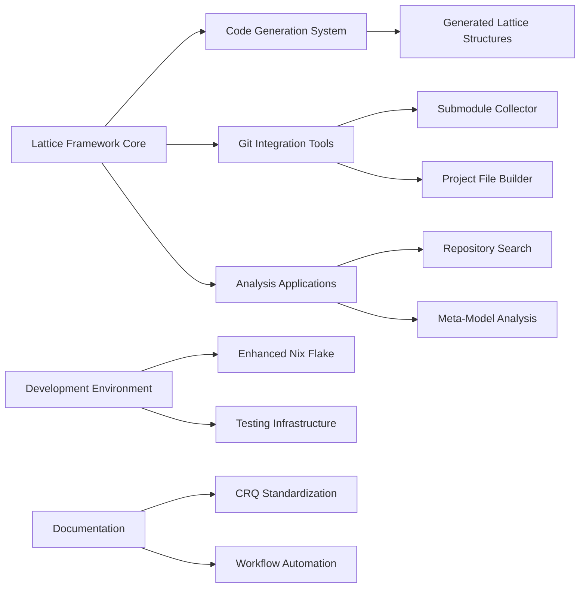

### **User description**
# CRQ-50-llm-communication-protocol.md

## Change Request: llm communication protocol
## LLM Communication Protocol: Audited, Controlled, Curried, and Continuable

This document outlines the conceptual design for a robust communication protocol enabling secure, auditable, and stateful interactions with Large Language Models (LLMs) within the Lattice Idea Framework. This protocol is a critical component of the "Grand Unified Search" architecture, facilitating advanced knowledge extraction and collaborative reasoning.

### 1. Audited and Controlled Communication

Given the sensitive nature of knowledge extraction and the potential for LLMs to generate unexpected or biased outputs, the communication system must be rigorously audited and controlled:

*   **Audit Trails:** Every interaction (query, context, response, and any subsequent actions) is logged with timestamps, user/system identifiers, and relevant lattice addresses. This creates a comprehensive, immutable audit trail for transparency and debugging.
*   **Access Control:** Fine-grained access control mechanisms ensure that only authorized components or users can initiate queries or access specific types of LLM responses. This prevents unauthorized data exposure or manipulation.
*   **Content Filtering & Sanitization:** Inputs to and outputs from the LLM are subject to filtering and sanitization to prevent prompt injection attacks, mitigate bias, and ensure adherence to ethical guidelines. This can involve pre- and post-processing steps guided by lattice-defined predicates.
*   **Resource Governance:** Control over LLM resource usage (e.g., rate limiting, token limits) to manage costs and prevent abuse.

### 2. Currying for Contextual Pre-filling

Currying, in this context, refers to the ability to pre-fill or partially apply context to LLM queries, creating specialized query functions. This enhances efficiency and precision by embedding relevant lattice-derived information directly into the query structure.

*   **Mechanism:** Instead of sending a full context with every query, the system can create a "curried query function" that already includes:
    *   The current lattice address of the analysis (e.g., `layer_k_2/instance_X`).
    *   A set of relevant predicates already extracted from the code being analyzed.
    *   Specific constraints or objectives derived from the structured testing framework.
*   **Benefits:**
    *   **Reduced Redundancy:** Avoids sending repetitive contextual information with each query.
    *   **Improved Focus:** Guides the LLM more precisely towards the desired knowledge, reducing irrelevant responses.
    *   **Enhanced Security:** Sensitive context can be pre-processed or tokenized before being curried into the query, reducing direct exposure.

### 3. Continuation for Stateful Interaction

Continuation enables the system to maintain a stateful dialogue or reasoning process with the LLM across multiple turns, allowing for complex, multi-step knowledge extraction. This goes beyond simple Q&A to facilitate iterative refinement and deeper understanding.

*   **Mechanism:** Each LLM response can include a "continuation token" or a set of "continuation instructions" that guide the next query. This allows the system to:
    *   **Follow Chains of Reasoning:** If an LLM provides a partial answer, the system can use the continuation to ask for elaboration or the next logical step.
    *   **Resolve Ambiguities:** If an LLM response is ambiguous, the system can use continuation to provide clarifying context or ask targeted follow-up questions.
    *   **Iterative Refinement:** The system can iteratively refine its understanding of a complex concept by repeatedly querying the LLM, each time building on the previous response and guiding the LLM towards a fixed point of knowledge.
*   **Lattice Integration:** The state of the conversation and the progression of reasoning can be mapped onto the lattice. Each turn in the dialogue could correspond to a traversal path or a new node in the lattice, providing an auditable and analyzable record of the knowledge extraction process.

This protocol transforms LLM interaction from a series of isolated requests into a structured, intelligent dialogue, enabling the framework to extract and synthesize knowledge with unprecedented depth and control.

___

### **PR Type**
Enhancement

___

### **Description**
• **Major lattice framework implementation**: Complete implementation of the Lattice Idea Framework with core types, structures, and code generation capabilities
• **New development tools and applications**: Added 10+ new Rust applications including submodule collector, project file lattice builder, lattice mapper, and repository search simulator
• **Code generation system**: Implemented comprehensive code generation using `syn` and `quote` crates for programmatic lattice construction
• **Git integration utilities**: New Git project reader library and submodule analysis tools with comprehensive JSON reporting
• **Testing infrastructure**: Added performance benchmarking with IAI Callgrind and comprehensive test suites for all new components
• **Development environment enhancements**: Enhanced Nix flake with valgrind, development tools, and shell formatting utilities
• **Documentation and workflow automation**: Added CRQ standardization scripts, GitHub CLI wrappers, and comprehensive project documentation
• **Meta-modeling capabilities**: Self-referential framework analysis and grand unified search system conceptual implementation

___

### Diagram Walkthrough

 
<h3> File Walkthrough</h3>

<table><thead><tr><th></th><th align="left">Relevant files</th></tr></thead><tbody><tr><td><strong>Configuration changes</strong></td><td>

2 files
<table>
<tr>
  <td>
    

      
<strong>flake.nix</strong><dd><code>Enhanced Nix flake with submodule-collector package and development </code> <code>tools</code></dd>

flake.nix

• Removed empty line at the beginning of the file  • Added new  <code>submodule-collector</code> package derivation with Rust build configuration  •  Added multiple development tools including jq, valgrind, and various  Emacs packages  • Added shell formatting and linting tools (shellcheck,  shfmt, nixpkgs-fmt)

  </td>
  <td><a href="https://github.com/meta-introspector/git-submodules-rs-nix/pull/7/files#diff-206b9ce276ab5971a2489d75eb1b12999d4bf3843b7988cbe8d687cfde61dea0">+34/-1</a>&nbsp; &nbsp; </td>

</tr>

<tr>
  <td>
    

      
<strong>shell.nix</strong><dd><code>Added valgrind to development shell dependencies</code>&nbsp; &nbsp; &nbsp; &nbsp; &nbsp; &nbsp; &nbsp; &nbsp; &nbsp; </dd>

shell.nix

• Added <code>pkgs.valgrind</code> to the buildInputs list for memory profiling  support

  </td>
  <td><a href="https://github.com/meta-introspector/git-submodules-rs-nix/pull/7/files#diff-e53dfbfffe62ae3c0b411b3938ccffa9fb6a2ecc565f55785ef8daa756631a6b">+1/-1</a>&nbsp; &nbsp; &nbsp; </td>

</tr>
</table>
</td></tr><tr><td><strong>Enhancement</strong></td><td>

56 files
<table>
<tr>
  <td>
    

      
<strong>lib.rs</strong><dd><code>New lattice code generation library with procedural macro utilities</code></dd>

lattice_code_generator/src/lib.rs

• New library providing code generation utilities for the Lattice Idea  Framework  • Implements functions to generate Rust enums, structs, and  traits using <code>syn</code> and <code>quote</code>  • Includes comprehensive test suite for  validating generated code structure  • Supports generating <code>ValueType</code>  enums, <code>Instance</code> structs, and lattice layer components

  </td>
  <td><a href="https://github.com/meta-introspector/git-submodules-rs-nix/pull/7/files#diff-243854d89636db85a935fa955ee16fa44ea3ca7092902bc29701c3a825b0ba0a">+296/-0</a>&nbsp; </td>

</tr>

<tr>
  <td>
    

      
<strong>main.rs</strong><dd><code>New submodule collector tool for Git repository analysis</code>&nbsp; </dd>

submodule-collector/src/main.rs

• New command-line tool for scanning Git repositories and their  submodules  • Recursively processes nested submodules and collects  detailed repository information  • Outputs comprehensive JSON reports  with repository URLs, paths, and submodule details  • Includes error  handling and resilient processing of failed repositories

  </td>
  <td><a href="https://github.com/meta-introspector/git-submodules-rs-nix/pull/7/files#diff-a47f0db0f72bdfe38e4c5fc28fcb76ddd4adc991f2b12a672f14f8348411c83a">+279/-0</a>&nbsp; </td>

</tr>

<tr>
  <td>
    

      
<strong>main.rs</strong><dd><code>New project file lattice builder for conceptual file organization</code></dd>

project_file_lattice_builder/src/main.rs

• New application that constructs a conceptual lattice of project  files  • Implements file classification based on predicate analysis and  content extraction  • Maps files into lattice hierarchy using  simplified classification rules  • Includes comprehensive test suite  for predicate extraction and classification logic

  </td>
  <td><a href="https://github.com/meta-introspector/git-submodules-rs-nix/pull/7/files#diff-307096deb9eb86f24a90391b001a081a638672a52f8c27651d21c72bcfdcd2a1">+202/-0</a>&nbsp; </td>

</tr>

<tr>
  <td>
    

      
<strong>lattice_mapper_app.rs</strong><dd><code>New lattice mapper application for code similarity matching</code></dd>

src/lattice_mapper_app.rs

• New application demonstrating code mapping into pre-generated  lattice structures  • Implements similarity-based classification using  predicate matching  • Bridges lattice structure generation with  repository search functionality  • Shows conceptual "generate and then  match" process for code classification

  </td>
  <td><a href="https://github.com/meta-introspector/git-submodules-rs-nix/pull/7/files#diff-d4b10dc90da2ebd2e54c216c08faf398915f797cc4bf2e94185cd40832762c62">+209/-0</a>&nbsp; </td>

</tr>

<tr>
  <td>
    

      
<strong>lattice_types.rs</strong><dd><code>New lattice types module with core framework structures</code>&nbsp; &nbsp; </dd>

src/lattice_types.rs

• New module defining conceptual lattice types and structures in Rust   • Implements <code>ValueType</code> enum, <code>Instance</code> struct, and <code>LatticeLayer</code>  components  • Includes trait definitions for value counting and lattice  layer operations  • Demonstrates usage with bit-based and three-value  type examples

  </td>
  <td><a href="https://github.com/meta-introspector/git-submodules-rs-nix/pull/7/files#diff-b4cbc31fe99d9b693a12612fdfbcbb6a05afbab7836ee96ef34759a80eea2dfc">+196/-0</a>&nbsp; </td>

</tr>

<tr>
  <td>
    

      
<strong>repo_search_simulator.rs</strong><dd><code>New repository search simulator for predicate-based code analysis</code></dd>

src/repo_search_simulator.rs

• New application simulating search-by-example across mock  repositories  • Implements predicate-based classification and  similarity scoring  • Demonstrates lattice framework application to  large codebase analysis  • Includes conceptual repository  classification and comparison logic

  </td>
  <td><a href="https://github.com/meta-introspector/git-submodules-rs-nix/pull/7/files#diff-0fd44409289d811f50e94913ae801d7ed5c483e8798303c297ac9854807cfe41">+202/-0</a>&nbsp; </td>

</tr>

<tr>
  <td>
    

      
<strong>meta_lattice_model.rs</strong><dd><code>New meta-lattice model for self-referential framework analysis</code></dd>

src/meta_lattice_model.rs

• New meta-model program that conceptually models the lattice idea  framework itself  • Implements self-referential analysis and similar  model detection  • Demonstrates framework's capacity for meta-modeling  and self-analysis  • Includes conceptual search functionality for  finding similar frameworks

  </td>
  <td><a href="https://github.com/meta-introspector/git-submodules-rs-nix/pull/7/files#diff-4ad95f3ed0d6e795cabcf8199fb28fa159aef84b4f32e578f55079fa94e07625">+153/-0</a>&nbsp; </td>

</tr>

<tr>
  <td>
    

      
<strong>analyze_strings.rs</strong><dd><code>New string analysis module with n-gram processing and ontology rules</code></dd>

report-analyzer-rs/src/analyze_strings.rs

• New string analysis module for processing repository reports  •  Implements token collection, frequency counting, and n-gram generation   • Includes iterative analysis with emoji ontology application  •  Provides suggested ontology rules generation based on analysis results

  </td>
  <td><a href="https://github.com/meta-introspector/git-submodules-rs-nix/pull/7/files#diff-2972c1dbf1387f1fc356a8a7315beb271dcacb9eb512719d2ac60d15084a7c1a">+171/-0</a>&nbsp; </td>

</tr>

<tr>
  <td>
    

      
<strong>lattice_classifier_app.rs</strong><dd><code>New lattice classifier application for predicate-based text analysis</code></dd>

src/lattice_classifier_app.rs

• New application demonstrating lattice-based text classification  •  Implements predicate-based classification using generated lattice  structures  • Includes word predicate extraction and instance creation  functionality  • Shows conceptual usage of generated lattice types for  search-by-example

  </td>
  <td><a href="https://github.com/meta-introspector/git-submodules-rs-nix/pull/7/files#diff-2046e6cf0881f2c6f04e40c623dbf7b071fa54d0b330bd758caea2f306c79f59">+188/-0</a>&nbsp; </td>

</tr>

<tr>
  <td>
    

      
<strong>lib.rs</strong><dd><code>New Git project reader library with repository information collection</code></dd>

git_project_reader/src/lib.rs

• New library for reading Git project information including tracked  files and status  • Implements functions to collect repository data and  execute git commands  • Includes comprehensive test suite with  temporary repository creation  • Provides structured <code>GitProjectInfo</code> for  repository analysis

  </td>
  <td><a href="https://github.com/meta-introspector/git-submodules-rs-nix/pull/7/files#diff-258b44c334cd672e0393e8cad155edd07074a84e46a6c7389d9d227e07b3e1d8">+174/-0</a>&nbsp; </td>

</tr>

<tr>
  <td>
    

      
<strong>grand_unified_search.rs</strong><dd><code>New grand unified search system conceptual implementation</code></dd>

src/grand_unified_search.rs

• New conceptual outline for a Grand Unified Search system  •  Demonstrates self-parsing, similarity search, and LLM interaction  concepts  • Includes placeholder functions for code analysis and  submodule tool integration  • Shows theoretical framework for  large-scale code analysis and knowledge extraction

  </td>
  <td><a href="https://github.com/meta-introspector/git-submodules-rs-nix/pull/7/files#diff-b8a48c02f53b75052bc23d20df7488207a5b86d7815d3fb29ef0b8b985553ab1">+148/-0</a>&nbsp; </td>

</tr>

<tr>
  <td>
    

      
<strong>lattice_model.rs</strong><dd><code>New lattice model module with core framework components</code>&nbsp; &nbsp; </dd>

src/lattice_model.rs

• New lattice model module with core framework types and structures  •  Implements <code>ValueType</code> enum with prime-based value types and ZOS  sequence  • Includes <code>Instance</code>, <code>LatticeLayer</code>, and <code>Lattice</code> struct  definitions  • Provides <code>PredicateClassifier</code> for text-based predicate  extraction

  </td>
  <td><a href="https://github.com/meta-introspector/git-submodules-rs-nix/pull/7/files#diff-780a4d5fb95789264d299113f8c45e066dafc4aa039180f7494020e35c5246b6">+136/-0</a>&nbsp; </td>

</tr>

<tr>
  <td>
    

      
<strong>word_predicate_analyzer.rs</strong><dd><code>New word predicate analyzer for text-based lattice analysis</code></dd>

src/word_predicate_analyzer.rs

• New analyzer for representing and analyzing words as predicates  •  Implements text tokenization and conversion to <code>WordPredicate</code> types  •  Includes n-gram generation functionality for predicate sequences  •  Demonstrates integration with lattice types for text analysis

  </td>
  <td><a href="https://github.com/meta-introspector/git-submodules-rs-nix/pull/7/files#diff-8b1a5639c122dab7e9c36fd0dac9ffa1dd9fbbbb4fb5d68eca6be406d0f63e83">+95/-0</a>&nbsp; &nbsp; </td>

</tr>

<tr>
  <td>
    

      
<strong>main.rs</strong><dd><code>New lattice structure generator for organized code hierarchy</code></dd>

lattice_structure_generator/src/main.rs

• New application for generating structured lattice directory  hierarchies  • Creates organized file structure based on lattice  generation parameters  • Generates core lattice components and layered  instance structures  • Includes conceptual mapping documentation for  existing code integration

  </td>
  <td><a href="https://github.com/meta-introspector/git-submodules-rs-nix/pull/7/files#diff-0503dd508e5c7168f8b6b74fb16594f291c5cead8790bfaec55d85ac576166f2">+82/-0</a>&nbsp; &nbsp; </td>

</tr>

<tr>
  <td>
    

      
<strong>lib.rs</strong><dd><code>Enhanced library with ZOS lattice construction functionality</code></dd>

src/lib.rs

• Added new <code>build_zos_lattice</code> function for constructing project  lattices  • Integrated lattice model components with file  classification logic  • Implements multi-layer lattice construction  based on file types and content  • Added comprehensive file  classification into different lattice layers

  </td>
  <td><a href="https://github.com/meta-introspector/git-submodules-rs-nix/pull/7/files#diff-b1a35a68f14e696205874893c07fd24fdb88882b47c23cc0e0c80a30c7d53759">+78/-0</a>&nbsp; &nbsp; </td>

</tr>

<tr>
  <td>
    

      
<strong>main.rs</strong><dd><code>New lattice generator application for automated code generation</code></dd>

lattice_generator_app/src/main.rs

• New application for generating lattice code using the code generator  library  • Creates organized output directory with generated Rust code  files  • Generates all core lattice components including enums,  structs, and traits  • Provides file writing utilities for code  generation output

  </td>
  <td><a href="https://github.com/meta-introspector/git-submodules-rs-nix/pull/7/files#diff-ba3c74e9dedda9c826a5198e4fb1879be1cc3251ad2be3b8bd4cef25d22bf646">+56/-0</a>&nbsp; &nbsp; </td>

</tr>

<tr>
  <td>
    

      
<strong>main.rs</strong><dd><code>Main entry point for report analyzer application</code>&nbsp; &nbsp; &nbsp; &nbsp; &nbsp; &nbsp; &nbsp; &nbsp; &nbsp; </dd>

report-analyzer-rs/src/main.rs

• Implements main entry point for report analyzer with command-line  argument parsing  • Loads JSON report and optional ontology files from  specified paths  • Calls string analysis function and prints results  with emoji ontology mapping  • Comments out unused analysis functions  (LCP, duplicates, organizations, names)

  </td>
  <td><a href="https://github.com/meta-introspector/git-submodules-rs-nix/pull/7/files#diff-0c621fee3c56e03aa11c26e9371c0d100ee91ec12c43746c6cf2eb8f687bdeac">+50/-0</a>&nbsp; &nbsp; </td>

</tr>

<tr>
  <td>
    

      
<strong>program_self_description.rs</strong><dd><code>Self-describing program demonstrating lattice framework concepts</code></dd>

src/program_self_description.rs

• Creates a self-describing Rust program demonstrating the theoretical  framework  • Implements functions to describe itself and search for  similar programs  • Uses predicate-based approach with "word as  predicate" model  • Includes meta-assertion about self-referential  capacity

  </td>
  <td><a href="https://github.com/meta-introspector/git-submodules-rs-nix/pull/7/files#diff-386ecf0f7a94fde9c182bd08fe96599c8620c47e849ed27d5ffd2d799bf30060">+37/-0</a>&nbsp; &nbsp; </td>

</tr>

<tr>
  <td>
    

      
<strong>lcp.rs</strong><dd><code>Longest common prefix analysis implementation</code>&nbsp; &nbsp; &nbsp; &nbsp; &nbsp; &nbsp; &nbsp; &nbsp; &nbsp; &nbsp; &nbsp; &nbsp; </dd>

report-analyzer-rs/src/lcp.rs

• Implements longest common prefix (LCP) analysis for repository paths  and URLs  • Provides functions to find LCP among strings and perform  analysis on report data  • Includes nested repository and submodule  path processing  • Adds formatted output for LCP analysis results

  </td>
  <td><a href="https://github.com/meta-introspector/git-submodules-rs-nix/pull/7/files#diff-b21ab373ab1b39d083a90c0171119e10f283f4af3edb4ab1148d439b9eda1101">+51/-0</a>&nbsp; &nbsp; </td>

</tr>

<tr>
  <td>
    

      
<strong>types.rs</strong><dd><code>Core data types and CLI argument definitions</code>&nbsp; &nbsp; &nbsp; &nbsp; &nbsp; &nbsp; &nbsp; &nbsp; &nbsp; &nbsp; &nbsp; &nbsp; &nbsp; </dd>

report-analyzer-rs/src/types.rs

• Defines core data structures for report analysis (SubmoduleInfo,  RepoInfo, Report)  • Implements command-line argument parsing with clap  derive macros  • Adds serialization/deserialization support for JSON  handling  • Includes ontology type definition for emoji mapping

  </td>
  <td><a href="https://github.com/meta-introspector/git-submodules-rs-nix/pull/7/files#diff-70a32aaec9d7a33bba7859aaec9a648355cf4a92b9a1c688430f60fd0b1ad036">+47/-0</a>&nbsp; &nbsp; </td>

</tr>

<tr>
  <td>
    

      
<strong>analyze_names.rs</strong><dd><code>Repository and submodule name frequency analysis</code>&nbsp; &nbsp; &nbsp; &nbsp; &nbsp; &nbsp; &nbsp; &nbsp; &nbsp; </dd>

report-analyzer-rs/src/analyze_names.rs

• Implements repository and submodule name analysis functionality  •  Extracts names from GitHub URLs using regex patterns  • Counts  frequency of repository and submodule names  • Processes both main  repositories and nested repositories

  </td>
  <td><a href="https://github.com/meta-introspector/git-submodules-rs-nix/pull/7/files#diff-ece2606d6df195d4968ecc9276f8faa6fb13f2dfbd036a099bdef2995f9eac1d">+30/-0</a>&nbsp; &nbsp; </td>

</tr>

<tr>
  <td>
    

      
<strong>value_type.rs</strong><dd><code>Generated lattice value type definitions</code>&nbsp; &nbsp; &nbsp; &nbsp; &nbsp; &nbsp; &nbsp; &nbsp; &nbsp; &nbsp; &nbsp; &nbsp; &nbsp; &nbsp; &nbsp; &nbsp; &nbsp; </dd>

generated_lattice_code/value_type.rs

• Defines ValueType enum with various prime-based value types  •  Implements count method and zos_sequence function  • Contains  compressed/minified Rust code on single line  • Represents lattice  framework's value type system

  </td>
  <td><a href="https://github.com/meta-introspector/git-submodules-rs-nix/pull/7/files#diff-4534ce506bbc5e0a512da2a9f61948dc44575940029777e3be9fa6f1ce706735">+1/-0</a>&nbsp; &nbsp; &nbsp; </td>

</tr>

<tr>
  <td>
    

      
<strong>value_type.rs</strong><dd><code>Duplicate generated lattice value type definitions</code>&nbsp; &nbsp; &nbsp; &nbsp; &nbsp; &nbsp; &nbsp; </dd>

generated_lattice_structure/value_type.rs

• Duplicate of generated_lattice_code/value_type.rs  • Same ValueType  enum and implementation  • Compressed format on single line  • Part of  lattice structure generation

  </td>
  <td><a href="https://github.com/meta-introspector/git-submodules-rs-nix/pull/7/files#diff-0e397496f4650bd5f8a1aaa402b4f095cc1ebfec730fb80a60040684b1e76798">+1/-0</a>&nbsp; &nbsp; &nbsp; </td>

</tr>

<tr>
  <td>
    

      
<strong>analyze_orgs.rs</strong><dd><code>GitHub organization frequency analysis</code>&nbsp; &nbsp; &nbsp; &nbsp; &nbsp; &nbsp; &nbsp; &nbsp; &nbsp; &nbsp; &nbsp; &nbsp; &nbsp; &nbsp; &nbsp; &nbsp; &nbsp; &nbsp; &nbsp; </dd>

report-analyzer-rs/src/analyze_orgs.rs

• Implements GitHub organization analysis from repository URLs  • Uses  regex to extract organization names from GitHub URLs  • Counts  frequency of organizations across repositories  • Processes both  successful and failed repositories

  </td>
  <td><a href="https://github.com/meta-introspector/git-submodules-rs-nix/pull/7/files#diff-dfc5e43d786c558598103c88d48bb1cfc40e246b3ba904ae455a340f1c5d7e0a">+26/-0</a>&nbsp; &nbsp; </td>

</tr>

<tr>
  <td>
    

      
<strong>lattice_struct.rs</strong><dd><code>Generated lattice main structure definitions</code>&nbsp; &nbsp; &nbsp; &nbsp; &nbsp; &nbsp; &nbsp; &nbsp; &nbsp; &nbsp; &nbsp; &nbsp; &nbsp; </dd>

generated_lattice_code/lattice_struct.rs

• Defines main Lattice struct with dynamic layer management  •  Implements trait-based polymorphism for different layer types  •  Provides methods for adding layers and describing lattice structure  •  Compressed single-line format for generated code

  </td>
  <td><a href="https://github.com/meta-introspector/git-submodules-rs-nix/pull/7/files#diff-79d9dfa1f549d761bf956b17120979d037243e9dc1f10ebb9402e5b62ff5cf46">+1/-0</a>&nbsp; &nbsp; &nbsp; </td>

</tr>

<tr>
  <td>
    

      
<strong>lattice_struct.rs</strong><dd><code>Duplicate generated lattice structure definitions</code>&nbsp; &nbsp; &nbsp; &nbsp; &nbsp; &nbsp; &nbsp; &nbsp; </dd>

generated_lattice_structure/lattice_struct.rs

• Duplicate of generated_lattice_code/lattice_struct.rs  • Same Lattice  struct and trait implementations  • Identical compressed format  • Part  of structure generation system

  </td>
  <td><a href="https://github.com/meta-introspector/git-submodules-rs-nix/pull/7/files#diff-d0b1a7887fc4298e093cd2bfb55016adcc95a93c94f2f6df94699f5fb9f43180">+1/-0</a>&nbsp; &nbsp; &nbsp; </td>

</tr>

<tr>
  <td>
    

      
<strong>instance_struct.rs</strong><dd><code>Generated lattice instance structure definitions</code>&nbsp; &nbsp; &nbsp; &nbsp; &nbsp; &nbsp; &nbsp; &nbsp; &nbsp; </dd>

generated_lattice_code/instance_struct.rs

• Defines Instance struct for lattice elements with generic type  support  • Implements constructor and description methods  • Includes  n-gram size validation and unit management  • Compressed single-line  generated code format

  </td>
  <td><a href="https://github.com/meta-introspector/git-submodules-rs-nix/pull/7/files#diff-d3a134be5da73893ad11cfba2741e995cb5385d116f305bb9f90ba03072271f8">+1/-0</a>&nbsp; &nbsp; &nbsp; </td>

</tr>

<tr>
  <td>
    

      
<strong>instance_struct.rs</strong><dd><code>Duplicate generated lattice instance definitions</code>&nbsp; &nbsp; &nbsp; &nbsp; &nbsp; &nbsp; &nbsp; &nbsp; &nbsp; </dd>

generated_lattice_structure/instance_struct.rs

• Duplicate of generated_lattice_code/instance_struct.rs  • Same  Instance struct implementation  • Identical compressed format  • Part of  lattice structure system

  </td>
  <td><a href="https://github.com/meta-introspector/git-submodules-rs-nix/pull/7/files#diff-2a3695aa0e91eed81596edd58de20843bbebe8a9e7ddddae052cc7f695267747">+1/-0</a>&nbsp; &nbsp; &nbsp; </td>

</tr>

<tr>
  <td>
    

      
<strong>lattice_layer_struct.rs</strong><dd><code>Generated lattice layer structure definitions</code>&nbsp; &nbsp; &nbsp; &nbsp; &nbsp; &nbsp; &nbsp; &nbsp; &nbsp; &nbsp; &nbsp; &nbsp; </dd>

generated_lattice_code/lattice_layer_struct.rs

• Defines LatticeLayer struct for organizing instances by value type  •  Implements layer management with type validation  • Provides methods  for adding instances and describing layers  • Compressed single-line  generated code

  </td>
  <td><a href="https://github.com/meta-introspector/git-submodules-rs-nix/pull/7/files#diff-0aacd04a7a621f806b54ffa94092f874682700841e03474720504945ec824126">+1/-0</a>&nbsp; &nbsp; &nbsp; </td>

</tr>

<tr>
  <td>
    

      
<strong>lattice_layer_struct.rs</strong><dd><code>Duplicate generated lattice layer definitions</code>&nbsp; &nbsp; &nbsp; &nbsp; &nbsp; &nbsp; &nbsp; &nbsp; &nbsp; &nbsp; &nbsp; &nbsp; </dd>

generated_lattice_structure/lattice_layer_struct.rs

• Duplicate of generated_lattice_code/lattice_layer_struct.rs  • Same  LatticeLayer struct implementation  • Identical compressed format  •  Part of structure generation framework

  </td>
  <td><a href="https://github.com/meta-introspector/git-submodules-rs-nix/pull/7/files#diff-8732c80f707e0ab6b869ea056076368c8830979c489e8c25c0b1d63a05affb3b">+1/-0</a>&nbsp; &nbsp; &nbsp; </td>

</tr>

<tr>
  <td>
    

      
<strong>duplicates.rs</strong><dd><code>Duplicate repository URL detection and analysis</code>&nbsp; &nbsp; &nbsp; &nbsp; &nbsp; &nbsp; &nbsp; &nbsp; &nbsp; &nbsp; </dd>

report-analyzer-rs/src/duplicates.rs

• Implements duplicate repository URL detection and analysis  •  Provides functions to analyze and print duplicate URLs with their  paths  • Groups repositories by URL to identify duplicates  • Includes  formatted output for duplicate analysis results

  </td>
  <td><a href="https://github.com/meta-introspector/git-submodules-rs-nix/pull/7/files#diff-4d80fd66c8b316d5012d6352dd781de56fe14903a0f5394e6ce2fa81ee99e035">+25/-0</a>&nbsp; &nbsp; </td>

</tr>

<tr>
  <td>
    

      
<strong>input.rs</strong><dd><code>Input handling and data loading functionality</code>&nbsp; &nbsp; &nbsp; &nbsp; &nbsp; &nbsp; &nbsp; &nbsp; &nbsp; &nbsp; &nbsp; &nbsp; </dd>

report-analyzer-rs/src/input.rs

• Implements input handling for command-line arguments and data  loading  • Provides functions to parse arguments and load JSON  report/ontology files  • Handles file reading and JSON deserialization  with error handling  • Supports optional ontology file loading

  </td>
  <td><a href="https://github.com/meta-introspector/git-submodules-rs-nix/pull/7/files#diff-e9ea32f3583a31e364d9ff7d6c37296c5c56f4c8fe8b359a4693368182e54e3b">+22/-0</a>&nbsp; &nbsp; </td>

</tr>

<tr>
  <td>
    

      
<strong>apply_emojis.rs</strong><dd><code>Emoji ontology text transformation functionality</code>&nbsp; &nbsp; &nbsp; &nbsp; &nbsp; &nbsp; &nbsp; &nbsp; &nbsp; </dd>

report-analyzer-rs/src/apply_emojis.rs

• Implements emoji ontology application to text strings  • Replaces  text keys with corresponding emoji values from ontology  • Sorts keys  by length to handle overlapping replacements correctly  • Returns  original text if no ontology is provided

  </td>
  <td><a href="https://github.com/meta-introspector/git-submodules-rs-nix/pull/7/files#diff-b046d9b03ffcc74bc7362f658297d45a8141ccff9481915e5a8348b7f49a2297">+18/-0</a>&nbsp; &nbsp; </td>

</tr>

<tr>
  <td>
    

      
<strong>names_analysis.rs</strong><dd><code>Repository name analysis output formatting</code>&nbsp; &nbsp; &nbsp; &nbsp; &nbsp; &nbsp; &nbsp; &nbsp; &nbsp; &nbsp; &nbsp; &nbsp; &nbsp; &nbsp; &nbsp; </dd>

report-analyzer-rs/src/names_analysis.rs

• Implements formatted output for repository/submodule name analysis  •  Sorts names by frequency and displays top 10 results  • Applies emoji  ontology transformation to names  • Handles empty results with  appropriate messaging

  </td>
  <td><a href="https://github.com/meta-introspector/git-submodules-rs-nix/pull/7/files#diff-300b8fb41eee786eabd0188c0030f81f88dfc1cee7f998e57e62b26ff2a14c37">+14/-0</a>&nbsp; &nbsp; </td>

</tr>

<tr>
  <td>
    

      
<strong>org_analysis.rs</strong><dd><code>Organization analysis output formatting</code>&nbsp; &nbsp; &nbsp; &nbsp; &nbsp; &nbsp; &nbsp; &nbsp; &nbsp; &nbsp; &nbsp; &nbsp; &nbsp; &nbsp; &nbsp; &nbsp; &nbsp; &nbsp; </dd>

report-analyzer-rs/src/org_analysis.rs

• Implements formatted output for organization frequency analysis  •  Sorts organizations by count and shows top 10 results  • Applies emoji  ontology to organization names  • Provides fallback message for empty  results

  </td>
  <td><a href="https://github.com/meta-introspector/git-submodules-rs-nix/pull/7/files#diff-5bc7fdd91e1797253239ee186eacd73c931025fcd10b5880906a97a8400fbdcc">+13/-0</a>&nbsp; &nbsp; </td>

</tr>

<tr>
  <td>
    

      
<strong>main.rs</strong><dd><code>Git repository testing utility</code>&nbsp; &nbsp; &nbsp; &nbsp; &nbsp; &nbsp; &nbsp; &nbsp; &nbsp; &nbsp; &nbsp; &nbsp; &nbsp; &nbsp; &nbsp; &nbsp; &nbsp; &nbsp; &nbsp; &nbsp; &nbsp; &nbsp; &nbsp; &nbsp; &nbsp; &nbsp; &nbsp; </dd>

git_test_repo/src/main.rs

• Creates simple Git repository testing application  • Uses git2  library to open and validate repository at current directory  •  Provides basic error handling for repository operations  • Demonstrates  Git repository access functionality

  </td>
  <td><a href="https://github.com/meta-introspector/git-submodules-rs-nix/pull/7/files#diff-8b9cadcb87746c34dbbc19f46f1ef3a55b401e70c5dba9cf5f2af4f9877fa594">+10/-0</a>&nbsp; &nbsp; </td>

</tr>

<tr>
  <td>
    

      
<strong>instance_1.rs</strong><dd><code>Generated lattice layer k=2 instance placeholder</code>&nbsp; &nbsp; &nbsp; &nbsp; &nbsp; &nbsp; &nbsp; &nbsp; &nbsp; </dd>

generated_lattice_structure/layer_k_2/instance_1.rs

• Placeholder file for Layer k=2, Instance 1 implementation  • Contains  comments describing 2-value type structure  • Part of generated lattice  structure hierarchy  • Represents specific lattice layer instance

  </td>
  <td><a href="https://github.com/meta-introspector/git-submodules-rs-nix/pull/7/files#diff-df8632b2498c76b1d518d069119ef059ccb029cdcabff4a67066bd7b537542ca">+3/-0</a>&nbsp; &nbsp; &nbsp; </td>

</tr>

<tr>
  <td>
    

      
<strong>instance_0.rs</strong><dd><code>Generated lattice layer k=3 instance placeholder</code>&nbsp; &nbsp; &nbsp; &nbsp; &nbsp; &nbsp; &nbsp; &nbsp; &nbsp; </dd>

generated_lattice_structure/layer_k_3/instance_0.rs

• Placeholder file for Layer k=3, Instance 0 implementation  • Contains  comments about 3-value type structure  • Part of lattice structure  generation system  • Represents specific layer instance

  </td>
  <td><a href="https://github.com/meta-introspector/git-submodules-rs-nix/pull/7/files#diff-45a15a4ed78fb935970c9dfb064319535f48d88aa3eeaaf6724236295ad8bc36">+3/-0</a>&nbsp; &nbsp; &nbsp; </td>

</tr>

<tr>
  <td>
    

      
<strong>instance_1.rs</strong><dd><code>Generated lattice layer k=3 instance placeholder</code>&nbsp; &nbsp; &nbsp; &nbsp; &nbsp; &nbsp; &nbsp; &nbsp; &nbsp; </dd>

generated_lattice_structure/layer_k_3/instance_1.rs

• Placeholder file for Layer k=3, Instance 1 implementation  • Similar  structure to other layer instance files  • Part of lattice framework  generation  • Contains descriptive comments about implementation

  </td>
  <td><a href="https://github.com/meta-introspector/git-submodules-rs-nix/pull/7/files#diff-f985fd8aeb2357840bce2296c2e55547376810292136d6b105ebb782f0c2bea1">+3/-0</a>&nbsp; &nbsp; &nbsp; </td>

</tr>

<tr>
  <td>
    

      
<strong>has_value_count_impls.rs</strong><dd><code>Generated HasValueCount trait implementation</code>&nbsp; &nbsp; &nbsp; &nbsp; &nbsp; &nbsp; &nbsp; &nbsp; &nbsp; &nbsp; &nbsp; &nbsp; &nbsp; </dd>

generated_lattice_code/has_value_count_impls.rs

• Implements HasValueCount trait for bool type  • Provides value_count  method returning 2 for boolean  • Compressed single-line generated code  format  • Part of lattice type system implementation

  </td>
  <td><a href="https://github.com/meta-introspector/git-submodules-rs-nix/pull/7/files#diff-fc27ee60e32d05c14ba49d85ee4b7d8e66ac5c101ad0dbe3e5d349b4b9303ac8">+1/-0</a>&nbsp; &nbsp; &nbsp; </td>

</tr>

<tr>
  <td>
    

      
<strong>has_value_count_impls.rs</strong><dd><code>Duplicate HasValueCount trait implementation</code>&nbsp; &nbsp; &nbsp; &nbsp; &nbsp; &nbsp; &nbsp; &nbsp; &nbsp; &nbsp; &nbsp; &nbsp; &nbsp; </dd>

generated_lattice_structure/has_value_count_impls.rs

• Duplicate of generated_lattice_code/has_value_count_impls.rs  • Same  HasValueCount implementation for bool  • Identical compressed format  •  Part of structure generation system

  </td>
  <td><a href="https://github.com/meta-introspector/git-submodules-rs-nix/pull/7/files#diff-bfde8abac89de5011df90cbcb78cbcd164b872180cfb65270be5126f86444644">+1/-0</a>&nbsp; &nbsp; &nbsp; </td>

</tr>

<tr>
  <td>
    

      
<strong>has_value_count_trait.rs</strong><dd><code>Generated HasValueCount trait definition</code>&nbsp; &nbsp; &nbsp; &nbsp; &nbsp; &nbsp; &nbsp; &nbsp; &nbsp; &nbsp; &nbsp; &nbsp; &nbsp; &nbsp; &nbsp; &nbsp; &nbsp; </dd>

generated_lattice_code/has_value_count_trait.rs

• Defines HasValueCount trait with value_count method  • Compressed  single-line generated code  • Core trait for lattice type system  •  Enables generic value counting functionality

  </td>
  <td><a href="https://github.com/meta-introspector/git-submodules-rs-nix/pull/7/files#diff-cf0ba0ca0358cab475d52e9b5edf475682f4cd05a5cd4d554b917677343ec3b1">+1/-0</a>&nbsp; &nbsp; &nbsp; </td>

</tr>

<tr>
  <td>
    

      
<strong>has_value_count_trait.rs</strong><dd><code>Duplicate HasValueCount trait definition</code>&nbsp; &nbsp; &nbsp; &nbsp; &nbsp; &nbsp; &nbsp; &nbsp; &nbsp; &nbsp; &nbsp; &nbsp; &nbsp; &nbsp; &nbsp; &nbsp; &nbsp; </dd>

generated_lattice_structure/has_value_count_trait.rs

• Duplicate of generated_lattice_code/has_value_count_trait.rs  • Same  HasValueCount trait definition  • Identical compressed format  • Part of  lattice structure framework

  </td>
  <td><a href="https://github.com/meta-introspector/git-submodules-rs-nix/pull/7/files#diff-ef800ec7554c85081358a5d3b43129aedea930cf2edbc44915c73ff89d7f767e">+1/-0</a>&nbsp; &nbsp; &nbsp; </td>

</tr>

<tr>
  <td>
    

      
<strong>standardize_and_move_crqs.sh</strong><dd><code>CRQ file standardization and organization script</code>&nbsp; &nbsp; &nbsp; &nbsp; &nbsp; &nbsp; &nbsp; &nbsp; &nbsp; </dd>

tools/gh_scripts/standardize_and_move_crqs.sh

• Comprehensive bash script for standardizing CRQ (Change Request  Quality) files  • Implements dry-run mode and robust CRQ number  calculation  • Handles filename and header standardization with regex  processing  • Moves standardized files to designated directory with  reporting

  </td>
  <td><a href="https://github.com/meta-introspector/git-submodules-rs-nix/pull/7/files#diff-8c55bddfb101eb3114069c644947a8dd51e359934e566113c182d18a2dfd27ea">+149/-0</a>&nbsp; </td>

</tr>

<tr>
  <td>
    

      
<strong>create_crq_workflow.sh</strong><dd><code>Automated CRQ workflow creation script</code>&nbsp; &nbsp; &nbsp; &nbsp; &nbsp; &nbsp; &nbsp; &nbsp; &nbsp; &nbsp; &nbsp; &nbsp; &nbsp; &nbsp; &nbsp; &nbsp; &nbsp; &nbsp; &nbsp; </dd>

tools/gh_scripts/create_crq_workflow.sh

• Automates CRQ workflow creation including branch and PR generation  •  Extracts CRQ information and creates task.md files  • Integrates with  Git and GitHub CLI for complete workflow automation  • Handles branch  creation, commits, and pull request creation

  </td>
  <td><a href="https://github.com/meta-introspector/git-submodules-rs-nix/pull/7/files#diff-6c8f66bef77ee7fde8332f1252ae40263db8cf2753250002be768b877a1ea40e">+79/-0</a>&nbsp; &nbsp; </td>

</tr>

<tr>
  <td>
    

      
<strong>boot.sh</strong><dd><code>Session orchestration and crash recovery boot script</code>&nbsp; &nbsp; &nbsp; &nbsp; &nbsp; </dd>

boot.sh

• Orchestrates tmux session recording with asciinema  • Launches Gemini  CLI within recorded session  • Implements crash recovery checks with  git status and diff logging  • Creates timestamped log files for  session tracking

  </td>
  <td><a href="https://github.com/meta-introspector/git-submodules-rs-nix/pull/7/files#diff-c270322e6f914001c9d1d23e01d1eefe9469337f284b0c0a920c5f843a15b373">+38/-0</a>&nbsp; &nbsp; </td>

</tr>

<tr>
  <td>
    

      
<strong>gh_extract_actors.sh</strong><dd><code>GitHub actors extraction utility script</code>&nbsp; &nbsp; &nbsp; &nbsp; &nbsp; &nbsp; &nbsp; &nbsp; &nbsp; &nbsp; &nbsp; &nbsp; &nbsp; &nbsp; &nbsp; &nbsp; &nbsp; &nbsp; </dd>

tools/gh_scripts/gh_extract_actors.sh

• Extracts unique actors (users) from GitHub issues and comments  •  Uses GitHub CLI to fetch issue data in JSON format  • Processes JSON  with jq to identify unique contributors  • Provides option to save  actors list to file

  </td>
  <td><a href="https://github.com/meta-introspector/git-submodules-rs-nix/pull/7/files#diff-460ff5ab5242fc20792c70a204e82ad028e958e7a97a454d0146104b9c11c60d">+41/-0</a>&nbsp; &nbsp; </td>

</tr>

<tr>
  <td>
    

      
<strong>gh_workflows_view.sh</strong><dd><code>GitHub workflow run viewer script</code>&nbsp; &nbsp; &nbsp; &nbsp; &nbsp; &nbsp; &nbsp; &nbsp; &nbsp; &nbsp; &nbsp; &nbsp; &nbsp; &nbsp; &nbsp; &nbsp; &nbsp; &nbsp; &nbsp; &nbsp; &nbsp; &nbsp; &nbsp; &nbsp; </dd>

tools/gh_scripts/gh_workflows_view.sh

• Simple wrapper script for viewing GitHub Actions workflow runs  •  Validates run ID parameter and passes arguments to gh CLI  • Provides  usage information for proper invocation  • Part of GitHub workflow  management toolset

  </td>
  <td><a href="https://github.com/meta-introspector/git-submodules-rs-nix/pull/7/files#diff-b0c94629d1fb360d50c2e90b6727366e24932da3280fe67fba264b2557c5813d">+7/-0</a>&nbsp; &nbsp; &nbsp; </td>

</tr>

<tr>
  <td>
    

      
<strong>gh_workflows_rerun.sh</strong><dd><code>GitHub workflow re-run utility script</code>&nbsp; &nbsp; &nbsp; &nbsp; &nbsp; &nbsp; &nbsp; &nbsp; &nbsp; &nbsp; &nbsp; &nbsp; &nbsp; &nbsp; &nbsp; &nbsp; &nbsp; &nbsp; &nbsp; &nbsp; </dd>

tools/gh_scripts/gh_workflows_rerun.sh

• Wrapper script for re-running GitHub Actions workflows  • Validates  run ID parameter before execution  • Passes through additional  arguments to gh CLI  • Simple utility for workflow management

  </td>
  <td><a href="https://github.com/meta-introspector/git-submodules-rs-nix/pull/7/files#diff-e0c1712ffe488bdadbc0d62c565cf16af06d40f4e687e0934dbed1d7bbbc5355">+7/-0</a>&nbsp; &nbsp; &nbsp; </td>

</tr>

<tr>
  <td>
    

      
<strong>gh_issues_view.sh</strong><dd><code>GitHub issue viewer script</code>&nbsp; &nbsp; &nbsp; &nbsp; &nbsp; &nbsp; &nbsp; &nbsp; &nbsp; &nbsp; &nbsp; &nbsp; &nbsp; &nbsp; &nbsp; &nbsp; &nbsp; &nbsp; &nbsp; &nbsp; &nbsp; &nbsp; &nbsp; &nbsp; &nbsp; &nbsp; &nbsp; &nbsp; &nbsp; &nbsp; &nbsp; </dd>

tools/gh_scripts/gh_issues_view.sh

• Wrapper for viewing GitHub issue details  • Validates issue number  parameter  • Passes arguments to GitHub CLI  • Part of issue management  toolset

  </td>
  <td><a href="https://github.com/meta-introspector/git-submodules-rs-nix/pull/7/files#diff-ceee01b16affa23014471597e8bfa4e7093a08cae0010e80d6e417f64eb4bd73">+7/-0</a>&nbsp; &nbsp; &nbsp; </td>

</tr>

<tr>
  <td>
    

      
<strong>gh_prs_view.sh</strong><dd><code>GitHub pull request viewer script</code>&nbsp; &nbsp; &nbsp; &nbsp; &nbsp; &nbsp; &nbsp; &nbsp; &nbsp; &nbsp; &nbsp; &nbsp; &nbsp; &nbsp; &nbsp; &nbsp; &nbsp; &nbsp; &nbsp; &nbsp; &nbsp; &nbsp; &nbsp; &nbsp; </dd>

tools/gh_scripts/gh_prs_view.sh

• Simple wrapper for viewing GitHub pull request details  • Validates  PR number parameter  • Forwards arguments to gh CLI  • Part of PR  management utilities

  </td>
  <td><a href="https://github.com/meta-introspector/git-submodules-rs-nix/pull/7/files#diff-ab1b2cdb0af702cfdded4516d0729e6dfd7e8344593d60c4f8e18391e97ad237">+7/-0</a>&nbsp; &nbsp; &nbsp; </td>

</tr>

<tr>
  <td>
    

      
<strong>gh_prs_checkout.sh</strong><dd><code>GitHub pull request checkout script</code>&nbsp; &nbsp; &nbsp; &nbsp; &nbsp; &nbsp; &nbsp; &nbsp; &nbsp; &nbsp; &nbsp; &nbsp; &nbsp; &nbsp; &nbsp; &nbsp; &nbsp; &nbsp; &nbsp; &nbsp; &nbsp; &nbsp; </dd>

tools/gh_scripts/gh_prs_checkout.sh

• Wrapper script for checking out GitHub pull requests locally  •  Validates PR number parameter  • Uses gh CLI for local PR checkout  •  Facilitates local PR review workflow

  </td>
  <td><a href="https://github.com/meta-introspector/git-submodules-rs-nix/pull/7/files#diff-d28d93bffaad9e849d93396c98a560026fe56ab83bb1b6970b7c861a88374ac8">+7/-0</a>&nbsp; &nbsp; &nbsp; </td>

</tr>

<tr>
  <td>
    

      
<strong>gh_prs_create.sh</strong><dd><code>GitHub pull request creation script</code>&nbsp; &nbsp; &nbsp; &nbsp; &nbsp; &nbsp; &nbsp; &nbsp; &nbsp; &nbsp; &nbsp; &nbsp; &nbsp; &nbsp; &nbsp; &nbsp; &nbsp; &nbsp; &nbsp; &nbsp; &nbsp; &nbsp; </dd>

tools/gh_scripts/gh_prs_create.sh

• Simple wrapper for creating new GitHub pull requests  • Passes all  arguments directly to gh CLI  • Minimal script for PR creation workflow   • Part of GitHub integration toolset

  </td>
  <td><a href="https://github.com/meta-introspector/git-submodules-rs-nix/pull/7/files#diff-a93576bdc2590454343302cb71a046eb7c93a47d55a26aae5ec37b2b338c6c04">+3/-0</a>&nbsp; &nbsp; &nbsp; </td>

</tr>

<tr>
  <td>
    

      
<strong>CRQ-48-lattice-and-quine-relay.md</strong><dd><code>Lattice framework application to multi-language quine relay</code></dd>

docs/crq_standardized/CRQ-48-lattice-and-quine-relay.md

• Introduced concept of applying Lattice Idea Framework to  128-language quine relay  • Defined language-specific predicate  extraction methodology across programming languages  • Outlined  generate-and-test approach for validating lattice representations  •  Proposed mapping quine relay transformations as lattice morphisms for  universal code understanding

  </td>
  <td><a href="https://github.com/meta-introspector/git-submodules-rs-nix/pull/7/files#diff-ac1a0c1e2463866634f85d0f5f1d0869206ca883b75cacc57a8ecd6e324310ce">+38/-0</a>&nbsp; &nbsp; </td>

</tr>

<tr>
  <td>
    

      
<strong>structured_testing_framework.md</strong><dd><code>Structured testing framework for knowledge extraction</code>&nbsp; &nbsp; &nbsp; &nbsp; </dd>

docs/structured_testing_framework.md

• Defined structured testing framework based on Lattice Idea  principles  • Outlined lattice-guided test case generation and  predicate-driven assertions  • Described layered evaluation methodology  from simple to complex abstractions  • Specified test execution,  analysis, and iterative improvement processes

  </td>
  <td><a href="https://github.com/meta-introspector/git-submodules-rs-nix/pull/7/files#diff-9f5eb85b0a07c965e710e4da924aa3748a0d39a6bdabf23e67b320caed5ec658">+38/-0</a>&nbsp; &nbsp; </td>

</tr>

<tr>
  <td>
    

      
<strong>CRQ-025-rust-code-generation-for-lattice-structures-programmatic-construction-of-the-framework.md</strong><dd><code>Rust code generation system for lattice framework</code>&nbsp; &nbsp; &nbsp; &nbsp; &nbsp; &nbsp; &nbsp; &nbsp; </dd>

docs/crq_standardized/CRQ-025-rust-code-generation-for-lattice-structures-programmatic-construction-of-the-framework.md

• Documented Rust code generation approach using <code>syn</code> and <code>quote</code> crates   • Described <code>lattice_code_generator</code> crate design for programmatic  lattice construction  • Outlined automated generation of ValueType  enums, Instance structs, and LatticeLayer components  • Emphasized  benefits of consistency, scalability, and maintainability through code  generation

  </td>
  <td><a href="https://github.com/meta-introspector/git-submodules-rs-nix/pull/7/files#diff-7dc2ace370b12ddd100af187f4ba6d6d6001aaade046298ecdab7484822b5174">+36/-0</a>&nbsp; &nbsp; </td>

</tr>
</table>
</td></tr><tr><td><strong>Tests</strong></td><td>

4 files
<table>
<tr>
  <td>
    

      
<strong>git-config-parser.rs</strong><dd><code>Added comprehensive tests for Git configuration parser</code>&nbsp; &nbsp; &nbsp; </dd>

src/bin/git-config-parser.rs

• Added comprehensive test suite for Git configuration parsing  functions  • Tests cover empty configs, multiple sections, comments,  and submodule parsing  • Includes validation for both <code>.git/config</code> and  <code>.gitmodules</code> file parsing  • Removed unused import (<code>Read</code> from <code>std::io</code>)

  </td>
  <td><a href="https://github.com/meta-introspector/git-submodules-rs-nix/pull/7/files#diff-c6637247fafdce9d1d89c2b644040bf28a6f3f2adac43f626011adbf1cb6a975">+131/-1</a>&nbsp; </td>

</tr>

<tr>
  <td>
    

      
<strong>my_profiling_bench.rs</strong><dd><code>Performance benchmarking setup with IAI Callgrind</code>&nbsp; &nbsp; &nbsp; &nbsp; &nbsp; &nbsp; &nbsp; &nbsp; </dd>

benches/my_profiling_bench.rs

• Sets up IAI Callgrind benchmarking for performance profiling  •  Creates benchmark functions for <code>add</code> and dummy git config parsing  •  Uses library benchmark macros for structured performance testing  •  Includes placeholder for git-config-parser integration

  </td>
  <td><a href="https://github.com/meta-introspector/git-submodules-rs-nix/pull/7/files#diff-ba6682e5e5c2b85faec0653350824785fbc61e8b011444d3fc293fc73a8eff5f">+36/-0</a>&nbsp; &nbsp; </td>

</tr>

<tr>
  <td>
    

      
<strong>main_execution_test.rs</strong><dd><code>Integration test for project file lattice builder</code>&nbsp; &nbsp; &nbsp; &nbsp; &nbsp; &nbsp; &nbsp; &nbsp; </dd>

project_file_lattice_builder/tests/main_execution_test.rs

• Creates integration test for project file lattice builder binary  execution  • Verifies binary exists and runs successfully with expected  output  • Checks for specific output strings to validate program  functionality  • Uses Cargo's binary path resolution for test  reliability

  </td>
  <td><a href="https://github.com/meta-introspector/git-submodules-rs-nix/pull/7/files#diff-5a0c5a5a81a37ae68fa3cf8f8eec11ab88deb61bcb9ceaa24ba914cb69b8d915">+23/-0</a>&nbsp; &nbsp; </td>

</tr>

<tr>
  <td>
    

      
<strong>main_execution_test.rs</strong><dd><code>Integration test for submodule collector binary</code>&nbsp; &nbsp; &nbsp; &nbsp; &nbsp; &nbsp; &nbsp; &nbsp; &nbsp; &nbsp; </dd>

submodule-collector/tests/main_execution_test.rs

• Creates integration test for submodule collector binary execution  •  Tests binary with --help flag to verify basic functionality  •  Validates expected help message content in output  • Ensures binary  exists and executes successfully

  </td>
  <td><a href="https://github.com/meta-introspector/git-submodules-rs-nix/pull/7/files#diff-f0ca198a718b31ebcb98cfb1b258adf263175cf536d8c8883def9223df093fdb">+24/-0</a>&nbsp; &nbsp; </td>

</tr>
</table>
</td></tr><tr><td><strong>Miscellaneous</strong></td><td>

1 files
<table>
<tr>
  <td>
    

      
<strong>instance_0.rs</strong><dd><code>Generated lattice structure instance file for layer k=2</code>&nbsp; &nbsp; </dd>

generated_lattice_structure/layer_k_2/instance_0.rs

• New generated file representing a specific lattice layer instance  •  Contains placeholder code for 2-value type lattice structure  • Part of  the generated lattice directory hierarchy

  </td>
  <td><a href="https://github.com/meta-introspector/git-submodules-rs-nix/pull/7/files#diff-990ad20f4685e1e62b47bcdc403066dc9a6a5cd320f109f452149c676da95d77">+3/-0</a>&nbsp; &nbsp; &nbsp; </td>

</tr>
</table>
</td></tr><tr><td><strong>Documentation</strong></td><td>

2 files
<table>
<tr>
  <td>
    

      
<strong>submodule_report.json</strong><dd><code>Complete submodule dependency mapping and documentation</code>&nbsp; &nbsp; </dd>

submodule_report.json

• Added comprehensive JSON report documenting all Git submodules  across the project  • Contains detailed information for 100+  repositories including paths, URLs, and nested submodules  • Maps the  entire dependency graph of external repositories used in the project  •  Includes major components like <code>lattice-introspector</code>,  <code>minizinc-introspector</code>, <code>git-submodule-tools-rs</code>, and various vendor  dependencies

  </td>
  <td><a href="https://github.com/meta-introspector/git-submodules-rs-nix/pull/7/files#diff-cf55860203aefdb6b0dd57e87aa0929dd59f5d9ef2f3e88568b54dc25898e3a7">+2021/-0</a></td>

</tr>

<tr>
  <td>
    

      
<strong>CRQ-003-deep-dive-and-reflection-on-nix-development-environment-graph.md</strong><dd><code>Nix dependency graph analysis and reflection framework</code>&nbsp; &nbsp; &nbsp; </dd>

docs/crq_standardized/CRQ-003-deep-dive-and-reflection-on-nix-development-environment-graph.md

• Documented analysis methodology for Nix development environment  dependency graph  • Outlined systematic examination of nodes, edges,  and transitive dependencies  • Defined reflection and documentation  requirements for <code>devshell_graph.dot</code> analysis  • Included partial  progress notes on initial graph observations and analysis goals

  </td>
  <td><a href="https://github.com/meta-introspector/git-submodules-rs-nix/pull/7/files#diff-b282b43f374ed6c51133aa4111b710c2805811f8607431640736bdf06eb4e940">+58/-0</a>&nbsp; &nbsp; </td>

</tr>
</table>
</td></tr><tr><td><strong>Additional files</strong></td><td>

101 files
<table>
<tr>
  <td><strong>.git_commit_message.txt</strong></td>
  <td><a href="https://github.com/meta-introspector/git-submodules-rs-nix/pull/7/files#diff-993228305b4d0adb47d3b4e0b45e35a0ab0fc9b43cd5e689feef1c3a1008e64d">+0/-3</a>&nbsp; &nbsp; &nbsp; </td>

</tr>

<tr>
  <td><strong>Cargo.toml</strong></td>
  <td><a href="https://github.com/meta-introspector/git-submodules-rs-nix/pull/7/files#diff-2e9d962a08321605940b5a657135052fbcef87b5e360662bb527c96d9a615542">+10/-1</a>&nbsp; &nbsp; </td>

</tr>

<tr>
  <td><strong>README.md</strong></td>
  <td><a href="https://github.com/meta-introspector/git-submodules-rs-nix/pull/7/files#diff-b335630551682c19a781afebcf4d07bf978fb1f8ac04c6bf87428ed5106870f5">+102/-0</a>&nbsp; </td>

</tr>

<tr>
  <td><strong>SOP_Nix_Graph_Reflection.md</strong></td>
  <td><a href="https://github.com/meta-introspector/git-submodules-rs-nix/pull/7/files#diff-9eea4a14e7fcdfa68232da66ffba61faa6fb8f7d84cad0f3f9264f56731fa920">+88/-0</a>&nbsp; &nbsp; </td>

</tr>

<tr>
  <td><strong>abstract_mathematical_idea.tex</strong></td>
  <td><a href="https://github.com/meta-introspector/git-submodules-rs-nix/pull/7/files#diff-69622bfa494d6fe61c7698baf13b5efc26d6672adef2ec3e0efa0d3e6555f3a5">+76/-0</a>&nbsp; &nbsp; </td>

</tr>

<tr>
  <td><strong>concept_word_as_predicate.md</strong></td>
  <td><a href="https://github.com/meta-introspector/git-submodules-rs-nix/pull/7/files#diff-8a4ed928664c47b3be475e7d3851ba8482b5c73a3fd143b0d0457100974cffff">+20/-0</a>&nbsp; &nbsp; </td>

</tr>

<tr>
  <td><strong>creative_expressions.md</strong></td>
  <td><a href="https://github.com/meta-introspector/git-submodules-rs-nix/pull/7/files#diff-4a1fc95b2b659d0083f480aca6584896dd24abd0c4273e6b8ae8441e9f39b43d">+106/-0</a>&nbsp; </td>

</tr>

<tr>
  <td><strong>CRQ-004-rust-documentation-rustdoc-updates-for-binaries.md</strong></td>
  <td><a href="https://github.com/meta-introspector/git-submodules-rs-nix/pull/7/files#diff-abd0edba3c84273f87250e0054f5bad2327767556eb2af57cd9f5fb65c566405">+35/-0</a>&nbsp; &nbsp; </td>

</tr>

<tr>
  <td><strong>CRQ-005-readme-md-updates.md</strong></td>
  <td><a href="https://github.com/meta-introspector/git-submodules-rs-nix/pull/7/files#diff-2e437d6523601d99fe5a18d8e8e2f632742e5d3f26eb02671b3962803589e832">+34/-0</a>&nbsp; &nbsp; </td>

</tr>

<tr>
  <td><strong>CRQ-006-formal-qa-procedures-and-standard-operating-procedures-sops-development.md</strong></td>
  <td><a href="https://github.com/meta-introspector/git-submodules-rs-nix/pull/7/files#diff-62a915240d316f6f1730714794d1f7433c4784005098e1a5ad018e6a516d760f">+37/-0</a>&nbsp; &nbsp; </td>

</tr>

<tr>
  <td><strong>CRQ-007-comprehensive-project-testing.md</strong></td>
  <td><a href="https://github.com/meta-introspector/git-submodules-rs-nix/pull/7/files#diff-f52bc4442b7dab07cb9b602ad562e7b6592867befdb4d2ff9369f42e78b74ac5">+37/-0</a>&nbsp; &nbsp; </td>

</tr>

<tr>
  <td><strong>CRQ-008-the-crq-of-crqs.md</strong></td>
  <td><a href="https://github.com/meta-introspector/git-submodules-rs-nix/pull/7/files#diff-e5088eb9e08387c4341abf4486b657744b2f1a0fe8177b5cd9a3d0c54b810583">+36/-0</a>&nbsp; &nbsp; </td>

</tr>

<tr>
  <td><strong>CRQ-009-git-project-reader-library-and-integration.md</strong></td>
  <td><a href="https://github.com/meta-introspector/git-submodules-rs-nix/pull/7/files#diff-2d3dbe720e4c081729b00d4a7e748b3dfdb27c469fd6a85a95ebc6b8862bc69d">+37/-0</a>&nbsp; &nbsp; </td>

</tr>

<tr>
  <td><strong>CRQ-010-sop-documentation-and-cargo-lock-update.md</strong></td>
  <td><a href="https://github.com/meta-introspector/git-submodules-rs-nix/pull/7/files#diff-adad5ca581fcf01563ae88abc1fcb0a7b1bf007281559ea6aa75b8d511dca737">+38/-0</a>&nbsp; &nbsp; </td>

</tr>

<tr>
  <td><strong>CRQ-011-github-cli-sops-and-wrapper-scripts.md</strong></td>
  <td><a href="https://github.com/meta-introspector/git-submodules-rs-nix/pull/7/files#diff-b6ff24e9d17b8ff4a58807a0d8c20065f7a8c4545957617bbace55916f153021">+46/-0</a>&nbsp; &nbsp; </td>

</tr>

<tr>
  <td><strong>CRQ-012-integrate-git-submodule-tools-into-lattice-system.md</strong></td>
  <td><a href="https://github.com/meta-introspector/git-submodules-rs-nix/pull/7/files#diff-32f72223bf8cc82b54485b0bfb5bbfe98437d26abfcff608c2a320f8ec8120a2">+32/-0</a>&nbsp; &nbsp; </td>

</tr>

<tr>
  <td><strong>CRQ-013-integrate-gitoxide-into-lattice-system.md</strong></td>
  <td><a href="https://github.com/meta-introspector/git-submodules-rs-nix/pull/7/files#diff-195bfc579b532e53586ffc1b892e250984a7804dafd1c6576702f29a625f4df0">+32/-0</a>&nbsp; &nbsp; </td>

</tr>

<tr>
  <td><strong>CRQ-014-integrate-magoo-into-lattice-system.md</strong></td>
  <td><a href="https://github.com/meta-introspector/git-submodules-rs-nix/pull/7/files#diff-0c06fa194ecff963a8198ba81ec47c86086593f8b4b4f7356ca50d041b80f87e">+32/-0</a>&nbsp; &nbsp; </td>

</tr>

<tr>
  <td><strong>CRQ-015-integrate-naersk-into-lattice-system.md</strong></td>
  <td><a href="https://github.com/meta-introspector/git-submodules-rs-nix/pull/7/files#diff-dc9f5dcad9bf75f383fa78a8e4fe7b478c7f44e0adc11c153c2cd5c024d4547b">+32/-0</a>&nbsp; &nbsp; </td>

</tr>

<tr>
  <td><strong>CRQ-016-integrate-submod-into-lattice-system.md</strong></td>
  <td><a href="https://github.com/meta-introspector/git-submodules-rs-nix/pull/7/files#diff-ff885ea72545ac0d5d6b661eecc61246dcf144d723df659a1b189efa572b664c">+32/-0</a>&nbsp; &nbsp; </td>

</tr>

<tr>
  <td><strong>CRQ-017-submodule-lattice-integration-crqs-and-task-files.md</strong></td>
  <td><a href="https://github.com/meta-introspector/git-submodules-rs-nix/pull/7/files#diff-715470e987b31c9a9f6c1cfe2f9c072b2bc00b7040c0b76060f35de4e79e5f92">+36/-0</a>&nbsp; &nbsp; </td>

</tr>

<tr>
  <td><strong>CRQ-018-the-branch-as-a-holistic-development-unit.md</strong></td>
  <td><a href="https://github.com/meta-introspector/git-submodules-rs-nix/pull/7/files#diff-2832ecc2da1157f0deb2c08520db29562ce395f8edb92b1a1fe8a26c8826cf98">+39/-0</a>&nbsp; &nbsp; </td>

</tr>

<tr>
  <td><strong>CRQ-019-one-to-one-mapping-of-crq-to-branch-and-pull-request.md</strong></td>
  <td><a href="https://github.com/meta-introspector/git-submodules-rs-nix/pull/7/files#diff-564ce4eb098ed3bb171534f310f55239586262f320c688b2fb4c3fd0524ac2f8">+38/-0</a>&nbsp; &nbsp; </td>

</tr>

<tr>
  <td><strong>CRQ-020-braindump-update-and-crq-status-reflection.md</strong></td>
  <td><a href="https://github.com/meta-introspector/git-submodules-rs-nix/pull/7/files#diff-c4ef172e05429d8d67e528855c74922f500d612544ca49a2bba6dfe9618251b6">+34/-0</a>&nbsp; &nbsp; </td>

</tr>

<tr>
  <td><strong>CRQ-024-new-sops-for-crq-driven-development.md</strong></td>
  <td><a href="https://github.com/meta-introspector/git-submodules-rs-nix/pull/7/files#diff-edf47b642d473b24d43282565ed04f55e84181fb6396d718e673470923761d8d">+35/-0</a>&nbsp; &nbsp; </td>

</tr>

<tr>
  <td><strong>CRQ-026-zos-sequence-self-application-iterative-attribute-expansion.md</strong></td>
  <td><a href="https://github.com/meta-introspector/git-submodules-rs-nix/pull/7/files#diff-9c2012fc7f8bbf404288787385d776cedab9b119121856b2a9a7b4b584f01d3f">+31/-0</a>&nbsp; &nbsp; </td>

</tr>

<tr>
  <td><strong>CRQ-027-Open_Source_Language_and_Compiler_Classification_The_1k_Repo_Grounding.md</strong></td>
  <td><a href="https://github.com/meta-introspector/git-submodules-rs-nix/pull/7/files#diff-2cd54cbd9ef78791fbed3097e1327b3a87b6cafc69a71e9ff1f60b15c220c437">+40/-0</a>&nbsp; &nbsp; </td>

</tr>

<tr>
  <td><strong>CRQ-28-audited-llm-interaction.md</strong></td>
  <td><a href="https://github.com/meta-introspector/git-submodules-rs-nix/pull/7/files#diff-71ded38638ad554ba9c9dcf865012a6f35876f8cb25797a3ae3edc30d9a2d34d">+38/-0</a>&nbsp; &nbsp; </td>

</tr>

<tr>
  <td><strong>CRQ-29-conceptual-rust-lattice-types.md</strong></td>
  <td><a href="https://github.com/meta-introspector/git-submodules-rs-nix/pull/7/files#diff-e44703aac23ac28a428cc63faecc3e9486b422f46c9276010386519011fde66d">+56/-0</a>&nbsp; &nbsp; </td>

</tr>

<tr>
  <td><strong>CRQ-30-concrete-lattice-analysis-example.md</strong></td>
  <td><a href="https://github.com/meta-introspector/git-submodules-rs-nix/pull/7/files#diff-1c800f91d868ed987de12c40601586726adf434dbf607dfb4c814d5715fb3b8e">+54/-0</a>&nbsp; &nbsp; </td>

</tr>

<tr>
  <td><strong>CRQ-31-crq-001-review-git-log-patch.md</strong></td>
  <td><a href="https://github.com/meta-introspector/git-submodules-rs-nix/pull/7/files#diff-a871ee19bb38959d789ee7a3df0a935298e5082a8a0b429ca86936f11c4dc844">+7/-0</a>&nbsp; &nbsp; &nbsp; </td>

</tr>

<tr>
  <td><strong>CRQ-32-crq-002-automate-sops-to-rust.md</strong></td>
  <td><a href="https://github.com/meta-introspector/git-submodules-rs-nix/pull/7/files#diff-03b41ca901e9a0b3ac38680ba13014440e0ba3723eb174cfd3376f9d275b46c4">+3/-0</a>&nbsp; &nbsp; &nbsp; </td>

</tr>

<tr>
  <td><strong>CRQ-33-crq-002-submodule-report-function-development.md</strong></td>
  <td><a href="https://github.com/meta-introspector/git-submodules-rs-nix/pull/7/files#diff-32f8d2f5ee6181f0979697737d27d33711a32fcfb99a6ca3b125b46975e225e0">+44/-0</a>&nbsp; &nbsp; </td>

</tr>

<tr>
  <td><strong>CRQ-34-crq-003-context-introspector.md</strong></td>
  <td><a href="https://github.com/meta-introspector/git-submodules-rs-nix/pull/7/files#diff-daafb6f83eb1ccdd1fbbd3ee53f1a9e417a4e5042e74e0c3d4fc5e60d4229044">+3/-0</a>&nbsp; &nbsp; &nbsp; </td>

</tr>

<tr>
  <td><strong>CRQ-35-crq-004-formalize-interaction-procedure.md</strong></td>
  <td><a href="https://github.com/meta-introspector/git-submodules-rs-nix/pull/7/files#diff-60aaf7c66586ccc58757a027cbf2488d846408993d726099db972233d3176214">+3/-0</a>&nbsp; &nbsp; &nbsp; </td>

</tr>

<tr>
  <td><strong>CRQ-36-crq-005-strategic-alignment.md</strong></td>
  <td><a href="https://github.com/meta-introspector/git-submodules-rs-nix/pull/7/files#diff-72de710f48ccac4d2a52344fccbe5548dc70de73fc85cecabb6c18e5eaedcd30">+3/-0</a>&nbsp; &nbsp; &nbsp; </td>

</tr>

<tr>
  <td><strong>CRQ-37-crq-006-process-unification-kether-review.md</strong></td>
  <td><a href="https://github.com/meta-introspector/git-submodules-rs-nix/pull/7/files#diff-17877ca6ae284ede5ff98cad8fdb67b32304d207ac4a1d6614101b8038c23f65">+3/-0</a>&nbsp; &nbsp; &nbsp; </td>

</tr>

<tr>
  <td><strong>CRQ-38-crq-007-gitmodules-recon.md</strong></td>
  <td><a href="https://github.com/meta-introspector/git-submodules-rs-nix/pull/7/files#diff-8394a2316e9a4f6f656e8861f7c0abddddb6edeeb82118c6d7e179872b68743e">+3/-0</a>&nbsp; &nbsp; &nbsp; </td>

</tr>

<tr>
  <td><strong>CRQ-39-crq-008-category-theory-hott-submodules.md</strong></td>
  <td><a href="https://github.com/meta-introspector/git-submodules-rs-nix/pull/7/files#diff-f613840ff525a7bafbba373fbb4d03fa1f722fc2e6ff1d03549bfea04c0386ac">+3/-0</a>&nbsp; &nbsp; &nbsp; </td>

</tr>

<tr>
  <td><strong>CRQ-40-crq-009-grand-unified-framework.md</strong></td>
  <td><a href="https://github.com/meta-introspector/git-submodules-rs-nix/pull/7/files#diff-7e6b56d87fe72ef2d770c603382d247ea4cfb398eb2b469dd1962d3906729078">+3/-0</a>&nbsp; &nbsp; &nbsp; </td>

</tr>

<tr>
  <td><strong>CRQ-41-crq-009-grand-unified-framework-zoomed-in.md</strong></td>
  <td><a href="https://github.com/meta-introspector/git-submodules-rs-nix/pull/7/files#diff-c1522a230ece898026d70ecfa879f41372c980b65010635e92c1e75cbb21ecfd">+3/-0</a>&nbsp; &nbsp; &nbsp; </td>

</tr>

<tr>
  <td><strong>CRQ-42-crq-009-grand-unified-framework-zoomed-out.md</strong></td>
  <td><a href="https://github.com/meta-introspector/git-submodules-rs-nix/pull/7/files#diff-572bbb67558c8a702bf4a33d76826c6c84c5cf73debb82430dd003ba250d8793">+3/-0</a>&nbsp; &nbsp; &nbsp; </td>

</tr>

<tr>
  <td><strong>CRQ-43-crq-010-dynamic-information-flow.md</strong></td>
  <td><a href="https://github.com/meta-introspector/git-submodules-rs-nix/pull/7/files#diff-619ae2ff9e176380df968e83459a2d823b79e4c6fda344754751b76e5b7a75a3">+3/-0</a>&nbsp; &nbsp; &nbsp; </td>

</tr>

<tr>
  <td><strong>CRQ-44-crq-011-bott-periodicity.md</strong></td>
  <td><a href="https://github.com/meta-introspector/git-submodules-rs-nix/pull/7/files#diff-5f9f7416c3608efe6c1b19e595cb0878c75a3f2ddc768023c156969ec1b4d984">+3/-0</a>&nbsp; &nbsp; &nbsp; </td>

</tr>

<tr>
  <td><strong>CRQ-45-crq-012-naersk-integration.md</strong></td>
  <td><a href="https://github.com/meta-introspector/git-submodules-rs-nix/pull/7/files#diff-470a1c728bb70a8a61d4e65af40a7b31b2b0b45ca178560296b9efdfbf92b3c8">+3/-0</a>&nbsp; &nbsp; &nbsp; </td>

</tr>

<tr>
  <td><strong>CRQ-46-crq-document-index.md</strong></td>
  <td><a href="https://github.com/meta-introspector/git-submodules-rs-nix/pull/7/files#diff-1025a7059be193fa9c2ee78e0255a651a814adf34ca25336094398c8226ad8c1">+40/-0</a>&nbsp; &nbsp; </td>

</tr>

<tr>
  <td><strong>CRQ-47-k-value-type-semantics.md</strong></td>
  <td><a href="https://github.com/meta-introspector/git-submodules-rs-nix/pull/7/files#diff-0f874fa63e16d743b757bb6a7c3068c38afba47e7d3013dcd02671ca5307ca66">+41/-0</a>&nbsp; &nbsp; </td>

</tr>

<tr>
  <td><strong>CRQ-49-lattice-code-generation-and-mapping.md</strong></td>
  <td><a href="https://github.com/meta-introspector/git-submodules-rs-nix/pull/7/files#diff-9b118fd4693a05a3da50a0e898dd0c1b08b54718e9c7589ed73462419a3de8a4">+45/-0</a>&nbsp; &nbsp; </td>

</tr>

<tr>
  <td><strong>CRQ-50-llm-communication-protocol.md</strong></td>
  <td><a href="https://github.com/meta-introspector/git-submodules-rs-nix/pull/7/files#diff-4f756135cea4ba6bf7fba1822e8665a1ef326664d3434b5fd18c47455918194b">+40/-0</a>&nbsp; &nbsp; </td>

</tr>

<tr>
  <td><strong>CRQ-51-meta-lattice-application.md</strong></td>
  <td><a href="https://github.com/meta-introspector/git-submodules-rs-nix/pull/7/files#diff-e3b1a8fdea63612f200062e72fa25db30e45624a98678e72cb8d2f41f337784c">+32/-0</a>&nbsp; &nbsp; </td>

</tr>

<tr>
  <td><strong>CRQ-52-orchestration-layer-architecture.md</strong></td>
  <td><a href="https://github.com/meta-introspector/git-submodules-rs-nix/pull/7/files#diff-da8bd15db6da5c9a2b7a63a28305682987e8ded82d1be1223a264f3a613ec881">+50/-0</a>&nbsp; &nbsp; </td>

</tr>

<tr>
  <td><strong>CRQ-53-recursive-decomposition.md</strong></td>
  <td><a href="https://github.com/meta-introspector/git-submodules-rs-nix/pull/7/files#diff-9bada1d9e91dc77a5a2adb2d46033f5b92748e37882b6bb91955cfbf3c56d7e2">+40/-0</a>&nbsp; &nbsp; </td>

</tr>

<tr>
  <td><strong>grand_unified_search_architecture.md</strong></td>
  <td><a href="https://github.com/meta-introspector/git-submodules-rs-nix/pull/7/files#diff-5a63bd97f21f12fac52fca20cd40fad7ae0e38ebc42cd87c6c5c66e16755076f">+43/-0</a>&nbsp; &nbsp; </td>

</tr>

<tr>
  <td><strong>Meme_CRQ_Commit_Message.md</strong></td>
  <td><a href="https://github.com/meta-introspector/git-submodules-rs-nix/pull/7/files#diff-a0e667739fed70091e8ed06ac9c0de5656b8f4ff368a63026066561cfb690d24">+11/-0</a>&nbsp; &nbsp; </td>

</tr>

<tr>
  <td><strong>gta.md</strong></td>
  <td><a href="https://github.com/meta-introspector/git-submodules-rs-nix/pull/7/files#diff-ab9e240b593becd5366f2671d92a077e23ef32371405c829a47a78442f24d273">+7/-0</a>&nbsp; &nbsp; &nbsp; </td>

</tr>

<tr>
  <td><strong>gta1.md</strong></td>
  <td><a href="https://github.com/meta-introspector/git-submodules-rs-nix/pull/7/files#diff-19867bc3a0db962973b5ae2068e5996edde18c0bc6e291b7deaf376e0b80f42c">+3/-0</a>&nbsp; &nbsp; &nbsp; </td>

</tr>

<tr>
  <td><strong>oss_language_classification.md</strong></td>
  <td><a href="https://github.com/meta-introspector/git-submodules-rs-nix/pull/7/files#diff-1beb0ce21ddf24339147d323ec6b2bada6eb245f4ab4b5ab3bd92ee02520c3e5">+35/-0</a>&nbsp; &nbsp; </td>

</tr>

<tr>
  <td><strong>resonance_analysis.md</strong></td>
  <td><a href="https://github.com/meta-introspector/git-submodules-rs-nix/pull/7/files#diff-81fd0277e6c643b5840b226540f5a1bc2c5bdb58bf2cc6da3886a4920f0eb648">+29/-0</a>&nbsp; &nbsp; </td>

</tr>

<tr>
  <td><strong>scalable_analysis_of_large_repositories.md</strong></td>
  <td><a href="https://github.com/meta-introspector/git-submodules-rs-nix/pull/7/files#diff-a84dabb51ad998b97806b4096463cc0b736bfe606a48e8414046aa4b99fcb99a">+40/-0</a>&nbsp; &nbsp; </td>

</tr>

<tr>
  <td><strong>SOP_AI_Agent_Management_via_PRs.md</strong></td>
  <td><a href="https://github.com/meta-introspector/git-submodules-rs-nix/pull/7/files#diff-8603ab46e32f6257e23d74bd77089b701b66e47b81c0e37856011e406c55584c">+57/-0</a>&nbsp; &nbsp; </td>

</tr>

<tr>
  <td><strong>SOP_Bootstrap_CRQ_Hypothesis_Implementation.md</strong></td>
  <td><a href="https://github.com/meta-introspector/git-submodules-rs-nix/pull/7/files#diff-accd770f607ad21fcfae5a75e1ba313bc1da2fb5c89e354770f6b43bd235cb8c">+45/-0</a>&nbsp; &nbsp; </td>

</tr>

<tr>
  <td><strong>SOP_Branch_Driven_Development_Philosophy.md</strong></td>
  <td><a href="https://github.com/meta-introspector/git-submodules-rs-nix/pull/7/files#diff-1fd5102c76a305b2aa20d21c82672de70f4bdb3ee86b974dc1daf33751302684">+59/-0</a>&nbsp; &nbsp; </td>

</tr>

<tr>
  <td><strong>SOP_CRQ_as_Commit_Message.md</strong></td>
  <td><a href="https://github.com/meta-introspector/git-submodules-rs-nix/pull/7/files#diff-486f592819f5c5438c5e72bee9fc7a17d135d76ea7a1441b9eab19deaff0ed94">+28/-0</a>&nbsp; &nbsp; </td>

</tr>

<tr>
  <td><strong>SOP_Coding_Standards.md</strong></td>
  <td><a href="https://github.com/meta-introspector/git-submodules-rs-nix/pull/7/files#diff-f6c33385fe0edea8f6b21e407f547bf5efc31ba686073741a459b32fc08fc3b1">+28/-0</a>&nbsp; &nbsp; </td>

</tr>

<tr>
  <td><strong>SOP_GH_CLI_Check_Issues.md</strong></td>
  <td><a href="https://github.com/meta-introspector/git-submodules-rs-nix/pull/7/files#diff-9528ab23b6a76dddce04d7b73c212f072c6ef955e204336afaccf1299ba33928">+93/-0</a>&nbsp; &nbsp; </td>

</tr>

<tr>
  <td><strong>SOP_GH_CLI_Check_PRs.md</strong></td>
  <td><a href="https://github.com/meta-introspector/git-submodules-rs-nix/pull/7/files#diff-97ddeaf648ead9a23640ad5d831488642db0240dc24707a5c6f5f1225fdd82fb">+101/-0</a>&nbsp; </td>

</tr>

<tr>
  <td><strong>SOP_GH_CLI_Check_Workflows.md</strong></td>
  <td><a href="https://github.com/meta-introspector/git-submodules-rs-nix/pull/7/files#diff-a31ffec6191f238f1e7de865616e54ed621a4f61e9dc7cf444f40de8a6227731">+84/-0</a>&nbsp; &nbsp; </td>

</tr>

<tr>
  <td><strong>SOP_Integrated_Binary_Workflow.md</strong></td>
  <td><a href="https://github.com/meta-introspector/git-submodules-rs-nix/pull/7/files#diff-7bfddaf1d82bfb0a3e2d6a8c205de5e11a78f8c7ea02da3fb47fee12b1c200ab">+60/-0</a>&nbsp; &nbsp; </td>

</tr>

<tr>
  <td><strong>SOP_Refactoring_with_CRQ_Branches.md</strong></td>
  <td><a href="https://github.com/meta-introspector/git-submodules-rs-nix/pull/7/files#diff-7ad3e2d44a5fa234edc31be9d0ed24f07ff7cf40cd6fbb310e2022128bbd8faa">+49/-0</a>&nbsp; &nbsp; </td>

</tr>

<tr>
  <td><strong>SOP_Using_Git_Config_Parser.md</strong></td>
  <td><a href="https://github.com/meta-introspector/git-submodules-rs-nix/pull/7/files#diff-89bb95d26366ba09a24bee5e7bc4570cba40e71fe9fb13f6147fb6a2214dcf62">+62/-0</a>&nbsp; &nbsp; </td>

</tr>

<tr>
  <td><strong>SOP_Using_Project_File_Lattice_Builder.md</strong></td>
  <td><a href="https://github.com/meta-introspector/git-submodules-rs-nix/pull/7/files#diff-d36a7db64a85b219553e54ab4c451d46fba7f6b7b58dcc4811d9680a7d9308cb">+49/-0</a>&nbsp; &nbsp; </td>

</tr>

<tr>
  <td><strong>SOP_Using_Submodule_Collector.md</strong></td>
  <td><a href="https://github.com/meta-introspector/git-submodules-rs-nix/pull/7/files#diff-199699cfacae5a09dec7a2187531b49ac558a72acadb0e16ad75819c773ab0e2">+52/-0</a>&nbsp; &nbsp; </td>

</tr>

<tr>
  <td><strong>sops-debugging-submodule-counting.md</strong></td>
  <td><a href="https://github.com/meta-introspector/git-submodules-rs-nix/pull/7/files#diff-3f6742a18af12b0f3f01974399fb1e911992886dd0ff8a89aaa9b701eb1bb499">+68/-0</a>&nbsp; &nbsp; </td>

</tr>

<tr>
  <td><strong>sops-github-issue-workflow.md</strong></td>
  <td><a href="https://github.com/meta-introspector/git-submodules-rs-nix/pull/7/files#diff-7de47923c2bf9a825d19da3cdd0918b8e5754adbb29bd5aba4decaee3dd71b0f">+44/-0</a>&nbsp; &nbsp; </td>

</tr>

<tr>
  <td><strong>sops-herding-ai-flock.md</strong></td>
  <td><a href="https://github.com/meta-introspector/git-submodules-rs-nix/pull/7/files#diff-52a8aa9a904b5f7b9261d9bee5c9caab3c30345f12bab0173bd00b94fb69f778">+59/-0</a>&nbsp; &nbsp; </td>

</tr>

<tr>
  <td><strong>sops-whistle-while-you-work.md</strong></td>
  <td><a href="https://github.com/meta-introspector/git-submodules-rs-nix/pull/7/files#diff-edef4b4c77c2a84eaf1ce74861e613ec31123f9c6f4a81778306c0439cfc8dbf">+71/-0</a>&nbsp; &nbsp; </td>

</tr>

<tr>
  <td><strong>task_git-submodule-tools_lattice_integration.md</strong></td>
  <td><a href="https://github.com/meta-introspector/git-submodules-rs-nix/pull/7/files#diff-805dde15da29f98488f393266be818e29104c7c6fbf2b827babd7dfedc4f82da">+21/-0</a>&nbsp; &nbsp; </td>

</tr>

<tr>
  <td><strong>task_gitoxide_lattice_integration.md</strong></td>
  <td><a href="https://github.com/meta-introspector/git-submodules-rs-nix/pull/7/files#diff-449e6fb6fd1aa0070d7d18f20eed0191f3743be483943f3d1326bfa4ead33951">+23/-0</a>&nbsp; &nbsp; </td>

</tr>

<tr>
  <td><strong>task_magoo_lattice_integration.md</strong></td>
  <td><a href="https://github.com/meta-introspector/git-submodules-rs-nix/pull/7/files#diff-fcf7a444a3f680fbbff7c0bc580424734c6fc8a53422f4d78f7dd1e64a8fa974">+15/-0</a>&nbsp; &nbsp; </td>

</tr>

<tr>
  <td><strong>task_naersk_lattice_integration.md</strong></td>
  <td><a href="https://github.com/meta-introspector/git-submodules-rs-nix/pull/7/files#diff-7e08032db04782a693e7826ef4359578614c3fc63fb1029e18d909d72c022d29">+22/-0</a>&nbsp; &nbsp; </td>

</tr>

<tr>
  <td><strong>task_submod_lattice_integration.md</strong></td>
  <td><a href="https://github.com/meta-introspector/git-submodules-rs-nix/pull/7/files#diff-a7bb6df28c91a0b221e14e0cafc2b9558a040c2615c269338d2eecce87f9bd3f">+15/-0</a>&nbsp; &nbsp; </td>

</tr>

<tr>
  <td><strong>emacs.sh</strong></td>
  <td><a href="https://github.com/meta-introspector/git-submodules-rs-nix/pull/7/files#diff-534f77f5b047055c0423d42b1e91e507f9a4c0deb6e5639d61ef765b4be3f4e8">+1/-0</a>&nbsp; &nbsp; &nbsp; </td>

</tr>

<tr>
  <td><strong>Cargo.toml</strong></td>
  <td><a href="https://github.com/meta-introspector/git-submodules-rs-nix/pull/7/files#diff-c0303cdd6d5a5a6919f33ed3f01c3a28aa5262a96f992d9b1e7d288e310f11ee">+15/-0</a>&nbsp; &nbsp; </td>

</tr>

<tr>
  <td><strong>Cargo.toml</strong></td>
  <td><a href="https://github.com/meta-introspector/git-submodules-rs-nix/pull/7/files#diff-6c61dbe9a4f7b1f7a8bffef6dccd67c079aa7703dfde6e60b7c19b757d4b85f6">+7/-0</a>&nbsp; &nbsp; &nbsp; </td>

</tr>

<tr>
  <td><strong>gitoxide</strong></td>
  <td><a href="https://github.com/meta-introspector/git-submodules-rs-nix/pull/7/files#diff-d7383a3c87f95d3fae5a555361451ec6b16dc4b327d9e7c9e7ad275777262aa1">+1/-1</a>&nbsp; &nbsp; &nbsp; </td>

</tr>

<tr>
  <td><strong>section_combinatorial_analysis.tex</strong></td>
  <td><a href="https://github.com/meta-introspector/git-submodules-rs-nix/pull/7/files#diff-3646ce5a11b71777a52dbc5f181e436eb541da3a4632bde07a0f2bff69625451">+2/-0</a>&nbsp; &nbsp; &nbsp; </td>

</tr>

<tr>
  <td><strong>section_conclusion.tex</strong></td>
  <td><a href="https://github.com/meta-introspector/git-submodules-rs-nix/pull/7/files#diff-5f8033a65ea84bfb69d315dae5eb94e6d101ceaf187e3455ccae4e38a68a6962">+6/-0</a>&nbsp; &nbsp; &nbsp; </td>

</tr>

<tr>
  <td><strong>section_functions_and_enumeration.tex</strong></td>
  <td><a href="https://github.com/meta-introspector/git-submodules-rs-nix/pull/7/files#diff-803ea9393262acf11bfd67b5decd49d851fe798a7e7ad225c48b62caff31988d">+4/-0</a>&nbsp; &nbsp; &nbsp; </td>

</tr>

<tr>
  <td><strong>section_instances_and_algebraic_composition.tex</strong></td>
  <td><a href="https://github.com/meta-introspector/git-submodules-rs-nix/pull/7/files#diff-bf19a91081009cf80b8faee0110b17bf1d6aa018ee06d0acef2f37da71e5d41a">+17/-0</a>&nbsp; &nbsp; </td>

</tr>

<tr>
  <td><strong>section_introduction.tex</strong></td>
  <td><a href="https://github.com/meta-introspector/git-submodules-rs-nix/pull/7/files#diff-c974d37af9bcf3681da665bc357f393bd5e50d905583842010abbe71bf43f0ef">+2/-0</a>&nbsp; &nbsp; &nbsp; </td>

</tr>

<tr>
  <td><strong>section_multi_layered_model.tex</strong></td>
  <td><a href="https://github.com/meta-introspector/git-submodules-rs-nix/pull/7/files#diff-7f1bb672f9f024a8b5b1d9a83fc2a768a9a13971e43d82d3b48040bea8ed5ea5">+11/-0</a>&nbsp; &nbsp; </td>

</tr>

<tr>
  <td><strong>section_n_grams_and_core_topologies.tex</strong></td>
  <td><a href="https://github.com/meta-introspector/git-submodules-rs-nix/pull/7/files#diff-a3c3767286f647a92a7de73605ffdd0638af67ef5965bbd62bfa7fae9f59ad24">+14/-0</a>&nbsp; &nbsp; </td>

</tr>

<tr>
  <td><strong>section_primorial_base_sequence.tex</strong></td>
  <td><a href="https://github.com/meta-introspector/git-submodules-rs-nix/pull/7/files#diff-952ffd581a0b423ca55658259ad09a1f3c86f5cffedc7a4a587882443d53e89b">+4/-0</a>&nbsp; &nbsp; &nbsp; </td>

</tr>

<tr>
  <td><strong>section_proposed_application.tex</strong></td>
  <td><a href="https://github.com/meta-introspector/git-submodules-rs-nix/pull/7/files#diff-918927ada8b201ebd441977e8d8b7d0acac60c9538ffcdf583ccf42777cc86ad">+11/-0</a>&nbsp; &nbsp; </td>

</tr>

<tr>
  <td><strong>Cargo.toml</strong></td>
  <td><a href="https://github.com/meta-introspector/git-submodules-rs-nix/pull/7/files#diff-28317b0ec6fadf9345d39a7a1e5f36177b311097a9f8a933635c8e6765dea3e5">+9/-0</a>&nbsp; &nbsp; &nbsp; </td>

</tr>

<tr>
  <td><strong>Cargo.toml</strong></td>
  <td><a href="https://github.com/meta-introspector/git-submodules-rs-nix/pull/7/files#diff-9b04a9f4b3c5e9500f2130bbdc4621d875768f7699ea8bba0f051c0cf8747b75">+9/-0</a>&nbsp; &nbsp; &nbsp; </td>

</tr>

<tr>
  <td><strong>Cargo.toml</strong></td>
  <td><a href="https://github.com/meta-introspector/git-submodules-rs-nix/pull/7/files#diff-1f9c02d855ce59798ba92f3435043aa92257f7dfd8d612cfa26e403cbb83bac5">+9/-0</a>&nbsp; &nbsp; &nbsp; </td>

</tr>

<tr>
  <td><strong>memes.md</strong></td>
  <td><a href="https://github.com/meta-introspector/git-submodules-rs-nix/pull/7/files#diff-79362d7c276348610d7a1e36e181fcaca7ab2b1225489ec8800c00d3528ae8d1">+3/-0</a>&nbsp; &nbsp; &nbsp; </td>

</tr>

<tr>
  <td><strong>ontology.json</strong></td>
  <td><a href="https://github.com/meta-introspector/git-submodules-rs-nix/pull/7/files#diff-ad0d3a368707e3d1b401472896ee86bdd45b2b3a05857d0fa583c3ce71babe9b">+63/-0</a>&nbsp; &nbsp; </td>

</tr>

<tr>
  <td><strong>Cargo.toml</strong></td>
  <td><a href="https://github.com/meta-introspector/git-submodules-rs-nix/pull/7/files#diff-6772f1e1b5bcef201773b1277d5722fa95bed417327608c22b6528706d98403f">+7/-0</a>&nbsp; &nbsp; &nbsp; </td>

</tr>

<tr>
  <td><strong>Additional files not shown</strong></td>
  <td></td>

</tr>
</table>
</td></tr></tr></tbody></table>

___

<!-- This is an auto-generated comment: release notes by coderabbit.ai -->

## Summary by CodeRabbit

* **Documentation**
  * Replaced a single-line directive with a structured task document for CRQ-50: LLM communication protocol.
  * Added clear sections (Objective, Description) as placeholders for future details.
  * Included a reference to an external detailed document for deeper context.
  * Improves clarity, readability, and consistency of task documentation for easier collaboration and tracking.

<!-- end of auto-generated comment: release notes by coderabbit.ai -->
