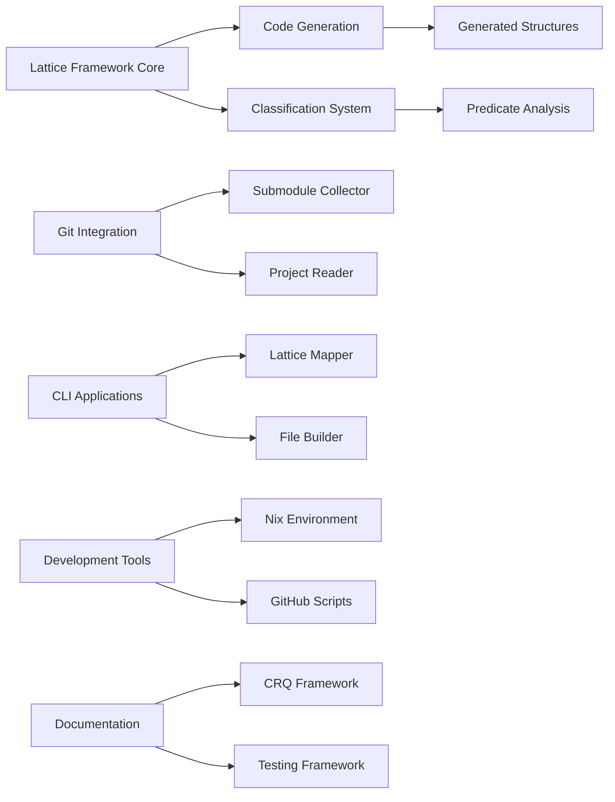

### **User description**
# CRQ-53-recursive-decomposition.md

## Change Request: recursive decomposition
## Recursive Decomposition: Unpacking Complexity through Nested N-gram Analysis

This document elaborates on the concept of "recursive decomposition" within the Lattice Idea Framework, a powerful analytical technique that involves identifying and analyzing smaller n-grams nested within larger n-grams. This process allows for a granular unpacking of complex structures, revealing their constituent patterns and relationships across different levels of abstraction.

### 1. The Principle of Nested N-gram Analysis

The core idea of recursive decomposition is to apply n-gram analysis not just to raw sequences of predicates, but also to the components or values of higher-order n-grams themselves. This creates a hierarchical breakdown of information, where each level of decomposition reveals finer-grained patterns.

### 2. Examples of Recursive Decomposition

Using the `zos` sequence of primes `[2, 3, 5, 7, 11, 13, 17, 19]` as our guide for n-gram sizes, we can illustrate this principle:

*   **`[2, 3, ..., 17]`-grams inside 19-grams:**
    *   Consider a `k=19` tuple (a 19-gram) representing a highly complex model or narrative (as discussed in `k_value_type_semantics.md`). This 19-gram is composed of 19 individual elements or values.
    *   We can then apply n-gram analysis to the sequence of these 19 values. For instance, we can look for 2-grams (pairs), 3-grams (triples), up to 17-grams *within* this 19-element sequence.
    *   **Example:** If a 19-gram describes a programming language, a 5-gram within it might represent a common pattern of `(memory_model, concurrency_primitive, error_handling_strategy, type_system, compilation_model)`. Analyzing these internal n-grams reveals sub-patterns of the larger language model.

*   **`2..13`-grams inside 17-grams:**
    *   Similarly, if we have a 17-gram (e.g., representing a complex event or a detailed system architecture), we can decompose it by searching for n-grams of sizes 2 through 13 within its 17 constituent elements.
    *   This allows us to identify recurring sub-events or architectural modules within the larger structure.

*   **Pairs inside Triples:**
    *   At a more fundamental level, consider a `k=3` tuple (a triple, like an RDF statement: `(Subject, Predicate, Object)`).
    *   We can then look for pairs *within* this triple. For example, `(Subject, Predicate)` or `(Predicate, Object)`. While seemingly simple, this highlights the fundamental relationships that form the triple.
    *   This is analogous to analyzing the relationships between words within a sentence, where the sentence itself is a higher-order n-gram.

### 3. Significance for Understanding Complexity

This recursive decomposition is vital for the Lattice Idea Framework's ability to understand and organize complex knowledge:

*   **Unpacking Black Boxes:** It provides a systematic method to break down seemingly monolithic entities (like a 19-tuple representing an entire programming language) into their more manageable and analyzable sub-components.
*   **Identifying Fundamental Building Blocks:** By repeatedly decomposing, we can identify the most fundamental, repeating patterns and relationships that constitute higher-order structures.
*   **Cross-Layer Grounding:** It allows for grounding concepts across different layers of the lattice. A pattern identified as a 3-gram within a 19-gram at one layer might correspond to a core concept defined in a lower, 3-value type layer.
*   **Enhanced Classification:** The identified sub-patterns can serve as additional predicates for classification, allowing for more nuanced and precise mapping of entities into the lattice.
*   **Algorithmic Discovery:** This process can lead to the algorithmic discovery of new, meaningful n-grams and relationships that were not explicitly defined beforehand, as the system learns to recognize recurring substructures.

Recursive decomposition is a cornerstone of the Lattice Idea Framework's analytical power, enabling it to navigate and make sense of the inherent complexity in code, language, and abstract models.

___

### **PR Type**
Enhancement

___

### **Description**
• **Major lattice framework implementation**: Complete implementation of the Lattice Idea Framework with recursive decomposition capabilities, including core types, code generation utilities, and classification systems
• **New CLI tools and applications**: Added submodule-collector for Git repository analysis, project file lattice builder, lattice mapper, and various specialized analyzers
• **Comprehensive code generation system**: Implemented lattice code generator with proc macro utilities and automated structure generation
• **Git integration libraries**: New git project reader library and enhanced git config parser with comprehensive test coverage
• **Development tooling enhancements**: Updated Nix flake with development tools, added GitHub CLI wrapper scripts, and created CRQ workflow automation
• **Documentation and analysis frameworks**: Added structured testing framework, CRQ standardization scripts, and comprehensive submodule reporting
• **Meta-programming capabilities**: Self-referential lattice models and grand unified search system for semantic code analysis

___

### Diagram Walkthrough

 
<h3> File Walkthrough</h3>

<table><thead><tr><th></th><th align="left">Relevant files</th></tr></thead><tbody><tr><td><strong>Configuration changes</strong></td><td>

2 files
<table>
<tr>
  <td>
    

      
<strong>flake.nix</strong><dd><code>Enhanced Nix flake with submodule-collector and development tools</code></dd>

flake.nix

• Removed empty line at the beginning of the file  • Added new  <code>submodule-collector</code> derivation with build configuration for Rust  package  • Added development tools including jq, valgrind, Emacs  packages, and shell utilities

  </td>
  <td><a href="https://github.com/meta-introspector/git-submodules-rs-nix/pull/4/files#diff-206b9ce276ab5971a2489d75eb1b12999d4bf3843b7988cbe8d687cfde61dea0">+34/-1</a>&nbsp; &nbsp; </td>

</tr>

<tr>
  <td>
    

      
<strong>shell.nix</strong><dd><code>Added valgrind to development shell dependencies</code>&nbsp; &nbsp; &nbsp; &nbsp; &nbsp; &nbsp; &nbsp; &nbsp; &nbsp; </dd>

shell.nix

• Added `pkgs.valgrind` to the buildInputs list for development shell

  </td>
  <td><a href="https://github.com/meta-introspector/git-submodules-rs-nix/pull/4/files#diff-e53dfbfffe62ae3c0b411b3938ccffa9fb6a2ecc565f55785ef8daa756631a6b">+1/-1</a>&nbsp; &nbsp; &nbsp; </td>

</tr>
</table>
</td></tr><tr><td><strong>Enhancement</strong></td><td>

60 files
<table>
<tr>
  <td>
    

      
<strong>lib.rs</strong><dd><code>New lattice code generator library with proc macro utilities</code></dd>

lattice_code_generator/src/lib.rs

• New library providing code generation utilities for Lattice Idea  Framework  • Implements functions to generate Rust enums, structs, and  traits using <code>proc_macro2</code> and <code>quote</code>  • Includes comprehensive test suite  for generated code validation

  </td>
  <td><a href="https://github.com/meta-introspector/git-submodules-rs-nix/pull/4/files#diff-243854d89636db85a935fa955ee16fa44ea3ca7092902bc29701c3a825b0ba0a">+296/-0</a>&nbsp; </td>

</tr>

<tr>
  <td>
    

      
<strong>main.rs</strong><dd><code>New submodule collector CLI tool for Git repository analysis</code></dd>

submodule-collector/src/main.rs

• New CLI tool for scanning Git repositories and their submodules  recursively  • Outputs comprehensive JSON reports with repository and  submodule information  • Includes error handling and resilient  processing of nested submodules

  </td>
  <td><a href="https://github.com/meta-introspector/git-submodules-rs-nix/pull/4/files#diff-a47f0db0f72bdfe38e4c5fc28fcb76ddd4adc991f2b12a672f14f8348411c83a">+279/-0</a>&nbsp; </td>

</tr>

<tr>
  <td>
    

      
<strong>main.rs</strong><dd><code>New project file lattice builder for conceptual file mapping</code></dd>

project_file_lattice_builder/src/main.rs

• New application that conceptually maps project files into lattice  structure  • Implements predicate-based classification system for file  analysis  • Demonstrates lattice framework application to file system  organization

  </td>
  <td><a href="https://github.com/meta-introspector/git-submodules-rs-nix/pull/4/files#diff-307096deb9eb86f24a90391b001a081a638672a52f8c27651d21c72bcfdcd2a1">+202/-0</a>&nbsp; </td>

</tr>

<tr>
  <td>
    

      
<strong>lattice_mapper_app.rs</strong><dd><code>New lattice mapper for code similarity classification</code>&nbsp; &nbsp; &nbsp; &nbsp; </dd>

src/lattice_mapper_app.rs

• New application demonstrating code mapping into pre-generated  lattice structures  • Implements similarity-based classification using  predicate matching  • Bridges lattice structure generation with  repository classification

  </td>
  <td><a href="https://github.com/meta-introspector/git-submodules-rs-nix/pull/4/files#diff-d4b10dc90da2ebd2e54c216c08faf398915f797cc4bf2e94185cd40832762c62">+209/-0</a>&nbsp; </td>

</tr>

<tr>
  <td>
    

      
<strong>lattice_types.rs</strong><dd><code>Core lattice framework type definitions and structures</code>&nbsp; &nbsp; &nbsp; </dd>

src/lattice_types.rs

• Defines core lattice framework types including <code>ValueType</code>, <code>Instance</code>,  and <code>LatticeLayer</code>  • Implements trait system for value counting and  lattice layer management  • Provides conceptual demonstration of  lattice structure usage

  </td>
  <td><a href="https://github.com/meta-introspector/git-submodules-rs-nix/pull/4/files#diff-b4cbc31fe99d9b693a12612fdfbcbb6a05afbab7836ee96ef34759a80eea2dfc">+196/-0</a>&nbsp; </td>

</tr>

<tr>
  <td>
    

      
<strong>repo_search_simulator.rs</strong><dd><code>Repository search simulator with predicate-based classification</code></dd>

src/repo_search_simulator.rs

• Simulates search-by-example functionality across mock repositories  •  Implements predicate-based classification for repository similarity  •  Demonstrates lattice framework application to code search

  </td>
  <td><a href="https://github.com/meta-introspector/git-submodules-rs-nix/pull/4/files#diff-0fd44409289d811f50e94913ae801d7ed5c483e8798303c297ac9854807cfe41">+202/-0</a>&nbsp; </td>

</tr>

<tr>
  <td>
    

      
<strong>meta_lattice_model.rs</strong><dd><code>Meta-model implementation for self-referential lattice analysis</code></dd>

src/meta_lattice_model.rs

• Self-referential meta-model of the Lattice Idea Framework  •  Implements conceptual self-analysis and similarity finding  capabilities  • Demonstrates framework's capacity for meta-modeling

  </td>
  <td><a href="https://github.com/meta-introspector/git-submodules-rs-nix/pull/4/files#diff-4ad95f3ed0d6e795cabcf8199fb28fa159aef84b4f32e578f55079fa94e07625">+153/-0</a>&nbsp; </td>

</tr>

<tr>
  <td>
    

      
<strong>analyze_strings.rs</strong><dd><code>String analysis module with n-gram generation and emoji ontology</code></dd>

report-analyzer-rs/src/analyze_strings.rs

• Implements string analysis with token collection and frequency  counting  • Generates and analyzes n-grams with emoji ontology  application  • Provides iterative analysis with convergence checking

  </td>
  <td><a href="https://github.com/meta-introspector/git-submodules-rs-nix/pull/4/files#diff-2972c1dbf1387f1fc356a8a7315beb271dcacb9eb512719d2ac60d15084a7c1a">+171/-0</a>&nbsp; </td>

</tr>

<tr>
  <td>
    

      
<strong>lattice_classifier_app.rs</strong><dd><code>Lattice classifier application for predicate-based text analysis</code></dd>

src/lattice_classifier_app.rs

• Demonstrates lattice structure usage for text classification  •  Implements predicate-based classification with word predicates  • Shows  practical application of generated lattice types

  </td>
  <td><a href="https://github.com/meta-introspector/git-submodules-rs-nix/pull/4/files#diff-2046e6cf0881f2c6f04e40c623dbf7b071fa54d0b330bd758caea2f306c79f59">+188/-0</a>&nbsp; </td>

</tr>

<tr>
  <td>
    

      
<strong>lib.rs</strong><dd><code>Git project reader library with status and file tracking</code>&nbsp; </dd>

git_project_reader/src/lib.rs

• New library for reading Git project information including tracked  files  • Implements git status retrieval with porcelain output  •  Includes comprehensive test suite with temporary repository setup

  </td>
  <td><a href="https://github.com/meta-introspector/git-submodules-rs-nix/pull/4/files#diff-258b44c334cd672e0393e8cad155edd07074a84e46a6c7389d9d227e07b3e1d8">+174/-0</a>&nbsp; </td>

</tr>

<tr>
  <td>
    

      
<strong>grand_unified_search.rs</strong><dd><code>Grand unified search system conceptual implementation</code>&nbsp; &nbsp; &nbsp; &nbsp; </dd>

src/grand_unified_search.rs

• Conceptual outline for unified search system with self-parsing  capabilities  • Demonstrates integration of code analysis, LLM  interaction, and submodule tools  • Provides framework for semantic  code search and similarity detection

  </td>
  <td><a href="https://github.com/meta-introspector/git-submodules-rs-nix/pull/4/files#diff-b8a48c02f53b75052bc23d20df7488207a5b86d7815d3fb29ef0b8b985553ab1">+148/-0</a>&nbsp; </td>

</tr>

<tr>
  <td>
    

      
<strong>lattice_model.rs</strong><dd><code>Core lattice model definitions with predicate classification</code></dd>

src/lattice_model.rs

• Defines core lattice model types including <code>ValueType</code> enum and traits   • Implements predicate classification system with word predicate  support  • Provides foundation for lattice-based analysis and  classification

  </td>
  <td><a href="https://github.com/meta-introspector/git-submodules-rs-nix/pull/4/files#diff-780a4d5fb95789264d299113f8c45e066dafc4aa039180f7494020e35c5246b6">+136/-0</a>&nbsp; </td>

</tr>

<tr>
  <td>
    

      
<strong>word_predicate_analyzer.rs</strong><dd><code>Word predicate analyzer for lattice-based text processing</code></dd>

src/word_predicate_analyzer.rs

• Implements word-as-predicate analysis using lattice type definitions   • Provides text tokenization and n-gram generation for predicate  sequences  • Demonstrates practical application of lattice framework to  text analysis

  </td>
  <td><a href="https://github.com/meta-introspector/git-submodules-rs-nix/pull/4/files#diff-8b1a5639c122dab7e9c36fd0dac9ffa1dd9fbbbb4fb5d68eca6be406d0f63e83">+95/-0</a>&nbsp; &nbsp; </td>

</tr>

<tr>
  <td>
    

      
<strong>main.rs</strong><dd><code>Lattice structure generator for hierarchical code organization</code></dd>

lattice_structure_generator/src/main.rs

• Generates structured lattice hierarchy with layered directory  organization  • Creates conceptual mapping system for existing code  classification  • Demonstrates practical lattice structure generation  and code placement

  </td>
  <td><a href="https://github.com/meta-introspector/git-submodules-rs-nix/pull/4/files#diff-0503dd508e5c7168f8b6b74fb16594f291c5cead8790bfaec55d85ac576166f2">+82/-0</a>&nbsp; &nbsp; </td>

</tr>

<tr>
  <td>
    

      
<strong>lib.rs</strong><dd><code>ZOS lattice builder integration with predicate classification</code></dd>

src/lib.rs

• Added <code>build_zos_lattice</code> function for project file lattice  construction  • Integrates predicate classification with layered  lattice structure  • Provides practical implementation of lattice  framework for file organization

  </td>
  <td><a href="https://github.com/meta-introspector/git-submodules-rs-nix/pull/4/files#diff-b1a35a68f14e696205874893c07fd24fdb88882b47c23cc0e0c80a30c7d53759">+78/-0</a>&nbsp; &nbsp; </td>

</tr>

<tr>
  <td>
    

      
<strong>main.rs</strong><dd><code>Lattice generator application for automated code generation</code></dd>

lattice_generator_app/src/main.rs

• Application for generating lattice code structures to files  •  Orchestrates code generation for all lattice components  • Provides  organized output of generated lattice framework code

  </td>
  <td><a href="https://github.com/meta-introspector/git-submodules-rs-nix/pull/4/files#diff-ba3c74e9dedda9c826a5198e4fb1879be1cc3251ad2be3b8bd4cef25d22bf646">+56/-0</a>&nbsp; &nbsp; </td>

</tr>

<tr>
  <td>
    

      
<strong>main.rs</strong><dd><code>Report analyzer main entry point implementation</code>&nbsp; &nbsp; &nbsp; &nbsp; &nbsp; &nbsp; &nbsp; &nbsp; &nbsp; &nbsp; </dd>

report-analyzer-rs/src/main.rs

• Added new main.rs file for report analyzer with command-line  argument parsing  • Implemented basic report loading and analysis  structure with commented-out processing functions  • Added call to  analyze_strings module for string analysis and emoji-enhanced output

  </td>
  <td><a href="https://github.com/meta-introspector/git-submodules-rs-nix/pull/4/files#diff-0c621fee3c56e03aa11c26e9371c0d100ee91ec12c43746c6cf2eb8f687bdeac">+50/-0</a>&nbsp; &nbsp; </td>

</tr>

<tr>
  <td>
    

      
<strong>program_self_description.rs</strong><dd><code>Self-describing program implementation for framework demonstration</code></dd>

src/program_self_description.rs

• Created self-describing program demonstrating predicate-based  analysis concepts  • Implemented functions for self-description and  finding similar programs  • Added meta-assertion about the program's  self-referential capacity

  </td>
  <td><a href="https://github.com/meta-introspector/git-submodules-rs-nix/pull/4/files#diff-386ecf0f7a94fde9c182bd08fe96599c8620c47e849ed27d5ffd2d799bf30060">+37/-0</a>&nbsp; &nbsp; </td>

</tr>

<tr>
  <td>
    

      
<strong>lcp.rs</strong><dd><code>Longest common prefix analysis implementation</code>&nbsp; &nbsp; &nbsp; &nbsp; &nbsp; &nbsp; &nbsp; &nbsp; &nbsp; &nbsp; &nbsp; &nbsp; </dd>

report-analyzer-rs/src/lcp.rs

• Implemented longest common prefix (LCP) analysis functionality  •  Added functions to find LCP across repository paths and URLs  • Created  analysis and printing functions for LCP results

  </td>
  <td><a href="https://github.com/meta-introspector/git-submodules-rs-nix/pull/4/files#diff-b21ab373ab1b39d083a90c0171119e10f283f4af3edb4ab1148d439b9eda1101">+51/-0</a>&nbsp; &nbsp; </td>

</tr>

<tr>
  <td>
    

      
<strong>types.rs</strong><dd><code>Core data types and structures definition</code>&nbsp; &nbsp; &nbsp; &nbsp; &nbsp; &nbsp; &nbsp; &nbsp; &nbsp; &nbsp; &nbsp; &nbsp; &nbsp; &nbsp; &nbsp; &nbsp; </dd>

report-analyzer-rs/src/types.rs

• Defined core data structures for submodule reporting system  • Added  <code>SubmoduleInfo</code>, <code>RepoInfo</code>, <code>FailedRepoInfo</code>, and <code>Report</code> structs with serde  support  • Implemented command-line argument parsing with <code>Args</code> struct  and <code>Ontology</code> type

  </td>
  <td><a href="https://github.com/meta-introspector/git-submodules-rs-nix/pull/4/files#diff-70a32aaec9d7a33bba7859aaec9a648355cf4a92b9a1c688430f60fd0b1ad036">+47/-0</a>&nbsp; &nbsp; </td>

</tr>

<tr>
  <td>
    

      
<strong>analyze_names.rs</strong><dd><code>Repository and submodule name analysis</code>&nbsp; &nbsp; &nbsp; &nbsp; &nbsp; &nbsp; &nbsp; &nbsp; &nbsp; &nbsp; &nbsp; &nbsp; &nbsp; &nbsp; &nbsp; &nbsp; &nbsp; &nbsp; &nbsp; </dd>

report-analyzer-rs/src/analyze_names.rs

• Implemented repository and submodule name analysis functionality  •  Added regex-based extraction of repository names from GitHub URLs  •  Created frequency counting for names across repositories and  submodules

  </td>
  <td><a href="https://github.com/meta-introspector/git-submodules-rs-nix/pull/4/files#diff-ece2606d6df195d4968ecc9276f8faa6fb13f2dfbd036a099bdef2995f9eac1d">+30/-0</a>&nbsp; &nbsp; </td>

</tr>

<tr>
  <td>
    

      
<strong>value_type.rs</strong><dd><code>Generated lattice value type implementation</code>&nbsp; &nbsp; &nbsp; &nbsp; &nbsp; &nbsp; &nbsp; &nbsp; &nbsp; &nbsp; &nbsp; &nbsp; &nbsp; &nbsp; </dd>

generated_lattice_code/value_type.rs

• Generated compressed Rust code for <code>ValueType</code> enum with prime value  variants  • Implemented methods for value counting and <code>zos_sequence</code>  generation  • Created foundation for lattice framework value type  system

  </td>
  <td><a href="https://github.com/meta-introspector/git-submodules-rs-nix/pull/4/files#diff-4534ce506bbc5e0a512da2a9f61948dc44575940029777e3be9fa6f1ce706735">+1/-0</a>&nbsp; &nbsp; &nbsp; </td>

</tr>

<tr>
  <td>
    

      
<strong>value_type.rs</strong><dd><code>Lattice structure value type duplicate</code>&nbsp; &nbsp; &nbsp; &nbsp; &nbsp; &nbsp; &nbsp; &nbsp; &nbsp; &nbsp; &nbsp; &nbsp; &nbsp; &nbsp; &nbsp; &nbsp; &nbsp; &nbsp; &nbsp; </dd>

generated_lattice_structure/value_type.rs

• Duplicate of generated lattice code for value type implementation  •  Contains same compressed <code>ValueType</code> enum and methods  • Part of lattice  structure generation system

  </td>
  <td><a href="https://github.com/meta-introspector/git-submodules-rs-nix/pull/4/files#diff-0e397496f4650bd5f8a1aaa402b4f095cc1ebfec730fb80a60040684b1e76798">+1/-0</a>&nbsp; &nbsp; &nbsp; </td>

</tr>

<tr>
  <td>
    

      
<strong>analyze_orgs.rs</strong><dd><code>GitHub organization analysis functionality</code>&nbsp; &nbsp; &nbsp; &nbsp; &nbsp; &nbsp; &nbsp; &nbsp; &nbsp; &nbsp; &nbsp; &nbsp; &nbsp; &nbsp; &nbsp; </dd>

report-analyzer-rs/src/analyze_orgs.rs

• Implemented organization analysis from GitHub repository URLs  •  Added regex-based extraction of organization names  • Created frequency  counting for organizations across repositories

  </td>
  <td><a href="https://github.com/meta-introspector/git-submodules-rs-nix/pull/4/files#diff-dfc5e43d786c558598103c88d48bb1cfc40e246b3ba904ae455a340f1c5d7e0a">+26/-0</a>&nbsp; &nbsp; </td>

</tr>

<tr>
  <td>
    

      
<strong>lattice_struct.rs</strong><dd><code>Generated lattice structure implementation</code>&nbsp; &nbsp; &nbsp; &nbsp; &nbsp; &nbsp; &nbsp; &nbsp; &nbsp; &nbsp; &nbsp; &nbsp; &nbsp; &nbsp; &nbsp; </dd>

generated_lattice_code/lattice_struct.rs

• Generated compressed Rust code for main <code>Lattice</code> struct and trait  system  • Implemented trait-based layer management with dynamic  dispatch  • Created foundation for multi-layered lattice architecture

  </td>
  <td><a href="https://github.com/meta-introspector/git-submodules-rs-nix/pull/4/files#diff-79d9dfa1f549d761bf956b17120979d037243e9dc1f10ebb9402e5b62ff5cf46">+1/-0</a>&nbsp; &nbsp; &nbsp; </td>

</tr>

<tr>
  <td>
    

      
<strong>lattice_struct.rs</strong><dd><code>Lattice structure duplicate implementation</code>&nbsp; &nbsp; &nbsp; &nbsp; &nbsp; &nbsp; &nbsp; &nbsp; &nbsp; &nbsp; &nbsp; &nbsp; &nbsp; &nbsp; &nbsp; </dd>

generated_lattice_structure/lattice_struct.rs

• Duplicate of generated lattice struct implementation  • Contains same  compressed lattice architecture code  • Part of lattice structure  generation system

  </td>
  <td><a href="https://github.com/meta-introspector/git-submodules-rs-nix/pull/4/files#diff-d0b1a7887fc4298e093cd2bfb55016adcc95a93c94f2f6df94699f5fb9f43180">+1/-0</a>&nbsp; &nbsp; &nbsp; </td>

</tr>

<tr>
  <td>
    

      
<strong>instance_struct.rs</strong><dd><code>Generated lattice instance structure</code>&nbsp; &nbsp; &nbsp; &nbsp; &nbsp; &nbsp; &nbsp; &nbsp; &nbsp; &nbsp; &nbsp; &nbsp; &nbsp; &nbsp; &nbsp; &nbsp; &nbsp; &nbsp; &nbsp; &nbsp; &nbsp; </dd>

generated_lattice_code/instance_struct.rs

• Generated compressed Rust code for <code>Instance</code> struct with generic type  support  • Implemented n-gram size validation and description methods  •  Created foundation for lattice instance representation

  </td>
  <td><a href="https://github.com/meta-introspector/git-submodules-rs-nix/pull/4/files#diff-d3a134be5da73893ad11cfba2741e995cb5385d116f305bb9f90ba03072271f8">+1/-0</a>&nbsp; &nbsp; &nbsp; </td>

</tr>

<tr>
  <td>
    

      
<strong>instance_struct.rs</strong><dd><code>Lattice instance structure duplicate</code>&nbsp; &nbsp; &nbsp; &nbsp; &nbsp; &nbsp; &nbsp; &nbsp; &nbsp; &nbsp; &nbsp; &nbsp; &nbsp; &nbsp; &nbsp; &nbsp; &nbsp; &nbsp; &nbsp; &nbsp; &nbsp; </dd>

generated_lattice_structure/instance_struct.rs

• Duplicate of generated instance struct implementation  • Contains  same compressed instance architecture code  • Part of lattice structure  generation system

  </td>
  <td><a href="https://github.com/meta-introspector/git-submodules-rs-nix/pull/4/files#diff-2a3695aa0e91eed81596edd58de20843bbebe8a9e7ddddae052cc7f695267747">+1/-0</a>&nbsp; &nbsp; &nbsp; </td>

</tr>

<tr>
  <td>
    

      
<strong>lattice_layer_struct.rs</strong><dd><code>Generated lattice layer structure</code>&nbsp; &nbsp; &nbsp; &nbsp; &nbsp; &nbsp; &nbsp; &nbsp; &nbsp; &nbsp; &nbsp; &nbsp; &nbsp; &nbsp; &nbsp; &nbsp; &nbsp; &nbsp; &nbsp; &nbsp; &nbsp; &nbsp; &nbsp; &nbsp; </dd>

generated_lattice_code/lattice_layer_struct.rs

• Generated compressed Rust code for <code>LatticeLayer</code> struct with generic  support  • Implemented layer management with instance validation  •  Created foundation for lattice layer organization

  </td>
  <td><a href="https://github.com/meta-introspector/git-submodules-rs-nix/pull/4/files#diff-0aacd04a7a621f806b54ffa94092f874682700841e03474720504945ec824126">+1/-0</a>&nbsp; &nbsp; &nbsp; </td>

</tr>

<tr>
  <td>
    

      
<strong>lattice_layer_struct.rs</strong><dd><code>Lattice layer structure duplicate</code>&nbsp; &nbsp; &nbsp; &nbsp; &nbsp; &nbsp; &nbsp; &nbsp; &nbsp; &nbsp; &nbsp; &nbsp; &nbsp; &nbsp; &nbsp; &nbsp; &nbsp; &nbsp; &nbsp; &nbsp; &nbsp; &nbsp; &nbsp; &nbsp; </dd>

generated_lattice_structure/lattice_layer_struct.rs

• Duplicate of generated lattice layer struct implementation  •  Contains same compressed layer architecture code  • Part of lattice  structure generation system

  </td>
  <td><a href="https://github.com/meta-introspector/git-submodules-rs-nix/pull/4/files#diff-8732c80f707e0ab6b869ea056076368c8830979c489e8c25c0b1d63a05affb3b">+1/-0</a>&nbsp; &nbsp; &nbsp; </td>

</tr>

<tr>
  <td>
    

      
<strong>duplicates.rs</strong><dd><code>Duplicate repository URL analysis</code>&nbsp; &nbsp; &nbsp; &nbsp; &nbsp; &nbsp; &nbsp; &nbsp; &nbsp; &nbsp; &nbsp; &nbsp; &nbsp; &nbsp; &nbsp; &nbsp; &nbsp; &nbsp; &nbsp; &nbsp; &nbsp; &nbsp; &nbsp; &nbsp; </dd>

report-analyzer-rs/src/duplicates.rs

• Implemented duplicate URL detection and analysis functionality  •  Added functions to identify repositories with same URLs but different  paths  • Created reporting system for duplicate repository detection

  </td>
  <td><a href="https://github.com/meta-introspector/git-submodules-rs-nix/pull/4/files#diff-4d80fd66c8b316d5012d6352dd781de56fe14903a0f5394e6ce2fa81ee99e035">+25/-0</a>&nbsp; &nbsp; </td>

</tr>

<tr>
  <td>
    

      
<strong>input.rs</strong><dd><code>Input handling and data loading functionality</code>&nbsp; &nbsp; &nbsp; &nbsp; &nbsp; &nbsp; &nbsp; &nbsp; &nbsp; &nbsp; &nbsp; &nbsp; </dd>

report-analyzer-rs/src/input.rs

• Implemented input handling for command-line arguments and data  loading  • Added functions for parsing arguments and loading  report/ontology data  • Created error handling for file reading and  JSON parsing

  </td>
  <td><a href="https://github.com/meta-introspector/git-submodules-rs-nix/pull/4/files#diff-e9ea32f3583a31e364d9ff7d6c37296c5c56f4c8fe8b359a4693368182e54e3b">+22/-0</a>&nbsp; &nbsp; </td>

</tr>

<tr>
  <td>
    

      
<strong>apply_emojis.rs</strong><dd><code>Emoji ontology text enhancement</code>&nbsp; &nbsp; &nbsp; &nbsp; &nbsp; &nbsp; &nbsp; &nbsp; &nbsp; &nbsp; &nbsp; &nbsp; &nbsp; &nbsp; &nbsp; &nbsp; &nbsp; &nbsp; &nbsp; &nbsp; &nbsp; &nbsp; &nbsp; &nbsp; &nbsp; &nbsp; </dd>

report-analyzer-rs/src/apply_emojis.rs

• Implemented emoji ontology application for text enhancement  • Added  function to replace text with emojis based on ontology mapping  •  Created sorted key replacement for longest-match-first processing

  </td>
  <td><a href="https://github.com/meta-introspector/git-submodules-rs-nix/pull/4/files#diff-b046d9b03ffcc74bc7362f658297d45a8141ccff9481915e5a8348b7f49a2297">+18/-0</a>&nbsp; &nbsp; </td>

</tr>

<tr>
  <td>
    

      
<strong>names_analysis.rs</strong><dd><code>Name analysis output formatting</code>&nbsp; &nbsp; &nbsp; &nbsp; &nbsp; &nbsp; &nbsp; &nbsp; &nbsp; &nbsp; &nbsp; &nbsp; &nbsp; &nbsp; &nbsp; &nbsp; &nbsp; &nbsp; &nbsp; &nbsp; &nbsp; &nbsp; &nbsp; &nbsp; &nbsp; &nbsp; </dd>

report-analyzer-rs/src/names_analysis.rs

• Implemented name analysis printing with emoji ontology support  •  Added frequency-based sorting and top-10 display functionality  •  Created formatted output for repository/submodule name analysis

  </td>
  <td><a href="https://github.com/meta-introspector/git-submodules-rs-nix/pull/4/files#diff-300b8fb41eee786eabd0188c0030f81f88dfc1cee7f998e57e62b26ff2a14c37">+14/-0</a>&nbsp; &nbsp; </td>

</tr>

<tr>
  <td>
    

      
<strong>org_analysis.rs</strong><dd><code>Organization analysis output formatting</code>&nbsp; &nbsp; &nbsp; &nbsp; &nbsp; &nbsp; &nbsp; &nbsp; &nbsp; &nbsp; &nbsp; &nbsp; &nbsp; &nbsp; &nbsp; &nbsp; &nbsp; &nbsp; </dd>

report-analyzer-rs/src/org_analysis.rs

• Implemented organization analysis printing with emoji ontology  support  • Added frequency-based sorting and top-10 display  functionality  • Created formatted output for organization analysis

  </td>
  <td><a href="https://github.com/meta-introspector/git-submodules-rs-nix/pull/4/files#diff-5bc7fdd91e1797253239ee186eacd73c931025fcd10b5880906a97a8400fbdcc">+13/-0</a>&nbsp; &nbsp; </td>

</tr>

<tr>
  <td>
    

      
<strong>instance_0.rs</strong><dd><code>Layer k=2 instance 0 placeholder</code>&nbsp; &nbsp; &nbsp; &nbsp; &nbsp; &nbsp; &nbsp; &nbsp; &nbsp; &nbsp; &nbsp; &nbsp; &nbsp; &nbsp; &nbsp; &nbsp; &nbsp; &nbsp; &nbsp; &nbsp; &nbsp; &nbsp; &nbsp; &nbsp; &nbsp; </dd>

generated_lattice_structure/layer_k_2/instance_0.rs

• Added placeholder code for instance 0 in k=2 layer  • Created  template for 2-value type instance implementation  • Part of generated  lattice structure organization

  </td>
  <td><a href="https://github.com/meta-introspector/git-submodules-rs-nix/pull/4/files#diff-990ad20f4685e1e62b47bcdc403066dc9a6a5cd320f109f452149c676da95d77">+3/-0</a>&nbsp; &nbsp; &nbsp; </td>

</tr>

<tr>
  <td>
    

      
<strong>instance_1.rs</strong><dd><code>Layer k=2 instance 1 placeholder</code>&nbsp; &nbsp; &nbsp; &nbsp; &nbsp; &nbsp; &nbsp; &nbsp; &nbsp; &nbsp; &nbsp; &nbsp; &nbsp; &nbsp; &nbsp; &nbsp; &nbsp; &nbsp; &nbsp; &nbsp; &nbsp; &nbsp; &nbsp; &nbsp; &nbsp; </dd>

generated_lattice_structure/layer_k_2/instance_1.rs

• Added placeholder code for instance 1 in k=2 layer  • Created  template for 2-value type instance implementation  • Part of generated  lattice structure organization

  </td>
  <td><a href="https://github.com/meta-introspector/git-submodules-rs-nix/pull/4/files#diff-df8632b2498c76b1d518d069119ef059ccb029cdcabff4a67066bd7b537542ca">+3/-0</a>&nbsp; &nbsp; &nbsp; </td>

</tr>

<tr>
  <td>
    

      
<strong>instance_0.rs</strong><dd><code>Layer k=3 instance 0 placeholder</code>&nbsp; &nbsp; &nbsp; &nbsp; &nbsp; &nbsp; &nbsp; &nbsp; &nbsp; &nbsp; &nbsp; &nbsp; &nbsp; &nbsp; &nbsp; &nbsp; &nbsp; &nbsp; &nbsp; &nbsp; &nbsp; &nbsp; &nbsp; &nbsp; &nbsp; </dd>

generated_lattice_structure/layer_k_3/instance_0.rs

• Added placeholder code for instance 0 in k=3 layer  • Created  template for 3-value type instance implementation  • Part of generated  lattice structure organization

  </td>
  <td><a href="https://github.com/meta-introspector/git-submodules-rs-nix/pull/4/files#diff-45a15a4ed78fb935970c9dfb064319535f48d88aa3eeaaf6724236295ad8bc36">+3/-0</a>&nbsp; &nbsp; &nbsp; </td>

</tr>

<tr>
  <td>
    

      
<strong>instance_1.rs</strong><dd><code>Layer k=3 instance 1 placeholder</code>&nbsp; &nbsp; &nbsp; &nbsp; &nbsp; &nbsp; &nbsp; &nbsp; &nbsp; &nbsp; &nbsp; &nbsp; &nbsp; &nbsp; &nbsp; &nbsp; &nbsp; &nbsp; &nbsp; &nbsp; &nbsp; &nbsp; &nbsp; &nbsp; &nbsp; </dd>

generated_lattice_structure/layer_k_3/instance_1.rs

• Added placeholder code for instance 1 in k=3 layer  • Created  template for 3-value type instance implementation  • Part of generated  lattice structure organization

  </td>
  <td><a href="https://github.com/meta-introspector/git-submodules-rs-nix/pull/4/files#diff-f985fd8aeb2357840bce2296c2e55547376810292136d6b105ebb782f0c2bea1">+3/-0</a>&nbsp; &nbsp; &nbsp; </td>

</tr>

<tr>
  <td>
    

      
<strong>has_value_count_impls.rs</strong><dd><code>Generated value count trait implementation</code>&nbsp; &nbsp; &nbsp; &nbsp; &nbsp; &nbsp; &nbsp; &nbsp; &nbsp; &nbsp; &nbsp; &nbsp; &nbsp; &nbsp; &nbsp; </dd>

generated_lattice_code/has_value_count_impls.rs

• Generated compressed implementation of <code>HasValueCount</code> trait for <code>bool</code>  type  • Created foundation for value counting system in lattice  framework  • Part of generated lattice code architecture

  </td>
  <td><a href="https://github.com/meta-introspector/git-submodules-rs-nix/pull/4/files#diff-fc27ee60e32d05c14ba49d85ee4b7d8e66ac5c101ad0dbe3e5d349b4b9303ac8">+1/-0</a>&nbsp; &nbsp; &nbsp; </td>

</tr>

<tr>
  <td>
    

      
<strong>has_value_count_impls.rs</strong><dd><code>Value count trait implementation duplicate</code>&nbsp; &nbsp; &nbsp; &nbsp; &nbsp; &nbsp; &nbsp; &nbsp; &nbsp; &nbsp; &nbsp; &nbsp; &nbsp; &nbsp; &nbsp; </dd>

generated_lattice_structure/has_value_count_impls.rs

• Duplicate of generated value count trait implementation  • Contains  same compressed trait implementation for <code>bool</code>  • Part of lattice  structure generation system

  </td>
  <td><a href="https://github.com/meta-introspector/git-submodules-rs-nix/pull/4/files#diff-bfde8abac89de5011df90cbcb78cbcd164b872180cfb65270be5126f86444644">+1/-0</a>&nbsp; &nbsp; &nbsp; </td>

</tr>

<tr>
  <td>
    

      
<strong>has_value_count_trait.rs</strong><dd><code>Generated value count trait definition</code>&nbsp; &nbsp; &nbsp; &nbsp; &nbsp; &nbsp; &nbsp; &nbsp; &nbsp; &nbsp; &nbsp; &nbsp; &nbsp; &nbsp; &nbsp; &nbsp; &nbsp; &nbsp; &nbsp; </dd>

generated_lattice_code/has_value_count_trait.rs

• Generated compressed definition of <code>HasValueCount</code> trait  • Created  foundation trait for value counting in lattice system  • Part of  generated lattice code architecture

  </td>
  <td><a href="https://github.com/meta-introspector/git-submodules-rs-nix/pull/4/files#diff-cf0ba0ca0358cab475d52e9b5edf475682f4cd05a5cd4d554b917677343ec3b1">+1/-0</a>&nbsp; &nbsp; &nbsp; </td>

</tr>

<tr>
  <td>
    

      
<strong>has_value_count_trait.rs</strong><dd><code>Value count trait definition duplicate</code>&nbsp; &nbsp; &nbsp; &nbsp; &nbsp; &nbsp; &nbsp; &nbsp; &nbsp; &nbsp; &nbsp; &nbsp; &nbsp; &nbsp; &nbsp; &nbsp; &nbsp; &nbsp; &nbsp; </dd>

generated_lattice_structure/has_value_count_trait.rs

• Duplicate of generated value count trait definition  • Contains same  compressed trait definition  • Part of lattice structure generation  system

  </td>
  <td><a href="https://github.com/meta-introspector/git-submodules-rs-nix/pull/4/files#diff-ef800ec7554c85081358a5d3b43129aedea930cf2edbc44915c73ff89d7f767e">+1/-0</a>&nbsp; &nbsp; &nbsp; </td>

</tr>

<tr>
  <td>
    

      
<strong>standardize_and_move_crqs.sh</strong><dd><code>CRQ standardization and organization script</code>&nbsp; &nbsp; &nbsp; &nbsp; &nbsp; &nbsp; &nbsp; &nbsp; &nbsp; &nbsp; &nbsp; &nbsp; &nbsp; &nbsp; </dd>

tools/gh_scripts/standardize_and_move_crqs.sh

• Created comprehensive shell script for CRQ file standardization and  organization  • Implemented robust CRQ number extraction and filename  standardization  • Added dry-run mode and automated header updating  functionality

  </td>
  <td><a href="https://github.com/meta-introspector/git-submodules-rs-nix/pull/4/files#diff-8c55bddfb101eb3114069c644947a8dd51e359934e566113c182d18a2dfd27ea">+149/-0</a>&nbsp; </td>

</tr>

<tr>
  <td>
    

      
<strong>create_crq_workflow.sh</strong><dd><code>Automated CRQ workflow creation script</code>&nbsp; &nbsp; &nbsp; &nbsp; &nbsp; &nbsp; &nbsp; &nbsp; &nbsp; &nbsp; &nbsp; &nbsp; &nbsp; &nbsp; &nbsp; &nbsp; &nbsp; &nbsp; &nbsp; </dd>

tools/gh_scripts/create_crq_workflow.sh

• Created shell script for automated CRQ workflow creation  •  Implemented branch creation, task.md generation, and PR creation  •  Added integration with GitHub CLI for pull request management

  </td>
  <td><a href="https://github.com/meta-introspector/git-submodules-rs-nix/pull/4/files#diff-6c8f66bef77ee7fde8332f1252ae40263db8cf2753250002be768b877a1ea40e">+79/-0</a>&nbsp; &nbsp; </td>

</tr>

<tr>
  <td>
    

      
<strong>boot.sh</strong><dd><code>Main boot script with session recording</code>&nbsp; &nbsp; &nbsp; &nbsp; &nbsp; &nbsp; &nbsp; &nbsp; &nbsp; &nbsp; &nbsp; &nbsp; &nbsp; &nbsp; &nbsp; &nbsp; &nbsp; &nbsp; </dd>

boot.sh

• Created main boot script for tmux session recording with asciinema  •  Implemented crash recovery checks with git status and diff logging  •  Added log processing and comprehensive session management

  </td>
  <td><a href="https://github.com/meta-introspector/git-submodules-rs-nix/pull/4/files#diff-c270322e6f914001c9d1d23e01d1eefe9469337f284b0c0a920c5f843a15b373">+38/-0</a>&nbsp; &nbsp; </td>

</tr>

<tr>
  <td>
    

      
<strong>gh_extract_actors.sh</strong><dd><code>GitHub actors extraction script</code>&nbsp; &nbsp; &nbsp; &nbsp; &nbsp; &nbsp; &nbsp; &nbsp; &nbsp; &nbsp; &nbsp; &nbsp; &nbsp; &nbsp; &nbsp; &nbsp; &nbsp; &nbsp; &nbsp; &nbsp; &nbsp; &nbsp; &nbsp; &nbsp; &nbsp; &nbsp; </dd>

tools/gh_scripts/gh_extract_actors.sh

• Created script to extract unique actors from GitHub issues and  comments  • Implemented JSON parsing with <code>jq</code> for actor identification  •  Added GitHub CLI integration for issue data retrieval

  </td>
  <td><a href="https://github.com/meta-introspector/git-submodules-rs-nix/pull/4/files#diff-460ff5ab5242fc20792c70a204e82ad028e958e7a97a454d0146104b9c11c60d">+41/-0</a>&nbsp; &nbsp; </td>

</tr>

<tr>
  <td>
    

      
<strong>gh_workflows_view.sh</strong><dd><code>GitHub workflow viewing script</code>&nbsp; &nbsp; &nbsp; &nbsp; &nbsp; &nbsp; &nbsp; &nbsp; &nbsp; &nbsp; &nbsp; &nbsp; &nbsp; &nbsp; &nbsp; &nbsp; &nbsp; &nbsp; &nbsp; &nbsp; &nbsp; &nbsp; &nbsp; &nbsp; &nbsp; &nbsp; &nbsp; </dd>

tools/gh_scripts/gh_workflows_view.sh

• Created simple wrapper script for viewing GitHub Actions workflow  runs  • Added parameter validation and GitHub CLI integration  • Part of  GitHub workflow management toolset

  </td>
  <td><a href="https://github.com/meta-introspector/git-submodules-rs-nix/pull/4/files#diff-b0c94629d1fb360d50c2e90b6727366e24932da3280fe67fba264b2557c5813d">+7/-0</a>&nbsp; &nbsp; &nbsp; </td>

</tr>

<tr>
  <td>
    

      
<strong>gh_workflows_rerun.sh</strong><dd><code>GitHub workflow rerun script</code>&nbsp; &nbsp; &nbsp; &nbsp; &nbsp; &nbsp; &nbsp; &nbsp; &nbsp; &nbsp; &nbsp; &nbsp; &nbsp; &nbsp; &nbsp; &nbsp; &nbsp; &nbsp; &nbsp; &nbsp; &nbsp; &nbsp; &nbsp; &nbsp; &nbsp; &nbsp; &nbsp; &nbsp; &nbsp; </dd>

tools/gh_scripts/gh_workflows_rerun.sh

• Created simple wrapper script for re-running GitHub Actions  workflows  • Added parameter validation and GitHub CLI integration  •  Part of GitHub workflow management toolset

  </td>
  <td><a href="https://github.com/meta-introspector/git-submodules-rs-nix/pull/4/files#diff-e0c1712ffe488bdadbc0d62c565cf16af06d40f4e687e0934dbed1d7bbbc5355">+7/-0</a>&nbsp; &nbsp; &nbsp; </td>

</tr>

<tr>
  <td>
    

      
<strong>gh_issues_view.sh</strong><dd><code>GitHub issue viewing script</code>&nbsp; &nbsp; &nbsp; &nbsp; &nbsp; &nbsp; &nbsp; &nbsp; &nbsp; &nbsp; &nbsp; &nbsp; &nbsp; &nbsp; &nbsp; &nbsp; &nbsp; &nbsp; &nbsp; &nbsp; &nbsp; &nbsp; &nbsp; &nbsp; &nbsp; &nbsp; &nbsp; &nbsp; &nbsp; &nbsp; </dd>

tools/gh_scripts/gh_issues_view.sh

• Created simple wrapper script for viewing GitHub issues  • Added  parameter validation and GitHub CLI integration  • Part of GitHub issue  management toolset

  </td>
  <td><a href="https://github.com/meta-introspector/git-submodules-rs-nix/pull/4/files#diff-ceee01b16affa23014471597e8bfa4e7093a08cae0010e80d6e417f64eb4bd73">+7/-0</a>&nbsp; &nbsp; &nbsp; </td>

</tr>

<tr>
  <td>
    

      
<strong>gh_prs_view.sh</strong><dd><code>GitHub pull request viewing script</code>&nbsp; &nbsp; &nbsp; &nbsp; &nbsp; &nbsp; &nbsp; &nbsp; &nbsp; &nbsp; &nbsp; &nbsp; &nbsp; &nbsp; &nbsp; &nbsp; &nbsp; &nbsp; &nbsp; &nbsp; &nbsp; &nbsp; &nbsp; </dd>

tools/gh_scripts/gh_prs_view.sh

• Created simple wrapper script for viewing GitHub pull requests  •  Added parameter validation and GitHub CLI integration  • Part of GitHub  PR management toolset

  </td>
  <td><a href="https://github.com/meta-introspector/git-submodules-rs-nix/pull/4/files#diff-ab1b2cdb0af702cfdded4516d0729e6dfd7e8344593d60c4f8e18391e97ad237">+7/-0</a>&nbsp; &nbsp; &nbsp; </td>

</tr>

<tr>
  <td>
    

      
<strong>gh_prs_checkout.sh</strong><dd><code>GitHub pull request checkout script</code>&nbsp; &nbsp; &nbsp; &nbsp; &nbsp; &nbsp; &nbsp; &nbsp; &nbsp; &nbsp; &nbsp; &nbsp; &nbsp; &nbsp; &nbsp; &nbsp; &nbsp; &nbsp; &nbsp; &nbsp; &nbsp; &nbsp; </dd>

tools/gh_scripts/gh_prs_checkout.sh

• Created simple wrapper script for checking out GitHub pull requests  locally  • Added parameter validation and GitHub CLI integration  • Part  of GitHub PR management toolset

  </td>
  <td><a href="https://github.com/meta-introspector/git-submodules-rs-nix/pull/4/files#diff-d28d93bffaad9e849d93396c98a560026fe56ab83bb1b6970b7c861a88374ac8">+7/-0</a>&nbsp; &nbsp; &nbsp; </td>

</tr>

<tr>
  <td>
    

      
<strong>gh_prs_create.sh</strong><dd><code>GitHub pull request creation script</code>&nbsp; &nbsp; &nbsp; &nbsp; &nbsp; &nbsp; &nbsp; &nbsp; &nbsp; &nbsp; &nbsp; &nbsp; &nbsp; &nbsp; &nbsp; &nbsp; &nbsp; &nbsp; &nbsp; &nbsp; &nbsp; &nbsp; </dd>

tools/gh_scripts/gh_prs_create.sh

• Created simple wrapper script for creating GitHub pull requests  •  Added GitHub CLI integration for PR creation  • Part of GitHub PR  management toolset

  </td>
  <td><a href="https://github.com/meta-introspector/git-submodules-rs-nix/pull/4/files#diff-a93576bdc2590454343302cb71a046eb7c93a47d55a26aae5ec37b2b338c6c04">+3/-0</a>&nbsp; &nbsp; &nbsp; </td>

</tr>

<tr>
  <td>
    

      
<strong>gh_issues_create.sh</strong><dd><code>GitHub issue creation script</code>&nbsp; &nbsp; &nbsp; &nbsp; &nbsp; &nbsp; &nbsp; &nbsp; &nbsp; &nbsp; &nbsp; &nbsp; &nbsp; &nbsp; &nbsp; &nbsp; &nbsp; &nbsp; &nbsp; &nbsp; &nbsp; &nbsp; &nbsp; &nbsp; &nbsp; &nbsp; &nbsp; &nbsp; &nbsp; </dd>

tools/gh_scripts/gh_issues_create.sh

• Created simple wrapper script for creating GitHub issues  • Added  GitHub CLI integration for issue creation  • Part of GitHub issue  management toolset

  </td>
  <td><a href="https://github.com/meta-introspector/git-submodules-rs-nix/pull/4/files#diff-3f1da69ae9e8e9fa5053e313adcb1682a01433effadbcd20c25a9861161f75ba">+3/-0</a>&nbsp; &nbsp; &nbsp; </td>

</tr>

<tr>
  <td>
    

      
<strong>gh_workflows_list.sh</strong><dd><code>GitHub workflow listing script</code>&nbsp; &nbsp; &nbsp; &nbsp; &nbsp; &nbsp; &nbsp; &nbsp; &nbsp; &nbsp; &nbsp; &nbsp; &nbsp; &nbsp; &nbsp; &nbsp; &nbsp; &nbsp; &nbsp; &nbsp; &nbsp; &nbsp; &nbsp; &nbsp; &nbsp; &nbsp; &nbsp; </dd>

tools/gh_scripts/gh_workflows_list.sh

• Created simple wrapper script for listing GitHub Actions workflows  •  Added GitHub CLI integration for workflow listing  • Part of GitHub  workflow management toolset

  </td>
  <td><a href="https://github.com/meta-introspector/git-submodules-rs-nix/pull/4/files#diff-c778abc6dfa41fde8a4a81403f113532ca4e7bf3ca3a3e365ed7ddad0542ae7b">+3/-0</a>&nbsp; &nbsp; &nbsp; </td>

</tr>

<tr>
  <td>
    

      
<strong>gh_prs_list.sh</strong><dd><code>GitHub pull request listing script</code>&nbsp; &nbsp; &nbsp; &nbsp; &nbsp; &nbsp; &nbsp; &nbsp; &nbsp; &nbsp; &nbsp; &nbsp; &nbsp; &nbsp; &nbsp; &nbsp; &nbsp; &nbsp; &nbsp; &nbsp; &nbsp; &nbsp; &nbsp; </dd>

tools/gh_scripts/gh_prs_list.sh

• Created simple wrapper script for listing GitHub pull requests  •  Added GitHub CLI integration for PR listing  • Part of GitHub PR  management toolset

  </td>
  <td><a href="https://github.com/meta-introspector/git-submodules-rs-nix/pull/4/files#diff-11073f60f2b49e29a5c3f078aaf23c113fcf8a427b0a5dfa818e5d87f4e51b6f">+3/-0</a>&nbsp; &nbsp; &nbsp; </td>

</tr>

<tr>
  <td>
    

      
<strong>gh_issues_list.sh</strong><dd><code>GitHub issue listing script</code>&nbsp; &nbsp; &nbsp; &nbsp; &nbsp; &nbsp; &nbsp; &nbsp; &nbsp; &nbsp; &nbsp; &nbsp; &nbsp; &nbsp; &nbsp; &nbsp; &nbsp; &nbsp; &nbsp; &nbsp; &nbsp; &nbsp; &nbsp; &nbsp; &nbsp; &nbsp; &nbsp; &nbsp; &nbsp; &nbsp; </dd>

tools/gh_scripts/gh_issues_list.sh

• Created simple wrapper script for listing GitHub issues  • Added  GitHub CLI integration for issue listing  • Part of GitHub issue  management toolset

  </td>
  <td><a href="https://github.com/meta-introspector/git-submodules-rs-nix/pull/4/files#diff-ade836d0f144c9482760f27efe6ca79a5c14a45c3006bcd9fada06b845f822fe">+3/-0</a>&nbsp; &nbsp; &nbsp; </td>

</tr>

<tr>
  <td>
    

      
<strong>CRQ-48-lattice-and-quine-relay.md</strong><dd><code>Lattice Framework Application to Multi-Language Quine Relay</code></dd>

docs/crq_standardized/CRQ-48-lattice-and-quine-relay.md

• Proposes applying Lattice Idea Framework to 128-language quine relay  analysis  • Defines language-specific predicate extraction and  generate-and-test methodology  • Outlines mapping transformations  between programming languages as lattice morphisms  • Describes  implications for universal code understanding and cross-language  generation

  </td>
  <td><a href="https://github.com/meta-introspector/git-submodules-rs-nix/pull/4/files#diff-ac1a0c1e2463866634f85d0f5f1d0869206ca883b75cacc57a8ecd6e324310ce">+38/-0</a>&nbsp; &nbsp; </td>

</tr>

<tr>
  <td>
    

      
<strong>structured_testing_framework.md</strong><dd><code>Structured Testing Framework for Knowledge Extraction</code>&nbsp; &nbsp; &nbsp; &nbsp; </dd>

docs/structured_testing_framework.md

• Introduces systematic testing framework based on Lattice Idea  principles  • Defines lattice-guided test case generation and  predicate-driven assertions  • Outlines layered evaluation methodology  from simple to complex abstractions  • Describes test execution,  analysis, and iterative improvement processes

  </td>
  <td><a href="https://github.com/meta-introspector/git-submodules-rs-nix/pull/4/files#diff-9f5eb85b0a07c965e710e4da924aa3748a0d39a6bdabf23e67b320caed5ec658">+38/-0</a>&nbsp; &nbsp; </td>

</tr>

<tr>
  <td>
    

      
<strong>CRQ-018-the-branch-as-a-holistic-development-unit.md</strong><dd><code>Git Branch as Holistic Development Unit Philosophy</code>&nbsp; &nbsp; &nbsp; &nbsp; &nbsp; &nbsp; &nbsp; </dd>

docs/crq_standardized/CRQ-018-the-branch-as-a-holistic-development-unit.md

• Proposes philosophical framework treating Git branches as holistic  development units  • Defines branches as embodying CRQ, commit, vibe,  vector, function, type, expression, and meme  • Outlines conceptual  elevation of branch role beyond simple code containers  • Describes  benefits for holistic development, team alignment, and AI integration

  </td>
  <td><a href="https://github.com/meta-introspector/git-submodules-rs-nix/pull/4/files#diff-2832ecc2da1157f0deb2c08520db29562ce395f8edb92b1a1fe8a26c8826cf98">+39/-0</a>&nbsp; &nbsp; </td>

</tr>
</table>
</td></tr><tr><td><strong>Tests</strong></td><td>

5 files
<table>
<tr>
  <td>
    

      
<strong>git-config-parser.rs</strong><dd><code>Enhanced git config parser with comprehensive test coverage</code></dd>

src/bin/git-config-parser.rs

• Added comprehensive test suite for git config and gitmodules parsing   • Tests cover empty configs, multiple sections, comments, and various  edge cases  • Removed unused import (<code>Read</code> from <code>std::io</code>)

  </td>
  <td><a href="https://github.com/meta-introspector/git-submodules-rs-nix/pull/4/files#diff-c6637247fafdce9d1d89c2b644040bf28a6f3f2adac43f626011adbf1cb6a975">+131/-1</a>&nbsp; </td>

</tr>

<tr>
  <td>
    

      
<strong>my_profiling_bench.rs</strong><dd><code>Performance profiling benchmarks setup</code>&nbsp; &nbsp; &nbsp; &nbsp; &nbsp; &nbsp; &nbsp; &nbsp; &nbsp; &nbsp; &nbsp; &nbsp; &nbsp; &nbsp; &nbsp; &nbsp; &nbsp; &nbsp; &nbsp; </dd>

benches/my_profiling_bench.rs

• Added profiling benchmarks using <code>iai_callgrind</code> for performance  analysis  • Created benchmarks for <code>add</code> function and dummy git config  parsing  • Set up benchmark group configuration for performance testing

  </td>
  <td><a href="https://github.com/meta-introspector/git-submodules-rs-nix/pull/4/files#diff-ba6682e5e5c2b85faec0653350824785fbc61e8b011444d3fc293fc73a8eff5f">+36/-0</a>&nbsp; &nbsp; </td>

</tr>

<tr>
  <td>
    

      
<strong>main_execution_test.rs</strong><dd><code>Project file lattice builder execution test</code>&nbsp; &nbsp; &nbsp; &nbsp; &nbsp; &nbsp; &nbsp; &nbsp; &nbsp; &nbsp; &nbsp; &nbsp; &nbsp; &nbsp; </dd>

project_file_lattice_builder/tests/main_execution_test.rs

• Added integration test for project file lattice builder binary  execution  • Implemented test to verify binary exists and runs  successfully  • Added assertions for expected output content  verification

  </td>
  <td><a href="https://github.com/meta-introspector/git-submodules-rs-nix/pull/4/files#diff-5a0c5a5a81a37ae68fa3cf8f8eec11ab88deb61bcb9ceaa24ba914cb69b8d915">+23/-0</a>&nbsp; &nbsp; </td>

</tr>

<tr>
  <td>
    

      
<strong>main_execution_test.rs</strong><dd><code>Submodule collector execution test</code>&nbsp; &nbsp; &nbsp; &nbsp; &nbsp; &nbsp; &nbsp; &nbsp; &nbsp; &nbsp; &nbsp; &nbsp; &nbsp; &nbsp; &nbsp; &nbsp; &nbsp; &nbsp; &nbsp; &nbsp; &nbsp; &nbsp; &nbsp; </dd>

submodule-collector/tests/main_execution_test.rs

• Added integration test for submodule collector binary execution  •  Implemented test using <code>--help</code> flag to verify basic functionality  •  Added output content verification for help message

  </td>
  <td><a href="https://github.com/meta-introspector/git-submodules-rs-nix/pull/4/files#diff-f0ca198a718b31ebcb98cfb1b258adf263175cf536d8c8883def9223df093fdb">+24/-0</a>&nbsp; &nbsp; </td>

</tr>

<tr>
  <td>
    

      
<strong>main.rs</strong><dd><code>Git repository testing utility</code>&nbsp; &nbsp; &nbsp; &nbsp; &nbsp; &nbsp; &nbsp; &nbsp; &nbsp; &nbsp; &nbsp; &nbsp; &nbsp; &nbsp; &nbsp; &nbsp; &nbsp; &nbsp; &nbsp; &nbsp; &nbsp; &nbsp; &nbsp; &nbsp; &nbsp; &nbsp; &nbsp; </dd>

git_test_repo/src/main.rs

• Created simple Git repository testing program using <code>git2</code> crate  •  Implemented basic repository opening and path verification  • Added  error handling for Git repository operations

  </td>
  <td><a href="https://github.com/meta-introspector/git-submodules-rs-nix/pull/4/files#diff-8b9cadcb87746c34dbbc19f46f1ef3a55b401e70c5dba9cf5f2af4f9877fa594">+10/-0</a>&nbsp; &nbsp; </td>

</tr>
</table>
</td></tr><tr><td><strong>Documentation</strong></td><td>

2 files
<table>
<tr>
  <td>
    

      
<strong>submodule_report.json</strong><dd><code>Complete Git Submodule Repository Mapping Report</code>&nbsp; &nbsp; &nbsp; &nbsp; &nbsp; &nbsp; &nbsp; &nbsp; &nbsp; </dd>

submodule_report.json

• Added comprehensive JSON report mapping 2021 Git repositories and  their submodule structures  • Includes repository URLs, local paths,  and nested submodule configurations  • Documents complex dependency  relationships across multiple meta-introspector projects  • Contains  detailed submodule hierarchies for major projects like  lattice-introspector, minizinc-introspector, and  git-submodule-tools-rs

  </td>
  <td><a href="https://github.com/meta-introspector/git-submodules-rs-nix/pull/4/files#diff-cf55860203aefdb6b0dd57e87aa0929dd59f5d9ef2f3e88568b54dc25898e3a7">+2021/-0</a></td>

</tr>

<tr>
  <td>
    

      
<strong>CRQ-003-deep-dive-and-reflection-on-nix-development-environment-graph.md</strong><dd><code>Nix Development Environment Graph Analysis Framework</code>&nbsp; &nbsp; &nbsp; &nbsp; &nbsp; </dd>

docs/crq_standardized/CRQ-003-deep-dive-and-reflection-on-nix-development-environment-graph.md

• Defines comprehensive analysis task for Nix development environment  dependency graph  • Outlines methodology for examining  <code>devshell_graph.dot</code> file structure and relationships  • Specifies  documentation requirements for graph analysis insights and reflections   • Includes partial progress notes on initial graph generation and  observations

  </td>
  <td><a href="https://github.com/meta-introspector/git-submodules-rs-nix/pull/4/files#diff-b282b43f374ed6c51133aa4111b710c2805811f8607431640736bdf06eb4e940">+58/-0</a>&nbsp; &nbsp; </td>

</tr>
</table>
</td></tr><tr><td><strong>Additional files</strong></td><td>

101 files
<table>
<tr>
  <td><strong>.git_commit_message.txt</strong></td>
  <td><a href="https://github.com/meta-introspector/git-submodules-rs-nix/pull/4/files#diff-993228305b4d0adb47d3b4e0b45e35a0ab0fc9b43cd5e689feef1c3a1008e64d">+0/-3</a>&nbsp; &nbsp; &nbsp; </td>

</tr>

<tr>
  <td><strong>Cargo.toml</strong></td>
  <td><a href="https://github.com/meta-introspector/git-submodules-rs-nix/pull/4/files#diff-2e9d962a08321605940b5a657135052fbcef87b5e360662bb527c96d9a615542">+10/-1</a>&nbsp; &nbsp; </td>

</tr>

<tr>
  <td><strong>README.md</strong></td>
  <td><a href="https://github.com/meta-introspector/git-submodules-rs-nix/pull/4/files#diff-b335630551682c19a781afebcf4d07bf978fb1f8ac04c6bf87428ed5106870f5">+102/-0</a>&nbsp; </td>

</tr>

<tr>
  <td><strong>SOP_Nix_Graph_Reflection.md</strong></td>
  <td><a href="https://github.com/meta-introspector/git-submodules-rs-nix/pull/4/files#diff-9eea4a14e7fcdfa68232da66ffba61faa6fb8f7d84cad0f3f9264f56731fa920">+88/-0</a>&nbsp; &nbsp; </td>

</tr>

<tr>
  <td><strong>abstract_mathematical_idea.tex</strong></td>
  <td><a href="https://github.com/meta-introspector/git-submodules-rs-nix/pull/4/files#diff-69622bfa494d6fe61c7698baf13b5efc26d6672adef2ec3e0efa0d3e6555f3a5">+76/-0</a>&nbsp; &nbsp; </td>

</tr>

<tr>
  <td><strong>concept_word_as_predicate.md</strong></td>
  <td><a href="https://github.com/meta-introspector/git-submodules-rs-nix/pull/4/files#diff-8a4ed928664c47b3be475e7d3851ba8482b5c73a3fd143b0d0457100974cffff">+20/-0</a>&nbsp; &nbsp; </td>

</tr>

<tr>
  <td><strong>creative_expressions.md</strong></td>
  <td><a href="https://github.com/meta-introspector/git-submodules-rs-nix/pull/4/files#diff-4a1fc95b2b659d0083f480aca6584896dd24abd0c4273e6b8ae8441e9f39b43d">+106/-0</a>&nbsp; </td>

</tr>

<tr>
  <td><strong>CRQ-004-rust-documentation-rustdoc-updates-for-binaries.md</strong></td>
  <td><a href="https://github.com/meta-introspector/git-submodules-rs-nix/pull/4/files#diff-abd0edba3c84273f87250e0054f5bad2327767556eb2af57cd9f5fb65c566405">+35/-0</a>&nbsp; &nbsp; </td>

</tr>

<tr>
  <td><strong>CRQ-005-readme-md-updates.md</strong></td>
  <td><a href="https://github.com/meta-introspector/git-submodules-rs-nix/pull/4/files#diff-2e437d6523601d99fe5a18d8e8e2f632742e5d3f26eb02671b3962803589e832">+34/-0</a>&nbsp; &nbsp; </td>

</tr>

<tr>
  <td><strong>CRQ-006-formal-qa-procedures-and-standard-operating-procedures-sops-development.md</strong></td>
  <td><a href="https://github.com/meta-introspector/git-submodules-rs-nix/pull/4/files#diff-62a915240d316f6f1730714794d1f7433c4784005098e1a5ad018e6a516d760f">+37/-0</a>&nbsp; &nbsp; </td>

</tr>

<tr>
  <td><strong>CRQ-007-comprehensive-project-testing.md</strong></td>
  <td><a href="https://github.com/meta-introspector/git-submodules-rs-nix/pull/4/files#diff-f52bc4442b7dab07cb9b602ad562e7b6592867befdb4d2ff9369f42e78b74ac5">+37/-0</a>&nbsp; &nbsp; </td>

</tr>

<tr>
  <td><strong>CRQ-008-the-crq-of-crqs.md</strong></td>
  <td><a href="https://github.com/meta-introspector/git-submodules-rs-nix/pull/4/files#diff-e5088eb9e08387c4341abf4486b657744b2f1a0fe8177b5cd9a3d0c54b810583">+36/-0</a>&nbsp; &nbsp; </td>

</tr>

<tr>
  <td><strong>CRQ-009-git-project-reader-library-and-integration.md</strong></td>
  <td><a href="https://github.com/meta-introspector/git-submodules-rs-nix/pull/4/files#diff-2d3dbe720e4c081729b00d4a7e748b3dfdb27c469fd6a85a95ebc6b8862bc69d">+37/-0</a>&nbsp; &nbsp; </td>

</tr>

<tr>
  <td><strong>CRQ-010-sop-documentation-and-cargo-lock-update.md</strong></td>
  <td><a href="https://github.com/meta-introspector/git-submodules-rs-nix/pull/4/files#diff-adad5ca581fcf01563ae88abc1fcb0a7b1bf007281559ea6aa75b8d511dca737">+38/-0</a>&nbsp; &nbsp; </td>

</tr>

<tr>
  <td><strong>CRQ-011-github-cli-sops-and-wrapper-scripts.md</strong></td>
  <td><a href="https://github.com/meta-introspector/git-submodules-rs-nix/pull/4/files#diff-b6ff24e9d17b8ff4a58807a0d8c20065f7a8c4545957617bbace55916f153021">+46/-0</a>&nbsp; &nbsp; </td>

</tr>

<tr>
  <td><strong>CRQ-012-integrate-git-submodule-tools-into-lattice-system.md</strong></td>
  <td><a href="https://github.com/meta-introspector/git-submodules-rs-nix/pull/4/files#diff-32f72223bf8cc82b54485b0bfb5bbfe98437d26abfcff608c2a320f8ec8120a2">+32/-0</a>&nbsp; &nbsp; </td>

</tr>

<tr>
  <td><strong>CRQ-013-integrate-gitoxide-into-lattice-system.md</strong></td>
  <td><a href="https://github.com/meta-introspector/git-submodules-rs-nix/pull/4/files#diff-195bfc579b532e53586ffc1b892e250984a7804dafd1c6576702f29a625f4df0">+32/-0</a>&nbsp; &nbsp; </td>

</tr>

<tr>
  <td><strong>CRQ-014-integrate-magoo-into-lattice-system.md</strong></td>
  <td><a href="https://github.com/meta-introspector/git-submodules-rs-nix/pull/4/files#diff-0c06fa194ecff963a8198ba81ec47c86086593f8b4b4f7356ca50d041b80f87e">+32/-0</a>&nbsp; &nbsp; </td>

</tr>

<tr>
  <td><strong>CRQ-015-integrate-naersk-into-lattice-system.md</strong></td>
  <td><a href="https://github.com/meta-introspector/git-submodules-rs-nix/pull/4/files#diff-dc9f5dcad9bf75f383fa78a8e4fe7b478c7f44e0adc11c153c2cd5c024d4547b">+32/-0</a>&nbsp; &nbsp; </td>

</tr>

<tr>
  <td><strong>CRQ-016-integrate-submod-into-lattice-system.md</strong></td>
  <td><a href="https://github.com/meta-introspector/git-submodules-rs-nix/pull/4/files#diff-ff885ea72545ac0d5d6b661eecc61246dcf144d723df659a1b189efa572b664c">+32/-0</a>&nbsp; &nbsp; </td>

</tr>

<tr>
  <td><strong>CRQ-017-submodule-lattice-integration-crqs-and-task-files.md</strong></td>
  <td><a href="https://github.com/meta-introspector/git-submodules-rs-nix/pull/4/files#diff-715470e987b31c9a9f6c1cfe2f9c072b2bc00b7040c0b76060f35de4e79e5f92">+36/-0</a>&nbsp; &nbsp; </td>

</tr>

<tr>
  <td><strong>CRQ-019-one-to-one-mapping-of-crq-to-branch-and-pull-request.md</strong></td>
  <td><a href="https://github.com/meta-introspector/git-submodules-rs-nix/pull/4/files#diff-564ce4eb098ed3bb171534f310f55239586262f320c688b2fb4c3fd0524ac2f8">+38/-0</a>&nbsp; &nbsp; </td>

</tr>

<tr>
  <td><strong>CRQ-020-braindump-update-and-crq-status-reflection.md</strong></td>
  <td><a href="https://github.com/meta-introspector/git-submodules-rs-nix/pull/4/files#diff-c4ef172e05429d8d67e528855c74922f500d612544ca49a2bba6dfe9618251b6">+34/-0</a>&nbsp; &nbsp; </td>

</tr>

<tr>
  <td><strong>CRQ-024-new-sops-for-crq-driven-development.md</strong></td>
  <td><a href="https://github.com/meta-introspector/git-submodules-rs-nix/pull/4/files#diff-edf47b642d473b24d43282565ed04f55e84181fb6396d718e673470923761d8d">+35/-0</a>&nbsp; &nbsp; </td>

</tr>

<tr>
  <td><strong>CRQ-025-rust-code-generation-for-lattice-structures-programmatic-construction-of-the-framework.md</strong></td>
  <td><a href="https://github.com/meta-introspector/git-submodules-rs-nix/pull/4/files#diff-7dc2ace370b12ddd100af187f4ba6d6d6001aaade046298ecdab7484822b5174">+36/-0</a>&nbsp; &nbsp; </td>

</tr>

<tr>
  <td><strong>CRQ-026-zos-sequence-self-application-iterative-attribute-expansion.md</strong></td>
  <td><a href="https://github.com/meta-introspector/git-submodules-rs-nix/pull/4/files#diff-9c2012fc7f8bbf404288787385d776cedab9b119121856b2a9a7b4b584f01d3f">+31/-0</a>&nbsp; &nbsp; </td>

</tr>

<tr>
  <td><strong>CRQ-027-Open_Source_Language_and_Compiler_Classification_The_1k_Repo_Grounding.md</strong></td>
  <td><a href="https://github.com/meta-introspector/git-submodules-rs-nix/pull/4/files#diff-2cd54cbd9ef78791fbed3097e1327b3a87b6cafc69a71e9ff1f60b15c220c437">+40/-0</a>&nbsp; &nbsp; </td>

</tr>

<tr>
  <td><strong>CRQ-28-audited-llm-interaction.md</strong></td>
  <td><a href="https://github.com/meta-introspector/git-submodules-rs-nix/pull/4/files#diff-71ded38638ad554ba9c9dcf865012a6f35876f8cb25797a3ae3edc30d9a2d34d">+38/-0</a>&nbsp; &nbsp; </td>

</tr>

<tr>
  <td><strong>CRQ-29-conceptual-rust-lattice-types.md</strong></td>
  <td><a href="https://github.com/meta-introspector/git-submodules-rs-nix/pull/4/files#diff-e44703aac23ac28a428cc63faecc3e9486b422f46c9276010386519011fde66d">+56/-0</a>&nbsp; &nbsp; </td>

</tr>

<tr>
  <td><strong>CRQ-30-concrete-lattice-analysis-example.md</strong></td>
  <td><a href="https://github.com/meta-introspector/git-submodules-rs-nix/pull/4/files#diff-1c800f91d868ed987de12c40601586726adf434dbf607dfb4c814d5715fb3b8e">+54/-0</a>&nbsp; &nbsp; </td>

</tr>

<tr>
  <td><strong>CRQ-31-crq-001-review-git-log-patch.md</strong></td>
  <td><a href="https://github.com/meta-introspector/git-submodules-rs-nix/pull/4/files#diff-a871ee19bb38959d789ee7a3df0a935298e5082a8a0b429ca86936f11c4dc844">+7/-0</a>&nbsp; &nbsp; &nbsp; </td>

</tr>

<tr>
  <td><strong>CRQ-32-crq-002-automate-sops-to-rust.md</strong></td>
  <td><a href="https://github.com/meta-introspector/git-submodules-rs-nix/pull/4/files#diff-03b41ca901e9a0b3ac38680ba13014440e0ba3723eb174cfd3376f9d275b46c4">+3/-0</a>&nbsp; &nbsp; &nbsp; </td>

</tr>

<tr>
  <td><strong>CRQ-33-crq-002-submodule-report-function-development.md</strong></td>
  <td><a href="https://github.com/meta-introspector/git-submodules-rs-nix/pull/4/files#diff-32f8d2f5ee6181f0979697737d27d33711a32fcfb99a6ca3b125b46975e225e0">+44/-0</a>&nbsp; &nbsp; </td>

</tr>

<tr>
  <td><strong>CRQ-34-crq-003-context-introspector.md</strong></td>
  <td><a href="https://github.com/meta-introspector/git-submodules-rs-nix/pull/4/files#diff-daafb6f83eb1ccdd1fbbd3ee53f1a9e417a4e5042e74e0c3d4fc5e60d4229044">+3/-0</a>&nbsp; &nbsp; &nbsp; </td>

</tr>

<tr>
  <td><strong>CRQ-35-crq-004-formalize-interaction-procedure.md</strong></td>
  <td><a href="https://github.com/meta-introspector/git-submodules-rs-nix/pull/4/files#diff-60aaf7c66586ccc58757a027cbf2488d846408993d726099db972233d3176214">+3/-0</a>&nbsp; &nbsp; &nbsp; </td>

</tr>

<tr>
  <td><strong>CRQ-36-crq-005-strategic-alignment.md</strong></td>
  <td><a href="https://github.com/meta-introspector/git-submodules-rs-nix/pull/4/files#diff-72de710f48ccac4d2a52344fccbe5548dc70de73fc85cecabb6c18e5eaedcd30">+3/-0</a>&nbsp; &nbsp; &nbsp; </td>

</tr>

<tr>
  <td><strong>CRQ-37-crq-006-process-unification-kether-review.md</strong></td>
  <td><a href="https://github.com/meta-introspector/git-submodules-rs-nix/pull/4/files#diff-17877ca6ae284ede5ff98cad8fdb67b32304d207ac4a1d6614101b8038c23f65">+3/-0</a>&nbsp; &nbsp; &nbsp; </td>

</tr>

<tr>
  <td><strong>CRQ-38-crq-007-gitmodules-recon.md</strong></td>
  <td><a href="https://github.com/meta-introspector/git-submodules-rs-nix/pull/4/files#diff-8394a2316e9a4f6f656e8861f7c0abddddb6edeeb82118c6d7e179872b68743e">+3/-0</a>&nbsp; &nbsp; &nbsp; </td>

</tr>

<tr>
  <td><strong>CRQ-39-crq-008-category-theory-hott-submodules.md</strong></td>
  <td><a href="https://github.com/meta-introspector/git-submodules-rs-nix/pull/4/files#diff-f613840ff525a7bafbba373fbb4d03fa1f722fc2e6ff1d03549bfea04c0386ac">+3/-0</a>&nbsp; &nbsp; &nbsp; </td>

</tr>

<tr>
  <td><strong>CRQ-40-crq-009-grand-unified-framework.md</strong></td>
  <td><a href="https://github.com/meta-introspector/git-submodules-rs-nix/pull/4/files#diff-7e6b56d87fe72ef2d770c603382d247ea4cfb398eb2b469dd1962d3906729078">+3/-0</a>&nbsp; &nbsp; &nbsp; </td>

</tr>

<tr>
  <td><strong>CRQ-41-crq-009-grand-unified-framework-zoomed-in.md</strong></td>
  <td><a href="https://github.com/meta-introspector/git-submodules-rs-nix/pull/4/files#diff-c1522a230ece898026d70ecfa879f41372c980b65010635e92c1e75cbb21ecfd">+3/-0</a>&nbsp; &nbsp; &nbsp; </td>

</tr>

<tr>
  <td><strong>CRQ-42-crq-009-grand-unified-framework-zoomed-out.md</strong></td>
  <td><a href="https://github.com/meta-introspector/git-submodules-rs-nix/pull/4/files#diff-572bbb67558c8a702bf4a33d76826c6c84c5cf73debb82430dd003ba250d8793">+3/-0</a>&nbsp; &nbsp; &nbsp; </td>

</tr>

<tr>
  <td><strong>CRQ-43-crq-010-dynamic-information-flow.md</strong></td>
  <td><a href="https://github.com/meta-introspector/git-submodules-rs-nix/pull/4/files#diff-619ae2ff9e176380df968e83459a2d823b79e4c6fda344754751b76e5b7a75a3">+3/-0</a>&nbsp; &nbsp; &nbsp; </td>

</tr>

<tr>
  <td><strong>CRQ-44-crq-011-bott-periodicity.md</strong></td>
  <td><a href="https://github.com/meta-introspector/git-submodules-rs-nix/pull/4/files#diff-5f9f7416c3608efe6c1b19e595cb0878c75a3f2ddc768023c156969ec1b4d984">+3/-0</a>&nbsp; &nbsp; &nbsp; </td>

</tr>

<tr>
  <td><strong>CRQ-45-crq-012-naersk-integration.md</strong></td>
  <td><a href="https://github.com/meta-introspector/git-submodules-rs-nix/pull/4/files#diff-470a1c728bb70a8a61d4e65af40a7b31b2b0b45ca178560296b9efdfbf92b3c8">+3/-0</a>&nbsp; &nbsp; &nbsp; </td>

</tr>

<tr>
  <td><strong>CRQ-46-crq-document-index.md</strong></td>
  <td><a href="https://github.com/meta-introspector/git-submodules-rs-nix/pull/4/files#diff-1025a7059be193fa9c2ee78e0255a651a814adf34ca25336094398c8226ad8c1">+40/-0</a>&nbsp; &nbsp; </td>

</tr>

<tr>
  <td><strong>CRQ-47-k-value-type-semantics.md</strong></td>
  <td><a href="https://github.com/meta-introspector/git-submodules-rs-nix/pull/4/files#diff-0f874fa63e16d743b757bb6a7c3068c38afba47e7d3013dcd02671ca5307ca66">+41/-0</a>&nbsp; &nbsp; </td>

</tr>

<tr>
  <td><strong>CRQ-49-lattice-code-generation-and-mapping.md</strong></td>
  <td><a href="https://github.com/meta-introspector/git-submodules-rs-nix/pull/4/files#diff-9b118fd4693a05a3da50a0e898dd0c1b08b54718e9c7589ed73462419a3de8a4">+45/-0</a>&nbsp; &nbsp; </td>

</tr>

<tr>
  <td><strong>CRQ-50-llm-communication-protocol.md</strong></td>
  <td><a href="https://github.com/meta-introspector/git-submodules-rs-nix/pull/4/files#diff-4f756135cea4ba6bf7fba1822e8665a1ef326664d3434b5fd18c47455918194b">+40/-0</a>&nbsp; &nbsp; </td>

</tr>

<tr>
  <td><strong>CRQ-51-meta-lattice-application.md</strong></td>
  <td><a href="https://github.com/meta-introspector/git-submodules-rs-nix/pull/4/files#diff-e3b1a8fdea63612f200062e72fa25db30e45624a98678e72cb8d2f41f337784c">+32/-0</a>&nbsp; &nbsp; </td>

</tr>

<tr>
  <td><strong>CRQ-52-orchestration-layer-architecture.md</strong></td>
  <td><a href="https://github.com/meta-introspector/git-submodules-rs-nix/pull/4/files#diff-da8bd15db6da5c9a2b7a63a28305682987e8ded82d1be1223a264f3a613ec881">+50/-0</a>&nbsp; &nbsp; </td>

</tr>

<tr>
  <td><strong>CRQ-53-recursive-decomposition.md</strong></td>
  <td><a href="https://github.com/meta-introspector/git-submodules-rs-nix/pull/4/files#diff-9bada1d9e91dc77a5a2adb2d46033f5b92748e37882b6bb91955cfbf3c56d7e2">+40/-0</a>&nbsp; &nbsp; </td>

</tr>

<tr>
  <td><strong>grand_unified_search_architecture.md</strong></td>
  <td><a href="https://github.com/meta-introspector/git-submodules-rs-nix/pull/4/files#diff-5a63bd97f21f12fac52fca20cd40fad7ae0e38ebc42cd87c6c5c66e16755076f">+43/-0</a>&nbsp; &nbsp; </td>

</tr>

<tr>
  <td><strong>Meme_CRQ_Commit_Message.md</strong></td>
  <td><a href="https://github.com/meta-introspector/git-submodules-rs-nix/pull/4/files#diff-a0e667739fed70091e8ed06ac9c0de5656b8f4ff368a63026066561cfb690d24">+11/-0</a>&nbsp; &nbsp; </td>

</tr>

<tr>
  <td><strong>gta.md</strong></td>
  <td><a href="https://github.com/meta-introspector/git-submodules-rs-nix/pull/4/files#diff-ab9e240b593becd5366f2671d92a077e23ef32371405c829a47a78442f24d273">+7/-0</a>&nbsp; &nbsp; &nbsp; </td>

</tr>

<tr>
  <td><strong>gta1.md</strong></td>
  <td><a href="https://github.com/meta-introspector/git-submodules-rs-nix/pull/4/files#diff-19867bc3a0db962973b5ae2068e5996edde18c0bc6e291b7deaf376e0b80f42c">+3/-0</a>&nbsp; &nbsp; &nbsp; </td>

</tr>

<tr>
  <td><strong>oss_language_classification.md</strong></td>
  <td><a href="https://github.com/meta-introspector/git-submodules-rs-nix/pull/4/files#diff-1beb0ce21ddf24339147d323ec6b2bada6eb245f4ab4b5ab3bd92ee02520c3e5">+35/-0</a>&nbsp; &nbsp; </td>

</tr>

<tr>
  <td><strong>resonance_analysis.md</strong></td>
  <td><a href="https://github.com/meta-introspector/git-submodules-rs-nix/pull/4/files#diff-81fd0277e6c643b5840b226540f5a1bc2c5bdb58bf2cc6da3886a4920f0eb648">+29/-0</a>&nbsp; &nbsp; </td>

</tr>

<tr>
  <td><strong>scalable_analysis_of_large_repositories.md</strong></td>
  <td><a href="https://github.com/meta-introspector/git-submodules-rs-nix/pull/4/files#diff-a84dabb51ad998b97806b4096463cc0b736bfe606a48e8414046aa4b99fcb99a">+40/-0</a>&nbsp; &nbsp; </td>

</tr>

<tr>
  <td><strong>SOP_AI_Agent_Management_via_PRs.md</strong></td>
  <td><a href="https://github.com/meta-introspector/git-submodules-rs-nix/pull/4/files#diff-8603ab46e32f6257e23d74bd77089b701b66e47b81c0e37856011e406c55584c">+57/-0</a>&nbsp; &nbsp; </td>

</tr>

<tr>
  <td><strong>SOP_Bootstrap_CRQ_Hypothesis_Implementation.md</strong></td>
  <td><a href="https://github.com/meta-introspector/git-submodules-rs-nix/pull/4/files#diff-accd770f607ad21fcfae5a75e1ba313bc1da2fb5c89e354770f6b43bd235cb8c">+45/-0</a>&nbsp; &nbsp; </td>

</tr>

<tr>
  <td><strong>SOP_Branch_Driven_Development_Philosophy.md</strong></td>
  <td><a href="https://github.com/meta-introspector/git-submodules-rs-nix/pull/4/files#diff-1fd5102c76a305b2aa20d21c82672de70f4bdb3ee86b974dc1daf33751302684">+59/-0</a>&nbsp; &nbsp; </td>

</tr>

<tr>
  <td><strong>SOP_CRQ_as_Commit_Message.md</strong></td>
  <td><a href="https://github.com/meta-introspector/git-submodules-rs-nix/pull/4/files#diff-486f592819f5c5438c5e72bee9fc7a17d135d76ea7a1441b9eab19deaff0ed94">+28/-0</a>&nbsp; &nbsp; </td>

</tr>

<tr>
  <td><strong>SOP_Coding_Standards.md</strong></td>
  <td><a href="https://github.com/meta-introspector/git-submodules-rs-nix/pull/4/files#diff-f6c33385fe0edea8f6b21e407f547bf5efc31ba686073741a459b32fc08fc3b1">+28/-0</a>&nbsp; &nbsp; </td>

</tr>

<tr>
  <td><strong>SOP_GH_CLI_Check_Issues.md</strong></td>
  <td><a href="https://github.com/meta-introspector/git-submodules-rs-nix/pull/4/files#diff-9528ab23b6a76dddce04d7b73c212f072c6ef955e204336afaccf1299ba33928">+93/-0</a>&nbsp; &nbsp; </td>

</tr>

<tr>
  <td><strong>SOP_GH_CLI_Check_PRs.md</strong></td>
  <td><a href="https://github.com/meta-introspector/git-submodules-rs-nix/pull/4/files#diff-97ddeaf648ead9a23640ad5d831488642db0240dc24707a5c6f5f1225fdd82fb">+101/-0</a>&nbsp; </td>

</tr>

<tr>
  <td><strong>SOP_GH_CLI_Check_Workflows.md</strong></td>
  <td><a href="https://github.com/meta-introspector/git-submodules-rs-nix/pull/4/files#diff-a31ffec6191f238f1e7de865616e54ed621a4f61e9dc7cf444f40de8a6227731">+84/-0</a>&nbsp; &nbsp; </td>

</tr>

<tr>
  <td><strong>SOP_Integrated_Binary_Workflow.md</strong></td>
  <td><a href="https://github.com/meta-introspector/git-submodules-rs-nix/pull/4/files#diff-7bfddaf1d82bfb0a3e2d6a8c205de5e11a78f8c7ea02da3fb47fee12b1c200ab">+60/-0</a>&nbsp; &nbsp; </td>

</tr>

<tr>
  <td><strong>SOP_Refactoring_with_CRQ_Branches.md</strong></td>
  <td><a href="https://github.com/meta-introspector/git-submodules-rs-nix/pull/4/files#diff-7ad3e2d44a5fa234edc31be9d0ed24f07ff7cf40cd6fbb310e2022128bbd8faa">+49/-0</a>&nbsp; &nbsp; </td>

</tr>

<tr>
  <td><strong>SOP_Using_Git_Config_Parser.md</strong></td>
  <td><a href="https://github.com/meta-introspector/git-submodules-rs-nix/pull/4/files#diff-89bb95d26366ba09a24bee5e7bc4570cba40e71fe9fb13f6147fb6a2214dcf62">+62/-0</a>&nbsp; &nbsp; </td>

</tr>

<tr>
  <td><strong>SOP_Using_Project_File_Lattice_Builder.md</strong></td>
  <td><a href="https://github.com/meta-introspector/git-submodules-rs-nix/pull/4/files#diff-d36a7db64a85b219553e54ab4c451d46fba7f6b7b58dcc4811d9680a7d9308cb">+49/-0</a>&nbsp; &nbsp; </td>

</tr>

<tr>
  <td><strong>SOP_Using_Submodule_Collector.md</strong></td>
  <td><a href="https://github.com/meta-introspector/git-submodules-rs-nix/pull/4/files#diff-199699cfacae5a09dec7a2187531b49ac558a72acadb0e16ad75819c773ab0e2">+52/-0</a>&nbsp; &nbsp; </td>

</tr>

<tr>
  <td><strong>sops-debugging-submodule-counting.md</strong></td>
  <td><a href="https://github.com/meta-introspector/git-submodules-rs-nix/pull/4/files#diff-3f6742a18af12b0f3f01974399fb1e911992886dd0ff8a89aaa9b701eb1bb499">+68/-0</a>&nbsp; &nbsp; </td>

</tr>

<tr>
  <td><strong>sops-github-issue-workflow.md</strong></td>
  <td><a href="https://github.com/meta-introspector/git-submodules-rs-nix/pull/4/files#diff-7de47923c2bf9a825d19da3cdd0918b8e5754adbb29bd5aba4decaee3dd71b0f">+44/-0</a>&nbsp; &nbsp; </td>

</tr>

<tr>
  <td><strong>sops-herding-ai-flock.md</strong></td>
  <td><a href="https://github.com/meta-introspector/git-submodules-rs-nix/pull/4/files#diff-52a8aa9a904b5f7b9261d9bee5c9caab3c30345f12bab0173bd00b94fb69f778">+59/-0</a>&nbsp; &nbsp; </td>

</tr>

<tr>
  <td><strong>sops-whistle-while-you-work.md</strong></td>
  <td><a href="https://github.com/meta-introspector/git-submodules-rs-nix/pull/4/files#diff-edef4b4c77c2a84eaf1ce74861e613ec31123f9c6f4a81778306c0439cfc8dbf">+71/-0</a>&nbsp; &nbsp; </td>

</tr>

<tr>
  <td><strong>task_git-submodule-tools_lattice_integration.md</strong></td>
  <td><a href="https://github.com/meta-introspector/git-submodules-rs-nix/pull/4/files#diff-805dde15da29f98488f393266be818e29104c7c6fbf2b827babd7dfedc4f82da">+21/-0</a>&nbsp; &nbsp; </td>

</tr>

<tr>
  <td><strong>task_gitoxide_lattice_integration.md</strong></td>
  <td><a href="https://github.com/meta-introspector/git-submodules-rs-nix/pull/4/files#diff-449e6fb6fd1aa0070d7d18f20eed0191f3743be483943f3d1326bfa4ead33951">+23/-0</a>&nbsp; &nbsp; </td>

</tr>

<tr>
  <td><strong>task_magoo_lattice_integration.md</strong></td>
  <td><a href="https://github.com/meta-introspector/git-submodules-rs-nix/pull/4/files#diff-fcf7a444a3f680fbbff7c0bc580424734c6fc8a53422f4d78f7dd1e64a8fa974">+15/-0</a>&nbsp; &nbsp; </td>

</tr>

<tr>
  <td><strong>task_naersk_lattice_integration.md</strong></td>
  <td><a href="https://github.com/meta-introspector/git-submodules-rs-nix/pull/4/files#diff-7e08032db04782a693e7826ef4359578614c3fc63fb1029e18d909d72c022d29">+22/-0</a>&nbsp; &nbsp; </td>

</tr>

<tr>
  <td><strong>task_submod_lattice_integration.md</strong></td>
  <td><a href="https://github.com/meta-introspector/git-submodules-rs-nix/pull/4/files#diff-a7bb6df28c91a0b221e14e0cafc2b9558a040c2615c269338d2eecce87f9bd3f">+15/-0</a>&nbsp; &nbsp; </td>

</tr>

<tr>
  <td><strong>Cargo.toml</strong></td>
  <td><a href="https://github.com/meta-introspector/git-submodules-rs-nix/pull/4/files#diff-c0303cdd6d5a5a6919f33ed3f01c3a28aa5262a96f992d9b1e7d288e310f11ee">+15/-0</a>&nbsp; &nbsp; </td>

</tr>

<tr>
  <td><strong>Cargo.toml</strong></td>
  <td><a href="https://github.com/meta-introspector/git-submodules-rs-nix/pull/4/files#diff-6c61dbe9a4f7b1f7a8bffef6dccd67c079aa7703dfde6e60b7c19b757d4b85f6">+7/-0</a>&nbsp; &nbsp; &nbsp; </td>

</tr>

<tr>
  <td><strong>gitoxide</strong></td>
  <td><a href="https://github.com/meta-introspector/git-submodules-rs-nix/pull/4/files#diff-d7383a3c87f95d3fae5a555361451ec6b16dc4b327d9e7c9e7ad275777262aa1">+1/-1</a>&nbsp; &nbsp; &nbsp; </td>

</tr>

<tr>
  <td><strong>section_combinatorial_analysis.tex</strong></td>
  <td><a href="https://github.com/meta-introspector/git-submodules-rs-nix/pull/4/files#diff-3646ce5a11b71777a52dbc5f181e436eb541da3a4632bde07a0f2bff69625451">+2/-0</a>&nbsp; &nbsp; &nbsp; </td>

</tr>

<tr>
  <td><strong>section_conclusion.tex</strong></td>
  <td><a href="https://github.com/meta-introspector/git-submodules-rs-nix/pull/4/files#diff-5f8033a65ea84bfb69d315dae5eb94e6d101ceaf187e3455ccae4e38a68a6962">+6/-0</a>&nbsp; &nbsp; &nbsp; </td>

</tr>

<tr>
  <td><strong>section_functions_and_enumeration.tex</strong></td>
  <td><a href="https://github.com/meta-introspector/git-submodules-rs-nix/pull/4/files#diff-803ea9393262acf11bfd67b5decd49d851fe798a7e7ad225c48b62caff31988d">+4/-0</a>&nbsp; &nbsp; &nbsp; </td>

</tr>

<tr>
  <td><strong>section_instances_and_algebraic_composition.tex</strong></td>
  <td><a href="https://github.com/meta-introspector/git-submodules-rs-nix/pull/4/files#diff-bf19a91081009cf80b8faee0110b17bf1d6aa018ee06d0acef2f37da71e5d41a">+17/-0</a>&nbsp; &nbsp; </td>

</tr>

<tr>
  <td><strong>section_introduction.tex</strong></td>
  <td><a href="https://github.com/meta-introspector/git-submodules-rs-nix/pull/4/files#diff-c974d37af9bcf3681da665bc357f393bd5e50d905583842010abbe71bf43f0ef">+2/-0</a>&nbsp; &nbsp; &nbsp; </td>

</tr>

<tr>
  <td><strong>section_multi_layered_model.tex</strong></td>
  <td><a href="https://github.com/meta-introspector/git-submodules-rs-nix/pull/4/files#diff-7f1bb672f9f024a8b5b1d9a83fc2a768a9a13971e43d82d3b48040bea8ed5ea5">+11/-0</a>&nbsp; &nbsp; </td>

</tr>

<tr>
  <td><strong>section_n_grams_and_core_topologies.tex</strong></td>
  <td><a href="https://github.com/meta-introspector/git-submodules-rs-nix/pull/4/files#diff-a3c3767286f647a92a7de73605ffdd0638af67ef5965bbd62bfa7fae9f59ad24">+14/-0</a>&nbsp; &nbsp; </td>

</tr>

<tr>
  <td><strong>section_primorial_base_sequence.tex</strong></td>
  <td><a href="https://github.com/meta-introspector/git-submodules-rs-nix/pull/4/files#diff-952ffd581a0b423ca55658259ad09a1f3c86f5cffedc7a4a587882443d53e89b">+4/-0</a>&nbsp; &nbsp; &nbsp; </td>

</tr>

<tr>
  <td><strong>section_proposed_application.tex</strong></td>
  <td><a href="https://github.com/meta-introspector/git-submodules-rs-nix/pull/4/files#diff-918927ada8b201ebd441977e8d8b7d0acac60c9538ffcdf583ccf42777cc86ad">+11/-0</a>&nbsp; &nbsp; </td>

</tr>

<tr>
  <td><strong>Cargo.toml</strong></td>
  <td><a href="https://github.com/meta-introspector/git-submodules-rs-nix/pull/4/files#diff-28317b0ec6fadf9345d39a7a1e5f36177b311097a9f8a933635c8e6765dea3e5">+9/-0</a>&nbsp; &nbsp; &nbsp; </td>

</tr>

<tr>
  <td><strong>Cargo.toml</strong></td>
  <td><a href="https://github.com/meta-introspector/git-submodules-rs-nix/pull/4/files#diff-9b04a9f4b3c5e9500f2130bbdc4621d875768f7699ea8bba0f051c0cf8747b75">+9/-0</a>&nbsp; &nbsp; &nbsp; </td>

</tr>

<tr>
  <td><strong>Cargo.toml</strong></td>
  <td><a href="https://github.com/meta-introspector/git-submodules-rs-nix/pull/4/files#diff-1f9c02d855ce59798ba92f3435043aa92257f7dfd8d612cfa26e403cbb83bac5">+9/-0</a>&nbsp; &nbsp; &nbsp; </td>

</tr>

<tr>
  <td><strong>memes.md</strong></td>
  <td><a href="https://github.com/meta-introspector/git-submodules-rs-nix/pull/4/files#diff-79362d7c276348610d7a1e36e181fcaca7ab2b1225489ec8800c00d3528ae8d1">+3/-0</a>&nbsp; &nbsp; &nbsp; </td>

</tr>

<tr>
  <td><strong>ontology.json</strong></td>
  <td><a href="https://github.com/meta-introspector/git-submodules-rs-nix/pull/4/files#diff-ad0d3a368707e3d1b401472896ee86bdd45b2b3a05857d0fa583c3ce71babe9b">+63/-0</a>&nbsp; &nbsp; </td>

</tr>

<tr>
  <td><strong>Cargo.toml</strong></td>
  <td><a href="https://github.com/meta-introspector/git-submodules-rs-nix/pull/4/files#diff-6772f1e1b5bcef201773b1277d5722fa95bed417327608c22b6528706d98403f">+7/-0</a>&nbsp; &nbsp; &nbsp; </td>

</tr>

<tr>
  <td><strong>Cargo.toml</strong></td>
  <td><a href="https://github.com/meta-introspector/git-submodules-rs-nix/pull/4/files#diff-c466c7cec1ff6e78740368af9de198c62334462b8b001082989c87aaa0a640e5">+10/-0</a>&nbsp; &nbsp; </td>

</tr>

<tr>
  <td><strong>Additional files not shown</strong></td>
  <td></td>

</tr>
</table>
</td></tr></tr></tbody></table>

___
