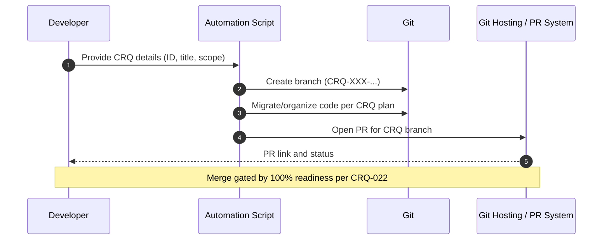

<!-- This is an auto-generated comment: summarize by coderabbit.ai -->
<!-- walkthrough_start -->

## Walkthrough
Adds two new CRQ documentation artifacts defining a CRQ-driven bootstrap hypothesis (CRQ-022) and a refactoring planning plus automation approach (CRQ-023). No source code or public APIs are added or modified.

## Changes
| Cohort / File(s) | Summary |
|---|---|
| **CRQ documentation additions** `docs/crq/CRQ-022-Bootstrap_CRQ_Hypothesis.md`, `docs/crq/CRQ-023-Refactoring_Planning_and_Automation.md` | Introduces CRQ-022 formalizing a CRQ-driven system bootstrap hypothesis and CRQ-023 detailing refactoring planning and automation scripts for CRQ-branch creation, migration, and PR workflows. Documentation only; no code changes. |

## Sequence Diagram(s)

## Estimated code review effort
🎯 2 (Simple) | ⏱️ ~8 minutes

<!-- pre_merge_checks_walkthrough_start -->

## Pre-merge checks (3 passed)

✅ Passed checks (3 passed)

|     Check name     | Status   | Explanation                                                                                                                                                                                                                                                                                                                                                                                                                                    |
| :----------------: | :------- | :--------------------------------------------------------------------------------------------------------------------------------------------------------------------------------------------------------------------------------------------------------------------------------------------------------------------------------------------------------------------------------------------------------------------------------------------- |
|  Description Check | ✅ Passed | Check skipped - CodeRabbit’s high-level summary is enabled.                                                                                                                                                                                                                                                                                                                                                                                    |
|     Title Check    | ✅ Passed | The title "CRQ-023: Refactoring Planning and Automation" accurately summarizes the pull request’s primary purpose of planning a CRQ-driven refactor and developing automation for branch/PR workflows. It is concise, includes the CRQ identifier, and directly maps to the added documentation and proposed automation tasks in the changeset. A teammate scanning PR history will understand the main change without extraneous information. |
| Docstring Coverage | ✅ Passed | No functions found in the changes. Docstring coverage check skipped.                                                                                                                                                                                                                                                                                                                                                                           |

<!-- pre_merge_checks_walkthrough_end -->

## Poem
> I thump my paws on tidy ground,  
> Two scrolls unrolled, with plans profound.  
> CRQs in rows, branches sprout,  
> Scripts to nudge each careful route.  
> Hop by hop, we trace the thread—  
> Merge when ready, carrot-fed.

<!-- walkthrough_end -->
<!-- internal state start -->

<!-- DwQgtGAEAqAWCWBnSTIEMB26CuAXA9mAOYCmGJATmriQCaQDG+Ats2bgFyQAOFk+AIwBWJBrngA3EsgEBPRvlqU0AgfFwA6NPEgQAfACgjoCEYDEZyAAUASpETZWaCrI5Ho6gDYkuAYRsAimAADABMAMxcNiQAZmhi+BTwGETWnpgYyamY9ACCeCzU8PhYABS2kGahAJSQgCgEkAJUGAywkDEk1NgUJAD0/kFh4WA9cQlJKWDc6RiZk2gFzEUlunqQS8kANPzcZHSN8kLM8ADWdNjcJbih/FihYQCsIQCcYACMb9BvABwcwb8AFgA7AAtbaIXBdRBcfC7DAaSAAVRsABkuLBcLhuNDer0iOpYNgBBomMxemxIWBkrgKPhELtxnj1GAHAJmIpsN5ECNuZkAB69biczy9ULuBDIIWeTyQHoAR2w0lwKAwNI5DGkkAGIQiUVi8QIE1SVhmc2yGDyi2W8MgAElldpmMgCDwZuh7LIISQluIGLL9eMsvwYpBcLASJASHykOIUgolAI0IgI9T8FrAmBaEkpFgmphWtJtvBmNNvewg2GIwAiABC+HwuAhVG46YCkAAErJLpXEEgq+1acxWzrQtscqG00opJ5YTgCD7ilhEAwktxGxP7DTOsxPMkI2HqDxaRrEIgEXAI7xYXS0DLkgxPNglNCjFBomNDUHphkK0mTi/IF0SBcgwW9ZAAL33cN4xIRNkw3eAlFVeAYnkGd8QYW9IGwTJG22Douh6RBtkSBQSxKdhkAcdQVG8dpSOSWhJEQ7AsIGZBxzzFpwzPAxAKgAARWI93dZMFTIDV+D4JQ4SQhh5CIZs2hiUjRgNRIg3YjcyFoiNMBVFcy1VLCaUwXtxBKDQ+KAgBRCFaKQNoV3USh4DQei+AAd1gQ8mAwCF1DwTV3KrN5gmCABSf00FoWR+wI3BugjFS+DYCh8TjXY+G1MJQisgwoHyedrXsZy10gKcSBnbg2FVNx+K1HpqAjRBw2lUrV3XUiSAVSRb3YCd8F3OMXQWYqaEYJqLKwfAQ3ITzGmaAtkBSyN4jaNTAzjAYrIagAxeJ4F3SEJuORSStmyNowCuMmCUFUXW1elRBQ+A/S45bdqA3JTxjFVJs6WNjWFSBonEiEVtInsIw+njtm7ctb08eRqRIc6gcgTyCUGzxkF3M5Q2gog2l8FFbXymy+QZGh6HwPBSU1XcvXoZw9IqkhISO/ZNs/TKZjHewOeDOdCmmjr4DXSG+FhgHrV6O6IzOqhpt6CollA0hatwMcLUgIhsEQqq92dNMyBSyTK1uEgwFaTBSCmSgwBl3h7wl7wEQAKWwAKYje61kHvR97sQT0aAXP0eY0lIixaJrk3oWJfYYeAJPkMNaWwYmRYXEptjIHyWn2RA0A6XB5AkNyUEQIbmvoe8ei1rDbZSQt0F1294CIDAtcx7HLbrBsmzQFsBg7LsGx4pAESE2SJJT5AMAbOguHiDU13zCNLpy0JR3QBgTxNwmIwVuCSB1ln2enWEe7ICvaW7gasbDSAAHF1Db+gs9J20FAwX39Z6LQfK+hjDgCgGQWmIYxqEFIOQZW+xSRay4LwfgwhRDiCkDIeQCsqCqHUFoHQICTBQDgKgVA+loHED2PA+giD2BcCoAtBwTgXAHBgrgtQmhtC6DAIYUBpgDC0HwAwRA8sKByn6BmXKYAB6NlMtwAA+gMBRnZuyTzPMwWgbgqw6IMBYYCtoqFwNrvYRwSxWGXWbqQRARhci0FoBxSA80KrCMcOwEqvs6JCJEWIiR29QgyPrHI5sSjAgqPHj2KemjCaHhSksXckFnTQVkUPEegQx5qOkOQ9uw4sySDIP6D8UdUgCEfCQF2qpzzQW8W41U6BTyUHXAeZUltyw9A9F6IcmFcwRmfM5AQ+xxx+SbNgMQ+wYiDndL7XCZ8pJKEAYLZUW90k1K1sRXuz8SBSFYaSS45A6mmQ1LpDc7kdp2mVEoaZ0guAAHk0FiHydsVRE8snIAAMonSMtrSAQllydUXJAUo2oBLZgKW80O3pX57F7IgAA3KDAMvNUipmHDWJaPF4UfPKU7WQYAsUtjeSXCMvgSgjIeSUeFYVIoIpisbKWkAACylBSDVG2JTam+wbn0xYLMr2Ps/YqxrHsX23zxwzwgXPaQCJ7Q8DpOoRcSSYZBNSfU0SPVFSF2FtqS5e56BemxNsJ+bROitHaIDJKVca403+qcjMSZq7JxMTLccaVrF6yddglgpYaDgkhBaZwDiwAdy7ggr13hpoInZeg/YdNcAM2QN6bgPleyQXaCDUew0ThoFIMLE+SZZnsloJyZw6hZDbA2MZZIKgjqlrHE+GipTelbKqtfdg59IC7grnGVZ7ixaXQEMq+RH9IwSCGngRc09ykSpaPPJxS9/S9QWTQNAQ4BDYFxVsHGQZVqj0MnLWGWRVY2HWeOZI8qm6KFgvmtuYEYXSuVKgJsb1cDI3dD24yYtnDiA/MOoRmpF4PtVLSItklSKFpQvIIUpS3rASsLaZApFq7dEkgrfK5hLC5E8DQZWCqNyWyUA+Zw/thZRkuBQa1pEoO7j9OWcQ0hXyQAAHIUSMHZcQPpQ33R6BXEgC1E6JE4JAFE+BPIGB0VWV8AjvGiJXH4qREQwDvnUkaBRJofwpAUTkBRRVRYTs0do3R+jciGNgcoa1zDzHyEsQXaxtj7GOOce+k6ALPG9OETJ8RkjBgKaU1tIgqnTRZE0xabTVoI3RKUJzYaqRfA2YjGDRUEJhxDD1EUo0aR1PmktONAFbyyrKiElfGq7AqluYYLUpZeBhrXIKpAO5IgHlSGQW6EOnSigR0RcU4Wls83wRRdq0FuZ0XBV3CG+gRrks73bZVaq2cSp/Ilk0tMe6JpPQZK9d6w36UmqcnFqyglpD5cXPVICvmkUZdmFkFeoFkapp65e0+CEkLfvkIW4tfAcLqGQEsbgxzHqBHWTq8gokiUx0Mo3GUMlp3yUFuJQu7alQOVapAKlUUmqxUmi5JI7lVquq/JQSbeVrKFTC7l/LPzm3VSQY0A2ng9X5eQKUVqVUZSkVvNh0CGDpC1FGmFnwssMbONHrDVuSsii3UvQ9NM0NFr5jhgLoMth6WR3SyLk9usEbISwqjdGAKJtZwfPAfbkAo1jPoFyuNPKV7syi9zTr6XvwYDrTllYC3JYbkAaMxWmBWIyhlitxc5bO44dzsOtWmBs1fPho+ZAD5Oh8BiHgC1M3W11P1obarh8zaJAttBbUBAnbosxokE4MQZyeWN3y79ArFy9CFeQEVXBWth3a4U5TWQwdx32InN6KcWhlsjBgAuGo9VErLoTDOWckBWoQXF9XLNRsPzqRN/ug7mytgyS8u9tXxUWkldCbCe+KD2QtJpeTASUnyNCQEcJmS72aLHPvaQh97sJnze29yb9cB4icruMAOlG0E4MA74SgtY0M9EMMsMzNcMXR8NRB0gQ9/ISMqYBMY0+AqMYNaN54GNmNyBWMAoONaFJduMU4+MYgUpBMmUmJHAxNdECpeF+FwFdZLpKFTMaEyJqdGFTEWF5A5B2EVBOECEeFDBiEOD1AFFEJEAFESDeM6AFF7JyNhDGDGBwgAA2YEB4b4UQLQ4IGIIEfeBgVQ8IIEIEN4cITocIAEb4IEWCB4NAZ4WgN4AEAQUIAQJQgwUQxBcQyQ6QrZUguQiBJQ0Q3gEgBRV1UIgsBgf8eQyERQkBAwAAb2sirCQFsBrBnCiLoBJVYHYCsDpBpirC4DiFxjPmSNajpjp3SOEROFsEKPaFvGTE2GSKQBuW2SSHsTIDqOKMaOSKYloBsBwgEmEQ+SNEQFi1EBODqJpEVCaMAirD6IGIwA8BfRIHGKiKmIoBmN6MQkWN+SOxKDWMmKKIaNKLmMzToHgwcGkBGLqJ0VmMgCrHSAhEOOiAcCw0QDqIAG1rJAIkjAJ/iHjIiThGMV0SBbi9j/kVhDiqx7iASqx7JEoPiuBpjTiASHjSMZhrRbjDj7ATgJZdh6AoASUlAbABD1BABMAmQAQGJjAG8GnG4MsyrkH10iARhJ+P+KrELTBK4CrE8mcDNDZLRIeI0gylvEOJBLYFuL6UhIwAkwBIAF9YTIA/i0SqwgSJTuSHjli6JoSlS5iETvYNitihSqwMSI9ppbiLxQwvAIwAAdKsbeSIBFNLRXQLOMccHTHODAe0vecreBV9CzEtRJI+HgEGeURLXASko8YsZwSDboS4eCS6R3M0d0AbfJLAFXX9SnWEIMaBL0jyWXbiI9YvCgUvcvM8c5JkvyZORogyIOTUS2UeQ2ZCX2SgabeAHoMQV9H7F/aCGKJQegJzEqccK8BMwZUnFYSERAf8f6HrOfDmBEXIUMbcDjUqTLawOwCUQ0eQLGdqHCeZE/egS2CtRgOLDZWAWNK6UycgOmAOP+RIL0jQQU1UoiMdC0nk5jU8u2CMcMjsugeFS2cQFYqs7wZwYdYeUc7HCaVaOAhbAZWhOfaVEMdIbDMQ9cfs+wTuTIJOTAB9EsbwLWfYAgIaIMUoA0X3cWd3UiNQUCJIbnbYYZQ2D7bgWgcXVIQCm07SKmajLwV7csFYe0t3RsH0l0UYbwMQFAfCr5QZcjFCA0Csm5SsCgLGeCM4cpEMv0noA5G0p8vUh4rk24vkigAUvSqsTskof+JKLok40ykUqtTwcU0E24oC7wOU/4xU9klUuE9UpynkoYkRGkTSfAbZSPZ8uEg0pE0MTY1EuEs0znRcW4z8xPFoaaSGfc2c6CKxKVH5dzQKiXEKnNIE3E/EugXS9kuYgynkoyky8q4UpIUUhy8MKIjUqU3K0YtywCeU6yAAXXuMeKTFwFsAhMWwSp5IsEsAACoJrERkxpJDsZSprbSMBLBHTFN7cgs1NLsNMtNPTrQNBNElqlr9FYtvyEVwZBMzsutNqUyPSJysA8tOoKcistZDrlr9F6t0F8lXroA0xHcQzm9vRW8VcgxLpWlroMZesUxVQ0w0ycxCzloxxF8gwV9oJ7TL919R5nlIlEAfTSgAADfxPG1lYdF0FPFsPM+bBnGJZUJsbcarQmVAK8A+POfyboIMHbdAexeVEoJuM8oiQ2O8lALqTyLAAcgVfYWGDQV68ainISxcb6iUDfM9cQZqRVI8A0P2O8KSxuMWJNa9UG1G2sNfYeDfLG9RKW/sGVZIUdTwTBDgV6t4BESAKay69La6q7RarAf4ia/4kCMCcCCsTK7oLS5USGp7csVCDtfADCLCT7PCM1QiVuUiXZCiVUJJXyfSAZQfTCbEYta1I1ZIFUJiCuItNiAHEm8MDshQCgIiPZJiOMNXKWr2wCH2wCISaZXM2HDVUDOa2efvPWJSAsmXYG7aAHFmhwdLdyYuDoYdeuL5EyZocyCdJagE1uk3eyaDVqIMOPMC5ybDSuVabyXyUlICoKRxe01HaKWKH0hKC1XHZlDvVVLKSAAm8/PGpupavKFuia3asWB6xbJ6ltYrOqT21e/4wrIBoMZndqISxnUiF5PgaiSERtObaaHnNMe1P6Quy2Ee1IJm5/UreCWB3udqR0Cce25utEte3+qCY+KaAFS6ZxNXAsjm3B1sJuoUlu/4g6ZOY6ZqEMsXPtEMKMGMbeyXFFGXeabYNbF6JOeGniDhzh6h36JLbBzK+hlYS6KwEGBLJUelYe9ahurbRRoUtevImgLXaUFGVUNGeBc8q6URkaesXGDtU4CMPGg3XcPGjcdWSPEMzyEvMvETD+pYxW/jRQ3cmUMgCeqCQ8JGNNRKdpMmrWMHIOQOn8wx1IS6bwIgeIT1JQMcWgcMIiPDaCCpZOUsYWe0jm/s7mm7L8luDcLOwur7fgEW+RzYES4p2CT1fyaYh5EaaCAGocQuqemgbgHFFkcZ4dae73WYSgEJmW03a1C3BmV66hm3bQbwegP61aNhsGxx1IMO/rDMPJOGxupajZ5MJZKBO6yippHyZUT3SSdWCi8JwDeRhXUPBWdYYPa0dtcPDWL5As/Zv8M8S5/43wUCvgdPJQTPAsxPRJptZ6gaF0aJi1GKbpzVWAw29Gk2zGiJc2+06W/RKvDbOWevYSXAdZ72ia8FNrX0Z09vFIDgKa6wWkEu4KTcTYsQJKFmbgK8daE5WVCxlWqxsiUsPkNvPzSMcggTJuteqa20WOToeOE3cg3vVOVln23+gFZ5hs6CYKygcMGKYWXxjKVIDANxDOKieJTwaRjMZ6ZOORi5jARViamyIfDeegQlUuVwNlz1mJ9Op5zJhpt1VmS1FCugbYGQzyaN2emx9GfYOeiHZGBV2luxLFi2NMKwBAGcauJNf1n2gSP8rs+QBwAVgTNW4sUsHWhhkMS2NG42tJNsM215H08cRtqsG5cgMAAvHt4ldJF0NFOXMPGwH0n7bgLIRZ/RXfOSeeGlwCREI/Q83M9uJ/deTVS6V+7zC/Zt6/W/LfKJWgd+iFwCXIJ/U8UpiMERm6I5h7a9VaCPZGO9M9wBqnAaW+Ds0Ax+bGL/YdDx3/eAbxvySywBEJpahRKDklyaiaioaALsEgT2/yira0V6yD6D70t62D4atcRcT2wqexQnSAPFltzfbGlxcrOtkoV6wj+gR0plmV92903WXVlYIc6aWj9e5BpmEmU5wbS+IBnuCkC8oRdCeQCZUEgJ0srj9ukSYZoG0NiC2kIV1aW9iGh95MdDjAKDhRGDn5Nyc6IcAAdVvBOHTjpmJm07xps7Sg2FoCWqCc8ltkUJRHHa9oGFyk+PtP8S4FI9NsJfbarG6uENbCGG84dPkydNdtdMy3tO6pXrC53lC5E8UCGmjtkAi9hoKQgY/dVHi8S884iFC4pumgi7Y/uoZwK488CCGFC+TKyAi5i7jE2uq5s7xu06WuAEiy2cQDWGAEDJcD0GAFgHCDWD2i5kgFM88HM9gEn1gGAF6FG+G96EG9kD0FeuAB45IGG8rBil24oF29gBW7DCO/QEXwAF57TvAYhqWqw9Bog6TcL2guZEBFvTv3vDv3uTXaBduB1YoDvdvfuBu1QUg9AUPqOMBFumwSgiATvgfcAEfdINuoeaQUfAItvfvEuMeeujo+vsf/iBuzFYzhuYewf/FAlB4r9lE2379aBofQe4fuvgeFY9B/OCW79UAOPFxFvWeAAyDAAQekeFAXoX7gEXwX4XyAUXqXmX8X6XyX+XuXiXsXlX2XxXtXpXjXhX1XnX9X3X5XvXrXg37Xxb+xFbtblHkbw7166TXxLzEcSn4JYeA92n49zbzkYb3ccH4SYHdn9JN3+lYZ3+MlaaYAJofr737jpHPjoIM5gpZJgaX7KgJiIgZgcPw7yAYAKPi3emth5T/AIVk5oINXDPyP+ANYN5dbSOy+9HOlTHfenHMDB+lIRbz37Ts3jmXrlH16jH3oRH9HrPgf4AdyOb2IK7qsDELEHEJkMMIkEkFgckLvqkIDOkamRIWflkIkN7LkHkMAfkQUYUUUXoVzRAMwJicgkIXQ0IGKGIN4IEAEOIVQlQN4EgVQh4V/swkgUIIEYIAQN4dQt8A6DBAABcQNAN8DQDBBOgAgO/rQGcLhABANhIEOEGeBoA3gAgYIOEDQD2k9AAAagBAAhegIQRbmgD0CG9De73LHlh0+499UeNvL2pj0H448u+ePJgYT0t4g974cPVas138zMd/MO1O6vtXp6rdGew3c3sAFZ68DXQ65ccKVwBTc8SgvPS9GQO17kC1BGgk3loP15S8zewPVbsTyG5dc5utAu3rJgd5DA1qLpDTPwOCy0BQsLueEAdWoGe9s+FfOTsDjYYNc4wggBrFzg4jtwBWKnVoGXyz458qsIkeQa7nJyJ86kv5BuJRFCFuC1gbGGPsOCdYbZPmAeFYNJzLIiYkhUfKvrI2sY0BdcOQ7GJIJUGeN4AygpQGsGIq4w2+ngWgV116C49cYLQhgf3yoEY9h+o/UYBPyn7YgOAuIfEHP2JCkgl+lIakLSCdaGhN+rIHftID34H8pQIoUICf1e7n8UIMQMAM/wEAPBaA3wBgMEA/5v9ngLhB4OoRIDIDngMQAEM8H+B6FQg3wFwqoSBAdAAQLw0IA8IcKqFaAmEZ4M8G+ChAYgAgVQiQFf4kBvgbwBgN8BwH4DCBxA3oKQPUG69KBtAmga0O27w8TuX3fvviNwD/d1u73ZHptzaEsCOhr1XTs+X6oQhbA2pTUpF28zRdQ2/A4dBVwkxdUPCYCI8KEXCIKIgSUhQIvoCAA= -->

<!-- internal state end -->
<!-- finishing_touch_checkbox_start -->

✨ Finishing touches

🧪 Generate unit tests

- [ ] <!-- {"checkboxId": "f47ac10b-58cc-4372-a567-0e02b2c3d479", "radioGroupId": "utg-output-choice-group-unknown_comment_id"} -->   Create PR with unit tests
- [ ] <!-- {"checkboxId": "07f1e7d6-8a8e-4e23-9900-8731c2c87f58", "radioGroupId": "utg-output-choice-group-unknown_comment_id"} -->   Post copyable unit tests in a comment
- [ ] <!-- {"checkboxId": "6ba7b810-9dad-11d1-80b4-00c04fd430c8", "radioGroupId": "utg-output-choice-group-unknown_comment_id"} -->   Commit unit tests in branch `feature/CRQ-023-refactoring-planning-automation`

<!-- finishing_touch_checkbox_end -->
<!-- tips_start -->

---

Thanks for using CodeRabbit! It's free for OSS, and your support helps us grow. If you like it, consider giving us a shout-out.

❤️ Share

- [X](https://twitter.com/intent/tweet?text=I%20just%20used%20%40coderabbitai%20for%20my%20code%20review%2C%20and%20it%27s%20fantastic%21%20It%27s%20free%20for%20OSS%20and%20offers%20a%20free%20trial%20for%20the%20proprietary%20code.%20Check%20it%20out%3A&url=https%3A//coderabbit.ai)
- [Mastodon](https://mastodon.social/share?text=I%20just%20used%20%40coderabbitai%20for%20my%20code%20review%2C%20and%20it%27s%20fantastic%21%20It%27s%20free%20for%20OSS%20and%20offers%20a%20free%20trial%20for%20the%20proprietary%20code.%20Check%20it%20out%3A%20https%3A%2F%2Fcoderabbit.ai)
- [Reddit](https://www.reddit.com/submit?title=Great%20tool%20for%20code%20review%20-%20CodeRabbit&text=I%20just%20used%20CodeRabbit%20for%20my%20code%20review%2C%20and%20it%27s%20fantastic%21%20It%27s%20free%20for%20OSS%20and%20offers%20a%20free%20trial%20for%20proprietary%20code.%20Check%20it%20out%3A%20https%3A//coderabbit.ai)
- [LinkedIn](https://www.linkedin.com/sharing/share-offsite/?url=https%3A%2F%2Fcoderabbit.ai&mini=true&title=Great%20tool%20for%20code%20review%20-%20CodeRabbit&summary=I%20just%20used%20CodeRabbit%20for%20my%20code%20review%2C%20and%20it%27s%20fantastic%21%20It%27s%20free%20for%20OSS%20and%20offers%20a%20free%20trial%20for%20proprietary%20code)

Comment `@coderabbitai help` to get the list of available commands and usage tips.

<!-- tips_end -->
