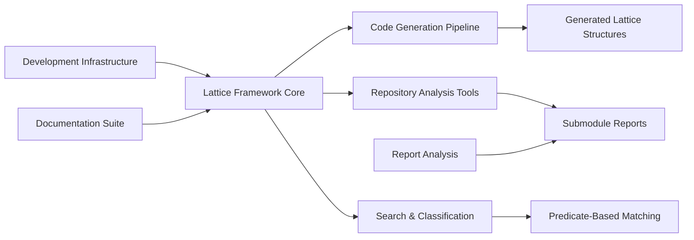

### **User description**
# CRQ-41-crq-009-grand-unified-framework-zoomed-in.md

## Change Request: crq 009 grand unified framework zoomed in
**Zooming In (Elaboration on CRQ-009: Current Task Alignment with Grand Unified Project Framework):**

**Description - Deeper Dive:**
The "Current Task Alignment with Grand Unified Project Framework" CRQ proposes a structured methodology to ensure that every individual task undertaken within the project is not merely completed in isolation, but is consciously and demonstrably integrated into the project's overarching "Grand Unified Framework" (GUF). This involves:
1.  **GUF Articulation**: For any given task, the first step is to clearly articulate the relevant segment of the GUF. This might involve referencing architectural diagrams, high-level design documents, or the project's core mission statement. The GUF should define the project's major components, their interactions, and the ultimate value proposition.
2.  **Task Decomposition & Analysis**: The current task is then broken down into its fundamental objectives, expected deliverables, and critical dependencies (both upstream and downstream). This analysis goes beyond a simple task description to understand its inherent purpose and functional boundaries.
3.  **Mapping & Integration**: This is the core of the alignment process. Each objective and deliverable of the task is explicitly mapped to specific components, functionalities, or outcomes within the GUF. For instance, if the GUF includes a "Data Ingestion Layer" and a "Reporting Module," a task to "Implement new data parser for X" would be mapped to the "Data Ingestion Layer," detailing how its output feeds into subsequent GUF components. This mapping should also identify any new interfaces or modifications to existing ones that the task introduces or requires.
4.  **Contribution Articulation**: Beyond mere mapping, the process requires articulating *how* the task contributes to the GUF's coherence and advances its ultimate objectives. This could be quantified (e.g., "reduces data processing time by Y% for Z component of GUF") or qualitatively described (e.g., "enables new reporting capabilities in the Analytics Hub of GUF").

**Scope - Granular Details:**
*   **Articulation of the project's "Grand Unified Framework" (GUF)**: This could involve creating or referencing:
    *   High-level architectural diagrams (e.g., C4 model, block diagrams).
    *   Core domain models.
    *   Project mission and vision statements.
    *   Key performance indicators (KPIs) that define the GUF's success.
*   **Detailed analysis of the current task's objectives, deliverables, and dependencies**: This would involve:
    *   Reviewing the task's user stories, requirements, or technical specifications.
    *   Identifying explicit and implicit dependencies on other project components or external systems.
    *   Defining clear success criteria for the task.
*   **Mapping of the current task's functionalities and interfaces to the GUF**: This might use:
    *   Interface Definition Languages (IDLs) or API specifications.
    *   Data flow diagrams.
    *   Component interaction diagrams.
    *   Traceability matrices linking task requirements to GUF components.
*   **Documentation of the task's role, contribution, and alignment within the GUF**: This would result in:
    *   A dedicated section in the task's documentation.
    *   Updates to relevant GUF documentation.
    *   Formal review checkpoints during the task lifecycle.
*   **Recommendations for optimizing the task's design or execution to better serve the GUF**: This could include:
    *   Suggesting alternative technical approaches that better align with GUF principles (e.g., reusability, scalability).
    *   Proposing adjustments to the task's scope to maximize its GUF contribution.
    *   Identifying opportunities for cross-team collaboration to enhance integration.

___

### **PR Type**
Enhancement, Documentation

___

### **Description**
• **Major Framework Implementation**: Comprehensive implementation of the "Lattice Idea Framework" - a mathematical approach for code analysis and classification using predicate-based n-gram analysis
• **Code Generation Pipeline**: Complete lattice code generation system with procedural macros, structure generators, and automated code creation for different k-value types
• **Repository Analysis Tools**: New CLI tools including `submodule-collector` for Git repository scanning and `project_file_lattice_builder` for conceptual file organization
• **Search and Classification Systems**: Implementation of grand unified search architecture with similarity-based classification, predicate matching, and self-referential analysis capabilities
• **Development Infrastructure**: Enhanced Nix development environment with comprehensive tooling, GitHub CLI wrapper scripts, and automated CRQ workflow management
• **Extensive Documentation**: Complete documentation suite including mathematical formalization, standard operating procedures, creative expressions, and comprehensive testing frameworks
• **Report Analysis Suite**: Full-featured report analyzer with string analysis, n-gram processing, emoji ontology support, and organization/repository frequency analysis

___

### Diagram Walkthrough

 
<h3> File Walkthrough</h3>

<table><thead><tr><th></th><th align="left">Relevant files</th></tr></thead><tbody><tr><td><strong>Configuration changes</strong></td><td>

3 files
<table>
<tr>
  <td>
    

      
<strong>flake.nix</strong><dd><code>Enhanced Nix flake with submodule-collector package and development </code> <code>tools</code></dd>

flake.nix

• Removed empty line at the beginning of the file  • Added new  <code>submodule-collector</code> package derivation with Rust build configuration  •  Added development tools including jq, valgrind, and extensive Emacs  packages for Rust/OCaml development  • Added shell formatting tools  like shellcheck, shfmt, and nixpkgs-fmt

  </td>
  <td><a href="https://github.com/meta-introspector/git-submodules-rs-nix/pull/16/files#diff-206b9ce276ab5971a2489d75eb1b12999d4bf3843b7988cbe8d687cfde61dea0">+34/-1</a>&nbsp; &nbsp; </td>

</tr>

<tr>
  <td>
    

      
<strong>shell.nix</strong><dd><code>Added valgrind to development shell dependencies</code>&nbsp; &nbsp; &nbsp; &nbsp; &nbsp; &nbsp; &nbsp; &nbsp; &nbsp; </dd>

shell.nix

• Added `pkgs.valgrind` to the buildInputs for the development shell

  </td>
  <td><a href="https://github.com/meta-introspector/git-submodules-rs-nix/pull/16/files#diff-e53dfbfffe62ae3c0b411b3938ccffa9fb6a2ecc565f55785ef8daa756631a6b">+1/-1</a>&nbsp; &nbsp; &nbsp; </td>

</tr>

<tr>
  <td>
    

      
<strong>ontology.json</strong><dd><code>Add emoji ontology mapping for project terminology</code>&nbsp; &nbsp; &nbsp; &nbsp; &nbsp; &nbsp; &nbsp; </dd>

ontology.json

• Adds emoji-based ontology mapping for project terminology and  concepts  • Maps technical terms like <code>github</code>, <code>nix</code>, <code>rust</code>,  <code>meta-introspector</code> to representative emojis  • Includes compound term  mappings and developer/organization name associations  • Provides  visual vocabulary for project documentation and communication

  </td>
  <td><a href="https://github.com/meta-introspector/git-submodules-rs-nix/pull/16/files#diff-ad0d3a368707e3d1b401472896ee86bdd45b2b3a05857d0fa583c3ce71babe9b">+63/-0</a>&nbsp; &nbsp; </td>

</tr>
</table>
</td></tr><tr><td><strong>Enhancement</strong></td><td>

61 files
<table>
<tr>
  <td>
    

      
<strong>lib.rs</strong><dd><code>New lattice code generator library with procedural macros</code></dd>

lattice_code_generator/src/lib.rs

• New library providing code generation utilities for the Lattice Idea  Framework  • Implements functions to generate Rust code for ValueType  enums, Instance structs, and LatticeLayer structs  • Uses <code>proc_macro2</code>  and <code>quote</code> for programmatic Rust code generation  • Includes  comprehensive tests for the generated code validation

  </td>
  <td><a href="https://github.com/meta-introspector/git-submodules-rs-nix/pull/16/files#diff-243854d89636db85a935fa955ee16fa44ea3ca7092902bc29701c3a825b0ba0a">+296/-0</a>&nbsp; </td>

</tr>

<tr>
  <td>
    

      
<strong>main.rs</strong><dd><code>New submodule collector CLI tool for Git repository analysis</code></dd>

submodule-collector/src/main.rs

• New command-line tool for scanning Git repositories and their  submodules recursively  • Collects detailed information about  repositories including remote URLs, paths, and branches  • Outputs  comprehensive JSON reports with error handling for failed repositories   • Uses <code>clap</code> for CLI parsing, <code>serde</code> for JSON serialization, and <code>git2</code>  for Git operations

  </td>
  <td><a href="https://github.com/meta-introspector/git-submodules-rs-nix/pull/16/files#diff-a47f0db0f72bdfe38e4c5fc28fcb76ddd4adc991f2b12a672f14f8348411c83a">+279/-0</a>&nbsp; </td>

</tr>

<tr>
  <td>
    

      
<strong>main.rs</strong><dd><code>New project file lattice builder for conceptual file organization</code></dd>

project_file_lattice_builder/src/main.rs

• New application that constructs a conceptual lattice of project  files  • Implements file classification using word predicates and  lattice hierarchy mapping  • Scans directories recursively and applies  predicate-based classification  • Includes comprehensive test coverage  for predicate extraction and classification logic

  </td>
  <td><a href="https://github.com/meta-introspector/git-submodules-rs-nix/pull/16/files#diff-307096deb9eb86f24a90391b001a081a638672a52f8c27651d21c72bcfdcd2a1">+202/-0</a>&nbsp; </td>

</tr>

<tr>
  <td>
    

      
<strong>lattice_mapper_app.rs</strong><dd><code>New lattice mapper for code similarity classification</code>&nbsp; &nbsp; &nbsp; &nbsp; </dd>

src/lattice_mapper_app.rs

• New application demonstrating code mapping into pre-generated  lattice structures  • Implements similarity-based classification using  predicate matching  • Bridges lattice structure generation with  repository search functionality  • Shows conceptual mapping of existing  code to lattice bins based on shared predicates

  </td>
  <td><a href="https://github.com/meta-introspector/git-submodules-rs-nix/pull/16/files#diff-d4b10dc90da2ebd2e54c216c08faf398915f797cc4bf2e94185cd40832762c62">+209/-0</a>&nbsp; </td>

</tr>

<tr>
  <td>
    

      
<strong>lattice_types.rs</strong><dd><code>New lattice types module with mathematical framework implementation</code></dd>

src/lattice_types.rs

• New module defining conceptual lattice types in Rust using enums,  structs, and traits  • Implements ValueType enum for different k-value  types based on prime numbers  • Defines Instance, LatticeLayer, and  Lattice structs with generic type support  • Includes demonstration of  lattice usage with bit-based and three-value type layers

  </td>
  <td><a href="https://github.com/meta-introspector/git-submodules-rs-nix/pull/16/files#diff-b4cbc31fe99d9b693a12612fdfbcbb6a05afbab7836ee96ef34759a80eea2dfc">+196/-0</a>&nbsp; </td>

</tr>

<tr>
  <td>
    

      
<strong>repo_search_simulator.rs</strong><dd><code>New repository search simulator with predicate-based matching</code></dd>

src/repo_search_simulator.rs

• New simulator for search-by-example functionality across mock  repositories  • Implements predicate-based classification and  similarity scoring  • Demonstrates lattice framework application to  large codebase search  • Uses WordPredicate instances for repository  comparison and ranking

  </td>
  <td><a href="https://github.com/meta-introspector/git-submodules-rs-nix/pull/16/files#diff-0fd44409289d811f50e94913ae801d7ed5c483e8798303c297ac9854807cfe41">+202/-0</a>&nbsp; </td>

</tr>

<tr>
  <td>
    

      
<strong>meta_lattice_model.rs</strong><dd><code>New meta-lattice model for self-referential framework analysis</code></dd>

src/meta_lattice_model.rs

• New meta-model program that conceptually models the lattice idea  framework itself  • Implements self-referential analysis capabilities  for the framework  • Defines Concept and Layer structures for  meta-modeling  • Demonstrates framework's capacity for self-analysis  and similar model discovery

  </td>
  <td><a href="https://github.com/meta-introspector/git-submodules-rs-nix/pull/16/files#diff-4ad95f3ed0d6e795cabcf8199fb28fa159aef84b4f32e578f55079fa94e07625">+153/-0</a>&nbsp; </td>

</tr>

<tr>
  <td>
    

      
<strong>analyze_strings.rs</strong><dd><code>New string analyzer with n-gram processing and ontology suggestions</code></dd>

report-analyzer-rs/src/analyze_strings.rs

• New string analysis module for processing Git repository reports  •  Implements token collection, frequency counting, and n-gram generation   • Applies emoji ontology transformations with iterative convergence  checking  • Generates suggested ontology rules based on token analysis  patterns

  </td>
  <td><a href="https://github.com/meta-introspector/git-submodules-rs-nix/pull/16/files#diff-2972c1dbf1387f1fc356a8a7315beb271dcacb9eb512719d2ac60d15084a7c1a">+171/-0</a>&nbsp; </td>

</tr>

<tr>
  <td>
    

      
<strong>lattice_classifier_app.rs</strong><dd><code>New lattice classifier for predicate-based text analysis</code>&nbsp; </dd>

src/lattice_classifier_app.rs

• New application demonstrating lattice-based text classification  •  Implements PredicateClassifier for word predicate extraction  • Shows  classification of text snippets using generated lattice structures  •  Demonstrates search-by-example functionality with predicate matching

  </td>
  <td><a href="https://github.com/meta-introspector/git-submodules-rs-nix/pull/16/files#diff-2046e6cf0881f2c6f04e40c623dbf7b071fa54d0b330bd758caea2f306c79f59">+188/-0</a>&nbsp; </td>

</tr>

<tr>
  <td>
    

      
<strong>lib.rs</strong><dd><code>New Git project reader library with comprehensive testing</code></dd>

git_project_reader/src/lib.rs

• New library for reading Git project information including tracked  files and status  • Implements functions to collect repository data  using <code>git2</code> and shell commands  • Provides comprehensive test coverage  for Git operations  • Handles error cases gracefully with proper error  propagation

  </td>
  <td><a href="https://github.com/meta-introspector/git-submodules-rs-nix/pull/16/files#diff-258b44c334cd672e0393e8cad155edd07074a84e46a6c7389d9d227e07b3e1d8">+174/-0</a>&nbsp; </td>

</tr>

<tr>
  <td>
    

      
<strong>grand_unified_search.rs</strong><dd><code>New grand unified search system conceptual framework</code>&nbsp; &nbsp; &nbsp; &nbsp; &nbsp; </dd>

src/grand_unified_search.rs

• New conceptual outline for a grand unified search system  •  Demonstrates self-parsing, similarity search, and LLM interaction  concepts  • Shows integration of semantic code parsing with lattice  framework  • Includes placeholder implementations for complex  functionality

  </td>
  <td><a href="https://github.com/meta-introspector/git-submodules-rs-nix/pull/16/files#diff-b8a48c02f53b75052bc23d20df7488207a5b86d7815d3fb29ef0b8b985553ab1">+148/-0</a>&nbsp; </td>

</tr>

<tr>
  <td>
    

      
<strong>lattice_model.rs</strong><dd><code>New lattice model with value types and predicate classification</code></dd>

src/lattice_model.rs

• New lattice model module with ValueType enum and trait definitions  •  Implements HasValueCount trait for different value types  • Defines  Instance, LatticeLayer, and Lattice structures  • Includes  PredicateClassifier for word predicate extraction

  </td>
  <td><a href="https://github.com/meta-introspector/git-submodules-rs-nix/pull/16/files#diff-780a4d5fb95789264d299113f8c45e066dafc4aa039180f7494020e35c5246b6">+136/-0</a>&nbsp; </td>

</tr>

<tr>
  <td>
    

      
<strong>word_predicate_analyzer.rs</strong><dd><code>New word predicate analyzer with n-gram generation</code>&nbsp; &nbsp; &nbsp; &nbsp; &nbsp; &nbsp; &nbsp; </dd>

src/word_predicate_analyzer.rs

• New analyzer for representing words as predicates using lattice  types  • Implements text tokenization and predicate conversion  functionality  • Generates n-grams of word predicates for pattern  analysis  • Demonstrates integration with lattice structure for text  analysis

  </td>
  <td><a href="https://github.com/meta-introspector/git-submodules-rs-nix/pull/16/files#diff-8b1a5639c122dab7e9c36fd0dac9ffa1dd9fbbbb4fb5d68eca6be406d0f63e83">+95/-0</a>&nbsp; &nbsp; </td>

</tr>

<tr>
  <td>
    

      
<strong>main.rs</strong><dd><code>New lattice structure generator for hierarchical code organization</code></dd>

lattice_structure_generator/src/main.rs

• New generator for creating structured lattice directory hierarchies   • Uses lattice code generator to create core components and layered  structures  • Generates instance-specific code files based on k-value  parameters  • Provides conceptual mapping framework for existing code  classification

  </td>
  <td><a href="https://github.com/meta-introspector/git-submodules-rs-nix/pull/16/files#diff-0503dd508e5c7168f8b6b74fb16594f291c5cead8790bfaec55d85ac576166f2">+82/-0</a>&nbsp; &nbsp; </td>

</tr>

<tr>
  <td>
    

      
<strong>lib.rs</strong><dd><code>Added ZOS lattice builder with automated file classification</code></dd>

src/lib.rs

• Added new <code>build_zos_lattice</code> function for constructing project  lattices  • Integrates lattice model components for file classification   • Implements predicate-based file categorization into different  lattice layers  • Uses PredicateClassifier for automated file type and  content analysis

  </td>
  <td><a href="https://github.com/meta-introspector/git-submodules-rs-nix/pull/16/files#diff-b1a35a68f14e696205874893c07fd24fdb88882b47c23cc0e0c80a30c7d53759">+78/-0</a>&nbsp; &nbsp; </td>

</tr>

<tr>
  <td>
    

      
<strong>main.rs</strong><dd><code>New lattice generator application for automated code creation</code></dd>

lattice_generator_app/src/main.rs

• New application for generating lattice code structures  • Uses  lattice code generator library to create all core components  • Writes  generated code to organized output directory structure  • Provides  complete code generation pipeline for lattice framework

  </td>
  <td><a href="https://github.com/meta-introspector/git-submodules-rs-nix/pull/16/files#diff-ba3c74e9dedda9c826a5198e4fb1879be1cc3251ad2be3b8bd4cef25d22bf646">+56/-0</a>&nbsp; &nbsp; </td>

</tr>

<tr>
  <td>
    

      
<strong>main.rs</strong><dd><code>New Git test repository validation application</code>&nbsp; &nbsp; &nbsp; &nbsp; &nbsp; &nbsp; &nbsp; &nbsp; &nbsp; &nbsp; &nbsp; </dd>

git_test_repo/src/main.rs

• New simple test application for Git repository operations  • Uses  <code>git2</code> library to open and validate repository access  • Provides basic  repository path validation and error handling

  </td>
  <td><a href="https://github.com/meta-introspector/git-submodules-rs-nix/pull/16/files#diff-8b9cadcb87746c34dbbc19f46f1ef3a55b401e70c5dba9cf5f2af4f9877fa594">+10/-0</a>&nbsp; &nbsp; </td>

</tr>

<tr>
  <td>
    

      
<strong>main.rs</strong><dd><code>Main entry point for report analyzer with CLI integration</code></dd>

report-analyzer-rs/src/main.rs

• Added module declarations for <code>types</code>, <code>input</code>, <code>analyze_strings</code>, and  <code>apply_emojis</code>  • Implemented main function with command-line argument  parsing using <code>clap::Parser</code>  • Added JSON file reading and parsing for  report and optional ontology data  • Integrated string analysis  functionality with emoji ontology support

  </td>
  <td><a href="https://github.com/meta-introspector/git-submodules-rs-nix/pull/16/files#diff-0c621fee3c56e03aa11c26e9371c0d100ee91ec12c43746c6cf2eb8f687bdeac">+50/-0</a>&nbsp; &nbsp; </td>

</tr>

<tr>
  <td>
    

      
<strong>program_self_description.rs</strong><dd><code>Self-describing program implementing predicate-based analysis </code> <code>framework</code></dd>

src/program_self_description.rs

• Created a self-describing Rust program demonstrating the  predicate-based framework  • Implemented functions for self-description  and finding similar programs conceptually  • Added meta-assertion about  the program's self-referential capacity

  </td>
  <td><a href="https://github.com/meta-introspector/git-submodules-rs-nix/pull/16/files#diff-386ecf0f7a94fde9c182bd08fe96599c8620c47e849ed27d5ffd2d799bf30060">+37/-0</a>&nbsp; &nbsp; </td>

</tr>

<tr>
  <td>
    

      
<strong>lcp.rs</strong><dd><code>Longest common prefix analysis for repository data</code>&nbsp; &nbsp; &nbsp; &nbsp; &nbsp; &nbsp; &nbsp; </dd>

report-analyzer-rs/src/lcp.rs

• Implemented longest common prefix (LCP) analysis for repository  paths and URLs  • Added functions to find LCP among strings and perform  analysis on report data  • Included functionality to print LCP analysis  results

  </td>
  <td><a href="https://github.com/meta-introspector/git-submodules-rs-nix/pull/16/files#diff-b21ab373ab1b39d083a90c0171119e10f283f4af3edb4ab1148d439b9eda1101">+51/-0</a>&nbsp; &nbsp; </td>

</tr>

<tr>
  <td>
    

      
<strong>my_profiling_bench.rs</strong><dd><code>Performance benchmarking setup with IAI callgrind</code>&nbsp; &nbsp; &nbsp; &nbsp; &nbsp; &nbsp; &nbsp; &nbsp; </dd>

benches/my_profiling_bench.rs

• Added IAI callgrind benchmarking setup for performance profiling  •  Created benchmark functions for <code>add</code> and <code>parse_git_config_dummy</code>  •  Configured library benchmark group with main entry point

  </td>
  <td><a href="https://github.com/meta-introspector/git-submodules-rs-nix/pull/16/files#diff-ba6682e5e5c2b85faec0653350824785fbc61e8b011444d3fc293fc73a8eff5f">+36/-0</a>&nbsp; &nbsp; </td>

</tr>

<tr>
  <td>
    

      
<strong>types.rs</strong><dd><code>Core data structures and CLI arguments for report analysis</code></dd>

report-analyzer-rs/src/types.rs

• Defined core data structures for submodule analysis including  <code>SubmoduleInfo</code>, <code>RepoInfo</code>, <code>FailedRepoInfo</code>, and <code>Report</code>  • Added  command-line argument structure <code>Args</code> with <code>clap::Parser</code> derive  •  Created <code>Ontology</code> type for emoji mapping functionality

  </td>
  <td><a href="https://github.com/meta-introspector/git-submodules-rs-nix/pull/16/files#diff-70a32aaec9d7a33bba7859aaec9a648355cf4a92b9a1c688430f60fd0b1ad036">+47/-0</a>&nbsp; &nbsp; </td>

</tr>

<tr>
  <td>
    

      
<strong>analyze_names.rs</strong><dd><code>Repository name analysis and frequency counting</code>&nbsp; &nbsp; &nbsp; &nbsp; &nbsp; &nbsp; &nbsp; &nbsp; &nbsp; &nbsp; </dd>

report-analyzer-rs/src/analyze_names.rs

• Implemented repository name analysis using regex pattern matching  •  Added functionality to extract and count repository names from URLs  and submodules  • Created frequency analysis for repository and  submodule names

  </td>
  <td><a href="https://github.com/meta-introspector/git-submodules-rs-nix/pull/16/files#diff-ece2606d6df195d4968ecc9276f8faa6fb13f2dfbd036a099bdef2995f9eac1d">+30/-0</a>&nbsp; &nbsp; </td>

</tr>

<tr>
  <td>
    

      
<strong>value_type.rs</strong><dd><code>Generated lattice value type definitions</code>&nbsp; &nbsp; &nbsp; &nbsp; &nbsp; &nbsp; &nbsp; &nbsp; &nbsp; &nbsp; &nbsp; &nbsp; &nbsp; &nbsp; &nbsp; &nbsp; &nbsp; </dd>

generated_lattice_code/value_type.rs

• Generated compressed Rust code defining <code>ValueType</code> enum with prime  value variants  • Implemented methods for value counting and ZOS  sequence generation  • Created single-line formatted code structure

  </td>
  <td><a href="https://github.com/meta-introspector/git-submodules-rs-nix/pull/16/files#diff-4534ce506bbc5e0a512da2a9f61948dc44575940029777e3be9fa6f1ce706735">+1/-0</a>&nbsp; &nbsp; &nbsp; </td>

</tr>

<tr>
  <td>
    

      
<strong>value_type.rs</strong><dd><code>Duplicate generated lattice value type definitions</code>&nbsp; &nbsp; &nbsp; &nbsp; &nbsp; &nbsp; &nbsp; </dd>

generated_lattice_structure/value_type.rs

• Duplicate of generated lattice code with identical <code>ValueType</code> enum  implementation  • Same compressed format with prime value variants and  utility methods

  </td>
  <td><a href="https://github.com/meta-introspector/git-submodules-rs-nix/pull/16/files#diff-0e397496f4650bd5f8a1aaa402b4f095cc1ebfec730fb80a60040684b1e76798">+1/-0</a>&nbsp; &nbsp; &nbsp; </td>

</tr>

<tr>
  <td>
    

      
<strong>analyze_orgs.rs</strong><dd><code>GitHub organization analysis and frequency counting</code>&nbsp; &nbsp; &nbsp; &nbsp; &nbsp; &nbsp; </dd>

report-analyzer-rs/src/analyze_orgs.rs

• Implemented organization analysis using regex to extract GitHub  organization names  • Added functionality to analyze both successful  and failed repositories  • Created frequency counting for organization  occurrences

  </td>
  <td><a href="https://github.com/meta-introspector/git-submodules-rs-nix/pull/16/files#diff-dfc5e43d786c558598103c88d48bb1cfc40e246b3ba904ae455a340f1c5d7e0a">+26/-0</a>&nbsp; &nbsp; </td>

</tr>

<tr>
  <td>
    

      
<strong>lattice_struct.rs</strong><dd><code>Generated lattice structure definitions</code>&nbsp; &nbsp; &nbsp; &nbsp; &nbsp; &nbsp; &nbsp; &nbsp; &nbsp; &nbsp; &nbsp; &nbsp; &nbsp; &nbsp; &nbsp; &nbsp; &nbsp; &nbsp; </dd>

generated_lattice_code/lattice_struct.rs

• Generated compressed Rust code for main <code>Lattice</code> struct and trait  definitions  • Implemented trait-based layer management with dynamic  dispatch  • Created methods for lattice construction and description

  </td>
  <td><a href="https://github.com/meta-introspector/git-submodules-rs-nix/pull/16/files#diff-79d9dfa1f549d761bf956b17120979d037243e9dc1f10ebb9402e5b62ff5cf46">+1/-0</a>&nbsp; &nbsp; &nbsp; </td>

</tr>

<tr>
  <td>
    

      
<strong>lattice_struct.rs</strong><dd><code>Duplicate generated lattice structure definitions</code>&nbsp; &nbsp; &nbsp; &nbsp; &nbsp; &nbsp; &nbsp; &nbsp; </dd>

generated_lattice_structure/lattice_struct.rs

• Duplicate of generated lattice code with identical structure  definitions  • Same compressed format with trait-based layer management

  </td>
  <td><a href="https://github.com/meta-introspector/git-submodules-rs-nix/pull/16/files#diff-d0b1a7887fc4298e093cd2bfb55016adcc95a93c94f2f6df94699f5fb9f43180">+1/-0</a>&nbsp; &nbsp; &nbsp; </td>

</tr>

<tr>
  <td>
    

      
<strong>instance_struct.rs</strong><dd><code>Generated lattice instance structure definitions</code>&nbsp; &nbsp; &nbsp; &nbsp; &nbsp; &nbsp; &nbsp; &nbsp; &nbsp; </dd>

generated_lattice_code/instance_struct.rs

• Generated compressed Rust code for <code>Instance</code> struct with generic type  parameter  • Implemented n-gram size validation and instance  description methods  • Created constructor with assertion for unit  count matching

  </td>
  <td><a href="https://github.com/meta-introspector/git-submodules-rs-nix/pull/16/files#diff-d3a134be5da73893ad11cfba2741e995cb5385d116f305bb9f90ba03072271f8">+1/-0</a>&nbsp; &nbsp; &nbsp; </td>

</tr>

<tr>
  <td>
    

      
<strong>instance_struct.rs</strong><dd><code>Duplicate generated lattice instance definitions</code>&nbsp; &nbsp; &nbsp; &nbsp; &nbsp; &nbsp; &nbsp; &nbsp; &nbsp; </dd>

generated_lattice_structure/instance_struct.rs

• Duplicate of generated instance code with identical implementation  •  Same compressed format with generic type support and validation

  </td>
  <td><a href="https://github.com/meta-introspector/git-submodules-rs-nix/pull/16/files#diff-2a3695aa0e91eed81596edd58de20843bbebe8a9e7ddddae052cc7f695267747">+1/-0</a>&nbsp; &nbsp; &nbsp; </td>

</tr>

<tr>
  <td>
    

      
<strong>lattice_layer_struct.rs</strong><dd><code>Generated lattice layer structure definitions</code>&nbsp; &nbsp; &nbsp; &nbsp; &nbsp; &nbsp; &nbsp; &nbsp; &nbsp; &nbsp; &nbsp; &nbsp; </dd>

generated_lattice_code/lattice_layer_struct.rs

• Generated compressed Rust code for <code>LatticeLayer</code> struct with generic  support  • Implemented layer construction and instance management with  validation  • Created description methods for layer analysis

  </td>
  <td><a href="https://github.com/meta-introspector/git-submodules-rs-nix/pull/16/files#diff-0aacd04a7a621f806b54ffa94092f874682700841e03474720504945ec824126">+1/-0</a>&nbsp; &nbsp; &nbsp; </td>

</tr>

<tr>
  <td>
    

      
<strong>lattice_layer_struct.rs</strong><dd><code>Duplicate generated lattice layer definitions</code>&nbsp; &nbsp; &nbsp; &nbsp; &nbsp; &nbsp; &nbsp; &nbsp; &nbsp; &nbsp; &nbsp; &nbsp; </dd>

generated_lattice_structure/lattice_layer_struct.rs

• Duplicate of generated lattice layer code with identical  implementation  • Same compressed format with generic type support and  validation

  </td>
  <td><a href="https://github.com/meta-introspector/git-submodules-rs-nix/pull/16/files#diff-8732c80f707e0ab6b869ea056076368c8830979c489e8c25c0b1d63a05affb3b">+1/-0</a>&nbsp; &nbsp; &nbsp; </td>

</tr>

<tr>
  <td>
    

      
<strong>duplicates.rs</strong><dd><code>Duplicate repository URL detection and analysis</code>&nbsp; &nbsp; &nbsp; &nbsp; &nbsp; &nbsp; &nbsp; &nbsp; &nbsp; &nbsp; </dd>

report-analyzer-rs/src/duplicates.rs

• Implemented duplicate URL detection and analysis for repositories  •  Added functionality to print duplicate repository URLs with their  paths  • Created analysis function to identify repositories with same  URLs

  </td>
  <td><a href="https://github.com/meta-introspector/git-submodules-rs-nix/pull/16/files#diff-4d80fd66c8b316d5012d6352dd781de56fe14903a0f5394e6ce2fa81ee99e035">+25/-0</a>&nbsp; &nbsp; </td>

</tr>

<tr>
  <td>
    

      
<strong>input.rs</strong><dd><code>Input handling and data loading for report analyzer</code>&nbsp; &nbsp; &nbsp; &nbsp; &nbsp; &nbsp; </dd>

report-analyzer-rs/src/input.rs

• Implemented command-line argument parsing using <code>clap::Parser</code>  • Added  data loading functionality for report and ontology JSON files  •  Created error handling for file reading and JSON parsing

  </td>
  <td><a href="https://github.com/meta-introspector/git-submodules-rs-nix/pull/16/files#diff-e9ea32f3583a31e364d9ff7d6c37296c5c56f4c8fe8b359a4693368182e54e3b">+22/-0</a>&nbsp; &nbsp; </td>

</tr>

<tr>
  <td>
    

      
<strong>apply_emojis.rs</strong><dd><code>Emoji ontology application for text enhancement</code>&nbsp; &nbsp; &nbsp; &nbsp; &nbsp; &nbsp; &nbsp; &nbsp; &nbsp; &nbsp; </dd>

report-analyzer-rs/src/apply_emojis.rs

• Implemented emoji ontology application to text strings  • Added  functionality to replace text with emojis based on ontology mapping  •  Created sorted key processing for longest-match replacement

  </td>
  <td><a href="https://github.com/meta-introspector/git-submodules-rs-nix/pull/16/files#diff-b046d9b03ffcc74bc7362f658297d45a8141ccff9481915e5a8348b7f49a2297">+18/-0</a>&nbsp; &nbsp; </td>

</tr>

<tr>
  <td>
    

      
<strong>names_analysis.rs</strong><dd><code>Repository name analysis output formatting</code>&nbsp; &nbsp; &nbsp; &nbsp; &nbsp; &nbsp; &nbsp; &nbsp; &nbsp; &nbsp; &nbsp; &nbsp; &nbsp; &nbsp; &nbsp; </dd>

report-analyzer-rs/src/names_analysis.rs

• Implemented analysis printing for repository and submodule names  •  Added frequency-based sorting and top 10 display functionality  •  Integrated emoji ontology support for enhanced output

  </td>
  <td><a href="https://github.com/meta-introspector/git-submodules-rs-nix/pull/16/files#diff-300b8fb41eee786eabd0188c0030f81f88dfc1cee7f998e57e62b26ff2a14c37">+14/-0</a>&nbsp; &nbsp; </td>

</tr>

<tr>
  <td>
    

      
<strong>org_analysis.rs</strong><dd><code>Organization analysis output formatting</code>&nbsp; &nbsp; &nbsp; &nbsp; &nbsp; &nbsp; &nbsp; &nbsp; &nbsp; &nbsp; &nbsp; &nbsp; &nbsp; &nbsp; &nbsp; &nbsp; &nbsp; &nbsp; </dd>

report-analyzer-rs/src/org_analysis.rs

• Implemented organization analysis output formatting with frequency  sorting  • Added top 10 organization display with emoji ontology  integration  • Created formatted output for organization frequency  analysis

  </td>
  <td><a href="https://github.com/meta-introspector/git-submodules-rs-nix/pull/16/files#diff-5bc7fdd91e1797253239ee186eacd73c931025fcd10b5880906a97a8400fbdcc">+13/-0</a>&nbsp; &nbsp; </td>

</tr>

<tr>
  <td>
    

      
<strong>instance_0.rs</strong><dd><code>Generated lattice layer instance template for k=2</code>&nbsp; &nbsp; &nbsp; &nbsp; &nbsp; &nbsp; &nbsp; &nbsp; </dd>

generated_lattice_structure/layer_k_2/instance_0.rs

• Added placeholder code structure for 2-value type layer instance  •  Created template for specific implementation based on 2-bit model

  </td>
  <td><a href="https://github.com/meta-introspector/git-submodules-rs-nix/pull/16/files#diff-990ad20f4685e1e62b47bcdc403066dc9a6a5cd320f109f452149c676da95d77">+3/-0</a>&nbsp; &nbsp; &nbsp; </td>

</tr>

<tr>
  <td>
    

      
<strong>instance_1.rs</strong><dd><code>Generated lattice layer instance template for k=2 instance 1</code></dd>

generated_lattice_structure/layer_k_2/instance_1.rs

• Added placeholder code structure for second 2-value type layer  instance  • Created template for specific implementation based on 2-bit  model

  </td>
  <td><a href="https://github.com/meta-introspector/git-submodules-rs-nix/pull/16/files#diff-df8632b2498c76b1d518d069119ef059ccb029cdcabff4a67066bd7b537542ca">+3/-0</a>&nbsp; &nbsp; &nbsp; </td>

</tr>

<tr>
  <td>
    

      
<strong>instance_0.rs</strong><dd><code>Generated lattice layer instance template for k=3</code>&nbsp; &nbsp; &nbsp; &nbsp; &nbsp; &nbsp; &nbsp; &nbsp; </dd>

generated_lattice_structure/layer_k_3/instance_0.rs

• Added placeholder code structure for 3-value type layer instance  •  Created template for specific implementation based on 3-value model

  </td>
  <td><a href="https://github.com/meta-introspector/git-submodules-rs-nix/pull/16/files#diff-45a15a4ed78fb935970c9dfb064319535f48d88aa3eeaaf6724236295ad8bc36">+3/-0</a>&nbsp; &nbsp; &nbsp; </td>

</tr>

<tr>
  <td>
    

      
<strong>instance_1.rs</strong><dd><code>Generated lattice layer instance template for k=3 instance 1</code></dd>

generated_lattice_structure/layer_k_3/instance_1.rs

• Added placeholder code structure for second 3-value type layer  instance  • Created template for specific implementation based on  3-value model

  </td>
  <td><a href="https://github.com/meta-introspector/git-submodules-rs-nix/pull/16/files#diff-f985fd8aeb2357840bce2296c2e55547376810292136d6b105ebb782f0c2bea1">+3/-0</a>&nbsp; &nbsp; &nbsp; </td>

</tr>

<tr>
  <td>
    

      
<strong>has_value_count_impls.rs</strong><dd><code>Generated trait implementation for value counting</code>&nbsp; &nbsp; &nbsp; &nbsp; &nbsp; &nbsp; &nbsp; &nbsp; </dd>

generated_lattice_code/has_value_count_impls.rs

• Generated compressed implementation of <code>HasValueCount</code> trait for <code>bool</code>  type  • Defined value count as 2 for boolean type in single-line format

  </td>
  <td><a href="https://github.com/meta-introspector/git-submodules-rs-nix/pull/16/files#diff-fc27ee60e32d05c14ba49d85ee4b7d8e66ac5c101ad0dbe3e5d349b4b9303ac8">+1/-0</a>&nbsp; &nbsp; &nbsp; </td>

</tr>

<tr>
  <td>
    

      
<strong>has_value_count_impls.rs</strong><dd><code>Duplicate generated trait implementation</code>&nbsp; &nbsp; &nbsp; &nbsp; &nbsp; &nbsp; &nbsp; &nbsp; &nbsp; &nbsp; &nbsp; &nbsp; &nbsp; &nbsp; &nbsp; &nbsp; &nbsp; </dd>

generated_lattice_structure/has_value_count_impls.rs

• Duplicate of generated trait implementation with identical code  •  Same compressed format for <code>HasValueCount</code> trait on <code>bool</code>

  </td>
  <td><a href="https://github.com/meta-introspector/git-submodules-rs-nix/pull/16/files#diff-bfde8abac89de5011df90cbcb78cbcd164b872180cfb65270be5126f86444644">+1/-0</a>&nbsp; &nbsp; &nbsp; </td>

</tr>

<tr>
  <td>
    

      
<strong>has_value_count_trait.rs</strong><dd><code>Generated trait definition for value counting</code>&nbsp; &nbsp; &nbsp; &nbsp; &nbsp; &nbsp; &nbsp; &nbsp; &nbsp; &nbsp; &nbsp; &nbsp; </dd>

generated_lattice_code/has_value_count_trait.rs

• Generated compressed trait definition for <code>HasValueCount</code> with value  counting method  • Created single-line formatted trait definition

  </td>
  <td><a href="https://github.com/meta-introspector/git-submodules-rs-nix/pull/16/files#diff-cf0ba0ca0358cab475d52e9b5edf475682f4cd05a5cd4d554b917677343ec3b1">+1/-0</a>&nbsp; &nbsp; &nbsp; </td>

</tr>

<tr>
  <td>
    

      
<strong>has_value_count_trait.rs</strong><dd><code>Duplicate generated trait definition</code>&nbsp; &nbsp; &nbsp; &nbsp; &nbsp; &nbsp; &nbsp; &nbsp; &nbsp; &nbsp; &nbsp; &nbsp; &nbsp; &nbsp; &nbsp; &nbsp; &nbsp; &nbsp; &nbsp; &nbsp; &nbsp; </dd>

generated_lattice_structure/has_value_count_trait.rs

• Duplicate of generated trait definition with identical  implementation  • Same compressed format for <code>HasValueCount</code> trait

  </td>
  <td><a href="https://github.com/meta-introspector/git-submodules-rs-nix/pull/16/files#diff-ef800ec7554c85081358a5d3b43129aedea930cf2edbc44915c73ff89d7f767e">+1/-0</a>&nbsp; &nbsp; &nbsp; </td>

</tr>

<tr>
  <td>
    

      
<strong>standardize_and_move_crqs.sh</strong><dd><code>CRQ file standardization and organization script</code>&nbsp; &nbsp; &nbsp; &nbsp; &nbsp; &nbsp; &nbsp; &nbsp; &nbsp; </dd>

tools/gh_scripts/standardize_and_move_crqs.sh

• Created comprehensive bash script for CRQ file standardization and  organization  • Implemented dry-run mode, filename parsing, header  validation, and file movement  • Added robust CRQ number calculation  and standardization report generation

  </td>
  <td><a href="https://github.com/meta-introspector/git-submodules-rs-nix/pull/16/files#diff-8c55bddfb101eb3114069c644947a8dd51e359934e566113c182d18a2dfd27ea">+149/-0</a>&nbsp; </td>

</tr>

<tr>
  <td>
    

      
<strong>create_crq_workflow.sh</strong><dd><code>Automated CRQ workflow creation script</code>&nbsp; &nbsp; &nbsp; &nbsp; &nbsp; &nbsp; &nbsp; &nbsp; &nbsp; &nbsp; &nbsp; &nbsp; &nbsp; &nbsp; &nbsp; &nbsp; &nbsp; &nbsp; &nbsp; </dd>

tools/gh_scripts/create_crq_workflow.sh

• Created bash script for automated CRQ workflow creation including  branch and PR setup  • Implemented CRQ parsing, branch creation,  task.md generation, and GitHub PR creation  • Added validation and  error handling for CRQ file processing

  </td>
  <td><a href="https://github.com/meta-introspector/git-submodules-rs-nix/pull/16/files#diff-6c8f66bef77ee7fde8332f1252ae40263db8cf2753250002be768b877a1ea40e">+79/-0</a>&nbsp; &nbsp; </td>

</tr>

<tr>
  <td>
    

      
<strong>boot.sh</strong><dd><code>Session orchestration and crash recovery script</code>&nbsp; &nbsp; &nbsp; &nbsp; &nbsp; &nbsp; &nbsp; &nbsp; &nbsp; &nbsp; </dd>

boot.sh

• Created orchestration script for tmux session recording with  asciinema  • Implemented crash recovery checks with git status and log  processing  • Added comprehensive logging and session management  functionality

  </td>
  <td><a href="https://github.com/meta-introspector/git-submodules-rs-nix/pull/16/files#diff-c270322e6f914001c9d1d23e01d1eefe9469337f284b0c0a920c5f843a15b373">+38/-0</a>&nbsp; &nbsp; </td>

</tr>

<tr>
  <td>
    

      
<strong>gh_extract_actors.sh</strong><dd><code>GitHub actor extraction script</code>&nbsp; &nbsp; &nbsp; &nbsp; &nbsp; &nbsp; &nbsp; &nbsp; &nbsp; &nbsp; &nbsp; &nbsp; &nbsp; &nbsp; &nbsp; &nbsp; &nbsp; &nbsp; &nbsp; &nbsp; &nbsp; &nbsp; &nbsp; &nbsp; &nbsp; &nbsp; &nbsp; </dd>

tools/gh_scripts/gh_extract_actors.sh

• Created script to extract unique GitHub actors from issues and  comments  • Implemented JSON parsing with <code>jq</code> for actor identification  and deduplication  • Added output formatting and optional file saving  functionality

  </td>
  <td><a href="https://github.com/meta-introspector/git-submodules-rs-nix/pull/16/files#diff-460ff5ab5242fc20792c70a204e82ad028e958e7a97a454d0146104b9c11c60d">+41/-0</a>&nbsp; &nbsp; </td>

</tr>

<tr>
  <td>
    

      
<strong>gh_workflows_view.sh</strong><dd><code>GitHub workflow viewing script</code>&nbsp; &nbsp; &nbsp; &nbsp; &nbsp; &nbsp; &nbsp; &nbsp; &nbsp; &nbsp; &nbsp; &nbsp; &nbsp; &nbsp; &nbsp; &nbsp; &nbsp; &nbsp; &nbsp; &nbsp; &nbsp; &nbsp; &nbsp; &nbsp; &nbsp; &nbsp; &nbsp; </dd>

tools/gh_scripts/gh_workflows_view.sh

• Created wrapper script for viewing GitHub Actions workflow run  details  • Added usage validation and argument forwarding to <code>gh run </code> <code>view</code>

  </td>
  <td><a href="https://github.com/meta-introspector/git-submodules-rs-nix/pull/16/files#diff-b0c94629d1fb360d50c2e90b6727366e24932da3280fe67fba264b2557c5813d">+7/-0</a>&nbsp; &nbsp; &nbsp; </td>

</tr>

<tr>
  <td>
    

      
<strong>gh_workflows_rerun.sh</strong><dd><code>GitHub workflow re-run script</code>&nbsp; &nbsp; &nbsp; &nbsp; &nbsp; &nbsp; &nbsp; &nbsp; &nbsp; &nbsp; &nbsp; &nbsp; &nbsp; &nbsp; &nbsp; &nbsp; &nbsp; &nbsp; &nbsp; &nbsp; &nbsp; &nbsp; &nbsp; &nbsp; &nbsp; &nbsp; &nbsp; &nbsp; </dd>

tools/gh_scripts/gh_workflows_rerun.sh

• Created wrapper script for re-running GitHub Actions workflow runs  •  Added usage validation and argument forwarding to <code>gh run rerun</code>

  </td>
  <td><a href="https://github.com/meta-introspector/git-submodules-rs-nix/pull/16/files#diff-e0c1712ffe488bdadbc0d62c565cf16af06d40f4e687e0934dbed1d7bbbc5355">+7/-0</a>&nbsp; &nbsp; &nbsp; </td>

</tr>

<tr>
  <td>
    

      
<strong>gh_issues_view.sh</strong><dd><code>GitHub issue viewing script</code>&nbsp; &nbsp; &nbsp; &nbsp; &nbsp; &nbsp; &nbsp; &nbsp; &nbsp; &nbsp; &nbsp; &nbsp; &nbsp; &nbsp; &nbsp; &nbsp; &nbsp; &nbsp; &nbsp; &nbsp; &nbsp; &nbsp; &nbsp; &nbsp; &nbsp; &nbsp; &nbsp; &nbsp; &nbsp; &nbsp; </dd>

tools/gh_scripts/gh_issues_view.sh

• Created wrapper script for viewing GitHub issue details  • Added  usage validation and argument forwarding to <code>gh issue view</code>

  </td>
  <td><a href="https://github.com/meta-introspector/git-submodules-rs-nix/pull/16/files#diff-ceee01b16affa23014471597e8bfa4e7093a08cae0010e80d6e417f64eb4bd73">+7/-0</a>&nbsp; &nbsp; &nbsp; </td>

</tr>

<tr>
  <td>
    

      
<strong>gh_prs_view.sh</strong><dd><code>GitHub pull request viewing script</code>&nbsp; &nbsp; &nbsp; &nbsp; &nbsp; &nbsp; &nbsp; &nbsp; &nbsp; &nbsp; &nbsp; &nbsp; &nbsp; &nbsp; &nbsp; &nbsp; &nbsp; &nbsp; &nbsp; &nbsp; &nbsp; &nbsp; &nbsp; </dd>

tools/gh_scripts/gh_prs_view.sh

• Created wrapper script for viewing GitHub pull request details  •  Added usage validation and argument forwarding to <code>gh pr view</code>

  </td>
  <td><a href="https://github.com/meta-introspector/git-submodules-rs-nix/pull/16/files#diff-ab1b2cdb0af702cfdded4516d0729e6dfd7e8344593d60c4f8e18391e97ad237">+7/-0</a>&nbsp; &nbsp; &nbsp; </td>

</tr>

<tr>
  <td>
    

      
<strong>gh_prs_checkout.sh</strong><dd><code>GitHub pull request checkout script</code>&nbsp; &nbsp; &nbsp; &nbsp; &nbsp; &nbsp; &nbsp; &nbsp; &nbsp; &nbsp; &nbsp; &nbsp; &nbsp; &nbsp; &nbsp; &nbsp; &nbsp; &nbsp; &nbsp; &nbsp; &nbsp; &nbsp; </dd>

tools/gh_scripts/gh_prs_checkout.sh

• Created wrapper script for checking out GitHub pull requests locally   • Added usage validation and argument forwarding to <code>gh pr checkout</code>

  </td>
  <td><a href="https://github.com/meta-introspector/git-submodules-rs-nix/pull/16/files#diff-d28d93bffaad9e849d93396c98a560026fe56ab83bb1b6970b7c861a88374ac8">+7/-0</a>&nbsp; &nbsp; &nbsp; </td>

</tr>

<tr>
  <td>
    

      
<strong>gh_prs_create.sh</strong><dd><code>GitHub pull request creation script</code>&nbsp; &nbsp; &nbsp; &nbsp; &nbsp; &nbsp; &nbsp; &nbsp; &nbsp; &nbsp; &nbsp; &nbsp; &nbsp; &nbsp; &nbsp; &nbsp; &nbsp; &nbsp; &nbsp; &nbsp; &nbsp; &nbsp; </dd>

tools/gh_scripts/gh_prs_create.sh

• Created wrapper script for creating new GitHub pull requests  • Added  direct argument forwarding to <code>gh pr create</code>

  </td>
  <td><a href="https://github.com/meta-introspector/git-submodules-rs-nix/pull/16/files#diff-a93576bdc2590454343302cb71a046eb7c93a47d55a26aae5ec37b2b338c6c04">+3/-0</a>&nbsp; &nbsp; &nbsp; </td>

</tr>

<tr>
  <td>
    

      
<strong>gh_issues_create.sh</strong><dd><code>GitHub issue creation script</code>&nbsp; &nbsp; &nbsp; &nbsp; &nbsp; &nbsp; &nbsp; &nbsp; &nbsp; &nbsp; &nbsp; &nbsp; &nbsp; &nbsp; &nbsp; &nbsp; &nbsp; &nbsp; &nbsp; &nbsp; &nbsp; &nbsp; &nbsp; &nbsp; &nbsp; &nbsp; &nbsp; &nbsp; &nbsp; </dd>

tools/gh_scripts/gh_issues_create.sh

• Created wrapper script for creating new GitHub issues  • Added direct  argument forwarding to <code>gh issue create</code>

  </td>
  <td><a href="https://github.com/meta-introspector/git-submodules-rs-nix/pull/16/files#diff-3f1da69ae9e8e9fa5053e313adcb1682a01433effadbcd20c25a9861161f75ba">+3/-0</a>&nbsp; &nbsp; &nbsp; </td>

</tr>

<tr>
  <td>
    

      
<strong>gh_workflows_list.sh</strong><dd><code>GitHub workflow listing script</code>&nbsp; &nbsp; &nbsp; &nbsp; &nbsp; &nbsp; &nbsp; &nbsp; &nbsp; &nbsp; &nbsp; &nbsp; &nbsp; &nbsp; &nbsp; &nbsp; &nbsp; &nbsp; &nbsp; &nbsp; &nbsp; &nbsp; &nbsp; &nbsp; &nbsp; &nbsp; &nbsp; </dd>

tools/gh_scripts/gh_workflows_list.sh

• Created wrapper script for listing GitHub Actions workflow runs  •  Added direct argument forwarding to <code>gh run list</code>

  </td>
  <td><a href="https://github.com/meta-introspector/git-submodules-rs-nix/pull/16/files#diff-c778abc6dfa41fde8a4a81403f113532ca4e7bf3ca3a3e365ed7ddad0542ae7b">+3/-0</a>&nbsp; &nbsp; &nbsp; </td>

</tr>

<tr>
  <td>
    

      
<strong>gh_prs_list.sh</strong><dd><code>GitHub pull request listing script</code>&nbsp; &nbsp; &nbsp; &nbsp; &nbsp; &nbsp; &nbsp; &nbsp; &nbsp; &nbsp; &nbsp; &nbsp; &nbsp; &nbsp; &nbsp; &nbsp; &nbsp; &nbsp; &nbsp; &nbsp; &nbsp; &nbsp; &nbsp; </dd>

tools/gh_scripts/gh_prs_list.sh

• Created wrapper script for listing GitHub pull requests  • Added  direct argument forwarding to <code>gh pr list</code>

  </td>
  <td><a href="https://github.com/meta-introspector/git-submodules-rs-nix/pull/16/files#diff-11073f60f2b49e29a5c3f078aaf23c113fcf8a427b0a5dfa818e5d87f4e51b6f">+3/-0</a>&nbsp; &nbsp; &nbsp; </td>

</tr>

<tr>
  <td>
    

      
<strong>gh_issues_list.sh</strong><dd><code>GitHub issue listing script</code>&nbsp; &nbsp; &nbsp; &nbsp; &nbsp; &nbsp; &nbsp; &nbsp; &nbsp; &nbsp; &nbsp; &nbsp; &nbsp; &nbsp; &nbsp; &nbsp; &nbsp; &nbsp; &nbsp; &nbsp; &nbsp; &nbsp; &nbsp; &nbsp; &nbsp; &nbsp; &nbsp; &nbsp; &nbsp; &nbsp; </dd>

tools/gh_scripts/gh_issues_list.sh

• Created wrapper script for listing GitHub issues  • Added direct  argument forwarding to <code>gh issue list</code>

  </td>
  <td><a href="https://github.com/meta-introspector/git-submodules-rs-nix/pull/16/files#diff-ade836d0f144c9482760f27efe6ca79a5c14a45c3006bcd9fada06b845f822fe">+3/-0</a>&nbsp; &nbsp; &nbsp; </td>

</tr>

<tr>
  <td>
    

      
<strong>emacs.sh</strong><dd><code>Emacs development environment setup script</code>&nbsp; &nbsp; &nbsp; &nbsp; &nbsp; &nbsp; &nbsp; &nbsp; &nbsp; &nbsp; &nbsp; &nbsp; &nbsp; &nbsp; &nbsp; </dd>

emacs.sh

• Created nix-shell command for launching Emacs with Rust development  packages  • Included magit, rustic, cargo-mode, rust-mode, and lsp-mode  packages

  </td>
  <td><a href="https://github.com/meta-introspector/git-submodules-rs-nix/pull/16/files#diff-534f77f5b047055c0423d42b1e91e507f9a4c0deb6e5639d61ef765b4be3f4e8">+1/-0</a>&nbsp; &nbsp; &nbsp; </td>

</tr>

<tr>
  <td>
    

      
<strong>CRQ-48-lattice-and-quine-relay.md</strong><dd><code>Add CRQ for 128-language quine relay lattice mapping</code>&nbsp; &nbsp; &nbsp; &nbsp; &nbsp; </dd>

docs/crq_standardized/CRQ-48-lattice-and-quine-relay.md

• Introduces new Change Request for lattice and quine relay  implementation  • Proposes translation of Lattice Idea Framework across  128 programming languages  • Describes mapping methodology for quine  relay transformations using generate-and-test approach  • Outlines  implications for universal code understanding and cross-language  generation

  </td>
  <td><a href="https://github.com/meta-introspector/git-submodules-rs-nix/pull/16/files#diff-ac1a0c1e2463866634f85d0f5f1d0869206ca883b75cacc57a8ecd6e324310ce">+38/-0</a>&nbsp; &nbsp; </td>

</tr>
</table>
</td></tr><tr><td><strong>Tests</strong></td><td>

3 files
<table>
<tr>
  <td>
    

      
<strong>git-config-parser.rs</strong><dd><code>Added comprehensive tests for Git configuration parser</code>&nbsp; &nbsp; &nbsp; </dd>

src/bin/git-config-parser.rs

• Added comprehensive test suite for Git configuration parsing  functions  • Tests cover empty configs, multiple sections, comments,  and submodule parsing  • Validates parsing of <code>.gitmodules</code> files with  branch specifications  • Ensures robust handling of various Git  configuration formats

  </td>
  <td><a href="https://github.com/meta-introspector/git-submodules-rs-nix/pull/16/files#diff-c6637247fafdce9d1d89c2b644040bf28a6f3f2adac43f626011adbf1cb6a975">+131/-1</a>&nbsp; </td>

</tr>

<tr>
  <td>
    

      
<strong>main_execution_test.rs</strong><dd><code>Integration test for project file lattice builder binary</code>&nbsp; </dd>

project_file_lattice_builder/tests/main_execution_test.rs

• Added integration test for <code>project_file_lattice_builder</code> binary  execution  • Implemented test to verify binary exists and runs  successfully  • Added assertions for expected output content  verification

  </td>
  <td><a href="https://github.com/meta-introspector/git-submodules-rs-nix/pull/16/files#diff-5a0c5a5a81a37ae68fa3cf8f8eec11ab88deb61bcb9ceaa24ba914cb69b8d915">+23/-0</a>&nbsp; &nbsp; </td>

</tr>

<tr>
  <td>
    

      
<strong>main_execution_test.rs</strong><dd><code>Integration test for submodule collector binary</code>&nbsp; &nbsp; &nbsp; &nbsp; &nbsp; &nbsp; &nbsp; &nbsp; &nbsp; &nbsp; </dd>

submodule-collector/tests/main_execution_test.rs

• Added integration test for <code>submodule-collector</code> binary execution  •  Implemented test using <code>--help</code> flag to verify basic functionality  •  Added output content verification for help message

  </td>
  <td><a href="https://github.com/meta-introspector/git-submodules-rs-nix/pull/16/files#diff-f0ca198a718b31ebcb98cfb1b258adf263175cf536d8c8883def9223df093fdb">+24/-0</a>&nbsp; &nbsp; </td>

</tr>
</table>
</td></tr><tr><td><strong>Documentation</strong></td><td>

16 files
<table>
<tr>
  <td>
    

      
<strong>self_reflection_directory.md</strong><dd><code>Comprehensive Nix development environment reflection documentation</code></dd>

self/reflection/directory/self_reflection_directory.md

• Created comprehensive self-reflection documentation on Nix  development environment  • Added detailed analysis of Nix graph  structure, dependency management, and reproducibility  • Included deep  dive into flake.nix components and their interactions

  </td>
  <td><a href="https://github.com/meta-introspector/git-submodules-rs-nix/pull/16/files#diff-aa09941ca9448a76cdc92b69976b6911e289b5a3346bbbf265a219c1d8ff5594">+102/-0</a>&nbsp; </td>

</tr>

<tr>
  <td>
    

      
<strong>sops-debugging-submodule-counting.md</strong><dd><code>Submodule counting debugging guide and troubleshooting workflow</code></dd>

docs/sops/sops-debugging-submodule-counting.md

• Created debugging guide for submodule counting issues with Gemini  CLI  • Documented error reporting improvements and repository location  challenges  • Added step-by-step troubleshooting workflow and next  steps guidance

  </td>
  <td><a href="https://github.com/meta-introspector/git-submodules-rs-nix/pull/16/files#diff-3f6742a18af12b0f3f01974399fb1e911992886dd0ff8a89aaa9b701eb1bb499">+68/-0</a>&nbsp; &nbsp; </td>

</tr>

<tr>
  <td>
    

      
<strong>abstract_mathematical_idea.tex</strong><dd><code>Abstract mathematical framework documentation in LaTeX</code>&nbsp; &nbsp; &nbsp; </dd>

abstract_mathematical_idea.tex

• Created comprehensive LaTeX document defining abstract mathematical  framework  • Documented primorial base sequence, n-grams, instances,  and multi-layered model  • Added mathematical formalization of lattice  analysis and combinatorial concepts

  </td>
  <td><a href="https://github.com/meta-introspector/git-submodules-rs-nix/pull/16/files#diff-69622bfa494d6fe61c7698baf13b5efc26d6672adef2ec3e0efa0d3e6555f3a5">+76/-0</a>&nbsp; &nbsp; </td>

</tr>

<tr>
  <td>
    

      
<strong>creative_expressions.md</strong><dd><code>Creative expressions and memeification of lattice framework</code></dd>

docs/creative_expressions.md

• Created creative interpretations of lattice framework including  memes, emojis, and poems  • Added conceptual song lyrics and video plan  for framework communication  • Designed creative content for framework  "memeification" and understanding

  </td>
  <td><a href="https://github.com/meta-introspector/git-submodules-rs-nix/pull/16/files#diff-4a1fc95b2b659d0083f480aca6584896dd24abd0c4273e6b8ae8441e9f39b43d">+106/-0</a>&nbsp; </td>

</tr>

<tr>
  <td>
    

      
<strong>SOP_Nix_Graph_Reflection.md</strong><dd><code>Standard operating procedure for Nix graph reflection</code>&nbsp; &nbsp; &nbsp; &nbsp; </dd>

SOP_Nix_Graph_Reflection.md

• Created standard operating procedure for Nix development environment  graph analysis  • Documented step-by-step process for generating and  analyzing dependency graphs  • Added best practices for graph  visualization and reflection documentation

  </td>
  <td><a href="https://github.com/meta-introspector/git-submodules-rs-nix/pull/16/files#diff-9eea4a14e7fcdfa68232da66ffba61faa6fb8f7d84cad0f3f9264f56731fa920">+88/-0</a>&nbsp; &nbsp; </td>

</tr>

<tr>
  <td>
    

      
<strong>CRQ-29-conceptual-rust-lattice-types.md</strong><dd><code>Conceptual Rust lattice types documentation</code>&nbsp; &nbsp; &nbsp; &nbsp; &nbsp; &nbsp; &nbsp; &nbsp; &nbsp; &nbsp; &nbsp; &nbsp; &nbsp; &nbsp; </dd>

docs/crq_standardized/CRQ-29-conceptual-rust-lattice-types.md

• Documented conceptual Rust implementation of lattice framework data  structures  • Described ValueType enum, HasValueCount trait, Instance  and LatticeLayer structs  • Explained generic programming approach and  type system usage

  </td>
  <td><a href="https://github.com/meta-introspector/git-submodules-rs-nix/pull/16/files#diff-e44703aac23ac28a428cc63faecc3e9486b422f46c9276010386519011fde66d">+56/-0</a>&nbsp; &nbsp; </td>

</tr>

<tr>
  <td>
    

      
<strong>CRQ-30-concrete-lattice-analysis-example.md</strong><dd><code>Concrete lattice analysis example documentation</code>&nbsp; &nbsp; &nbsp; &nbsp; &nbsp; &nbsp; &nbsp; &nbsp; &nbsp; &nbsp; </dd>

docs/crq_standardized/CRQ-30-concrete-lattice-analysis-example.md

• Documented concrete analytical workflow for identifying repeating  patterns in n-grams  • Described step-by-step process for frequency  analysis and pattern extraction  • Added lattice mapping and  interpretation methodology

  </td>
  <td><a href="https://github.com/meta-introspector/git-submodules-rs-nix/pull/16/files#diff-1c800f91d868ed987de12c40601586726adf434dbf607dfb4c814d5715fb3b8e">+54/-0</a>&nbsp; &nbsp; </td>

</tr>

<tr>
  <td>
    

      
<strong>CRQ-52-orchestration-layer-architecture.md</strong><dd><code>Orchestration layer architecture documentation</code>&nbsp; &nbsp; &nbsp; &nbsp; &nbsp; &nbsp; &nbsp; &nbsp; &nbsp; &nbsp; &nbsp; </dd>

docs/crq_standardized/CRQ-52-orchestration-layer-architecture.md

• Documented orchestration layer architecture for unifying lattice  framework components  • Described workflow management, data  coordination, and knowledge convergence systems  • Added conceptual  components and iterative refinement workflow example

  </td>
  <td><a href="https://github.com/meta-introspector/git-submodules-rs-nix/pull/16/files#diff-da8bd15db6da5c9a2b7a63a28305682987e8ded82d1be1223a264f3a613ec881">+50/-0</a>&nbsp; &nbsp; </td>

</tr>

<tr>
  <td>
    

      
<strong>grand_unified_search_architecture.md</strong><dd><code>Grand unified search architecture documentation</code>&nbsp; &nbsp; &nbsp; &nbsp; &nbsp; &nbsp; &nbsp; &nbsp; &nbsp; &nbsp; </dd>

docs/grand_unified_search_architecture.md

• Documented grand unified search architecture for self-analysis and  knowledge extraction  • Described core principles, architectural  components, and knowledge extraction workflow  • Added meta-assertion  about program self-description capabilities

  </td>
  <td><a href="https://github.com/meta-introspector/git-submodules-rs-nix/pull/16/files#diff-5a63bd97f21f12fac52fca20cd40fad7ae0e38ebc42cd87c6c5c66e16755076f">+43/-0</a>&nbsp; &nbsp; </td>

</tr>

<tr>
  <td>
    

      
<strong>CRQ-47-k-value-type-semantics.md</strong><dd><code>K-value type semantics documentation</code>&nbsp; &nbsp; &nbsp; &nbsp; &nbsp; &nbsp; &nbsp; &nbsp; &nbsp; &nbsp; &nbsp; &nbsp; &nbsp; &nbsp; &nbsp; &nbsp; &nbsp; &nbsp; &nbsp; &nbsp; &nbsp; </dd>

docs/crq_standardized/CRQ-47-k-value-type-semantics.md

• Documented semantic interpretation of k-value types in lattice  framework  • Described progression from binary predicates to complex  multi-dimensional models  • Added examples for different k-values and  their semantic meanings

  </td>
  <td><a href="https://github.com/meta-introspector/git-submodules-rs-nix/pull/16/files#diff-0f874fa63e16d743b757bb6a7c3068c38afba47e7d3013dcd02671ca5307ca66">+41/-0</a>&nbsp; &nbsp; </td>

</tr>

<tr>
  <td>
    

      
<strong>README.md</strong><dd><code>Comprehensive project README documentation</code>&nbsp; &nbsp; &nbsp; &nbsp; &nbsp; &nbsp; &nbsp; &nbsp; &nbsp; &nbsp; &nbsp; &nbsp; &nbsp; &nbsp; &nbsp; </dd>

README.md

• Created comprehensive project README with feature descriptions and  usage instructions  • Added build instructions, testing procedures, and  documentation references  • Included getting started guide with Nix  development environment setup

  </td>
  <td><a href="https://github.com/meta-introspector/git-submodules-rs-nix/pull/16/files#diff-b335630551682c19a781afebcf4d07bf978fb1f8ac04c6bf87428ed5106870f5">+102/-0</a>&nbsp; </td>

</tr>

<tr>
  <td>
    

      
<strong>CRQ-027-Open_Source_Language_and_Compiler_Classification_The_1k_Repo_Grounding.md</strong><dd><code>Open-source language classification documentation</code>&nbsp; &nbsp; &nbsp; &nbsp; &nbsp; &nbsp; &nbsp; &nbsp; </dd>

docs/crq_standardized/CRQ-027-Open_Source_Language_and_Compiler_Classification_The_1k_Repo_Grounding.md

• Documented application of lattice framework to programming language  classification  • Described classification by "vibes" and "memes"  beyond formal analysis  • Added 1k repository grounding assertion for  contextual understanding

  </td>
  <td><a href="https://github.com/meta-introspector/git-submodules-rs-nix/pull/16/files#diff-2cd54cbd9ef78791fbed3097e1327b3a87b6cafc69a71e9ff1f60b15c220c437">+40/-0</a>&nbsp; &nbsp; </td>

</tr>

<tr>
  <td>
    

      
<strong>resonance_analysis.md</strong><dd><code>Resonance analysis of creative expressions</code>&nbsp; &nbsp; &nbsp; &nbsp; &nbsp; &nbsp; &nbsp; &nbsp; &nbsp; &nbsp; &nbsp; &nbsp; &nbsp; &nbsp; &nbsp; </dd>

docs/resonance_analysis.md

• Documented alignment between creative expressions and lattice  framework principles  • Analyzed memeification, emojis, and narrative  structures as framework examples  • Demonstrated self-consistent  resonance between theory and creative representations

  </td>
  <td><a href="https://github.com/meta-introspector/git-submodules-rs-nix/pull/16/files#diff-81fd0277e6c643b5840b226540f5a1bc2c5bdb58bf2cc6da3886a4920f0eb648">+29/-0</a>&nbsp; &nbsp; </td>

</tr>

<tr>
  <td>
    

      
<strong>submodule_report.json</strong><dd><code>Add comprehensive submodule dependency report JSON</code>&nbsp; &nbsp; &nbsp; &nbsp; &nbsp; &nbsp; &nbsp; </dd>

submodule_report.json

• Added comprehensive JSON report documenting 2021 lines of repository  and submodule information  • Contains detailed mapping of repository  URLs, local paths, and nested submodule structures  • Includes major  projects like <code>apache/arrow-rs</code>, <code>rust-lang/cargo</code>, <code>WebAssembly/testsuite</code>,  and many meta-introspector repositories  • Documents complex dependency  relationships across multiple programming languages and frameworks

  </td>
  <td><a href="https://github.com/meta-introspector/git-submodules-rs-nix/pull/16/files#diff-cf55860203aefdb6b0dd57e87aa0929dd59f5d9ef2f3e88568b54dc25898e3a7">+2021/-0</a></td>

</tr>

<tr>
  <td>
    

      
<strong>structured_testing_framework.md</strong><dd><code>Add structured testing framework documentation</code>&nbsp; &nbsp; &nbsp; &nbsp; &nbsp; &nbsp; &nbsp; &nbsp; &nbsp; &nbsp; &nbsp; </dd>

docs/structured_testing_framework.md

• Documents structured testing framework for knowledge extraction via  Lattice Idea  • Defines lattice-guided test case generation and  predicate-driven assertions  • Outlines layered evaluation methodology  from simple to complex abstractions  • Describes test execution,  analysis, and iterative improvement processes

  </td>
  <td><a href="https://github.com/meta-introspector/git-submodules-rs-nix/pull/16/files#diff-9f5eb85b0a07c965e710e4da924aa3748a0d39a6bdabf23e67b320caed5ec658">+38/-0</a>&nbsp; &nbsp; </td>

</tr>

<tr>
  <td>
    

      
<strong>CRQ-003-deep-dive-and-reflection-on-nix-development-environment-graph.md</strong><dd><code>Add CRQ for Nix dependency graph analysis</code>&nbsp; &nbsp; &nbsp; &nbsp; &nbsp; &nbsp; &nbsp; &nbsp; &nbsp; &nbsp; &nbsp; &nbsp; &nbsp; &nbsp; &nbsp; &nbsp; </dd>

docs/crq_standardized/CRQ-003-deep-dive-and-reflection-on-nix-development-environment-graph.md

• Documents Change Request for analyzing Nix development environment  dependency graph  • Outlines methodology for examining  <code>devshell_graph.dot</code> file structure and relationships  • Describes  reflection process for understanding build dependencies and  optimization opportunities  • Includes partial progress notes on  initial graph analysis findings

  </td>
  <td><a href="https://github.com/meta-introspector/git-submodules-rs-nix/pull/16/files#diff-b282b43f374ed6c51133aa4111b710c2805811f8607431640736bdf06eb4e940">+58/-0</a>&nbsp; &nbsp; </td>

</tr>
</table>
</td></tr><tr><td><strong>Additional files</strong></td><td>

92 files
<table>
<tr>
  <td><strong>.git_commit_message.txt</strong></td>
  <td><a href="https://github.com/meta-introspector/git-submodules-rs-nix/pull/16/files#diff-993228305b4d0adb47d3b4e0b45e35a0ab0fc9b43cd5e689feef1c3a1008e64d">+0/-3</a>&nbsp; &nbsp; &nbsp; </td>

</tr>

<tr>
  <td><strong>Cargo.toml</strong></td>
  <td><a href="https://github.com/meta-introspector/git-submodules-rs-nix/pull/16/files#diff-2e9d962a08321605940b5a657135052fbcef87b5e360662bb527c96d9a615542">+10/-1</a>&nbsp; &nbsp; </td>

</tr>

<tr>
  <td><strong>concept_word_as_predicate.md</strong></td>
  <td><a href="https://github.com/meta-introspector/git-submodules-rs-nix/pull/16/files#diff-8a4ed928664c47b3be475e7d3851ba8482b5c73a3fd143b0d0457100974cffff">+20/-0</a>&nbsp; &nbsp; </td>

</tr>

<tr>
  <td><strong>CRQ-004-rust-documentation-rustdoc-updates-for-binaries.md</strong></td>
  <td><a href="https://github.com/meta-introspector/git-submodules-rs-nix/pull/16/files#diff-abd0edba3c84273f87250e0054f5bad2327767556eb2af57cd9f5fb65c566405">+35/-0</a>&nbsp; &nbsp; </td>

</tr>

<tr>
  <td><strong>CRQ-005-readme-md-updates.md</strong></td>
  <td><a href="https://github.com/meta-introspector/git-submodules-rs-nix/pull/16/files#diff-2e437d6523601d99fe5a18d8e8e2f632742e5d3f26eb02671b3962803589e832">+34/-0</a>&nbsp; &nbsp; </td>

</tr>

<tr>
  <td><strong>CRQ-006-formal-qa-procedures-and-standard-operating-procedures-sops-development.md</strong></td>
  <td><a href="https://github.com/meta-introspector/git-submodules-rs-nix/pull/16/files#diff-62a915240d316f6f1730714794d1f7433c4784005098e1a5ad018e6a516d760f">+37/-0</a>&nbsp; &nbsp; </td>

</tr>

<tr>
  <td><strong>CRQ-007-comprehensive-project-testing.md</strong></td>
  <td><a href="https://github.com/meta-introspector/git-submodules-rs-nix/pull/16/files#diff-f52bc4442b7dab07cb9b602ad562e7b6592867befdb4d2ff9369f42e78b74ac5">+37/-0</a>&nbsp; &nbsp; </td>

</tr>

<tr>
  <td><strong>CRQ-008-the-crq-of-crqs.md</strong></td>
  <td><a href="https://github.com/meta-introspector/git-submodules-rs-nix/pull/16/files#diff-e5088eb9e08387c4341abf4486b657744b2f1a0fe8177b5cd9a3d0c54b810583">+36/-0</a>&nbsp; &nbsp; </td>

</tr>

<tr>
  <td><strong>CRQ-009-git-project-reader-library-and-integration.md</strong></td>
  <td><a href="https://github.com/meta-introspector/git-submodules-rs-nix/pull/16/files#diff-2d3dbe720e4c081729b00d4a7e748b3dfdb27c469fd6a85a95ebc6b8862bc69d">+37/-0</a>&nbsp; &nbsp; </td>

</tr>

<tr>
  <td><strong>CRQ-010-sop-documentation-and-cargo-lock-update.md</strong></td>
  <td><a href="https://github.com/meta-introspector/git-submodules-rs-nix/pull/16/files#diff-adad5ca581fcf01563ae88abc1fcb0a7b1bf007281559ea6aa75b8d511dca737">+38/-0</a>&nbsp; &nbsp; </td>

</tr>

<tr>
  <td><strong>CRQ-011-github-cli-sops-and-wrapper-scripts.md</strong></td>
  <td><a href="https://github.com/meta-introspector/git-submodules-rs-nix/pull/16/files#diff-b6ff24e9d17b8ff4a58807a0d8c20065f7a8c4545957617bbace55916f153021">+46/-0</a>&nbsp; &nbsp; </td>

</tr>

<tr>
  <td><strong>CRQ-012-integrate-git-submodule-tools-into-lattice-system.md</strong></td>
  <td><a href="https://github.com/meta-introspector/git-submodules-rs-nix/pull/16/files#diff-32f72223bf8cc82b54485b0bfb5bbfe98437d26abfcff608c2a320f8ec8120a2">+32/-0</a>&nbsp; &nbsp; </td>

</tr>

<tr>
  <td><strong>CRQ-013-integrate-gitoxide-into-lattice-system.md</strong></td>
  <td><a href="https://github.com/meta-introspector/git-submodules-rs-nix/pull/16/files#diff-195bfc579b532e53586ffc1b892e250984a7804dafd1c6576702f29a625f4df0">+32/-0</a>&nbsp; &nbsp; </td>

</tr>

<tr>
  <td><strong>CRQ-014-integrate-magoo-into-lattice-system.md</strong></td>
  <td><a href="https://github.com/meta-introspector/git-submodules-rs-nix/pull/16/files#diff-0c06fa194ecff963a8198ba81ec47c86086593f8b4b4f7356ca50d041b80f87e">+32/-0</a>&nbsp; &nbsp; </td>

</tr>

<tr>
  <td><strong>CRQ-015-integrate-naersk-into-lattice-system.md</strong></td>
  <td><a href="https://github.com/meta-introspector/git-submodules-rs-nix/pull/16/files#diff-dc9f5dcad9bf75f383fa78a8e4fe7b478c7f44e0adc11c153c2cd5c024d4547b">+32/-0</a>&nbsp; &nbsp; </td>

</tr>

<tr>
  <td><strong>CRQ-016-integrate-submod-into-lattice-system.md</strong></td>
  <td><a href="https://github.com/meta-introspector/git-submodules-rs-nix/pull/16/files#diff-ff885ea72545ac0d5d6b661eecc61246dcf144d723df659a1b189efa572b664c">+32/-0</a>&nbsp; &nbsp; </td>

</tr>

<tr>
  <td><strong>CRQ-017-submodule-lattice-integration-crqs-and-task-files.md</strong></td>
  <td><a href="https://github.com/meta-introspector/git-submodules-rs-nix/pull/16/files#diff-715470e987b31c9a9f6c1cfe2f9c072b2bc00b7040c0b76060f35de4e79e5f92">+36/-0</a>&nbsp; &nbsp; </td>

</tr>

<tr>
  <td><strong>CRQ-018-the-branch-as-a-holistic-development-unit.md</strong></td>
  <td><a href="https://github.com/meta-introspector/git-submodules-rs-nix/pull/16/files#diff-2832ecc2da1157f0deb2c08520db29562ce395f8edb92b1a1fe8a26c8826cf98">+39/-0</a>&nbsp; &nbsp; </td>

</tr>

<tr>
  <td><strong>CRQ-019-one-to-one-mapping-of-crq-to-branch-and-pull-request.md</strong></td>
  <td><a href="https://github.com/meta-introspector/git-submodules-rs-nix/pull/16/files#diff-564ce4eb098ed3bb171534f310f55239586262f320c688b2fb4c3fd0524ac2f8">+38/-0</a>&nbsp; &nbsp; </td>

</tr>

<tr>
  <td><strong>CRQ-020-braindump-update-and-crq-status-reflection.md</strong></td>
  <td><a href="https://github.com/meta-introspector/git-submodules-rs-nix/pull/16/files#diff-c4ef172e05429d8d67e528855c74922f500d612544ca49a2bba6dfe9618251b6">+34/-0</a>&nbsp; &nbsp; </td>

</tr>

<tr>
  <td><strong>CRQ-024-new-sops-for-crq-driven-development.md</strong></td>
  <td><a href="https://github.com/meta-introspector/git-submodules-rs-nix/pull/16/files#diff-edf47b642d473b24d43282565ed04f55e84181fb6396d718e673470923761d8d">+35/-0</a>&nbsp; &nbsp; </td>

</tr>

<tr>
  <td><strong>CRQ-025-rust-code-generation-for-lattice-structures-programmatic-construction-of-the-framework.md</strong></td>
  <td><a href="https://github.com/meta-introspector/git-submodules-rs-nix/pull/16/files#diff-7dc2ace370b12ddd100af187f4ba6d6d6001aaade046298ecdab7484822b5174">+36/-0</a>&nbsp; &nbsp; </td>

</tr>

<tr>
  <td><strong>CRQ-026-zos-sequence-self-application-iterative-attribute-expansion.md</strong></td>
  <td><a href="https://github.com/meta-introspector/git-submodules-rs-nix/pull/16/files#diff-9c2012fc7f8bbf404288787385d776cedab9b119121856b2a9a7b4b584f01d3f">+31/-0</a>&nbsp; &nbsp; </td>

</tr>

<tr>
  <td><strong>CRQ-28-audited-llm-interaction.md</strong></td>
  <td><a href="https://github.com/meta-introspector/git-submodules-rs-nix/pull/16/files#diff-71ded38638ad554ba9c9dcf865012a6f35876f8cb25797a3ae3edc30d9a2d34d">+38/-0</a>&nbsp; &nbsp; </td>

</tr>

<tr>
  <td><strong>CRQ-31-crq-001-review-git-log-patch.md</strong></td>
  <td><a href="https://github.com/meta-introspector/git-submodules-rs-nix/pull/16/files#diff-a871ee19bb38959d789ee7a3df0a935298e5082a8a0b429ca86936f11c4dc844">+7/-0</a>&nbsp; &nbsp; &nbsp; </td>

</tr>

<tr>
  <td><strong>CRQ-32-crq-002-automate-sops-to-rust.md</strong></td>
  <td><a href="https://github.com/meta-introspector/git-submodules-rs-nix/pull/16/files#diff-03b41ca901e9a0b3ac38680ba13014440e0ba3723eb174cfd3376f9d275b46c4">+3/-0</a>&nbsp; &nbsp; &nbsp; </td>

</tr>

<tr>
  <td><strong>CRQ-33-crq-002-submodule-report-function-development.md</strong></td>
  <td><a href="https://github.com/meta-introspector/git-submodules-rs-nix/pull/16/files#diff-32f8d2f5ee6181f0979697737d27d33711a32fcfb99a6ca3b125b46975e225e0">+44/-0</a>&nbsp; &nbsp; </td>

</tr>

<tr>
  <td><strong>CRQ-34-crq-003-context-introspector.md</strong></td>
  <td><a href="https://github.com/meta-introspector/git-submodules-rs-nix/pull/16/files#diff-daafb6f83eb1ccdd1fbbd3ee53f1a9e417a4e5042e74e0c3d4fc5e60d4229044">+3/-0</a>&nbsp; &nbsp; &nbsp; </td>

</tr>

<tr>
  <td><strong>CRQ-35-crq-004-formalize-interaction-procedure.md</strong></td>
  <td><a href="https://github.com/meta-introspector/git-submodules-rs-nix/pull/16/files#diff-60aaf7c66586ccc58757a027cbf2488d846408993d726099db972233d3176214">+3/-0</a>&nbsp; &nbsp; &nbsp; </td>

</tr>

<tr>
  <td><strong>CRQ-36-crq-005-strategic-alignment.md</strong></td>
  <td><a href="https://github.com/meta-introspector/git-submodules-rs-nix/pull/16/files#diff-72de710f48ccac4d2a52344fccbe5548dc70de73fc85cecabb6c18e5eaedcd30">+3/-0</a>&nbsp; &nbsp; &nbsp; </td>

</tr>

<tr>
  <td><strong>CRQ-37-crq-006-process-unification-kether-review.md</strong></td>
  <td><a href="https://github.com/meta-introspector/git-submodules-rs-nix/pull/16/files#diff-17877ca6ae284ede5ff98cad8fdb67b32304d207ac4a1d6614101b8038c23f65">+3/-0</a>&nbsp; &nbsp; &nbsp; </td>

</tr>

<tr>
  <td><strong>CRQ-38-crq-007-gitmodules-recon.md</strong></td>
  <td><a href="https://github.com/meta-introspector/git-submodules-rs-nix/pull/16/files#diff-8394a2316e9a4f6f656e8861f7c0abddddb6edeeb82118c6d7e179872b68743e">+3/-0</a>&nbsp; &nbsp; &nbsp; </td>

</tr>

<tr>
  <td><strong>CRQ-39-crq-008-category-theory-hott-submodules.md</strong></td>
  <td><a href="https://github.com/meta-introspector/git-submodules-rs-nix/pull/16/files#diff-f613840ff525a7bafbba373fbb4d03fa1f722fc2e6ff1d03549bfea04c0386ac">+3/-0</a>&nbsp; &nbsp; &nbsp; </td>

</tr>

<tr>
  <td><strong>CRQ-40-crq-009-grand-unified-framework.md</strong></td>
  <td><a href="https://github.com/meta-introspector/git-submodules-rs-nix/pull/16/files#diff-7e6b56d87fe72ef2d770c603382d247ea4cfb398eb2b469dd1962d3906729078">+3/-0</a>&nbsp; &nbsp; &nbsp; </td>

</tr>

<tr>
  <td><strong>CRQ-41-crq-009-grand-unified-framework-zoomed-in.md</strong></td>
  <td><a href="https://github.com/meta-introspector/git-submodules-rs-nix/pull/16/files#diff-c1522a230ece898026d70ecfa879f41372c980b65010635e92c1e75cbb21ecfd">+3/-0</a>&nbsp; &nbsp; &nbsp; </td>

</tr>

<tr>
  <td><strong>CRQ-42-crq-009-grand-unified-framework-zoomed-out.md</strong></td>
  <td><a href="https://github.com/meta-introspector/git-submodules-rs-nix/pull/16/files#diff-572bbb67558c8a702bf4a33d76826c6c84c5cf73debb82430dd003ba250d8793">+3/-0</a>&nbsp; &nbsp; &nbsp; </td>

</tr>

<tr>
  <td><strong>CRQ-43-crq-010-dynamic-information-flow.md</strong></td>
  <td><a href="https://github.com/meta-introspector/git-submodules-rs-nix/pull/16/files#diff-619ae2ff9e176380df968e83459a2d823b79e4c6fda344754751b76e5b7a75a3">+3/-0</a>&nbsp; &nbsp; &nbsp; </td>

</tr>

<tr>
  <td><strong>CRQ-44-crq-011-bott-periodicity.md</strong></td>
  <td><a href="https://github.com/meta-introspector/git-submodules-rs-nix/pull/16/files#diff-5f9f7416c3608efe6c1b19e595cb0878c75a3f2ddc768023c156969ec1b4d984">+3/-0</a>&nbsp; &nbsp; &nbsp; </td>

</tr>

<tr>
  <td><strong>CRQ-45-crq-012-naersk-integration.md</strong></td>
  <td><a href="https://github.com/meta-introspector/git-submodules-rs-nix/pull/16/files#diff-470a1c728bb70a8a61d4e65af40a7b31b2b0b45ca178560296b9efdfbf92b3c8">+3/-0</a>&nbsp; &nbsp; &nbsp; </td>

</tr>

<tr>
  <td><strong>CRQ-46-crq-document-index.md</strong></td>
  <td><a href="https://github.com/meta-introspector/git-submodules-rs-nix/pull/16/files#diff-1025a7059be193fa9c2ee78e0255a651a814adf34ca25336094398c8226ad8c1">+40/-0</a>&nbsp; &nbsp; </td>

</tr>

<tr>
  <td><strong>CRQ-49-lattice-code-generation-and-mapping.md</strong></td>
  <td><a href="https://github.com/meta-introspector/git-submodules-rs-nix/pull/16/files#diff-9b118fd4693a05a3da50a0e898dd0c1b08b54718e9c7589ed73462419a3de8a4">+45/-0</a>&nbsp; &nbsp; </td>

</tr>

<tr>
  <td><strong>CRQ-50-llm-communication-protocol.md</strong></td>
  <td><a href="https://github.com/meta-introspector/git-submodules-rs-nix/pull/16/files#diff-4f756135cea4ba6bf7fba1822e8665a1ef326664d3434b5fd18c47455918194b">+40/-0</a>&nbsp; &nbsp; </td>

</tr>

<tr>
  <td><strong>CRQ-51-meta-lattice-application.md</strong></td>
  <td><a href="https://github.com/meta-introspector/git-submodules-rs-nix/pull/16/files#diff-e3b1a8fdea63612f200062e72fa25db30e45624a98678e72cb8d2f41f337784c">+32/-0</a>&nbsp; &nbsp; </td>

</tr>

<tr>
  <td><strong>CRQ-53-recursive-decomposition.md</strong></td>
  <td><a href="https://github.com/meta-introspector/git-submodules-rs-nix/pull/16/files#diff-9bada1d9e91dc77a5a2adb2d46033f5b92748e37882b6bb91955cfbf3c56d7e2">+40/-0</a>&nbsp; &nbsp; </td>

</tr>

<tr>
  <td><strong>Meme_CRQ_Commit_Message.md</strong></td>
  <td><a href="https://github.com/meta-introspector/git-submodules-rs-nix/pull/16/files#diff-a0e667739fed70091e8ed06ac9c0de5656b8f4ff368a63026066561cfb690d24">+11/-0</a>&nbsp; &nbsp; </td>

</tr>

<tr>
  <td><strong>gta.md</strong></td>
  <td><a href="https://github.com/meta-introspector/git-submodules-rs-nix/pull/16/files#diff-ab9e240b593becd5366f2671d92a077e23ef32371405c829a47a78442f24d273">+7/-0</a>&nbsp; &nbsp; &nbsp; </td>

</tr>

<tr>
  <td><strong>gta1.md</strong></td>
  <td><a href="https://github.com/meta-introspector/git-submodules-rs-nix/pull/16/files#diff-19867bc3a0db962973b5ae2068e5996edde18c0bc6e291b7deaf376e0b80f42c">+3/-0</a>&nbsp; &nbsp; &nbsp; </td>

</tr>

<tr>
  <td><strong>oss_language_classification.md</strong></td>
  <td><a href="https://github.com/meta-introspector/git-submodules-rs-nix/pull/16/files#diff-1beb0ce21ddf24339147d323ec6b2bada6eb245f4ab4b5ab3bd92ee02520c3e5">+35/-0</a>&nbsp; &nbsp; </td>

</tr>

<tr>
  <td><strong>scalable_analysis_of_large_repositories.md</strong></td>
  <td><a href="https://github.com/meta-introspector/git-submodules-rs-nix/pull/16/files#diff-a84dabb51ad998b97806b4096463cc0b736bfe606a48e8414046aa4b99fcb99a">+40/-0</a>&nbsp; &nbsp; </td>

</tr>

<tr>
  <td><strong>SOP_AI_Agent_Management_via_PRs.md</strong></td>
  <td><a href="https://github.com/meta-introspector/git-submodules-rs-nix/pull/16/files#diff-8603ab46e32f6257e23d74bd77089b701b66e47b81c0e37856011e406c55584c">+57/-0</a>&nbsp; &nbsp; </td>

</tr>

<tr>
  <td><strong>SOP_Bootstrap_CRQ_Hypothesis_Implementation.md</strong></td>
  <td><a href="https://github.com/meta-introspector/git-submodules-rs-nix/pull/16/files#diff-accd770f607ad21fcfae5a75e1ba313bc1da2fb5c89e354770f6b43bd235cb8c">+45/-0</a>&nbsp; &nbsp; </td>

</tr>

<tr>
  <td><strong>SOP_Branch_Driven_Development_Philosophy.md</strong></td>
  <td><a href="https://github.com/meta-introspector/git-submodules-rs-nix/pull/16/files#diff-1fd5102c76a305b2aa20d21c82672de70f4bdb3ee86b974dc1daf33751302684">+59/-0</a>&nbsp; &nbsp; </td>

</tr>

<tr>
  <td><strong>SOP_CRQ_as_Commit_Message.md</strong></td>
  <td><a href="https://github.com/meta-introspector/git-submodules-rs-nix/pull/16/files#diff-486f592819f5c5438c5e72bee9fc7a17d135d76ea7a1441b9eab19deaff0ed94">+28/-0</a>&nbsp; &nbsp; </td>

</tr>

<tr>
  <td><strong>SOP_Coding_Standards.md</strong></td>
  <td><a href="https://github.com/meta-introspector/git-submodules-rs-nix/pull/16/files#diff-f6c33385fe0edea8f6b21e407f547bf5efc31ba686073741a459b32fc08fc3b1">+28/-0</a>&nbsp; &nbsp; </td>

</tr>

<tr>
  <td><strong>SOP_GH_CLI_Check_Issues.md</strong></td>
  <td><a href="https://github.com/meta-introspector/git-submodules-rs-nix/pull/16/files#diff-9528ab23b6a76dddce04d7b73c212f072c6ef955e204336afaccf1299ba33928">+93/-0</a>&nbsp; &nbsp; </td>

</tr>

<tr>
  <td><strong>SOP_GH_CLI_Check_PRs.md</strong></td>
  <td><a href="https://github.com/meta-introspector/git-submodules-rs-nix/pull/16/files#diff-97ddeaf648ead9a23640ad5d831488642db0240dc24707a5c6f5f1225fdd82fb">+101/-0</a>&nbsp; </td>

</tr>

<tr>
  <td><strong>SOP_GH_CLI_Check_Workflows.md</strong></td>
  <td><a href="https://github.com/meta-introspector/git-submodules-rs-nix/pull/16/files#diff-a31ffec6191f238f1e7de865616e54ed621a4f61e9dc7cf444f40de8a6227731">+84/-0</a>&nbsp; &nbsp; </td>

</tr>

<tr>
  <td><strong>SOP_Integrated_Binary_Workflow.md</strong></td>
  <td><a href="https://github.com/meta-introspector/git-submodules-rs-nix/pull/16/files#diff-7bfddaf1d82bfb0a3e2d6a8c205de5e11a78f8c7ea02da3fb47fee12b1c200ab">+60/-0</a>&nbsp; &nbsp; </td>

</tr>

<tr>
  <td><strong>SOP_Refactoring_with_CRQ_Branches.md</strong></td>
  <td><a href="https://github.com/meta-introspector/git-submodules-rs-nix/pull/16/files#diff-7ad3e2d44a5fa234edc31be9d0ed24f07ff7cf40cd6fbb310e2022128bbd8faa">+49/-0</a>&nbsp; &nbsp; </td>

</tr>

<tr>
  <td><strong>SOP_Using_Git_Config_Parser.md</strong></td>
  <td><a href="https://github.com/meta-introspector/git-submodules-rs-nix/pull/16/files#diff-89bb95d26366ba09a24bee5e7bc4570cba40e71fe9fb13f6147fb6a2214dcf62">+62/-0</a>&nbsp; &nbsp; </td>

</tr>

<tr>
  <td><strong>SOP_Using_Project_File_Lattice_Builder.md</strong></td>
  <td><a href="https://github.com/meta-introspector/git-submodules-rs-nix/pull/16/files#diff-d36a7db64a85b219553e54ab4c451d46fba7f6b7b58dcc4811d9680a7d9308cb">+49/-0</a>&nbsp; &nbsp; </td>

</tr>

<tr>
  <td><strong>SOP_Using_Submodule_Collector.md</strong></td>
  <td><a href="https://github.com/meta-introspector/git-submodules-rs-nix/pull/16/files#diff-199699cfacae5a09dec7a2187531b49ac558a72acadb0e16ad75819c773ab0e2">+52/-0</a>&nbsp; &nbsp; </td>

</tr>

<tr>
  <td><strong>sops-github-issue-workflow.md</strong></td>
  <td><a href="https://github.com/meta-introspector/git-submodules-rs-nix/pull/16/files#diff-7de47923c2bf9a825d19da3cdd0918b8e5754adbb29bd5aba4decaee3dd71b0f">+44/-0</a>&nbsp; &nbsp; </td>

</tr>

<tr>
  <td><strong>sops-herding-ai-flock.md</strong></td>
  <td><a href="https://github.com/meta-introspector/git-submodules-rs-nix/pull/16/files#diff-52a8aa9a904b5f7b9261d9bee5c9caab3c30345f12bab0173bd00b94fb69f778">+59/-0</a>&nbsp; &nbsp; </td>

</tr>

<tr>
  <td><strong>sops-whistle-while-you-work.md</strong></td>
  <td><a href="https://github.com/meta-introspector/git-submodules-rs-nix/pull/16/files#diff-edef4b4c77c2a84eaf1ce74861e613ec31123f9c6f4a81778306c0439cfc8dbf">+71/-0</a>&nbsp; &nbsp; </td>

</tr>

<tr>
  <td><strong>task_git-submodule-tools_lattice_integration.md</strong></td>
  <td><a href="https://github.com/meta-introspector/git-submodules-rs-nix/pull/16/files#diff-805dde15da29f98488f393266be818e29104c7c6fbf2b827babd7dfedc4f82da">+21/-0</a>&nbsp; &nbsp; </td>

</tr>

<tr>
  <td><strong>task_gitoxide_lattice_integration.md</strong></td>
  <td><a href="https://github.com/meta-introspector/git-submodules-rs-nix/pull/16/files#diff-449e6fb6fd1aa0070d7d18f20eed0191f3743be483943f3d1326bfa4ead33951">+23/-0</a>&nbsp; &nbsp; </td>

</tr>

<tr>
  <td><strong>task_magoo_lattice_integration.md</strong></td>
  <td><a href="https://github.com/meta-introspector/git-submodules-rs-nix/pull/16/files#diff-fcf7a444a3f680fbbff7c0bc580424734c6fc8a53422f4d78f7dd1e64a8fa974">+15/-0</a>&nbsp; &nbsp; </td>

</tr>

<tr>
  <td><strong>task_naersk_lattice_integration.md</strong></td>
  <td><a href="https://github.com/meta-introspector/git-submodules-rs-nix/pull/16/files#diff-7e08032db04782a693e7826ef4359578614c3fc63fb1029e18d909d72c022d29">+22/-0</a>&nbsp; &nbsp; </td>

</tr>

<tr>
  <td><strong>task_submod_lattice_integration.md</strong></td>
  <td><a href="https://github.com/meta-introspector/git-submodules-rs-nix/pull/16/files#diff-a7bb6df28c91a0b221e14e0cafc2b9558a040c2615c269338d2eecce87f9bd3f">+15/-0</a>&nbsp; &nbsp; </td>

</tr>

<tr>
  <td><strong>Cargo.toml</strong></td>
  <td><a href="https://github.com/meta-introspector/git-submodules-rs-nix/pull/16/files#diff-c0303cdd6d5a5a6919f33ed3f01c3a28aa5262a96f992d9b1e7d288e310f11ee">+15/-0</a>&nbsp; &nbsp; </td>

</tr>

<tr>
  <td><strong>Cargo.toml</strong></td>
  <td><a href="https://github.com/meta-introspector/git-submodules-rs-nix/pull/16/files#diff-6c61dbe9a4f7b1f7a8bffef6dccd67c079aa7703dfde6e60b7c19b757d4b85f6">+7/-0</a>&nbsp; &nbsp; &nbsp; </td>

</tr>

<tr>
  <td><strong>gitoxide</strong></td>
  <td><a href="https://github.com/meta-introspector/git-submodules-rs-nix/pull/16/files#diff-d7383a3c87f95d3fae5a555361451ec6b16dc4b327d9e7c9e7ad275777262aa1">+1/-1</a>&nbsp; &nbsp; &nbsp; </td>

</tr>

<tr>
  <td><strong>section_combinatorial_analysis.tex</strong></td>
  <td><a href="https://github.com/meta-introspector/git-submodules-rs-nix/pull/16/files#diff-3646ce5a11b71777a52dbc5f181e436eb541da3a4632bde07a0f2bff69625451">+2/-0</a>&nbsp; &nbsp; &nbsp; </td>

</tr>

<tr>
  <td><strong>section_conclusion.tex</strong></td>
  <td><a href="https://github.com/meta-introspector/git-submodules-rs-nix/pull/16/files#diff-5f8033a65ea84bfb69d315dae5eb94e6d101ceaf187e3455ccae4e38a68a6962">+6/-0</a>&nbsp; &nbsp; &nbsp; </td>

</tr>

<tr>
  <td><strong>section_functions_and_enumeration.tex</strong></td>
  <td><a href="https://github.com/meta-introspector/git-submodules-rs-nix/pull/16/files#diff-803ea9393262acf11bfd67b5decd49d851fe798a7e7ad225c48b62caff31988d">+4/-0</a>&nbsp; &nbsp; &nbsp; </td>

</tr>

<tr>
  <td><strong>section_instances_and_algebraic_composition.tex</strong></td>
  <td><a href="https://github.com/meta-introspector/git-submodules-rs-nix/pull/16/files#diff-bf19a91081009cf80b8faee0110b17bf1d6aa018ee06d0acef2f37da71e5d41a">+17/-0</a>&nbsp; &nbsp; </td>

</tr>

<tr>
  <td><strong>section_introduction.tex</strong></td>
  <td><a href="https://github.com/meta-introspector/git-submodules-rs-nix/pull/16/files#diff-c974d37af9bcf3681da665bc357f393bd5e50d905583842010abbe71bf43f0ef">+2/-0</a>&nbsp; &nbsp; &nbsp; </td>

</tr>

<tr>
  <td><strong>section_multi_layered_model.tex</strong></td>
  <td><a href="https://github.com/meta-introspector/git-submodules-rs-nix/pull/16/files#diff-7f1bb672f9f024a8b5b1d9a83fc2a768a9a13971e43d82d3b48040bea8ed5ea5">+11/-0</a>&nbsp; &nbsp; </td>

</tr>

<tr>
  <td><strong>section_n_grams_and_core_topologies.tex</strong></td>
  <td><a href="https://github.com/meta-introspector/git-submodules-rs-nix/pull/16/files#diff-a3c3767286f647a92a7de73605ffdd0638af67ef5965bbd62bfa7fae9f59ad24">+14/-0</a>&nbsp; &nbsp; </td>

</tr>

<tr>
  <td><strong>section_primorial_base_sequence.tex</strong></td>
  <td><a href="https://github.com/meta-introspector/git-submodules-rs-nix/pull/16/files#diff-952ffd581a0b423ca55658259ad09a1f3c86f5cffedc7a4a587882443d53e89b">+4/-0</a>&nbsp; &nbsp; &nbsp; </td>

</tr>

<tr>
  <td><strong>section_proposed_application.tex</strong></td>
  <td><a href="https://github.com/meta-introspector/git-submodules-rs-nix/pull/16/files#diff-918927ada8b201ebd441977e8d8b7d0acac60c9538ffcdf583ccf42777cc86ad">+11/-0</a>&nbsp; &nbsp; </td>

</tr>

<tr>
  <td><strong>Cargo.toml</strong></td>
  <td><a href="https://github.com/meta-introspector/git-submodules-rs-nix/pull/16/files#diff-28317b0ec6fadf9345d39a7a1e5f36177b311097a9f8a933635c8e6765dea3e5">+9/-0</a>&nbsp; &nbsp; &nbsp; </td>

</tr>

<tr>
  <td><strong>Cargo.toml</strong></td>
  <td><a href="https://github.com/meta-introspector/git-submodules-rs-nix/pull/16/files#diff-9b04a9f4b3c5e9500f2130bbdc4621d875768f7699ea8bba0f051c0cf8747b75">+9/-0</a>&nbsp; &nbsp; &nbsp; </td>

</tr>

<tr>
  <td><strong>Cargo.toml</strong></td>
  <td><a href="https://github.com/meta-introspector/git-submodules-rs-nix/pull/16/files#diff-1f9c02d855ce59798ba92f3435043aa92257f7dfd8d612cfa26e403cbb83bac5">+9/-0</a>&nbsp; &nbsp; &nbsp; </td>

</tr>

<tr>
  <td><strong>memes.md</strong></td>
  <td><a href="https://github.com/meta-introspector/git-submodules-rs-nix/pull/16/files#diff-79362d7c276348610d7a1e36e181fcaca7ab2b1225489ec8800c00d3528ae8d1">+3/-0</a>&nbsp; &nbsp; &nbsp; </td>

</tr>

<tr>
  <td><strong>Cargo.toml</strong></td>
  <td><a href="https://github.com/meta-introspector/git-submodules-rs-nix/pull/16/files#diff-6772f1e1b5bcef201773b1277d5722fa95bed417327608c22b6528706d98403f">+7/-0</a>&nbsp; &nbsp; &nbsp; </td>

</tr>

<tr>
  <td><strong>Cargo.toml</strong></td>
  <td><a href="https://github.com/meta-introspector/git-submodules-rs-nix/pull/16/files#diff-c466c7cec1ff6e78740368af9de198c62334462b8b001082989c87aaa0a640e5">+10/-0</a>&nbsp; &nbsp; </td>

</tr>

<tr>
  <td><strong>devshell_graph.dot</strong></td>
  <td><a href="https://github.com/meta-introspector/git-submodules-rs-nix/pull/16/files#diff-f5748eca4c07ff6b663f74f2b2f9d31bf5238ad51607c779323f77d8ee8d05f8">+34789/-0</a></td>

</tr>

<tr>
  <td><strong>Cargo.toml</strong></td>
  <td><a href="https://github.com/meta-introspector/git-submodules-rs-nix/pull/16/files#diff-a515675439f574f42f16c3f4b2b3f54168ddb79fa6e9acabcd4b9a6cc718207b">+11/-0</a>&nbsp; &nbsp; </td>

</tr>

<tr>
  <td><strong>submodule_report_recursive_resilient.json</strong></td>
  <td><a href="https://github.com/meta-introspector/git-submodules-rs-nix/pull/16/files#diff-09447ed18fa651367382cc28353e5df49515c7c0d8d015f9db908f3bf77ae138">+2073/-0</a></td>

</tr>

<tr>
  <td><strong>task.md</strong></td>
  <td><a href="https://github.com/meta-introspector/git-submodules-rs-nix/pull/16/files#diff-80de932cadfdfae6ad9731e8f3bd3544fed09b0a70238a514b99d1d5929c6e64">+4/-22</a>&nbsp; &nbsp; </td>

</tr>
</table>
</td></tr></tr></tbody></table>

___
