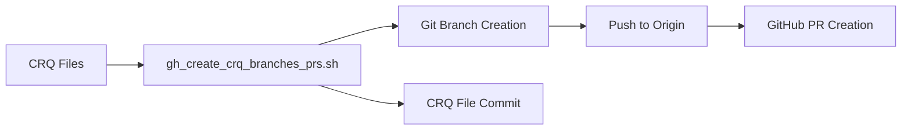

### **User description**
# CRQ-021-Add_CRQ_Branch_PR_Script.md

## Change Request: Add Script for CRQ-Driven Branch and PR Creation

### Objective

To introduce a new shell script (`gh_create_crq_branches_prs.sh`) that automates the process of creating Git branches and Pull Requests (PRs) based on Change Request Quality (CRQ) documents, adhering to the one-to-one CRQ-to-branch-to-PR mapping philosophy.

### Description

This CRQ covers the addition of the `gh_create_crq_branches_prs.sh` script to the `tools/gh_scripts/` directory. This script is designed to:

*   Identify CRQ files within the `docs/crq/` directory.
*   For each CRQ, create a new Git branch (e.g., `feature/crq-XXX-description`) from the `main` branch.
*   Commit the respective CRQ file to this new branch (if not already committed).
*   Push the newly created branch to the `origin` remote.
*   Create a Pull Request from the new branch to `main`, using the CRQ file's content as the PR title and body.
*   Handle idempotency by checking for existing local branches, remote branches, and open PRs.

This script significantly streamlines the workflow for implementing the "One-to-One Mapping of CRQ to Branch and Pull Request" philosophy (as defined in `CRQ-019-One_to_One_CRQ_Branch_PR.md`).

### Expected Outcome

*   Automated creation of branches and PRs for CRQs.
*   Consistent adherence to the CRQ-driven development workflow.
*   Reduced manual effort in setting up new development tasks.

### Justification/Benefit

*   **Automation:** Eliminates repetitive manual steps for branch and PR creation.
*   **Consistency:** Ensures all branches and PRs follow the defined CRQ-driven naming and linking conventions.
*   **Efficiency:** Speeds up the initiation of new development tasks.
*   **Enforcement:** Helps enforce the project's development philosophy.

### Dependencies

*   GitHub CLI (`gh`) installed and authenticated.
*   `jq` installed.
*   Adherence to CRQ filename conventions (`CRQ-XXX-Description.md`).

___

### **PR Type**
Enhancement

___

### **Description**
- Add automation script for CRQ-driven branch/PR creation

- Implement idempotent workflow with existence checks

- Support GitHub CLI integration for PR management

- Include CRQ documentation for new automation tool

___

### Diagram Walkthrough

 
<h3> File Walkthrough</h3>

<table><thead><tr><th></th><th align="left">Relevant files</th></tr></thead><tbody><tr><td><strong>Enhancement</strong></td><td><table>
<tr>
  <td>
    

      
<strong>gh_create_crq_branches_prs.sh</strong><dd><code>CRQ automation script implementation</code>&nbsp; &nbsp; &nbsp; &nbsp; &nbsp; &nbsp; &nbsp; &nbsp; &nbsp; &nbsp; &nbsp; &nbsp; &nbsp; &nbsp; &nbsp; &nbsp; &nbsp; &nbsp; &nbsp; &nbsp; &nbsp; </dd>

tools/gh_scripts/gh_create_crq_branches_prs.sh

<ul><li>Add shell script for automated CRQ branch/PR creation  <li> Implement idempotent checks for existing branches and PRs  <li> Include GitHub CLI integration for PR management  <li> Add error handling and validation for dependencies</ul>

  </td>
  <td><a href="https://github.com/meta-introspector/git-submodules-rs-nix/pull/1/files#diff-fb696df3b164dbf27d0675f9ebdc9ca92581470d9196df21253e038c20ee71e0">+109/-0</a>&nbsp; </td>

</tr>
</table></td></tr><tr><td><strong>Documentation</strong></td><td><table>
<tr>
  <td>
    

      
<strong>CRQ-021-Add_CRQ_Branch_PR_Script.md</strong><dd><code>CRQ documentation for automation script</code>&nbsp; &nbsp; &nbsp; &nbsp; &nbsp; &nbsp; &nbsp; &nbsp; &nbsp; &nbsp; &nbsp; &nbsp; &nbsp; &nbsp; &nbsp; &nbsp; &nbsp; &nbsp; </dd>

docs/crq/CRQ-021-Add_CRQ_Branch_PR_Script.md

<ul><li>Add CRQ documentation for new automation script  <li> Define objectives and expected outcomes  <li> Specify dependencies and benefits  <li> Document CRQ-driven development workflow enhancement</ul>

  </td>
  <td><a href="https://github.com/meta-introspector/git-submodules-rs-nix/pull/1/files#diff-58723e35b91647392aea5bac0dec9dc6599aea454944b4f9d72c5541b84d09e0">+39/-0</a>&nbsp; &nbsp; </td>

</tr>
</table></td></tr></tr></tbody></table>

___
