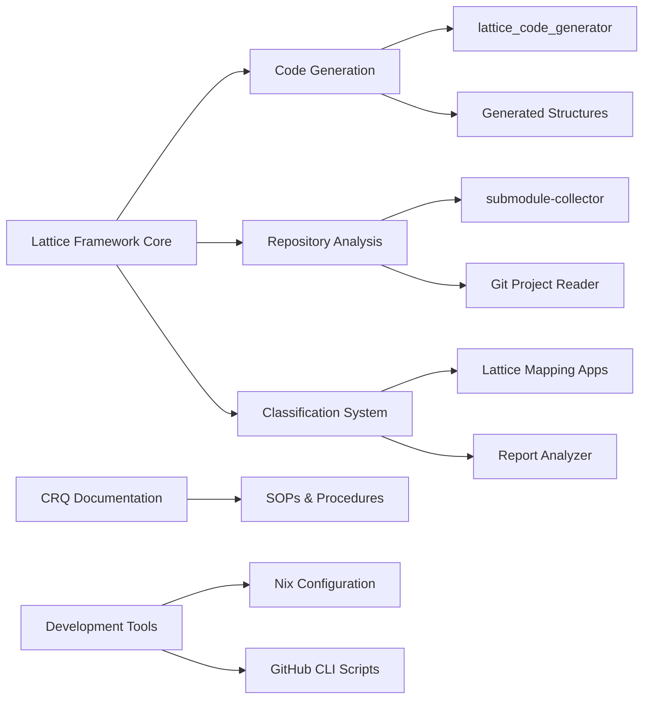

### **User description**
# CRQ-024-New_SOPs_for_CRQ_Driven_Development.md

## Change Request: New SOPs for CRQ-Driven Development

### Objective

To introduce two new Standard Operating Procedures (SOPs) that provide practical guidance for implementing the "Bootstrap CRQ Hypothesis" and for systematically refactoring code using CRQ-driven branches.

### Description

This CRQ covers the addition of the following two SOP documents to the `docs/sops/` directory:

1.  **`SOP_Bootstrap_CRQ_Hypothesis_Implementation.md`:** This SOP outlines the practical steps and principles for implementing the "Bootstrap CRQ Hypothesis" (`CRQ-022`). It details how every change should be a CRQ, the importance of CRQ-driven branching, incremental system construction, living documentation, and the criteria for 100% readiness for merge.

2.  **`SOP_Refactoring_with_CRQ_Branches.md`:** This SOP provides a systematic approach for refactoring existing code. It guides on identifying refactoring CRQs, creating dedicated branches for them, making safe and incremental changes, ensuring 100% readiness for merge, and leveraging automation support.

These SOPs are crucial for translating the philosophical concepts of CRQ-driven development into actionable practices, ensuring consistency and quality across the project.

### Expected Outcome

*   Clear, actionable guidelines for implementing the Bootstrap CRQ Hypothesis.
*   A standardized process for refactoring code into CRQ-driven branches.
*   Improved adherence to the project's development philosophy.

### Justification/Benefit

*   **Practical Guidance:** Provides concrete steps for developers to follow.
*   **Consistency:** Ensures a uniform approach to development and refactoring.
*   **Quality Assurance:** Supports the creation of high-quality, well-documented code.
*   **Training Aid:** Serves as a valuable resource for onboarding new team members to the project's development methodology.

### Dependencies

*   Understanding of `CRQ-022-Bootstrap_CRQ_Hypothesis.md`.
*   Team commitment to adopting these new procedures.

___

### **PR Type**
Enhancement, Documentation

___

### **Description**
• **Major lattice framework implementation**: Added comprehensive lattice-based code generation and classification system with multiple applications demonstrating the "Lattice Idea Framework"
• **New Rust applications and libraries**: Implemented `submodule-collector`, `project_file_lattice_builder`, `lattice_code_generator`, and various lattice mapping/classification tools
• **Git repository analysis tools**: Added Git project reader library, submodule collection utilities, and comprehensive repository analysis capabilities
• **Report analysis system**: Created `report-analyzer-rs` with string analysis, organization extraction, duplicate detection, and emoji ontology support
• **Generated lattice structures**: Auto-generated lattice code including ValueType enums, Instance structs, and LatticeLayer implementations
• **Development tooling enhancements**: Updated Nix flake with new packages, added valgrind support, and comprehensive testing infrastructure
• **Documentation expansion**: Added extensive CRQ documents, SOPs for CRQ-driven development, and lattice framework methodology guides
• **GitHub CLI integration**: Created utility scripts for workflow management, issue handling, and PR operations
• **Comprehensive submodule mapping**: Generated detailed JSON reports documenting entire project ecosystem and dependencies

___

### Diagram Walkthrough

 
<h3> File Walkthrough</h3>

<table><thead><tr><th></th><th align="left">Relevant files</th></tr></thead><tbody><tr><td><strong>Configuration changes</strong></td><td>

3 files
<table>
<tr>
  <td>
    

      
<strong>flake.nix</strong><dd><code>Enhanced Nix flake with new package and development tools</code></dd>

flake.nix

• Removed empty line at the beginning of the file  • Added new  <code>submodule-collector</code> package derivation with Rust build configuration  •  Added development tools including <code>jq</code>, <code>valgrind</code>, and various Emacs  packages  • Added shell formatting tools like <code>shellcheck</code>, <code>shfmt</code>, and  <code>nixpkgs-fmt</code>

  </td>
  <td><a href="https://github.com/meta-introspector/git-submodules-rs-nix/pull/3/files#diff-206b9ce276ab5971a2489d75eb1b12999d4bf3843b7988cbe8d687cfde61dea0">+34/-1</a>&nbsp; &nbsp; </td>

</tr>

<tr>
  <td>
    

      
<strong>shell.nix</strong><dd><code>Added valgrind to development shell dependencies</code>&nbsp; &nbsp; &nbsp; &nbsp; &nbsp; &nbsp; &nbsp; &nbsp; &nbsp; </dd>

shell.nix

• Added `pkgs.valgrind` to the buildInputs for the development shell

  </td>
  <td><a href="https://github.com/meta-introspector/git-submodules-rs-nix/pull/3/files#diff-e53dfbfffe62ae3c0b411b3938ccffa9fb6a2ecc565f55785ef8daa756631a6b">+1/-1</a>&nbsp; &nbsp; &nbsp; </td>

</tr>

<tr>
  <td>
    

      
<strong>boot.sh</strong><dd><code>Boot script for session recording and crash recovery</code>&nbsp; &nbsp; &nbsp; &nbsp; &nbsp; </dd>

boot.sh

• Shell script for orchestrating tmux session recording with asciinema   • Configures session management and logging directory setup  • Includes  crash recovery checks with git status and diff operations  • Integrates  log processor execution for session analysis

  </td>
  <td><a href="https://github.com/meta-introspector/git-submodules-rs-nix/pull/3/files#diff-c270322e6f914001c9d1d23e01d1eefe9469337f284b0c0a920c5f843a15b373">+38/-0</a>&nbsp; &nbsp; </td>

</tr>
</table>
</td></tr><tr><td><strong>Enhancement</strong></td><td>

33 files
<table>
<tr>
  <td>
    

      
<strong>lib.rs</strong><dd><code>New lattice code generation library implementation</code>&nbsp; &nbsp; &nbsp; &nbsp; &nbsp; &nbsp; &nbsp; </dd>

lattice_code_generator/src/lib.rs

• New library providing code generation utilities for the Lattice Idea  Framework  • Implements functions to generate Rust code for <code>ValueType</code>  enum, traits, and structs  • Uses <code>proc_macro2</code> and <code>quote</code> for  programmatic Rust code generation  • Includes comprehensive tests for  the generated code validation

  </td>
  <td><a href="https://github.com/meta-introspector/git-submodules-rs-nix/pull/3/files#diff-243854d89636db85a935fa955ee16fa44ea3ca7092902bc29701c3a825b0ba0a">+296/-0</a>&nbsp; </td>

</tr>

<tr>
  <td>
    

      
<strong>main.rs</strong><dd><code>New Git submodule collection and analysis tool</code>&nbsp; &nbsp; &nbsp; &nbsp; &nbsp; &nbsp; &nbsp; &nbsp; &nbsp; &nbsp; &nbsp; </dd>

submodule-collector/src/main.rs

• New command-line tool for scanning Git repositories and their  submodules  • Recursively processes nested submodules and collects  detailed information  • Outputs comprehensive JSON reports with  repository and submodule data  • Includes error handling and resilient  processing of failed repositories

  </td>
  <td><a href="https://github.com/meta-introspector/git-submodules-rs-nix/pull/3/files#diff-a47f0db0f72bdfe38e4c5fc28fcb76ddd4adc991f2b12a672f14f8348411c83a">+279/-0</a>&nbsp; </td>

</tr>

<tr>
  <td>
    

      
<strong>main.rs</strong><dd><code>New project file lattice construction application</code>&nbsp; &nbsp; &nbsp; &nbsp; &nbsp; &nbsp; &nbsp; &nbsp; </dd>

project_file_lattice_builder/src/main.rs

• New application that constructs a conceptual lattice of project  files  • Implements file classification using word predicates and  lattice hierarchy  • Scans project directories and maps files into  lattice structure  • Demonstrates the Lattice Idea Framework applied to  file organization

  </td>
  <td><a href="https://github.com/meta-introspector/git-submodules-rs-nix/pull/3/files#diff-307096deb9eb86f24a90391b001a081a638672a52f8c27651d21c72bcfdcd2a1">+202/-0</a>&nbsp; </td>

</tr>

<tr>
  <td>
    

      
<strong>lattice_mapper_app.rs</strong><dd><code>New lattice mapping application for code classification</code>&nbsp; &nbsp; </dd>

src/lattice_mapper_app.rs

• New application demonstrating code mapping into pre-generated  lattice structures  • Implements similarity-based classification using  predicate matching  • Bridges lattice structure generation with  repository search functionality  • Shows conceptual "generate and then  match" process for code organization

  </td>
  <td><a href="https://github.com/meta-introspector/git-submodules-rs-nix/pull/3/files#diff-d4b10dc90da2ebd2e54c216c08faf398915f797cc4bf2e94185cd40832762c62">+209/-0</a>&nbsp; </td>

</tr>

<tr>
  <td>
    

      
<strong>lattice_types.rs</strong><dd><code>Core lattice type definitions and framework implementation</code></dd>

src/lattice_types.rs

• New module defining conceptual lattice types in Rust  • Implements  <code>ValueType</code> enum, traits, and generic structs for lattice framework  •  Provides foundation types for different value types and complexity  layers  • Includes demonstration of lattice model usage with concrete  examples

  </td>
  <td><a href="https://github.com/meta-introspector/git-submodules-rs-nix/pull/3/files#diff-b4cbc31fe99d9b693a12612fdfbcbb6a05afbab7836ee96ef34759a80eea2dfc">+196/-0</a>&nbsp; </td>

</tr>

<tr>
  <td>
    

      
<strong>repo_search_simulator.rs</strong><dd><code>Repository search simulation with lattice classification</code>&nbsp; </dd>

src/repo_search_simulator.rs

• New application simulating search by example across mock  repositories  • Implements predicate-based classification for finding  similar programs  • Demonstrates lattice framework application to large  codebase analysis  • Includes similarity scoring and repository  comparison functionality

  </td>
  <td><a href="https://github.com/meta-introspector/git-submodules-rs-nix/pull/3/files#diff-0fd44409289d811f50e94913ae801d7ed5c483e8798303c297ac9854807cfe41">+202/-0</a>&nbsp; </td>

</tr>

<tr>
  <td>
    

      
<strong>meta_lattice_model.rs</strong><dd><code>Self-referential meta-model of the lattice framework</code>&nbsp; &nbsp; &nbsp; &nbsp; &nbsp; </dd>

src/meta_lattice_model.rs

• New meta-model program that models the lattice idea framework itself   • Implements self-referential analysis and conceptual model comparison   • Demonstrates the framework's capacity for meta-modeling and  self-analysis  • Shows how the model can analyze its own structure and  find similar models

  </td>
  <td><a href="https://github.com/meta-introspector/git-submodules-rs-nix/pull/3/files#diff-4ad95f3ed0d6e795cabcf8199fb28fa159aef84b4f32e578f55079fa94e07625">+153/-0</a>&nbsp; </td>

</tr>

<tr>
  <td>
    

      
<strong>analyze_strings.rs</strong><dd><code>String analysis module for repository report processing</code>&nbsp; &nbsp; </dd>

report-analyzer-rs/src/analyze_strings.rs

• New string analysis module for processing repository reports  •  Implements token collection, frequency counting, and n-gram generation   • Provides iterative analysis with emoji ontology application  •  Includes suggested rule generation based on analysis results

  </td>
  <td><a href="https://github.com/meta-introspector/git-submodules-rs-nix/pull/3/files#diff-2972c1dbf1387f1fc356a8a7315beb271dcacb9eb512719d2ac60d15084a7c1a">+171/-0</a>&nbsp; </td>

</tr>

<tr>
  <td>
    

      
<strong>lattice_classifier_app.rs</strong><dd><code>Lattice-based text classification demonstration application</code></dd>

src/lattice_classifier_app.rs

• New application demonstrating lattice-based text classification  •  Implements predicate-based classification using generated lattice  structures  • Shows search by example functionality for text snippets  •  Provides conceptual framework for classifying complex items using  predicates

  </td>
  <td><a href="https://github.com/meta-introspector/git-submodules-rs-nix/pull/3/files#diff-2046e6cf0881f2c6f04e40c623dbf7b071fa54d0b330bd758caea2f306c79f59">+188/-0</a>&nbsp; </td>

</tr>

<tr>
  <td>
    

      
<strong>lib.rs</strong><dd><code>Git project information reading library implementation</code>&nbsp; &nbsp; &nbsp; </dd>

git_project_reader/src/lib.rs

• New library for reading Git project information including tracked  files  • Implements functions to collect git status and repository  metadata  • Provides comprehensive error handling and cross-platform  compatibility  • Includes extensive test suite for Git operations  validation

  </td>
  <td><a href="https://github.com/meta-introspector/git-submodules-rs-nix/pull/3/files#diff-258b44c334cd672e0393e8cad155edd07074a84e46a6c7389d9d227e07b3e1d8">+174/-0</a>&nbsp; </td>

</tr>

<tr>
  <td>
    

      
<strong>grand_unified_search.rs</strong><dd><code>Grand unified search system conceptual implementation</code>&nbsp; &nbsp; &nbsp; &nbsp; </dd>

src/grand_unified_search.rs

• New conceptual outline for a grand unified search system  •  Demonstrates self-parsing, similarity search, and LLM interaction  concepts  • Shows integration of lattice framework with code analysis  and search  • Provides placeholder implementations for complex  functionality

  </td>
  <td><a href="https://github.com/meta-introspector/git-submodules-rs-nix/pull/3/files#diff-b8a48c02f53b75052bc23d20df7488207a5b86d7815d3fb29ef0b8b985553ab1">+148/-0</a>&nbsp; </td>

</tr>

<tr>
  <td>
    

      
<strong>lattice_model.rs</strong><dd><code>Core lattice model structures and classification utilities</code></dd>

src/lattice_model.rs

• New core lattice model definitions with <code>ValueType</code> enum and traits  •  Implements generic <code>Instance</code> and <code>LatticeLayer</code> structures  • Provides  <code>PredicateClassifier</code> for text analysis and predicate extraction  • Forms  the foundation for lattice-based classification systems

  </td>
  <td><a href="https://github.com/meta-introspector/git-submodules-rs-nix/pull/3/files#diff-780a4d5fb95789264d299113f8c45e066dafc4aa039180f7494020e35c5246b6">+136/-0</a>&nbsp; </td>

</tr>

<tr>
  <td>
    

      
<strong>word_predicate_analyzer.rs</strong><dd><code>Word predicate analysis using lattice type definitions</code>&nbsp; &nbsp; &nbsp; </dd>

src/word_predicate_analyzer.rs

• New analyzer for converting text to word predicates using lattice  types  • Implements n-gram generation and analysis on predicate  representations  • Demonstrates vocabulary-based text analysis within  lattice framework  • Shows practical application of word-as-predicate  concept

  </td>
  <td><a href="https://github.com/meta-introspector/git-submodules-rs-nix/pull/3/files#diff-8b1a5639c122dab7e9c36fd0dac9ffa1dd9fbbbb4fb5d68eca6be406d0f63e83">+95/-0</a>&nbsp; &nbsp; </td>

</tr>

<tr>
  <td>
    

      
<strong>main.rs</strong><dd><code>Lattice structure generation application for code organization</code></dd>

lattice_structure_generator/src/main.rs

• New application for generating structured lattice directory  hierarchies  • Creates organized file structure based on lattice  generation parameters  • Generates code files for different lattice  layers and instances  • Provides conceptual mapping framework for  existing code organization

  </td>
  <td><a href="https://github.com/meta-introspector/git-submodules-rs-nix/pull/3/files#diff-0503dd508e5c7168f8b6b74fb16594f291c5cead8790bfaec55d85ac576166f2">+82/-0</a>&nbsp; &nbsp; </td>

</tr>

<tr>
  <td>
    

      
<strong>lib.rs</strong><dd><code>Added ZOS lattice construction functionality to main library</code></dd>

src/lib.rs

• Added new <code>build_zos_lattice</code> function for constructing project  lattices  • Integrates lattice model for file classification and  organization  • Implements predicate-based file analysis using global  predicates  • Provides structured approach to project file lattice  construction

  </td>
  <td><a href="https://github.com/meta-introspector/git-submodules-rs-nix/pull/3/files#diff-b1a35a68f14e696205874893c07fd24fdb88882b47c23cc0e0c80a30c7d53759">+78/-0</a>&nbsp; &nbsp; </td>

</tr>

<tr>
  <td>
    

      
<strong>main.rs</strong><dd><code>Lattice code generation application using code generator library</code></dd>

lattice_generator_app/src/main.rs

• New application for generating lattice code structures  • Uses  <code>lattice_code_generator</code> to create various lattice components  • Writes  generated code to organized output directory structure  • Provides  automated code generation for lattice framework implementation

  </td>
  <td><a href="https://github.com/meta-introspector/git-submodules-rs-nix/pull/3/files#diff-ba3c74e9dedda9c826a5198e4fb1879be1cc3251ad2be3b8bd4cef25d22bf646">+56/-0</a>&nbsp; &nbsp; </td>

</tr>

<tr>
  <td>
    

      
<strong>program_self_description.rs</strong><dd><code>Self-describing program with similarity search demonstration</code></dd>

src/program_self_description.rs

• New program demonstrating self-description and similar program  search concepts  • Implements predicate-based self-analysis and program  comparison  • Shows meta-assertion capabilities within the theoretical  framework  • Demonstrates self-referential capacity of the lattice  model

  </td>
  <td><a href="https://github.com/meta-introspector/git-submodules-rs-nix/pull/3/files#diff-386ecf0f7a94fde9c182bd08fe96599c8620c47e849ed27d5ffd2d799bf30060">+37/-0</a>&nbsp; &nbsp; </td>

</tr>

<tr>
  <td>
    

      
<strong>main.rs</strong><dd><code>New main entry point for report analyzer with CLI interface</code></dd>

report-analyzer-rs/src/main.rs

• Added new main.rs file for report-analyzer-rs with command-line  argument parsing using clap  • Implements basic report analysis  functionality with file reading and JSON parsing  • Includes  commented-out calls to missing analysis functions and active call to  analyze_strings module  • Uses Args::parse() for CLI argument handling  and includes error handling for file operations

  </td>
  <td><a href="https://github.com/meta-introspector/git-submodules-rs-nix/pull/3/files#diff-0c621fee3c56e03aa11c26e9371c0d100ee91ec12c43746c6cf2eb8f687bdeac">+50/-0</a>&nbsp; &nbsp; </td>

</tr>

<tr>
  <td>
    

      
<strong>lcp.rs</strong><dd><code>LCP analysis module for finding common path prefixes</code>&nbsp; &nbsp; &nbsp; &nbsp; &nbsp; </dd>

report-analyzer-rs/src/lcp.rs

• Implements longest common prefix (LCP) analysis functionality  •  Provides find_longest_common_prefix function for string arrays  •  Includes perform_lcp_analysis to extract paths and URLs from report  data  • Contains print_lcp_analysis function for formatted output  display

  </td>
  <td><a href="https://github.com/meta-introspector/git-submodules-rs-nix/pull/3/files#diff-b21ab373ab1b39d083a90c0171119e10f283f4af3edb4ab1148d439b9eda1101">+51/-0</a>&nbsp; &nbsp; </td>

</tr>

<tr>
  <td>
    

      
<strong>types.rs</strong><dd><code>Core type definitions for report analysis structures</code>&nbsp; &nbsp; &nbsp; &nbsp; &nbsp; </dd>

report-analyzer-rs/src/types.rs

• Defines core data structures for report analysis including  SubmoduleInfo, RepoInfo, FailedRepoInfo  • Implements Args struct with  clap Parser derive for command-line argument handling  • Includes  Ontology struct for emoji mapping functionality  • Uses serde for JSON  serialization/deserialization of report structures

  </td>
  <td><a href="https://github.com/meta-introspector/git-submodules-rs-nix/pull/3/files#diff-70a32aaec9d7a33bba7859aaec9a648355cf4a92b9a1c688430f60fd0b1ad036">+47/-0</a>&nbsp; &nbsp; </td>

</tr>

<tr>
  <td>
    

      
<strong>analyze_names.rs</strong><dd><code>Repository name analysis with frequency counting</code>&nbsp; &nbsp; &nbsp; &nbsp; &nbsp; &nbsp; &nbsp; &nbsp; &nbsp; </dd>

report-analyzer-rs/src/analyze_names.rs

• Implements name analysis functionality for extracting repository  names from URLs  • Uses regex to parse GitHub URLs and extract  repository names  • Processes both main repositories and nested  submodule repositories  • Returns HashMap with name frequency counts  for analysis

  </td>
  <td><a href="https://github.com/meta-introspector/git-submodules-rs-nix/pull/3/files#diff-ece2606d6df195d4968ecc9276f8faa6fb13f2dfbd036a099bdef2995f9eac1d">+30/-0</a>&nbsp; &nbsp; </td>

</tr>

<tr>
  <td>
    

      
<strong>analyze_orgs.rs</strong><dd><code>GitHub organization analysis with URL parsing</code>&nbsp; &nbsp; &nbsp; &nbsp; &nbsp; &nbsp; &nbsp; &nbsp; &nbsp; &nbsp; &nbsp; &nbsp; </dd>

report-analyzer-rs/src/analyze_orgs.rs

• Implements organization analysis by extracting GitHub organization  names from URLs  • Uses regex pattern matching to identify organization  names from repository URLs  • Processes both successful repositories  and failed repository error messages  • Returns frequency count HashMap  for organization analysis

  </td>
  <td><a href="https://github.com/meta-introspector/git-submodules-rs-nix/pull/3/files#diff-dfc5e43d786c558598103c88d48bb1cfc40e246b3ba904ae455a340f1c5d7e0a">+26/-0</a>&nbsp; &nbsp; </td>

</tr>

<tr>
  <td>
    

      
<strong>duplicates.rs</strong><dd><code>Duplicate repository URL detection and analysis</code>&nbsp; &nbsp; &nbsp; &nbsp; &nbsp; &nbsp; &nbsp; &nbsp; &nbsp; &nbsp; </dd>

report-analyzer-rs/src/duplicates.rs

• Implements duplicate URL detection and reporting functionality  •  Provides print_duplicate_urls function for formatted output display  •  Includes analyze_duplicate_urls function to identify repositories with  same URLs  • Uses HashMap to track URL-to-path mappings for duplicate  detection

  </td>
  <td><a href="https://github.com/meta-introspector/git-submodules-rs-nix/pull/3/files#diff-4d80fd66c8b316d5012d6352dd781de56fe14903a0f5394e6ce2fa81ee99e035">+25/-0</a>&nbsp; &nbsp; </td>

</tr>

<tr>
  <td>
    

      
<strong>input.rs</strong><dd><code>Input handling for CLI arguments and data loading</code>&nbsp; &nbsp; &nbsp; &nbsp; &nbsp; &nbsp; &nbsp; &nbsp; </dd>

report-analyzer-rs/src/input.rs

• Provides input handling functions for command-line arguments and  data loading  • Implements parse_args function using clap Parser for  Args struct  • Includes load_data function for reading report and  ontology JSON files  • Contains error handling for file operations and  JSON parsing

  </td>
  <td><a href="https://github.com/meta-introspector/git-submodules-rs-nix/pull/3/files#diff-e9ea32f3583a31e364d9ff7d6c37296c5c56f4c8fe8b359a4693368182e54e3b">+22/-0</a>&nbsp; &nbsp; </td>

</tr>

<tr>
  <td>
    

      
<strong>apply_emojis.rs</strong><dd><code>Emoji ontology text transformation functionality</code>&nbsp; &nbsp; &nbsp; &nbsp; &nbsp; &nbsp; &nbsp; &nbsp; &nbsp; </dd>

report-analyzer-rs/src/apply_emojis.rs

• Implements emoji ontology application for text transformation  •  Provides apply_emoji_ontology function to replace text with emoji  mappings  • Uses sorted key approach for longest-match-first  replacement strategy  • Handles optional ontology parameter with  fallback to original text

  </td>
  <td><a href="https://github.com/meta-introspector/git-submodules-rs-nix/pull/3/files#diff-b046d9b03ffcc74bc7362f658297d45a8141ccff9481915e5a8348b7f49a2297">+18/-0</a>&nbsp; &nbsp; </td>

</tr>

<tr>
  <td>
    

      
<strong>names_analysis.rs</strong><dd><code>Formatted name analysis output with emoji support</code>&nbsp; &nbsp; &nbsp; &nbsp; &nbsp; &nbsp; &nbsp; &nbsp; </dd>

report-analyzer-rs/src/names_analysis.rs

• Implements formatted output for repository/submodule name analysis  •  Provides print_names_analysis function with emoji ontology integration   • Sorts name counts by frequency and displays top 10 results  • Handles  empty results case with appropriate messaging

  </td>
  <td><a href="https://github.com/meta-introspector/git-submodules-rs-nix/pull/3/files#diff-300b8fb41eee786eabd0188c0030f81f88dfc1cee7f998e57e62b26ff2a14c37">+14/-0</a>&nbsp; &nbsp; </td>

</tr>

<tr>
  <td>
    

      
<strong>org_analysis.rs</strong><dd><code>Formatted organization analysis output with emoji integration</code></dd>

report-analyzer-rs/src/org_analysis.rs

• Implements formatted output for organization analysis results  •  Provides print_organizations_analysis function with emoji ontology  support  • Sorts organization counts by frequency and shows top 10  entries  • Includes handling for empty results with appropriate  messaging

  </td>
  <td><a href="https://github.com/meta-introspector/git-submodules-rs-nix/pull/3/files#diff-5bc7fdd91e1797253239ee186eacd73c931025fcd10b5880906a97a8400fbdcc">+13/-0</a>&nbsp; &nbsp; </td>

</tr>

<tr>
  <td>
    

      
<strong>gh_extract_actors.sh</strong><dd><code>GitHub actor extraction script with CLI integration</code>&nbsp; &nbsp; &nbsp; &nbsp; &nbsp; &nbsp; </dd>

tools/gh_scripts/gh_extract_actors.sh

• Script to extract unique actors from GitHub issues and comments  using gh CLI  • Uses jq for JSON parsing and filtering of author  information  • Processes both issue authors and comment authors for  comprehensive actor list  • Includes error handling and optional file  output functionality

  </td>
  <td><a href="https://github.com/meta-introspector/git-submodules-rs-nix/pull/3/files#diff-460ff5ab5242fc20792c70a204e82ad028e958e7a97a454d0146104b9c11c60d">+41/-0</a>&nbsp; &nbsp; </td>

</tr>

<tr>
  <td>
    

      
<strong>gh_workflows_view.sh</strong><dd><code>GitHub workflow run viewing utility script</code>&nbsp; &nbsp; &nbsp; &nbsp; &nbsp; &nbsp; &nbsp; &nbsp; &nbsp; &nbsp; &nbsp; &nbsp; &nbsp; &nbsp; &nbsp; </dd>

tools/gh_scripts/gh_workflows_view.sh

• Simple wrapper script for viewing GitHub Actions workflow run  details  • Validates required RUN_ID parameter with usage message  •  Passes all arguments to gh run view command  • Includes proper error  handling for missing parameters

  </td>
  <td><a href="https://github.com/meta-introspector/git-submodules-rs-nix/pull/3/files#diff-b0c94629d1fb360d50c2e90b6727366e24932da3280fe67fba264b2557c5813d">+7/-0</a>&nbsp; &nbsp; &nbsp; </td>

</tr>

<tr>
  <td>
    

      
<strong>gh_workflows_rerun.sh</strong><dd><code>GitHub workflow re-run utility script</code>&nbsp; &nbsp; &nbsp; &nbsp; &nbsp; &nbsp; &nbsp; &nbsp; &nbsp; &nbsp; &nbsp; &nbsp; &nbsp; &nbsp; &nbsp; &nbsp; &nbsp; &nbsp; &nbsp; &nbsp; </dd>

tools/gh_scripts/gh_workflows_rerun.sh

• Wrapper script for re-running GitHub Actions workflow runs  •  Validates required RUN_ID parameter with usage information  • Passes  arguments to gh run rerun command  • Includes parameter validation and  error messaging

  </td>
  <td><a href="https://github.com/meta-introspector/git-submodules-rs-nix/pull/3/files#diff-e0c1712ffe488bdadbc0d62c565cf16af06d40f4e687e0934dbed1d7bbbc5355">+7/-0</a>&nbsp; &nbsp; &nbsp; </td>

</tr>

<tr>
  <td>
    

      
<strong>gh_issues_view.sh</strong><dd><code>GitHub issue viewing utility script</code>&nbsp; &nbsp; &nbsp; &nbsp; &nbsp; &nbsp; &nbsp; &nbsp; &nbsp; &nbsp; &nbsp; &nbsp; &nbsp; &nbsp; &nbsp; &nbsp; &nbsp; &nbsp; &nbsp; &nbsp; &nbsp; &nbsp; </dd>

tools/gh_scripts/gh_issues_view.sh

• Script wrapper for viewing GitHub issue details using gh CLI  •  Validates required ISSUE_NUMBER parameter with usage message  • Passes  all arguments to gh issue view command  • Includes proper parameter  validation and error handling

  </td>
  <td><a href="https://github.com/meta-introspector/git-submodules-rs-nix/pull/3/files#diff-ceee01b16affa23014471597e8bfa4e7093a08cae0010e80d6e417f64eb4bd73">+7/-0</a>&nbsp; &nbsp; &nbsp; </td>

</tr>

<tr>
  <td>
    

      
<strong>gh_prs_view.sh</strong><dd><code>GitHub Pull Request viewing utility script</code>&nbsp; &nbsp; &nbsp; &nbsp; &nbsp; &nbsp; &nbsp; &nbsp; &nbsp; &nbsp; &nbsp; &nbsp; &nbsp; &nbsp; &nbsp; </dd>

tools/gh_scripts/gh_prs_view.sh

• Wrapper script for viewing GitHub Pull Request details  • Validates  required PR_NUMBER parameter with usage information  • Passes all  arguments to gh pr view command  • Includes parameter validation and  error messaging

  </td>
  <td><a href="https://github.com/meta-introspector/git-submodules-rs-nix/pull/3/files#diff-ab1b2cdb0af702cfdded4516d0729e6dfd7e8344593d60c4f8e18391e97ad237">+7/-0</a>&nbsp; &nbsp; &nbsp; </td>

</tr>

<tr>
  <td>
    

      
<strong>gh_prs_checkout.sh</strong><dd><code>GitHub Pull Request checkout utility script</code>&nbsp; &nbsp; &nbsp; &nbsp; &nbsp; &nbsp; &nbsp; &nbsp; &nbsp; &nbsp; &nbsp; &nbsp; &nbsp; &nbsp; </dd>

tools/gh_scripts/gh_prs_checkout.sh

• Script for checking out GitHub Pull Requests locally using gh CLI  •  Validates required PR_NUMBER parameter with usage message  • Passes  arguments to gh pr checkout command  • Includes proper parameter  validation and error handling

  </td>
  <td><a href="https://github.com/meta-introspector/git-submodules-rs-nix/pull/3/files#diff-d28d93bffaad9e849d93396c98a560026fe56ab83bb1b6970b7c861a88374ac8">+7/-0</a>&nbsp; &nbsp; &nbsp; </td>

</tr>
</table>
</td></tr><tr><td><strong>Tests</strong></td><td>

5 files
<table>
<tr>
  <td>
    

      
<strong>git-config-parser.rs</strong><dd><code>Added comprehensive tests for Git configuration parser</code>&nbsp; &nbsp; &nbsp; </dd>

src/bin/git-config-parser.rs

• Added comprehensive test suite for Git configuration parsing  functions  • Tests cover empty configs, multiple sections, comments,  and submodule parsing  • Validates parsing of <code>.gitmodules</code> files with  various configurations  • Ensures robust handling of different Git  configuration formats

  </td>
  <td><a href="https://github.com/meta-introspector/git-submodules-rs-nix/pull/3/files#diff-c6637247fafdce9d1d89c2b644040bf28a6f3f2adac43f626011adbf1cb6a975">+131/-1</a>&nbsp; </td>

</tr>

<tr>
  <td>
    

      
<strong>my_profiling_bench.rs</strong><dd><code>Performance benchmarking setup with iai_callgrind integration</code></dd>

benches/my_profiling_bench.rs

• Added new benchmarking file using iai_callgrind for performance  profiling  • Includes benchmark functions for add operation and git  config parsing  • Uses library_benchmark macros and creates dummy  function for demonstration  • Sets up benchmark group and main entry  point for profiling execution

  </td>
  <td><a href="https://github.com/meta-introspector/git-submodules-rs-nix/pull/3/files#diff-ba6682e5e5c2b85faec0653350824785fbc61e8b011444d3fc293fc73a8eff5f">+36/-0</a>&nbsp; &nbsp; </td>

</tr>

<tr>
  <td>
    

      
<strong>main_execution_test.rs</strong><dd><code>Integration test for project file lattice builder execution</code></dd>

project_file_lattice_builder/tests/main_execution_test.rs

• Added integration test for project_file_lattice_builder binary  execution  • Verifies binary exists and executes successfully with  expected output  • Checks for specific output strings to validate  proper execution  • Uses CARGO_BIN_EXE environment variable for binary  path resolution

  </td>
  <td><a href="https://github.com/meta-introspector/git-submodules-rs-nix/pull/3/files#diff-5a0c5a5a81a37ae68fa3cf8f8eec11ab88deb61bcb9ceaa24ba914cb69b8d915">+23/-0</a>&nbsp; &nbsp; </td>

</tr>

<tr>
  <td>
    

      
<strong>main_execution_test.rs</strong><dd><code>Integration test for submodule collector help functionality</code></dd>

submodule-collector/tests/main_execution_test.rs

• Added integration test for submodule-collector binary with --help  flag  • Verifies binary existence and successful execution with help  output  • Validates expected help message content in stdout  • Uses  proper error handling and output validation

  </td>
  <td><a href="https://github.com/meta-introspector/git-submodules-rs-nix/pull/3/files#diff-f0ca198a718b31ebcb98cfb1b258adf263175cf536d8c8883def9223df093fdb">+24/-0</a>&nbsp; &nbsp; </td>

</tr>

<tr>
  <td>
    

      
<strong>main.rs</strong><dd><code>Git repository testing utility with git2 integration</code>&nbsp; &nbsp; &nbsp; &nbsp; &nbsp; </dd>

git_test_repo/src/main.rs

• Simple Git repository testing application using git2 crate  • Opens  current directory as Git repository and validates operation  • Includes  basic error handling for Git operations  • Provides debug output for  repository path information

  </td>
  <td><a href="https://github.com/meta-introspector/git-submodules-rs-nix/pull/3/files#diff-8b9cadcb87746c34dbbc19f46f1ef3a55b401e70c5dba9cf5f2af4f9877fa594">+10/-0</a>&nbsp; &nbsp; </td>

</tr>
</table>
</td></tr><tr><td><strong>Miscellaneous</strong></td><td>

16 files
<table>
<tr>
  <td>
    

      
<strong>value_type.rs</strong><dd><code>Generated ValueType enum for lattice structure</code>&nbsp; &nbsp; &nbsp; &nbsp; &nbsp; &nbsp; &nbsp; &nbsp; &nbsp; &nbsp; &nbsp; </dd>

generated_lattice_code/value_type.rs

• Single-line generated code file containing ValueType enum definition   • Includes variants for different prime-based value types (Bit,  ThreeValue, etc.)  • Contains implementation with count method and  zos_sequence function  • Appears to be auto-generated lattice structure  code

  </td>
  <td><a href="https://github.com/meta-introspector/git-submodules-rs-nix/pull/3/files#diff-4534ce506bbc5e0a512da2a9f61948dc44575940029777e3be9fa6f1ce706735">+1/-0</a>&nbsp; &nbsp; &nbsp; </td>

</tr>

<tr>
  <td>
    

      
<strong>value_type.rs</strong><dd><code>Duplicate generated ValueType enum structure</code>&nbsp; &nbsp; &nbsp; &nbsp; &nbsp; &nbsp; &nbsp; &nbsp; &nbsp; &nbsp; &nbsp; &nbsp; &nbsp; </dd>

generated_lattice_structure/value_type.rs

• Duplicate of generated_lattice_code/value_type.rs with identical  content  • Single-line generated ValueType enum with prime-based  variants  • Contains same implementation methods for count and  zos_sequence  • Part of generated lattice structure codebase

  </td>
  <td><a href="https://github.com/meta-introspector/git-submodules-rs-nix/pull/3/files#diff-0e397496f4650bd5f8a1aaa402b4f095cc1ebfec730fb80a60040684b1e76798">+1/-0</a>&nbsp; &nbsp; &nbsp; </td>

</tr>

<tr>
  <td>
    

      
<strong>lattice_struct.rs</strong><dd><code>Generated Lattice struct with trait-based layer system</code>&nbsp; &nbsp; &nbsp; </dd>

generated_lattice_code/lattice_struct.rs

• Single-line generated code defining Lattice struct with trait system   • Includes LatticeLayerTrait for polymorphic layer handling  • Contains  methods for adding layers and describing lattice structure  • Part of  auto-generated lattice framework code

  </td>
  <td><a href="https://github.com/meta-introspector/git-submodules-rs-nix/pull/3/files#diff-79d9dfa1f549d761bf956b17120979d037243e9dc1f10ebb9402e5b62ff5cf46">+1/-0</a>&nbsp; &nbsp; &nbsp; </td>

</tr>

<tr>
  <td>
    

      
<strong>lattice_struct.rs</strong><dd><code>Duplicate generated Lattice struct definition</code>&nbsp; &nbsp; &nbsp; &nbsp; &nbsp; &nbsp; &nbsp; &nbsp; &nbsp; &nbsp; &nbsp; &nbsp; </dd>

generated_lattice_structure/lattice_struct.rs

• Identical copy of generated_lattice_code/lattice_struct.rs  •  Contains same Lattice struct definition and trait implementations  •  Includes layer management and description functionality  • Duplicate  generated lattice structure file

  </td>
  <td><a href="https://github.com/meta-introspector/git-submodules-rs-nix/pull/3/files#diff-d0b1a7887fc4298e093cd2bfb55016adcc95a93c94f2f6df94699f5fb9f43180">+1/-0</a>&nbsp; &nbsp; &nbsp; </td>

</tr>

<tr>
  <td>
    

      
<strong>instance_struct.rs</strong><dd><code>Generated Instance struct for lattice elements</code>&nbsp; &nbsp; &nbsp; &nbsp; &nbsp; &nbsp; &nbsp; &nbsp; &nbsp; &nbsp; &nbsp; </dd>

generated_lattice_code/instance_struct.rs

• Single-line generated Instance struct with generic type parameter  •  Includes fields for id, n_gram_size, and units vector  • Contains  constructor and describe methods for instance management  • Part of  generated lattice framework infrastructure

  </td>
  <td><a href="https://github.com/meta-introspector/git-submodules-rs-nix/pull/3/files#diff-d3a134be5da73893ad11cfba2741e995cb5385d116f305bb9f90ba03072271f8">+1/-0</a>&nbsp; &nbsp; &nbsp; </td>

</tr>

<tr>
  <td>
    

      
<strong>instance_struct.rs</strong><dd><code>Duplicate generated Instance struct definition</code>&nbsp; &nbsp; &nbsp; &nbsp; &nbsp; &nbsp; &nbsp; &nbsp; &nbsp; &nbsp; &nbsp; </dd>

generated_lattice_structure/instance_struct.rs

• Duplicate of generated_lattice_code/instance_struct.rs with  identical content  • Same Instance struct definition with generic type  support  • Contains identical constructor and describe method  implementations  • Part of duplicate generated structure codebase

  </td>
  <td><a href="https://github.com/meta-introspector/git-submodules-rs-nix/pull/3/files#diff-2a3695aa0e91eed81596edd58de20843bbebe8a9e7ddddae052cc7f695267747">+1/-0</a>&nbsp; &nbsp; &nbsp; </td>

</tr>

<tr>
  <td>
    

      
<strong>lattice_layer_struct.rs</strong><dd><code>Generated LatticeLayer struct for layer management</code>&nbsp; &nbsp; &nbsp; &nbsp; &nbsp; &nbsp; &nbsp; </dd>

generated_lattice_code/lattice_layer_struct.rs

• Single-line generated LatticeLayer struct with generic type  parameter  • Includes value_type field and instances vector for layer  management  • Contains methods for adding instances and describing  layer structure  • Part of generated lattice framework with type  validation

  </td>
  <td><a href="https://github.com/meta-introspector/git-submodules-rs-nix/pull/3/files#diff-0aacd04a7a621f806b54ffa94092f874682700841e03474720504945ec824126">+1/-0</a>&nbsp; &nbsp; &nbsp; </td>

</tr>

<tr>
  <td>
    

      
<strong>lattice_layer_struct.rs</strong><dd><code>Duplicate generated LatticeLayer struct definition</code>&nbsp; &nbsp; &nbsp; &nbsp; &nbsp; &nbsp; &nbsp; </dd>

generated_lattice_structure/lattice_layer_struct.rs

• Identical copy of generated_lattice_code/lattice_layer_struct.rs  •  Same LatticeLayer struct with generic type and validation  • Contains  identical instance management and description methods  • Duplicate  generated lattice layer structure

  </td>
  <td><a href="https://github.com/meta-introspector/git-submodules-rs-nix/pull/3/files#diff-8732c80f707e0ab6b869ea056076368c8830979c489e8c25c0b1d63a05affb3b">+1/-0</a>&nbsp; &nbsp; &nbsp; </td>

</tr>

<tr>
  <td>
    

      
<strong>instance_0.rs</strong><dd><code>Placeholder for k=2 layer instance 0 implementation</code>&nbsp; &nbsp; &nbsp; &nbsp; &nbsp; &nbsp; </dd>

generated_lattice_structure/layer_k_2/instance_0.rs

• Placeholder comment file for Instance 0 in k=2 layer  • Contains  conceptual description of 2-value type instance implementation  • Part  of generated lattice structure hierarchy  • Represents specific layer  instance organization

  </td>
  <td><a href="https://github.com/meta-introspector/git-submodules-rs-nix/pull/3/files#diff-990ad20f4685e1e62b47bcdc403066dc9a6a5cd320f109f452149c676da95d77">+3/-0</a>&nbsp; &nbsp; &nbsp; </td>

</tr>

<tr>
  <td>
    

      
<strong>instance_1.rs</strong><dd><code>Placeholder for k=2 layer instance 1 implementation</code>&nbsp; &nbsp; &nbsp; &nbsp; &nbsp; &nbsp; </dd>

generated_lattice_structure/layer_k_2/instance_1.rs

• Placeholder comment file for Instance 1 in k=2 layer  • Contains  conceptual description for 2-value type instance  • Part of generated  lattice structure organization  • Represents layer-specific instance  placeholder

  </td>
  <td><a href="https://github.com/meta-introspector/git-submodules-rs-nix/pull/3/files#diff-df8632b2498c76b1d518d069119ef059ccb029cdcabff4a67066bd7b537542ca">+3/-0</a>&nbsp; &nbsp; &nbsp; </td>

</tr>

<tr>
  <td>
    

      
<strong>instance_0.rs</strong><dd><code>Placeholder for k=3 layer instance 0 implementation</code>&nbsp; &nbsp; &nbsp; &nbsp; &nbsp; &nbsp; </dd>

generated_lattice_structure/layer_k_3/instance_0.rs

• Placeholder comment file for Instance 0 in k=3 layer  • Contains  conceptual description for 3-value type instance  • Part of generated  lattice structure hierarchy  • Represents specific layer instance  organization

  </td>
  <td><a href="https://github.com/meta-introspector/git-submodules-rs-nix/pull/3/files#diff-45a15a4ed78fb935970c9dfb064319535f48d88aa3eeaaf6724236295ad8bc36">+3/-0</a>&nbsp; &nbsp; &nbsp; </td>

</tr>

<tr>
  <td>
    

      
<strong>instance_1.rs</strong><dd><code>Placeholder for k=3 layer instance 1 implementation</code>&nbsp; &nbsp; &nbsp; &nbsp; &nbsp; &nbsp; </dd>

generated_lattice_structure/layer_k_3/instance_1.rs

• Placeholder comment file for Instance 1 in k=3 layer  • Contains  conceptual description for 3-value type instance  • Part of generated  lattice structure organization  • Represents layer-specific instance  placeholder

  </td>
  <td><a href="https://github.com/meta-introspector/git-submodules-rs-nix/pull/3/files#diff-f985fd8aeb2357840bce2296c2e55547376810292136d6b105ebb782f0c2bea1">+3/-0</a>&nbsp; &nbsp; &nbsp; </td>

</tr>

<tr>
  <td>
    

      
<strong>has_value_count_impls.rs</strong><dd><code>Generated HasValueCount trait implementation for bool</code>&nbsp; &nbsp; &nbsp; &nbsp; </dd>

generated_lattice_code/has_value_count_impls.rs

• Single-line implementation of HasValueCount trait for bool type  •  Provides value_count method returning 2 for boolean type  • Part of  generated lattice framework trait implementations  • Enables generic  behavior for lattice value types

  </td>
  <td><a href="https://github.com/meta-introspector/git-submodules-rs-nix/pull/3/files#diff-fc27ee60e32d05c14ba49d85ee4b7d8e66ac5c101ad0dbe3e5d349b4b9303ac8">+1/-0</a>&nbsp; &nbsp; &nbsp; </td>

</tr>

<tr>
  <td>
    

      
<strong>has_value_count_impls.rs</strong><dd><code>Duplicate HasValueCount trait implementation for bool</code>&nbsp; &nbsp; &nbsp; &nbsp; </dd>

generated_lattice_structure/has_value_count_impls.rs

• Identical copy of generated_lattice_code/has_value_count_impls.rs  •  Same HasValueCount trait implementation for bool type  • Contains  identical value_count method implementation  • Duplicate generated  trait implementation file

  </td>
  <td><a href="https://github.com/meta-introspector/git-submodules-rs-nix/pull/3/files#diff-bfde8abac89de5011df90cbcb78cbcd164b872180cfb65270be5126f86444644">+1/-0</a>&nbsp; &nbsp; &nbsp; </td>

</tr>

<tr>
  <td>
    

      
<strong>has_value_count_trait.rs</strong><dd><code>Generated HasValueCount trait definition</code>&nbsp; &nbsp; &nbsp; &nbsp; &nbsp; &nbsp; &nbsp; &nbsp; &nbsp; &nbsp; &nbsp; &nbsp; &nbsp; &nbsp; &nbsp; &nbsp; &nbsp; </dd>

generated_lattice_code/has_value_count_trait.rs

• Single-line trait definition for HasValueCount with value_count  method  • Provides generic interface for types with countable values  •  Part of generated lattice framework trait system  • Enables polymorphic  behavior across value types

  </td>
  <td><a href="https://github.com/meta-introspector/git-submodules-rs-nix/pull/3/files#diff-cf0ba0ca0358cab475d52e9b5edf475682f4cd05a5cd4d554b917677343ec3b1">+1/-0</a>&nbsp; &nbsp; &nbsp; </td>

</tr>

<tr>
  <td>
    

      
<strong>has_value_count_trait.rs</strong><dd><code>Duplicate HasValueCount trait definition</code>&nbsp; &nbsp; &nbsp; &nbsp; &nbsp; &nbsp; &nbsp; &nbsp; &nbsp; &nbsp; &nbsp; &nbsp; &nbsp; &nbsp; &nbsp; &nbsp; &nbsp; </dd>

generated_lattice_structure/has_value_count_trait.rs

• Identical copy of generated_lattice_code/has_value_count_trait.rs  •  Same HasValueCount trait definition with value_count method  • Contains  identical trait interface specification  • Duplicate generated trait  definition file

  </td>
  <td><a href="https://github.com/meta-introspector/git-submodules-rs-nix/pull/3/files#diff-ef800ec7554c85081358a5d3b43129aedea930cf2edbc44915c73ff89d7f767e">+1/-0</a>&nbsp; &nbsp; &nbsp; </td>

</tr>
</table>
</td></tr><tr><td><strong>Documentation</strong></td><td>

6 files
<table>
<tr>
  <td>
    

      
<strong>submodule_report.json</strong><dd><code>Complete submodule ecosystem documentation and mapping</code>&nbsp; &nbsp; &nbsp; </dd>

submodule_report.json

• Added comprehensive JSON report containing 2021 lines documenting  all Git repositories and their submodules  • Includes repository URLs,  local paths, and nested submodule structures for the entire project  ecosystem  • Maps out complex dependency relationships across multiple  meta-introspector projects and external repositories

  </td>
  <td><a href="https://github.com/meta-introspector/git-submodules-rs-nix/pull/3/files#diff-cf55860203aefdb6b0dd57e87aa0929dd59f5d9ef2f3e88568b54dc25898e3a7">+2021/-0</a></td>

</tr>

<tr>
  <td>
    

      
<strong>recursive_decomposition.md</strong><dd><code>Recursive decomposition methodology for nested n-gram analysis</code></dd>

docs/crq/recursive_decomposition.md

• Introduced concept of recursive decomposition for analyzing nested  n-grams within larger structures  • Documented methodology for  hierarchical breakdown using <code>zos</code> prime sequence as guide for n-gram  sizes  • Explained significance for unpacking complexity and  identifying fundamental building blocks

  </td>
  <td><a href="https://github.com/meta-introspector/git-submodules-rs-nix/pull/3/files#diff-975a51fbe0d297625a33806ed38c34829ed265c2973c57fbd80a2aa2b6beeda6">+37/-0</a>&nbsp; &nbsp; </td>

</tr>

<tr>
  <td>
    

      
<strong>oss_language_classification.md</strong><dd><code>Open-source language classification framework using lattice principles</code></dd>

docs/oss_language_classification.md

• Proposed framework for classifying open-source programming languages  and compilers using lattice structure  • Defined approach for capturing  "vibes" and conceptual commonalities beyond syntactic analysis  •  Explained how memes and cultural aspects can be incorporated into  formal classification

  </td>
  <td><a href="https://github.com/meta-introspector/git-submodules-rs-nix/pull/3/files#diff-1beb0ce21ddf24339147d323ec6b2bada6eb245f4ab4b5ab3bd92ee02520c3e5">+35/-0</a>&nbsp; &nbsp; </td>

</tr>

<tr>
  <td>
    

      
<strong>resonance_analysis.md</strong><dd><code>Creative expression alignment with lattice framework principles</code></dd>

docs/resonance_analysis.md

• Analyzed alignment between creative expressions and lattice  framework principles  • Demonstrated how memes, emojis, poems serve as  multi-layered predicates and n-grams  • Explained self-consistent  resonance between framework and its representations

  </td>
  <td><a href="https://github.com/meta-introspector/git-submodules-rs-nix/pull/3/files#diff-81fd0277e6c643b5840b226540f5a1bc2c5bdb58bf2cc6da3886a4920f0eb648">+29/-0</a>&nbsp; &nbsp; </td>

</tr>

<tr>
  <td>
    

      
<strong>lattice_code_generation_and_mapping.md</strong><dd><code>Lattice code generation and knowledge mapping methodology</code></dd>

docs/crq/lattice_code_generation_and_mapping.md

• Detailed lattice code generator's role in defining object addresses  within lattice structure  • Explained process for generating entire  lattice hierarchies and directory structures  • Described methodology  for mapping existing code into structured framework through similarity  matching

  </td>
  <td><a href="https://github.com/meta-introspector/git-submodules-rs-nix/pull/3/files#diff-1dfc02231563ec5139e5417f8c7ce408b82742755ff543f07253c3c6d1be343e">+42/-0</a>&nbsp; &nbsp; </td>

</tr>

<tr>
  <td>
    

      
<strong>CRQ-015-Integrate_naersk_to_Lattice.md</strong><dd><code>Change request for naersk submodule lattice integration</code>&nbsp; &nbsp; </dd>

docs/crq/CRQ-015-Integrate_naersk_to_Lattice.md

• Created change request for integrating <code>naersk</code> submodule into lattice  system  • Defined objectives for indexing files, extracting metadata,  and lattice classification  • Outlined expected outcomes and benefits  for comprehensive project analysis

  </td>
  <td><a href="https://github.com/meta-introspector/git-submodules-rs-nix/pull/3/files#diff-3a73aa6a34a3d9086d63c50196ee2bd8433e533927b2954b72bd9296156db3f2">+32/-0</a>&nbsp; &nbsp; </td>

</tr>
</table>
</td></tr><tr><td><strong>Additional files</strong></td><td>

97 files
<table>
<tr>
  <td><strong>.git_commit_message.txt</strong></td>
  <td><a href="https://github.com/meta-introspector/git-submodules-rs-nix/pull/3/files#diff-993228305b4d0adb47d3b4e0b45e35a0ab0fc9b43cd5e689feef1c3a1008e64d">+0/-3</a>&nbsp; &nbsp; &nbsp; </td>

</tr>

<tr>
  <td><strong>Cargo.toml</strong></td>
  <td><a href="https://github.com/meta-introspector/git-submodules-rs-nix/pull/3/files#diff-2e9d962a08321605940b5a657135052fbcef87b5e360662bb527c96d9a615542">+10/-1</a>&nbsp; &nbsp; </td>

</tr>

<tr>
  <td><strong>README.md</strong></td>
  <td><a href="https://github.com/meta-introspector/git-submodules-rs-nix/pull/3/files#diff-b335630551682c19a781afebcf4d07bf978fb1f8ac04c6bf87428ed5106870f5">+102/-0</a>&nbsp; </td>

</tr>

<tr>
  <td><strong>SOP_Nix_Graph_Reflection.md</strong></td>
  <td><a href="https://github.com/meta-introspector/git-submodules-rs-nix/pull/3/files#diff-9eea4a14e7fcdfa68232da66ffba61faa6fb8f7d84cad0f3f9264f56731fa920">+88/-0</a>&nbsp; &nbsp; </td>

</tr>

<tr>
  <td><strong>abstract_mathematical_idea.tex</strong></td>
  <td><a href="https://github.com/meta-introspector/git-submodules-rs-nix/pull/3/files#diff-69622bfa494d6fe61c7698baf13b5efc26d6672adef2ec3e0efa0d3e6555f3a5">+76/-0</a>&nbsp; &nbsp; </td>

</tr>

<tr>
  <td><strong>concept_word_as_predicate.md</strong></td>
  <td><a href="https://github.com/meta-introspector/git-submodules-rs-nix/pull/3/files#diff-8a4ed928664c47b3be475e7d3851ba8482b5c73a3fd143b0d0457100974cffff">+20/-0</a>&nbsp; &nbsp; </td>

</tr>

<tr>
  <td><strong>creative_expressions.md</strong></td>
  <td><a href="https://github.com/meta-introspector/git-submodules-rs-nix/pull/3/files#diff-4a1fc95b2b659d0083f480aca6584896dd24abd0c4273e6b8ae8441e9f39b43d">+106/-0</a>&nbsp; </td>

</tr>

<tr>
  <td><strong>CRQ-003-nix-graph-reflection.md</strong></td>
  <td><a href="https://github.com/meta-introspector/git-submodules-rs-nix/pull/3/files#diff-c779cc49ec4ac7c97b9a9f21eb58151226461adda3ffdba116d810820738cbbf">+58/-0</a>&nbsp; &nbsp; </td>

</tr>

<tr>
  <td><strong>CRQ-004-rustdoc-updates.md</strong></td>
  <td><a href="https://github.com/meta-introspector/git-submodules-rs-nix/pull/3/files#diff-57310d1b6b278fc32fa9d1260a91b6227deacb722e6d349c54d1fcb805dc6f62">+35/-0</a>&nbsp; &nbsp; </td>

</tr>

<tr>
  <td><strong>CRQ-005-readme-updates.md</strong></td>
  <td><a href="https://github.com/meta-introspector/git-submodules-rs-nix/pull/3/files#diff-1aa6211b9ad3a48fb0963777dc5f3eaa6bc7dfa80408f1c04c0a316e48d37d64">+34/-0</a>&nbsp; &nbsp; </td>

</tr>

<tr>
  <td><strong>CRQ-006-formal-qa-sops.md</strong></td>
  <td><a href="https://github.com/meta-introspector/git-submodules-rs-nix/pull/3/files#diff-ea0516f95e1e01e3c423f37636305b073bf71ba46141a501c793b5422d76b7ab">+37/-0</a>&nbsp; &nbsp; </td>

</tr>

<tr>
  <td><strong>CRQ-007-comprehensive-testing.md</strong></td>
  <td><a href="https://github.com/meta-introspector/git-submodules-rs-nix/pull/3/files#diff-0142e99fd5ce8ac7270d21b9e755ee249ad439a2c0fdbb89c8d5cb70a218a2ab">+37/-0</a>&nbsp; &nbsp; </td>

</tr>

<tr>
  <td><strong>CRQ-008-CRQ_of_CRQs.md</strong></td>
  <td><a href="https://github.com/meta-introspector/git-submodules-rs-nix/pull/3/files#diff-63bfb256b24a08e883207736297bf55db0f635d8339c5b37c87e022234299a22">+36/-0</a>&nbsp; &nbsp; </td>

</tr>

<tr>
  <td><strong>CRQ-009-Read_Project_Tool.md</strong></td>
  <td><a href="https://github.com/meta-introspector/git-submodules-rs-nix/pull/3/files#diff-5f789f10c710847c9472de76a849e01d7d316ac803907b806d9072d4097dcc7d">+37/-0</a>&nbsp; &nbsp; </td>

</tr>

<tr>
  <td><strong>CRQ-010-SOP_and_Lock_File_Updates.md</strong></td>
  <td><a href="https://github.com/meta-introspector/git-submodules-rs-nix/pull/3/files#diff-263fb76b069d7378187a3b6a65603a632e7cc069ab4dd9f3d0a967f4c9851f99">+38/-0</a>&nbsp; &nbsp; </td>

</tr>

<tr>
  <td><strong>CRQ-011-GH_CLI_SOPs_and_Scripts.md</strong></td>
  <td><a href="https://github.com/meta-introspector/git-submodules-rs-nix/pull/3/files#diff-3b7dadbcda7f5589a9e1c036957745bbe20ced094d28c96cc750edee6b787cf3">+46/-0</a>&nbsp; &nbsp; </td>

</tr>

<tr>
  <td><strong>CRQ-012-Integrate_git-submodule-tools_to_Lattice.md</strong></td>
  <td><a href="https://github.com/meta-introspector/git-submodules-rs-nix/pull/3/files#diff-f3f6a5a374a0031d6aa4d987570f924424ff932c68b285b28653a24c08d59d3d">+32/-0</a>&nbsp; &nbsp; </td>

</tr>

<tr>
  <td><strong>CRQ-013-Integrate_gitoxide_to_Lattice.md</strong></td>
  <td><a href="https://github.com/meta-introspector/git-submodules-rs-nix/pull/3/files#diff-ec7dfd8093274571bc40f5aacc437b5e3fb19714affa031a198837808f085132">+32/-0</a>&nbsp; &nbsp; </td>

</tr>

<tr>
  <td><strong>CRQ-014-Integrate_magoo_to_Lattice.md</strong></td>
  <td><a href="https://github.com/meta-introspector/git-submodules-rs-nix/pull/3/files#diff-994d38e938287504e36053ba2216b2852efc8043fbdcfcbb73e68d17baa28882">+32/-0</a>&nbsp; &nbsp; </td>

</tr>

<tr>
  <td><strong>CRQ-016-Integrate_submod_to_Lattice.md</strong></td>
  <td><a href="https://github.com/meta-introspector/git-submodules-rs-nix/pull/3/files#diff-2760c974352d814fb387c63e2d047df026fa87de22030e2b417b4d52f14bacb4">+32/-0</a>&nbsp; &nbsp; </td>

</tr>

<tr>
  <td><strong>CRQ-017-Submodule_Lattice_Integration_CRQs_and_Tasks.md</strong></td>
  <td><a href="https://github.com/meta-introspector/git-submodules-rs-nix/pull/3/files#diff-8339cee9416377dcfa1f235c4e24415d90f0719d85a9fe3ad52d44a77dbbbb21">+36/-0</a>&nbsp; &nbsp; </td>

</tr>

<tr>
  <td><strong>CRQ-018-Branch_as_CRQ_Commit_Vibe.md</strong></td>
  <td><a href="https://github.com/meta-introspector/git-submodules-rs-nix/pull/3/files#diff-4fd13420ef3e52b00b54729f74ffc675d9bb887bd93892ea1538ffcf0d423f1f">+39/-0</a>&nbsp; &nbsp; </td>

</tr>

<tr>
  <td><strong>CRQ-019-One_to_One_CRQ_Branch_PR.md</strong></td>
  <td><a href="https://github.com/meta-introspector/git-submodules-rs-nix/pull/3/files#diff-efb239223a8e7fa1c4473604d0d2f5f2a6316382943d0e958eb184586a4b027d">+38/-0</a>&nbsp; &nbsp; </td>

</tr>

<tr>
  <td><strong>CRQ-020-Braindump_Update.md</strong></td>
  <td><a href="https://github.com/meta-introspector/git-submodules-rs-nix/pull/3/files#diff-0a8fa09a56ccc986403754c4da884926183ff3db8e54a79de21e85cd3fa82fa8">+34/-0</a>&nbsp; &nbsp; </td>

</tr>

<tr>
  <td><strong>CRQ-024-New_SOPs_for_CRQ_Driven_Development.md</strong></td>
  <td><a href="https://github.com/meta-introspector/git-submodules-rs-nix/pull/3/files#diff-f7fd93a75df2d5f6020ef5b3d260d4dda094b7c2a8b4da2cb0d809395bccb711">+35/-0</a>&nbsp; &nbsp; </td>

</tr>

<tr>
  <td><strong>audited_llm_interaction.md</strong></td>
  <td><a href="https://github.com/meta-introspector/git-submodules-rs-nix/pull/3/files#diff-a18c1e3cfa95801b543f524d86dda106c1d6de2364c89b1a3b322a0098b1f6bb">+35/-0</a>&nbsp; &nbsp; </td>

</tr>

<tr>
  <td><strong>conceptual_rust_lattice_types.md</strong></td>
  <td><a href="https://github.com/meta-introspector/git-submodules-rs-nix/pull/3/files#diff-31dd567eda3c6679ce53740758f86cac3b12f6e6ef701d72d75ccd85def8250a">+53/-0</a>&nbsp; &nbsp; </td>

</tr>

<tr>
  <td><strong>concrete_lattice_analysis_example.md</strong></td>
  <td><a href="https://github.com/meta-introspector/git-submodules-rs-nix/pull/3/files#diff-aa3ae2cff19c55c6f272aa1a3a38a67480075a745c5375a4b12398b74c7aa7b6">+51/-0</a>&nbsp; &nbsp; </td>

</tr>

<tr>
  <td><strong>crq-001-review-git-log-patch.md</strong></td>
  <td><a href="https://github.com/meta-introspector/git-submodules-rs-nix/pull/3/files#diff-387836d35b4a98b6df77fe46924589f6710ca3e596803632d1d79718c385f36c">+4/-0</a>&nbsp; &nbsp; &nbsp; </td>

</tr>

<tr>
  <td><strong>crq-002-submodule-report-function.md</strong></td>
  <td><a href="https://github.com/meta-introspector/git-submodules-rs-nix/pull/3/files#diff-43542af0c1aaa90764fcd2e0b199c76bc2c47414328379bd054802e44d3fbfe8">+44/-0</a>&nbsp; &nbsp; </td>

</tr>

<tr>
  <td><strong>crq_document_index.md</strong></td>
  <td><a href="https://github.com/meta-introspector/git-submodules-rs-nix/pull/3/files#diff-c83b6415674bc62baadc1b1d3492c5014d78bd421d38ecd26ccfaf309d70b1c8">+37/-0</a>&nbsp; &nbsp; </td>

</tr>

<tr>
  <td><strong>k_value_type_semantics.md</strong></td>
  <td><a href="https://github.com/meta-introspector/git-submodules-rs-nix/pull/3/files#diff-33ac50dbf4f093b11421f97fb75cc0e4582b67ab58507386c50ce3f5d8b38592">+38/-0</a>&nbsp; &nbsp; </td>

</tr>

<tr>
  <td><strong>lattice_and_quine_relay.md</strong></td>
  <td><a href="https://github.com/meta-introspector/git-submodules-rs-nix/pull/3/files#diff-ebe5e96cba1df396b6c84b75d18c4786bc9c1ed3b170fa75ec7ad56981bca06b">+35/-0</a>&nbsp; &nbsp; </td>

</tr>

<tr>
  <td><strong>llm_communication_protocol.md</strong></td>
  <td><a href="https://github.com/meta-introspector/git-submodules-rs-nix/pull/3/files#diff-20fd02d5410957ff9ff56812dd2b3804616c2c782892a7b7fd822e9f83017dd0">+37/-0</a>&nbsp; &nbsp; </td>

</tr>

<tr>
  <td><strong>meta_lattice_application.md</strong></td>
  <td><a href="https://github.com/meta-introspector/git-submodules-rs-nix/pull/3/files#diff-fe63377cad1325387de7946d683cdcc101c0074520b0713cec7bb0cf093dee82">+29/-0</a>&nbsp; &nbsp; </td>

</tr>

<tr>
  <td><strong>orchestration_layer_architecture.md</strong></td>
  <td><a href="https://github.com/meta-introspector/git-submodules-rs-nix/pull/3/files#diff-f876085c3a1375525ed94d354e4d06841e515ffea1a6ba1f03987f127735a256">+47/-0</a>&nbsp; &nbsp; </td>

</tr>

<tr>
  <td><strong>oss_language_classification_crq.md</strong></td>
  <td><a href="https://github.com/meta-introspector/git-submodules-rs-nix/pull/3/files#diff-ee86b24c47b97d2ff2078c4285728f9c145db6e7b96be0ad4ae4486e50b26cc0">+38/-0</a>&nbsp; &nbsp; </td>

</tr>

<tr>
  <td><strong>rust_code_generation_for_lattice.md</strong></td>
  <td><a href="https://github.com/meta-introspector/git-submodules-rs-nix/pull/3/files#diff-a02a23a7546f3a6cf69af6fa4f7082f962922d6f2fd165ea4e73effc81fa0b0f">+34/-0</a>&nbsp; &nbsp; </td>

</tr>

<tr>
  <td><strong>zos_self_application.md</strong></td>
  <td><a href="https://github.com/meta-introspector/git-submodules-rs-nix/pull/3/files#diff-232bc5554806e991b1eb7feaac80f91e0b778f3a2b1447e225ea5bf7038d9fd0">+29/-0</a>&nbsp; &nbsp; </td>

</tr>

<tr>
  <td><strong>grand_unified_search_architecture.md</strong></td>
  <td><a href="https://github.com/meta-introspector/git-submodules-rs-nix/pull/3/files#diff-5a63bd97f21f12fac52fca20cd40fad7ae0e38ebc42cd87c6c5c66e16755076f">+43/-0</a>&nbsp; &nbsp; </td>

</tr>

<tr>
  <td><strong>Meme_CRQ_Commit_Message.md</strong></td>
  <td><a href="https://github.com/meta-introspector/git-submodules-rs-nix/pull/3/files#diff-a0e667739fed70091e8ed06ac9c0de5656b8f4ff368a63026066561cfb690d24">+11/-0</a>&nbsp; &nbsp; </td>

</tr>

<tr>
  <td><strong>gta.md</strong></td>
  <td><a href="https://github.com/meta-introspector/git-submodules-rs-nix/pull/3/files#diff-ab9e240b593becd5366f2671d92a077e23ef32371405c829a47a78442f24d273">+7/-0</a>&nbsp; &nbsp; &nbsp; </td>

</tr>

<tr>
  <td><strong>gta1.md</strong></td>
  <td><a href="https://github.com/meta-introspector/git-submodules-rs-nix/pull/3/files#diff-19867bc3a0db962973b5ae2068e5996edde18c0bc6e291b7deaf376e0b80f42c">+3/-0</a>&nbsp; &nbsp; &nbsp; </td>

</tr>

<tr>
  <td><strong>scalable_analysis_of_large_repositories.md</strong></td>
  <td><a href="https://github.com/meta-introspector/git-submodules-rs-nix/pull/3/files#diff-a84dabb51ad998b97806b4096463cc0b736bfe606a48e8414046aa4b99fcb99a">+40/-0</a>&nbsp; &nbsp; </td>

</tr>

<tr>
  <td><strong>SOP_AI_Agent_Management_via_PRs.md</strong></td>
  <td><a href="https://github.com/meta-introspector/git-submodules-rs-nix/pull/3/files#diff-8603ab46e32f6257e23d74bd77089b701b66e47b81c0e37856011e406c55584c">+57/-0</a>&nbsp; &nbsp; </td>

</tr>

<tr>
  <td><strong>SOP_Bootstrap_CRQ_Hypothesis_Implementation.md</strong></td>
  <td><a href="https://github.com/meta-introspector/git-submodules-rs-nix/pull/3/files#diff-accd770f607ad21fcfae5a75e1ba313bc1da2fb5c89e354770f6b43bd235cb8c">+45/-0</a>&nbsp; &nbsp; </td>

</tr>

<tr>
  <td><strong>SOP_Branch_Driven_Development_Philosophy.md</strong></td>
  <td><a href="https://github.com/meta-introspector/git-submodules-rs-nix/pull/3/files#diff-1fd5102c76a305b2aa20d21c82672de70f4bdb3ee86b974dc1daf33751302684">+59/-0</a>&nbsp; &nbsp; </td>

</tr>

<tr>
  <td><strong>SOP_CRQ_as_Commit_Message.md</strong></td>
  <td><a href="https://github.com/meta-introspector/git-submodules-rs-nix/pull/3/files#diff-486f592819f5c5438c5e72bee9fc7a17d135d76ea7a1441b9eab19deaff0ed94">+28/-0</a>&nbsp; &nbsp; </td>

</tr>

<tr>
  <td><strong>SOP_Coding_Standards.md</strong></td>
  <td><a href="https://github.com/meta-introspector/git-submodules-rs-nix/pull/3/files#diff-f6c33385fe0edea8f6b21e407f547bf5efc31ba686073741a459b32fc08fc3b1">+28/-0</a>&nbsp; &nbsp; </td>

</tr>

<tr>
  <td><strong>SOP_GH_CLI_Check_Issues.md</strong></td>
  <td><a href="https://github.com/meta-introspector/git-submodules-rs-nix/pull/3/files#diff-9528ab23b6a76dddce04d7b73c212f072c6ef955e204336afaccf1299ba33928">+93/-0</a>&nbsp; &nbsp; </td>

</tr>

<tr>
  <td><strong>SOP_GH_CLI_Check_PRs.md</strong></td>
  <td><a href="https://github.com/meta-introspector/git-submodules-rs-nix/pull/3/files#diff-97ddeaf648ead9a23640ad5d831488642db0240dc24707a5c6f5f1225fdd82fb">+101/-0</a>&nbsp; </td>

</tr>

<tr>
  <td><strong>SOP_GH_CLI_Check_Workflows.md</strong></td>
  <td><a href="https://github.com/meta-introspector/git-submodules-rs-nix/pull/3/files#diff-a31ffec6191f238f1e7de865616e54ed621a4f61e9dc7cf444f40de8a6227731">+84/-0</a>&nbsp; &nbsp; </td>

</tr>

<tr>
  <td><strong>SOP_Integrated_Binary_Workflow.md</strong></td>
  <td><a href="https://github.com/meta-introspector/git-submodules-rs-nix/pull/3/files#diff-7bfddaf1d82bfb0a3e2d6a8c205de5e11a78f8c7ea02da3fb47fee12b1c200ab">+60/-0</a>&nbsp; &nbsp; </td>

</tr>

<tr>
  <td><strong>SOP_Refactoring_with_CRQ_Branches.md</strong></td>
  <td><a href="https://github.com/meta-introspector/git-submodules-rs-nix/pull/3/files#diff-7ad3e2d44a5fa234edc31be9d0ed24f07ff7cf40cd6fbb310e2022128bbd8faa">+49/-0</a>&nbsp; &nbsp; </td>

</tr>

<tr>
  <td><strong>SOP_Using_Git_Config_Parser.md</strong></td>
  <td><a href="https://github.com/meta-introspector/git-submodules-rs-nix/pull/3/files#diff-89bb95d26366ba09a24bee5e7bc4570cba40e71fe9fb13f6147fb6a2214dcf62">+62/-0</a>&nbsp; &nbsp; </td>

</tr>

<tr>
  <td><strong>SOP_Using_Project_File_Lattice_Builder.md</strong></td>
  <td><a href="https://github.com/meta-introspector/git-submodules-rs-nix/pull/3/files#diff-d36a7db64a85b219553e54ab4c451d46fba7f6b7b58dcc4811d9680a7d9308cb">+49/-0</a>&nbsp; &nbsp; </td>

</tr>

<tr>
  <td><strong>SOP_Using_Submodule_Collector.md</strong></td>
  <td><a href="https://github.com/meta-introspector/git-submodules-rs-nix/pull/3/files#diff-199699cfacae5a09dec7a2187531b49ac558a72acadb0e16ad75819c773ab0e2">+52/-0</a>&nbsp; &nbsp; </td>

</tr>

<tr>
  <td><strong>sops-debugging-submodule-counting.md</strong></td>
  <td><a href="https://github.com/meta-introspector/git-submodules-rs-nix/pull/3/files#diff-3f6742a18af12b0f3f01974399fb1e911992886dd0ff8a89aaa9b701eb1bb499">+68/-0</a>&nbsp; &nbsp; </td>

</tr>

<tr>
  <td><strong>sops-github-issue-workflow.md</strong></td>
  <td><a href="https://github.com/meta-introspector/git-submodules-rs-nix/pull/3/files#diff-7de47923c2bf9a825d19da3cdd0918b8e5754adbb29bd5aba4decaee3dd71b0f">+44/-0</a>&nbsp; &nbsp; </td>

</tr>

<tr>
  <td><strong>sops-herding-ai-flock.md</strong></td>
  <td><a href="https://github.com/meta-introspector/git-submodules-rs-nix/pull/3/files#diff-52a8aa9a904b5f7b9261d9bee5c9caab3c30345f12bab0173bd00b94fb69f778">+59/-0</a>&nbsp; &nbsp; </td>

</tr>

<tr>
  <td><strong>sops-whistle-while-you-work.md</strong></td>
  <td><a href="https://github.com/meta-introspector/git-submodules-rs-nix/pull/3/files#diff-edef4b4c77c2a84eaf1ce74861e613ec31123f9c6f4a81778306c0439cfc8dbf">+71/-0</a>&nbsp; &nbsp; </td>

</tr>

<tr>
  <td><strong>structured_testing_framework.md</strong></td>
  <td><a href="https://github.com/meta-introspector/git-submodules-rs-nix/pull/3/files#diff-9f5eb85b0a07c965e710e4da924aa3748a0d39a6bdabf23e67b320caed5ec658">+38/-0</a>&nbsp; &nbsp; </td>

</tr>

<tr>
  <td><strong>task_git-submodule-tools_lattice_integration.md</strong></td>
  <td><a href="https://github.com/meta-introspector/git-submodules-rs-nix/pull/3/files#diff-805dde15da29f98488f393266be818e29104c7c6fbf2b827babd7dfedc4f82da">+21/-0</a>&nbsp; &nbsp; </td>

</tr>

<tr>
  <td><strong>task_gitoxide_lattice_integration.md</strong></td>
  <td><a href="https://github.com/meta-introspector/git-submodules-rs-nix/pull/3/files#diff-449e6fb6fd1aa0070d7d18f20eed0191f3743be483943f3d1326bfa4ead33951">+23/-0</a>&nbsp; &nbsp; </td>

</tr>

<tr>
  <td><strong>task_magoo_lattice_integration.md</strong></td>
  <td><a href="https://github.com/meta-introspector/git-submodules-rs-nix/pull/3/files#diff-fcf7a444a3f680fbbff7c0bc580424734c6fc8a53422f4d78f7dd1e64a8fa974">+15/-0</a>&nbsp; &nbsp; </td>

</tr>

<tr>
  <td><strong>task_naersk_lattice_integration.md</strong></td>
  <td><a href="https://github.com/meta-introspector/git-submodules-rs-nix/pull/3/files#diff-7e08032db04782a693e7826ef4359578614c3fc63fb1029e18d909d72c022d29">+22/-0</a>&nbsp; &nbsp; </td>

</tr>

<tr>
  <td><strong>task_submod_lattice_integration.md</strong></td>
  <td><a href="https://github.com/meta-introspector/git-submodules-rs-nix/pull/3/files#diff-a7bb6df28c91a0b221e14e0cafc2b9558a040c2615c269338d2eecce87f9bd3f">+15/-0</a>&nbsp; &nbsp; </td>

</tr>

<tr>
  <td><strong>emacs.sh</strong></td>
  <td><a href="https://github.com/meta-introspector/git-submodules-rs-nix/pull/3/files#diff-534f77f5b047055c0423d42b1e91e507f9a4c0deb6e5639d61ef765b4be3f4e8">+1/-0</a>&nbsp; &nbsp; &nbsp; </td>

</tr>

<tr>
  <td><strong>Cargo.toml</strong></td>
  <td><a href="https://github.com/meta-introspector/git-submodules-rs-nix/pull/3/files#diff-c0303cdd6d5a5a6919f33ed3f01c3a28aa5262a96f992d9b1e7d288e310f11ee">+15/-0</a>&nbsp; &nbsp; </td>

</tr>

<tr>
  <td><strong>Cargo.toml</strong></td>
  <td><a href="https://github.com/meta-introspector/git-submodules-rs-nix/pull/3/files#diff-6c61dbe9a4f7b1f7a8bffef6dccd67c079aa7703dfde6e60b7c19b757d4b85f6">+7/-0</a>&nbsp; &nbsp; &nbsp; </td>

</tr>

<tr>
  <td><strong>gitoxide</strong></td>
  <td><a href="https://github.com/meta-introspector/git-submodules-rs-nix/pull/3/files#diff-d7383a3c87f95d3fae5a555361451ec6b16dc4b327d9e7c9e7ad275777262aa1">+1/-1</a>&nbsp; &nbsp; &nbsp; </td>

</tr>

<tr>
  <td><strong>section_combinatorial_analysis.tex</strong></td>
  <td><a href="https://github.com/meta-introspector/git-submodules-rs-nix/pull/3/files#diff-3646ce5a11b71777a52dbc5f181e436eb541da3a4632bde07a0f2bff69625451">+2/-0</a>&nbsp; &nbsp; &nbsp; </td>

</tr>

<tr>
  <td><strong>section_conclusion.tex</strong></td>
  <td><a href="https://github.com/meta-introspector/git-submodules-rs-nix/pull/3/files#diff-5f8033a65ea84bfb69d315dae5eb94e6d101ceaf187e3455ccae4e38a68a6962">+6/-0</a>&nbsp; &nbsp; &nbsp; </td>

</tr>

<tr>
  <td><strong>section_functions_and_enumeration.tex</strong></td>
  <td><a href="https://github.com/meta-introspector/git-submodules-rs-nix/pull/3/files#diff-803ea9393262acf11bfd67b5decd49d851fe798a7e7ad225c48b62caff31988d">+4/-0</a>&nbsp; &nbsp; &nbsp; </td>

</tr>

<tr>
  <td><strong>section_instances_and_algebraic_composition.tex</strong></td>
  <td><a href="https://github.com/meta-introspector/git-submodules-rs-nix/pull/3/files#diff-bf19a91081009cf80b8faee0110b17bf1d6aa018ee06d0acef2f37da71e5d41a">+17/-0</a>&nbsp; &nbsp; </td>

</tr>

<tr>
  <td><strong>section_introduction.tex</strong></td>
  <td><a href="https://github.com/meta-introspector/git-submodules-rs-nix/pull/3/files#diff-c974d37af9bcf3681da665bc357f393bd5e50d905583842010abbe71bf43f0ef">+2/-0</a>&nbsp; &nbsp; &nbsp; </td>

</tr>

<tr>
  <td><strong>section_multi_layered_model.tex</strong></td>
  <td><a href="https://github.com/meta-introspector/git-submodules-rs-nix/pull/3/files#diff-7f1bb672f9f024a8b5b1d9a83fc2a768a9a13971e43d82d3b48040bea8ed5ea5">+11/-0</a>&nbsp; &nbsp; </td>

</tr>

<tr>
  <td><strong>section_n_grams_and_core_topologies.tex</strong></td>
  <td><a href="https://github.com/meta-introspector/git-submodules-rs-nix/pull/3/files#diff-a3c3767286f647a92a7de73605ffdd0638af67ef5965bbd62bfa7fae9f59ad24">+14/-0</a>&nbsp; &nbsp; </td>

</tr>

<tr>
  <td><strong>section_primorial_base_sequence.tex</strong></td>
  <td><a href="https://github.com/meta-introspector/git-submodules-rs-nix/pull/3/files#diff-952ffd581a0b423ca55658259ad09a1f3c86f5cffedc7a4a587882443d53e89b">+4/-0</a>&nbsp; &nbsp; &nbsp; </td>

</tr>

<tr>
  <td><strong>section_proposed_application.tex</strong></td>
  <td><a href="https://github.com/meta-introspector/git-submodules-rs-nix/pull/3/files#diff-918927ada8b201ebd441977e8d8b7d0acac60c9538ffcdf583ccf42777cc86ad">+11/-0</a>&nbsp; &nbsp; </td>

</tr>

<tr>
  <td><strong>Cargo.toml</strong></td>
  <td><a href="https://github.com/meta-introspector/git-submodules-rs-nix/pull/3/files#diff-28317b0ec6fadf9345d39a7a1e5f36177b311097a9f8a933635c8e6765dea3e5">+9/-0</a>&nbsp; &nbsp; &nbsp; </td>

</tr>

<tr>
  <td><strong>Cargo.toml</strong></td>
  <td><a href="https://github.com/meta-introspector/git-submodules-rs-nix/pull/3/files#diff-9b04a9f4b3c5e9500f2130bbdc4621d875768f7699ea8bba0f051c0cf8747b75">+9/-0</a>&nbsp; &nbsp; &nbsp; </td>

</tr>

<tr>
  <td><strong>Cargo.toml</strong></td>
  <td><a href="https://github.com/meta-introspector/git-submodules-rs-nix/pull/3/files#diff-1f9c02d855ce59798ba92f3435043aa92257f7dfd8d612cfa26e403cbb83bac5">+9/-0</a>&nbsp; &nbsp; &nbsp; </td>

</tr>

<tr>
  <td><strong>memes.md</strong></td>
  <td><a href="https://github.com/meta-introspector/git-submodules-rs-nix/pull/3/files#diff-79362d7c276348610d7a1e36e181fcaca7ab2b1225489ec8800c00d3528ae8d1">+3/-0</a>&nbsp; &nbsp; &nbsp; </td>

</tr>

<tr>
  <td><strong>ontology.json</strong></td>
  <td><a href="https://github.com/meta-introspector/git-submodules-rs-nix/pull/3/files#diff-ad0d3a368707e3d1b401472896ee86bdd45b2b3a05857d0fa583c3ce71babe9b">+63/-0</a>&nbsp; &nbsp; </td>

</tr>

<tr>
  <td><strong>Cargo.toml</strong></td>
  <td><a href="https://github.com/meta-introspector/git-submodules-rs-nix/pull/3/files#diff-6772f1e1b5bcef201773b1277d5722fa95bed417327608c22b6528706d98403f">+7/-0</a>&nbsp; &nbsp; &nbsp; </td>

</tr>

<tr>
  <td><strong>Cargo.toml</strong></td>
  <td><a href="https://github.com/meta-introspector/git-submodules-rs-nix/pull/3/files#diff-c466c7cec1ff6e78740368af9de198c62334462b8b001082989c87aaa0a640e5">+10/-0</a>&nbsp; &nbsp; </td>

</tr>

<tr>
  <td><strong>devshell_graph.dot</strong></td>
  <td><a href="https://github.com/meta-introspector/git-submodules-rs-nix/pull/3/files#diff-f5748eca4c07ff6b663f74f2b2f9d31bf5238ad51607c779323f77d8ee8d05f8">+34789/-0</a></td>

</tr>

<tr>
  <td><strong>self_reflection_directory.md</strong></td>
  <td><a href="https://github.com/meta-introspector/git-submodules-rs-nix/pull/3/files#diff-aa09941ca9448a76cdc92b69976b6911e289b5a3346bbbf265a219c1d8ff5594">+102/-0</a>&nbsp; </td>

</tr>

<tr>
  <td><strong>Cargo.toml</strong></td>
  <td><a href="https://github.com/meta-introspector/git-submodules-rs-nix/pull/3/files#diff-a515675439f574f42f16c3f4b2b3f54168ddb79fa6e9acabcd4b9a6cc718207b">+11/-0</a>&nbsp; &nbsp; </td>

</tr>

<tr>
  <td><strong>submodule_report_recursive_resilient.json</strong></td>
  <td><a href="https://github.com/meta-introspector/git-submodules-rs-nix/pull/3/files#diff-09447ed18fa651367382cc28353e5df49515c7c0d8d015f9db908f3bf77ae138">+2073/-0</a></td>

</tr>

<tr>
  <td><strong>task.md</strong></td>
  <td><a href="https://github.com/meta-introspector/git-submodules-rs-nix/pull/3/files#diff-80de932cadfdfae6ad9731e8f3bd3544fed09b0a70238a514b99d1d5929c6e64">+6/-22</a>&nbsp; &nbsp; </td>

</tr>

<tr>
  <td><strong>gh_issues_create.sh</strong></td>
  <td><a href="https://github.com/meta-introspector/git-submodules-rs-nix/pull/3/files#diff-3f1da69ae9e8e9fa5053e313adcb1682a01433effadbcd20c25a9861161f75ba">+3/-0</a>&nbsp; &nbsp; &nbsp; </td>

</tr>

<tr>
  <td><strong>gh_issues_list.sh</strong></td>
  <td><a href="https://github.com/meta-introspector/git-submodules-rs-nix/pull/3/files#diff-ade836d0f144c9482760f27efe6ca79a5c14a45c3006bcd9fada06b845f822fe">+3/-0</a>&nbsp; &nbsp; &nbsp; </td>

</tr>

<tr>
  <td><strong>gh_prs_create.sh</strong></td>
  <td><a href="https://github.com/meta-introspector/git-submodules-rs-nix/pull/3/files#diff-a93576bdc2590454343302cb71a046eb7c93a47d55a26aae5ec37b2b338c6c04">+3/-0</a>&nbsp; &nbsp; &nbsp; </td>

</tr>

<tr>
  <td><strong>gh_prs_list.sh</strong></td>
  <td><a href="https://github.com/meta-introspector/git-submodules-rs-nix/pull/3/files#diff-11073f60f2b49e29a5c3f078aaf23c113fcf8a427b0a5dfa818e5d87f4e51b6f">+3/-0</a>&nbsp; &nbsp; &nbsp; </td>

</tr>

<tr>
  <td><strong>gh_workflows_list.sh</strong></td>
  <td><a href="https://github.com/meta-introspector/git-submodules-rs-nix/pull/3/files#diff-c778abc6dfa41fde8a4a81403f113532ca4e7bf3ca3a3e365ed7ddad0542ae7b">+3/-0</a>&nbsp; &nbsp; &nbsp; </td>

</tr>
</table>
</td></tr></tr></tbody></table>

___
