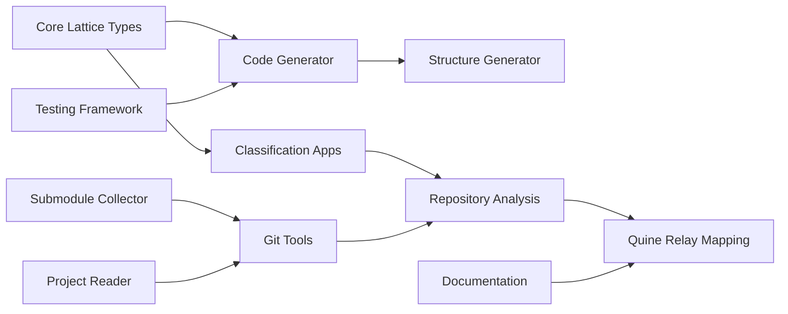

### **User description**
# CRQ-48-lattice-and-quine-relay.md

## Change Request: lattice and quine relay
## The Lattice Idea and the 128 Quine Relay: A Grand Unification of Languages

This document proposes the ultimate application of the Lattice Idea Framework: its translation and application across all programming languages, specifically targeting the monumental task of mapping out all languages involved in a 128-language quine relay. This endeavor represents a grand unification of linguistic understanding, demonstrating the framework's universal applicability and its capacity to bridge diverse programming paradigms.

### 1. The 128-Language Quine Relay as a Benchmark

A quine relay is a chain of programs where each program in the chain prints the next program in a different language, and the last program prints the first. A 128-language quine relay involves 128 distinct programming languages, each transforming code into the next. This complex artifact serves as an ideal benchmark for the Lattice Idea Framework due to its inherent diversity, self-referential nature, and the intricate relationships between its constituent languages.

### 2. Translating the Lattice Idea Across All Languages

The core proposition is that the Lattice Idea Framework, with its concepts of predicates, n-grams, k-value types, and multi-layered structures, can be translated and applied to *any* programming language. This is achieved through our "generate and test" method:

*   **Language-Specific Predicate Extraction:** For each of the 128 languages, the framework would define and extract language-specific predicates (keywords, syntax constructs, semantic patterns). For example, `def` in Python, `function` in JavaScript, and `fn` in Rust would all map to a common `function_definition` predicate, but their specific forms would be captured within the language's unique lattice representation.
*   **Generate and Test Method:**
    1.  **Generate:** Using the `lattice_code_generator` and `lattice_structure_generator`, the framework would generate lattice structures (e.g., predicate definitions, instance types, layer configurations) tailored to the specific characteristics of each of the 128 languages.
    2.  **Test:** The `structured_testing_framework` would then be applied to validate these language-specific lattice representations. This involves generating test cases (e.g., code snippets in that language) and verifying that the framework correctly extracts and classifies their predicates within the generated lattice.

### 3. Mapping Out the Quine Relay: A Lattice of Transformations

By applying this generate and test method to all 128 languages in the quine relay, the framework can create a comprehensive map of their interrelationships within the lattice:

*   **Lattice of Languages:** Each language in the relay becomes an instance within a higher-level lattice, classified by its unique set of predicates, n-grams, and k-value type characteristics.
*   **Morphism Analysis:** The transformations between languages in the quine relay (where one program prints the next in a different language) can be analyzed as "morphisms" within the lattice. These morphisms represent the conceptual distance and translation rules between different language paradigms.
*   **Identifying Shared "Vibes" and Memes:** The framework can identify shared "vibes" (e.g., functional programming ethos, object-oriented design patterns) and memes that transcend individual languages, revealing deeper connections across the relay.
*   **Predictive Capabilities:** Understanding the lattice of these languages and their transformations could potentially allow for predicting the characteristics of new languages or even generating novel language transformations.

### 4. Implications for Universal Code Understanding and Generation

Successfully mapping out the 128 quine relay within the Lattice Idea Framework would have profound implications:

*   **Universal Code Understanding:** It would demonstrate a path towards a truly universal understanding of code, where diverse languages are not seen as isolated entities but as interconnected points within a unified knowledge space.
*   **Cross-Language Code Generation:** The ability to precisely map and understand language transformations could pave the way for more sophisticated cross-language code generation, translation, and transpilation tools.
*   **Formalizing Informal Knowledge:** It would provide a mechanism to formalize the "vibes" and "memes" that often guide programming language design and adoption, bridging the gap between informal community knowledge and rigorous mathematical representation.

This ambitious application underscores the Lattice Idea Framework's potential as a foundational theory for understanding, classifying, and generating all forms of programmatic knowledge.

___

### **PR Type**
Enhancement, Documentation

___

### **Description**
• Implemented comprehensive Lattice Idea Framework with code generation, classification, and analysis capabilities
• Created multiple specialized tools: submodule collector, Git project reader, lattice structure generator, and project file classifier
• Built core lattice type system with `ValueType` enum, traits, and multi-layered structures for universal code understanding
• Added extensive documentation for 128-language quine relay analysis and structured testing framework
• Enhanced development environment with Nix flake improvements, valgrind integration, and comprehensive tooling
• Implemented "generate and test" methodology for language-specific predicate extraction and lattice mapping
• Created meta-lattice model with self-referential analysis capabilities and repository search simulation
• Added comprehensive JSON reports documenting submodule dependencies and project structure

___

### Diagram Walkthrough

 
<h3> File Walkthrough</h3>

<table><thead><tr><th></th><th align="left">Relevant files</th></tr></thead><tbody><tr><td><strong>Configuration changes</strong></td><td>

2 files
<table>
<tr>
  <td>
    

      
<strong>flake.nix</strong><dd><code>Enhanced Nix flake with submodule-collector package and development </code> <code>tools</code></dd>

flake.nix

• Removed empty line at the beginning of the file  • Added  <code>submodule-collector</code> package build configuration with Rust toolchain  dependencies  • Added development tools including <code>jq</code>, <code>valgrind</code>, and  various Emacs packages for Rust/OCaml development  • Added shell  formatting tools like <code>shellcheck</code>, <code>shfmt</code>, and <code>nixpkgs-fmt</code>

  </td>
  <td><a href="https://github.com/meta-introspector/git-submodules-rs-nix/pull/9/files#diff-206b9ce276ab5971a2489d75eb1b12999d4bf3843b7988cbe8d687cfde61dea0">+34/-1</a>&nbsp; &nbsp; </td>

</tr>

<tr>
  <td>
    

      
<strong>shell.nix</strong><dd><code>Added valgrind to development shell dependencies</code>&nbsp; &nbsp; &nbsp; &nbsp; &nbsp; &nbsp; &nbsp; &nbsp; &nbsp; </dd>

shell.nix

• Added <code>pkgs.valgrind</code> to the buildInputs list for memory profiling  capabilities

  </td>
  <td><a href="https://github.com/meta-introspector/git-submodules-rs-nix/pull/9/files#diff-e53dfbfffe62ae3c0b411b3938ccffa9fb6a2ecc565f55785ef8daa756631a6b">+1/-1</a>&nbsp; &nbsp; &nbsp; </td>

</tr>
</table>
</td></tr><tr><td><strong>Enhancement</strong></td><td>

16 files
<table>
<tr>
  <td>
    

      
<strong>lib.rs</strong><dd><code>Implemented lattice code generation library with procedural macros</code></dd>

lattice_code_generator/src/lib.rs

• Created comprehensive code generation library for the Lattice Idea  Framework  • Implements functions to generate Rust code for <code>ValueType</code>  enum, traits, structs, and lattice components  • Uses <code>proc_macro2</code> and  <code>quote</code> crates for programmatic Rust code generation  • Includes  extensive test coverage for generated code validation

  </td>
  <td><a href="https://github.com/meta-introspector/git-submodules-rs-nix/pull/9/files#diff-243854d89636db85a935fa955ee16fa44ea3ca7092902bc29701c3a825b0ba0a">+296/-0</a>&nbsp; </td>

</tr>

<tr>
  <td>
    

      
<strong>main.rs</strong><dd><code>Implemented Git submodule collector tool with recursive scanning</code></dd>

submodule-collector/src/main.rs

• Created command-line tool for scanning Git repositories and their  submodules recursively  • Implements comprehensive JSON report  generation with repository and submodule information  • Handles nested  submodules and error resilience with detailed failure reporting  • Uses  <code>clap</code>, <code>serde</code>, <code>git2</code>, and <code>walkdir</code> crates for functionality

  </td>
  <td><a href="https://github.com/meta-introspector/git-submodules-rs-nix/pull/9/files#diff-a47f0db0f72bdfe38e4c5fc28fcb76ddd4adc991f2b12a672f14f8348411c83a">+279/-0</a>&nbsp; </td>

</tr>

<tr>
  <td>
    

      
<strong>main.rs</strong><dd><code>Built project file lattice classification system</code>&nbsp; &nbsp; &nbsp; &nbsp; &nbsp; &nbsp; &nbsp; &nbsp; &nbsp; </dd>

project_file_lattice_builder/src/main.rs

• Created conceptual lattice builder for project files classification   • Implements predicate-based file analysis using word predicates and  classification paths  • Demonstrates mapping files as "large objects"  into lattice structure hierarchy  • Includes comprehensive test  coverage for predicate extraction and classification

  </td>
  <td><a href="https://github.com/meta-introspector/git-submodules-rs-nix/pull/9/files#diff-307096deb9eb86f24a90391b001a081a638672a52f8c27651d21c72bcfdcd2a1">+202/-0</a>&nbsp; </td>

</tr>

<tr>
  <td>
    

      
<strong>lattice_mapper_app.rs</strong><dd><code>Created lattice mapper for existing code classification</code>&nbsp; &nbsp; </dd>

src/lattice_mapper_app.rs

• Implemented conceptual lattice mapping application for existing code  classification  • Demonstrates "generate and test" method by mapping  code into pre-generated lattice structures  • Includes simplified  lattice types and predicate-based similarity matching  • Shows bridge  between lattice structure generation and repository classification

  </td>
  <td><a href="https://github.com/meta-introspector/git-submodules-rs-nix/pull/9/files#diff-d4b10dc90da2ebd2e54c216c08faf398915f797cc4bf2e94185cd40832762c62">+209/-0</a>&nbsp; </td>

</tr>

<tr>
  <td>
    

      
<strong>lattice_types.rs</strong><dd><code>Implemented core lattice type system and framework structures</code></dd>

src/lattice_types.rs

• Defined core lattice framework types including <code>ValueType</code> enum and  trait system  • Implemented generic <code>Instance</code>, <code>LatticeLayer</code>, and <code>Lattice</code>  structs with trait objects  • Created demonstration of multi-layered  lattice with different value types (2-value, 3-value)  • Includes  comprehensive type system for the Lattice Idea Framework

  </td>
  <td><a href="https://github.com/meta-introspector/git-submodules-rs-nix/pull/9/files#diff-b4cbc31fe99d9b693a12612fdfbcbb6a05afbab7836ee96ef34759a80eea2dfc">+196/-0</a>&nbsp; </td>

</tr>

<tr>
  <td>
    

      
<strong>repo_search_simulator.rs</strong><dd><code>Built repository search simulator with predicate-based classification</code></dd>

src/repo_search_simulator.rs

• Created repository search simulation using predicate-based  classification  • Implements "search by example" functionality across  mock repositories  • Demonstrates lattice framework application for  large codebase similarity detection  • Includes predicate extraction  and similarity scoring algorithms

  </td>
  <td><a href="https://github.com/meta-introspector/git-submodules-rs-nix/pull/9/files#diff-0fd44409289d811f50e94913ae801d7ed5c483e8798303c297ac9854807cfe41">+202/-0</a>&nbsp; </td>

</tr>

<tr>
  <td>
    

      
<strong>meta_lattice_model.rs</strong><dd><code>Created meta-lattice model with self-referential analysis capabilities</code></dd>

src/meta_lattice_model.rs

• Implemented self-referential meta-model of the Lattice Idea  Framework  • Demonstrates framework's capacity for analyzing its own  structure and finding similar models  • Creates conceptual  representation with multi-layered concept hierarchy  • Shows  self-analysis and similarity detection capabilities

  </td>
  <td><a href="https://github.com/meta-introspector/git-submodules-rs-nix/pull/9/files#diff-4ad95f3ed0d6e795cabcf8199fb28fa159aef84b4f32e578f55079fa94e07625">+153/-0</a>&nbsp; </td>

</tr>

<tr>
  <td>
    

      
<strong>analyze_strings.rs</strong><dd><code>Enhanced string analysis with n-gram generation and ontology </code> <code>compression</code></dd>

report-analyzer-rs/src/analyze_strings.rs

• Implemented comprehensive string analysis with token frequency  counting  • Added n-gram generation and analysis with iterative  compression using emoji ontology  • Created suggested rules generation  based on token patterns and frequencies  • Includes convergence  detection and practical iteration limits

  </td>
  <td><a href="https://github.com/meta-introspector/git-submodules-rs-nix/pull/9/files#diff-2972c1dbf1387f1fc356a8a7315beb271dcacb9eb512719d2ac60d15084a7c1a">+171/-0</a>&nbsp; </td>

</tr>

<tr>
  <td>
    

      
<strong>lattice_classifier_app.rs</strong><dd><code>Built lattice classifier for predicate-based text classification</code></dd>

src/lattice_classifier_app.rs

• Created lattice-based text classification application using  predicate presence  • Implements word predicate extraction and instance  representation in lattice layers  • Demonstrates "search by example"  classification with conceptual lattice structures  • Shows practical  application of generated lattice types for text analysis

  </td>
  <td><a href="https://github.com/meta-introspector/git-submodules-rs-nix/pull/9/files#diff-2046e6cf0881f2c6f04e40c623dbf7b071fa54d0b330bd758caea2f306c79f59">+188/-0</a>&nbsp; </td>

</tr>

<tr>
  <td>
    

      
<strong>lib.rs</strong><dd><code>Implemented Git project reader library with comprehensive testing</code></dd>

git_project_reader/src/lib.rs

• Created library for reading Git project information including  tracked files and status  • Implements <code>GitProjectInfo</code> struct with  comprehensive repository data collection  • Uses <code>git2</code> crate for  repository operations and shell commands for git status  • Includes  extensive test coverage with temporary repository creation

  </td>
  <td><a href="https://github.com/meta-introspector/git-submodules-rs-nix/pull/9/files#diff-258b44c334cd672e0393e8cad155edd07074a84e46a6c7389d9d227e07b3e1d8">+174/-0</a>&nbsp; </td>

</tr>

<tr>
  <td>
    

      
<strong>grand_unified_search.rs</strong><dd><code>Outlined Grand Unified Search system with self-analysis capabilities</code></dd>

src/grand_unified_search.rs

• Created conceptual outline for Grand Unified Search system  •  Demonstrates self-parsing, similarity search across repositories, and  LLM integration  • Includes placeholder implementations for <code>syn</code>  parsing, LLM queries, and submodule tools  • Shows theoretical  framework for large-scale code analysis and knowledge extraction

  </td>
  <td><a href="https://github.com/meta-introspector/git-submodules-rs-nix/pull/9/files#diff-b8a48c02f53b75052bc23d20df7488207a5b86d7815d3fb29ef0b8b985553ab1">+148/-0</a>&nbsp; </td>

</tr>

<tr>
  <td>
    

      
<strong>lattice_model.rs</strong><dd><code>Created foundational lattice model types and predicate classifier</code></dd>

src/lattice_model.rs

• Implemented core lattice model types with <code>ValueType</code> enum and trait  system  • Created <code>Instance</code>, <code>LatticeLayer</code>, and <code>Lattice</code> structs for  framework representation  • Added <code>PredicateClassifier</code> for word  predicate extraction from text  • Provides foundational types for the  Lattice Idea Framework implementation

  </td>
  <td><a href="https://github.com/meta-introspector/git-submodules-rs-nix/pull/9/files#diff-780a4d5fb95789264d299113f8c45e066dafc4aa039180f7494020e35c5246b6">+136/-0</a>&nbsp; </td>

</tr>

<tr>
  <td>
    

      
<strong>word_predicate_analyzer.rs</strong><dd><code>Built word predicate analyzer with n-gram generation</code>&nbsp; &nbsp; &nbsp; &nbsp; &nbsp; </dd>

src/word_predicate_analyzer.rs

• Implemented word predicate analysis using lattice type definitions  •  Created text tokenization and vocabulary-based predicate extraction  •  Added n-gram generation for predicate sequences and pattern analysis  •  Demonstrates practical application of lattice framework for text  analysis

  </td>
  <td><a href="https://github.com/meta-introspector/git-submodules-rs-nix/pull/9/files#diff-8b1a5639c122dab7e9c36fd0dac9ffa1dd9fbbbb4fb5d68eca6be406d0f63e83">+95/-0</a>&nbsp; &nbsp; </td>

</tr>

<tr>
  <td>
    

      
<strong>main.rs</strong><dd><code>Implemented lattice structure generator with hierarchical organization</code></dd>

lattice_structure_generator/src/main.rs

• Created structured lattice generation system with parameterized  configuration  • Generates hierarchical directory structure  representing lattice layers and instances  • Uses  <code>lattice_code_generator</code> library to create core lattice components  •  Demonstrates conceptual mapping of existing code into generated  lattice structure

  </td>
  <td><a href="https://github.com/meta-introspector/git-submodules-rs-nix/pull/9/files#diff-0503dd508e5c7168f8b6b74fb16594f291c5cead8790bfaec55d85ac576166f2">+82/-0</a>&nbsp; &nbsp; </td>

</tr>

<tr>
  <td>
    

      
<strong>lib.rs</strong><dd><code>Added ZOS lattice builder for project file classification</code></dd>

src/lib.rs

• Added <code>build_zos_lattice</code> function for creating project-specific  lattice structures  • Implements file classification into different  lattice layers based on file types and paths  • Uses predicate-based  classification for organizing files into conceptual hierarchy  •  Integrates with lattice model types for comprehensive project analysis

  </td>
  <td><a href="https://github.com/meta-introspector/git-submodules-rs-nix/pull/9/files#diff-b1a35a68f14e696205874893c07fd24fdb88882b47c23cc0e0c80a30c7d53759">+78/-0</a>&nbsp; &nbsp; </td>

</tr>

<tr>
  <td>
    

      
<strong>main.rs</strong><dd><code>Built lattice generator application for code generation workflow</code></dd>

lattice_generator_app/src/main.rs

• Created application for generating lattice code components to files   • Uses <code>lattice_code_generator</code> library to create all core lattice  structures  • Writes generated Rust code to organized file structure in  output directory  • Provides practical tool for creating lattice  framework implementations

  </td>
  <td><a href="https://github.com/meta-introspector/git-submodules-rs-nix/pull/9/files#diff-ba3c74e9dedda9c826a5198e4fb1879be1cc3251ad2be3b8bd4cef25d22bf646">+56/-0</a>&nbsp; &nbsp; </td>

</tr>
</table>
</td></tr><tr><td><strong>Tests</strong></td><td>

1 files
<table>
<tr>
  <td>
    

      
<strong>git-config-parser.rs</strong><dd><code>Added comprehensive tests for Git configuration parser</code>&nbsp; &nbsp; &nbsp; </dd>

src/bin/git-config-parser.rs

• Added comprehensive test suite for Git configuration parsing  functions  • Tests cover empty configs, sections-only, comments,  multiple sections, and submodules  • Validates parsing of <code>.gitconfig</code>  and <code>.gitmodules</code> file formats  • Ensures robust handling of various Git  configuration scenarios

  </td>
  <td><a href="https://github.com/meta-introspector/git-submodules-rs-nix/pull/9/files#diff-c6637247fafdce9d1d89c2b644040bf28a6f3f2adac43f626011adbf1cb6a975">+131/-1</a>&nbsp; </td>

</tr>
</table>
</td></tr><tr><td><strong>Documentation</strong></td><td>

5 files
<table>
<tr>
  <td>
    

      
<strong>submodule_report.json</strong><dd><code>Complete submodule inventory and dependency mapping report</code></dd>

submodule_report.json

• Added comprehensive JSON report documenting 2021 lines of repository  and submodule information  • Cataloged repositories with their paths,  URLs, and nested submodule structures  • Included major projects like  lattice-introspector, minizinc-introspector, git-submodule-tools-rs,  and various vendor dependencies  • Documented complex submodule  hierarchies with external dependencies from GitHub, Apache,  WebAssembly, and other sources

  </td>
  <td><a href="https://github.com/meta-introspector/git-submodules-rs-nix/pull/9/files#diff-cf55860203aefdb6b0dd57e87aa0929dd59f5d9ef2f3e88568b54dc25898e3a7">+2021/-0</a></td>

</tr>

<tr>
  <td>
    

      
<strong>CRQ-48-lattice-and-quine-relay.md</strong><dd><code>Lattice framework for 128-language quine relay analysis</code>&nbsp; &nbsp; </dd>

docs/crq_standardized/CRQ-48-lattice-and-quine-relay.md

• Added comprehensive documentation for the Lattice Idea Framework  applied to 128-language quine relay  • Described methodology for  language-specific predicate extraction using <code>def</code>, <code>function</code>, <code>fn</code>  keywords  • Outlined generate and test approach with  <code>lattice_code_generator</code> and <code>structured_testing_framework</code>  • Detailed  morphism analysis and predictive capabilities for cross-language  transformations

  </td>
  <td><a href="https://github.com/meta-introspector/git-submodules-rs-nix/pull/9/files#diff-ac1a0c1e2463866634f85d0f5f1d0869206ca883b75cacc57a8ecd6e324310ce">+38/-0</a>&nbsp; &nbsp; </td>

</tr>

<tr>
  <td>
    

      
<strong>structured_testing_framework.md</strong><dd><code>Structured testing framework for knowledge extraction</code>&nbsp; &nbsp; &nbsp; &nbsp; </dd>

docs/structured_testing_framework.md

• Introduced structured testing framework based on Lattice Idea  principles  • Defined lattice-guided test case generation and  predicate-driven assertions  • Outlined layered evaluation methodology  from simple to complex k-value types  • Described resonance  verification and iterative improvement processes

  </td>
  <td><a href="https://github.com/meta-introspector/git-submodules-rs-nix/pull/9/files#diff-9f5eb85b0a07c965e710e4da924aa3748a0d39a6bdabf23e67b320caed5ec658">+38/-0</a>&nbsp; &nbsp; </td>

</tr>

<tr>
  <td>
    

      
<strong>CRQ-003-deep-dive-and-reflection-on-nix-development-environment-graph.md</strong><dd><code>Nix development environment graph analysis change request</code></dd>

docs/crq_standardized/CRQ-003-deep-dive-and-reflection-on-nix-development-environment-graph.md

• Added change request for analyzing Nix development environment  dependency graph  • Outlined methodology for examining  <code>devshell_graph.dot</code> file nodes and edges  • Described reflection process  for documenting graph structure and optimization opportunities  •  Included partial progress notes on initial DOT file observations

  </td>
  <td><a href="https://github.com/meta-introspector/git-submodules-rs-nix/pull/9/files#diff-b282b43f374ed6c51133aa4111b710c2805811f8607431640736bdf06eb4e940">+58/-0</a>&nbsp; &nbsp; </td>

</tr>

<tr>
  <td>
    

      
<strong>CRQ-018-the-branch-as-a-holistic-development-unit.md</strong><dd><code>Branch as holistic development unit philosophy</code>&nbsp; &nbsp; &nbsp; &nbsp; &nbsp; &nbsp; &nbsp; &nbsp; &nbsp; &nbsp; &nbsp; </dd>

docs/crq_standardized/CRQ-018-the-branch-as-a-holistic-development-unit.md

• Introduced philosophical framework treating Git branches as holistic  development units  • Defined branches as CRQ, commit, vibe, vector,  function, type, expression, and meme  • Outlined benefits for holistic  development and AI integration  • Described expected outcomes for  improved code quality and architectural coherence

  </td>
  <td><a href="https://github.com/meta-introspector/git-submodules-rs-nix/pull/9/files#diff-2832ecc2da1157f0deb2c08520db29562ce395f8edb92b1a1fe8a26c8826cf98">+39/-0</a>&nbsp; &nbsp; </td>

</tr>
</table>
</td></tr><tr><td><strong>Additional files</strong></td><td>

101 files
<table>
<tr>
  <td><strong>.git_commit_message.txt</strong></td>
  <td><a href="https://github.com/meta-introspector/git-submodules-rs-nix/pull/9/files#diff-993228305b4d0adb47d3b4e0b45e35a0ab0fc9b43cd5e689feef1c3a1008e64d">+0/-3</a>&nbsp; &nbsp; &nbsp; </td>

</tr>

<tr>
  <td><strong>Cargo.toml</strong></td>
  <td><a href="https://github.com/meta-introspector/git-submodules-rs-nix/pull/9/files#diff-2e9d962a08321605940b5a657135052fbcef87b5e360662bb527c96d9a615542">+10/-1</a>&nbsp; &nbsp; </td>

</tr>

<tr>
  <td><strong>README.md</strong></td>
  <td><a href="https://github.com/meta-introspector/git-submodules-rs-nix/pull/9/files#diff-b335630551682c19a781afebcf4d07bf978fb1f8ac04c6bf87428ed5106870f5">+102/-0</a>&nbsp; </td>

</tr>

<tr>
  <td><strong>SOP_Nix_Graph_Reflection.md</strong></td>
  <td><a href="https://github.com/meta-introspector/git-submodules-rs-nix/pull/9/files#diff-9eea4a14e7fcdfa68232da66ffba61faa6fb8f7d84cad0f3f9264f56731fa920">+88/-0</a>&nbsp; &nbsp; </td>

</tr>

<tr>
  <td><strong>abstract_mathematical_idea.tex</strong></td>
  <td><a href="https://github.com/meta-introspector/git-submodules-rs-nix/pull/9/files#diff-69622bfa494d6fe61c7698baf13b5efc26d6672adef2ec3e0efa0d3e6555f3a5">+76/-0</a>&nbsp; &nbsp; </td>

</tr>

<tr>
  <td><strong>my_profiling_bench.rs</strong></td>
  <td><a href="https://github.com/meta-introspector/git-submodules-rs-nix/pull/9/files#diff-ba6682e5e5c2b85faec0653350824785fbc61e8b011444d3fc293fc73a8eff5f">+36/-0</a>&nbsp; &nbsp; </td>

</tr>

<tr>
  <td><strong>boot.sh</strong></td>
  <td><a href="https://github.com/meta-introspector/git-submodules-rs-nix/pull/9/files#diff-c270322e6f914001c9d1d23e01d1eefe9469337f284b0c0a920c5f843a15b373">+38/-0</a>&nbsp; &nbsp; </td>

</tr>

<tr>
  <td><strong>concept_word_as_predicate.md</strong></td>
  <td><a href="https://github.com/meta-introspector/git-submodules-rs-nix/pull/9/files#diff-8a4ed928664c47b3be475e7d3851ba8482b5c73a3fd143b0d0457100974cffff">+20/-0</a>&nbsp; &nbsp; </td>

</tr>

<tr>
  <td><strong>creative_expressions.md</strong></td>
  <td><a href="https://github.com/meta-introspector/git-submodules-rs-nix/pull/9/files#diff-4a1fc95b2b659d0083f480aca6584896dd24abd0c4273e6b8ae8441e9f39b43d">+106/-0</a>&nbsp; </td>

</tr>

<tr>
  <td><strong>CRQ-004-rust-documentation-rustdoc-updates-for-binaries.md</strong></td>
  <td><a href="https://github.com/meta-introspector/git-submodules-rs-nix/pull/9/files#diff-abd0edba3c84273f87250e0054f5bad2327767556eb2af57cd9f5fb65c566405">+35/-0</a>&nbsp; &nbsp; </td>

</tr>

<tr>
  <td><strong>CRQ-005-readme-md-updates.md</strong></td>
  <td><a href="https://github.com/meta-introspector/git-submodules-rs-nix/pull/9/files#diff-2e437d6523601d99fe5a18d8e8e2f632742e5d3f26eb02671b3962803589e832">+34/-0</a>&nbsp; &nbsp; </td>

</tr>

<tr>
  <td><strong>CRQ-006-formal-qa-procedures-and-standard-operating-procedures-sops-development.md</strong></td>
  <td><a href="https://github.com/meta-introspector/git-submodules-rs-nix/pull/9/files#diff-62a915240d316f6f1730714794d1f7433c4784005098e1a5ad018e6a516d760f">+37/-0</a>&nbsp; &nbsp; </td>

</tr>

<tr>
  <td><strong>CRQ-007-comprehensive-project-testing.md</strong></td>
  <td><a href="https://github.com/meta-introspector/git-submodules-rs-nix/pull/9/files#diff-f52bc4442b7dab07cb9b602ad562e7b6592867befdb4d2ff9369f42e78b74ac5">+37/-0</a>&nbsp; &nbsp; </td>

</tr>

<tr>
  <td><strong>CRQ-008-the-crq-of-crqs.md</strong></td>
  <td><a href="https://github.com/meta-introspector/git-submodules-rs-nix/pull/9/files#diff-e5088eb9e08387c4341abf4486b657744b2f1a0fe8177b5cd9a3d0c54b810583">+36/-0</a>&nbsp; &nbsp; </td>

</tr>

<tr>
  <td><strong>CRQ-009-git-project-reader-library-and-integration.md</strong></td>
  <td><a href="https://github.com/meta-introspector/git-submodules-rs-nix/pull/9/files#diff-2d3dbe720e4c081729b00d4a7e748b3dfdb27c469fd6a85a95ebc6b8862bc69d">+37/-0</a>&nbsp; &nbsp; </td>

</tr>

<tr>
  <td><strong>CRQ-010-sop-documentation-and-cargo-lock-update.md</strong></td>
  <td><a href="https://github.com/meta-introspector/git-submodules-rs-nix/pull/9/files#diff-adad5ca581fcf01563ae88abc1fcb0a7b1bf007281559ea6aa75b8d511dca737">+38/-0</a>&nbsp; &nbsp; </td>

</tr>

<tr>
  <td><strong>CRQ-011-github-cli-sops-and-wrapper-scripts.md</strong></td>
  <td><a href="https://github.com/meta-introspector/git-submodules-rs-nix/pull/9/files#diff-b6ff24e9d17b8ff4a58807a0d8c20065f7a8c4545957617bbace55916f153021">+46/-0</a>&nbsp; &nbsp; </td>

</tr>

<tr>
  <td><strong>CRQ-012-integrate-git-submodule-tools-into-lattice-system.md</strong></td>
  <td><a href="https://github.com/meta-introspector/git-submodules-rs-nix/pull/9/files#diff-32f72223bf8cc82b54485b0bfb5bbfe98437d26abfcff608c2a320f8ec8120a2">+32/-0</a>&nbsp; &nbsp; </td>

</tr>

<tr>
  <td><strong>CRQ-013-integrate-gitoxide-into-lattice-system.md</strong></td>
  <td><a href="https://github.com/meta-introspector/git-submodules-rs-nix/pull/9/files#diff-195bfc579b532e53586ffc1b892e250984a7804dafd1c6576702f29a625f4df0">+32/-0</a>&nbsp; &nbsp; </td>

</tr>

<tr>
  <td><strong>CRQ-014-integrate-magoo-into-lattice-system.md</strong></td>
  <td><a href="https://github.com/meta-introspector/git-submodules-rs-nix/pull/9/files#diff-0c06fa194ecff963a8198ba81ec47c86086593f8b4b4f7356ca50d041b80f87e">+32/-0</a>&nbsp; &nbsp; </td>

</tr>

<tr>
  <td><strong>CRQ-015-integrate-naersk-into-lattice-system.md</strong></td>
  <td><a href="https://github.com/meta-introspector/git-submodules-rs-nix/pull/9/files#diff-dc9f5dcad9bf75f383fa78a8e4fe7b478c7f44e0adc11c153c2cd5c024d4547b">+32/-0</a>&nbsp; &nbsp; </td>

</tr>

<tr>
  <td><strong>CRQ-016-integrate-submod-into-lattice-system.md</strong></td>
  <td><a href="https://github.com/meta-introspector/git-submodules-rs-nix/pull/9/files#diff-ff885ea72545ac0d5d6b661eecc61246dcf144d723df659a1b189efa572b664c">+32/-0</a>&nbsp; &nbsp; </td>

</tr>

<tr>
  <td><strong>CRQ-017-submodule-lattice-integration-crqs-and-task-files.md</strong></td>
  <td><a href="https://github.com/meta-introspector/git-submodules-rs-nix/pull/9/files#diff-715470e987b31c9a9f6c1cfe2f9c072b2bc00b7040c0b76060f35de4e79e5f92">+36/-0</a>&nbsp; &nbsp; </td>

</tr>

<tr>
  <td><strong>CRQ-019-one-to-one-mapping-of-crq-to-branch-and-pull-request.md</strong></td>
  <td><a href="https://github.com/meta-introspector/git-submodules-rs-nix/pull/9/files#diff-564ce4eb098ed3bb171534f310f55239586262f320c688b2fb4c3fd0524ac2f8">+38/-0</a>&nbsp; &nbsp; </td>

</tr>

<tr>
  <td><strong>CRQ-020-braindump-update-and-crq-status-reflection.md</strong></td>
  <td><a href="https://github.com/meta-introspector/git-submodules-rs-nix/pull/9/files#diff-c4ef172e05429d8d67e528855c74922f500d612544ca49a2bba6dfe9618251b6">+34/-0</a>&nbsp; &nbsp; </td>

</tr>

<tr>
  <td><strong>CRQ-024-new-sops-for-crq-driven-development.md</strong></td>
  <td><a href="https://github.com/meta-introspector/git-submodules-rs-nix/pull/9/files#diff-edf47b642d473b24d43282565ed04f55e84181fb6396d718e673470923761d8d">+35/-0</a>&nbsp; &nbsp; </td>

</tr>

<tr>
  <td><strong>CRQ-025-rust-code-generation-for-lattice-structures-programmatic-construction-of-the-framework.md</strong></td>
  <td><a href="https://github.com/meta-introspector/git-submodules-rs-nix/pull/9/files#diff-7dc2ace370b12ddd100af187f4ba6d6d6001aaade046298ecdab7484822b5174">+36/-0</a>&nbsp; &nbsp; </td>

</tr>

<tr>
  <td><strong>CRQ-026-zos-sequence-self-application-iterative-attribute-expansion.md</strong></td>
  <td><a href="https://github.com/meta-introspector/git-submodules-rs-nix/pull/9/files#diff-9c2012fc7f8bbf404288787385d776cedab9b119121856b2a9a7b4b584f01d3f">+31/-0</a>&nbsp; &nbsp; </td>

</tr>

<tr>
  <td><strong>CRQ-027-Open_Source_Language_and_Compiler_Classification_The_1k_Repo_Grounding.md</strong></td>
  <td><a href="https://github.com/meta-introspector/git-submodules-rs-nix/pull/9/files#diff-2cd54cbd9ef78791fbed3097e1327b3a87b6cafc69a71e9ff1f60b15c220c437">+40/-0</a>&nbsp; &nbsp; </td>

</tr>

<tr>
  <td><strong>CRQ-28-audited-llm-interaction.md</strong></td>
  <td><a href="https://github.com/meta-introspector/git-submodules-rs-nix/pull/9/files#diff-71ded38638ad554ba9c9dcf865012a6f35876f8cb25797a3ae3edc30d9a2d34d">+38/-0</a>&nbsp; &nbsp; </td>

</tr>

<tr>
  <td><strong>CRQ-29-conceptual-rust-lattice-types.md</strong></td>
  <td><a href="https://github.com/meta-introspector/git-submodules-rs-nix/pull/9/files#diff-e44703aac23ac28a428cc63faecc3e9486b422f46c9276010386519011fde66d">+56/-0</a>&nbsp; &nbsp; </td>

</tr>

<tr>
  <td><strong>CRQ-30-concrete-lattice-analysis-example.md</strong></td>
  <td><a href="https://github.com/meta-introspector/git-submodules-rs-nix/pull/9/files#diff-1c800f91d868ed987de12c40601586726adf434dbf607dfb4c814d5715fb3b8e">+54/-0</a>&nbsp; &nbsp; </td>

</tr>

<tr>
  <td><strong>CRQ-31-crq-001-review-git-log-patch.md</strong></td>
  <td><a href="https://github.com/meta-introspector/git-submodules-rs-nix/pull/9/files#diff-a871ee19bb38959d789ee7a3df0a935298e5082a8a0b429ca86936f11c4dc844">+7/-0</a>&nbsp; &nbsp; &nbsp; </td>

</tr>

<tr>
  <td><strong>CRQ-32-crq-002-automate-sops-to-rust.md</strong></td>
  <td><a href="https://github.com/meta-introspector/git-submodules-rs-nix/pull/9/files#diff-03b41ca901e9a0b3ac38680ba13014440e0ba3723eb174cfd3376f9d275b46c4">+3/-0</a>&nbsp; &nbsp; &nbsp; </td>

</tr>

<tr>
  <td><strong>CRQ-33-crq-002-submodule-report-function-development.md</strong></td>
  <td><a href="https://github.com/meta-introspector/git-submodules-rs-nix/pull/9/files#diff-32f8d2f5ee6181f0979697737d27d33711a32fcfb99a6ca3b125b46975e225e0">+44/-0</a>&nbsp; &nbsp; </td>

</tr>

<tr>
  <td><strong>CRQ-34-crq-003-context-introspector.md</strong></td>
  <td><a href="https://github.com/meta-introspector/git-submodules-rs-nix/pull/9/files#diff-daafb6f83eb1ccdd1fbbd3ee53f1a9e417a4e5042e74e0c3d4fc5e60d4229044">+3/-0</a>&nbsp; &nbsp; &nbsp; </td>

</tr>

<tr>
  <td><strong>CRQ-35-crq-004-formalize-interaction-procedure.md</strong></td>
  <td><a href="https://github.com/meta-introspector/git-submodules-rs-nix/pull/9/files#diff-60aaf7c66586ccc58757a027cbf2488d846408993d726099db972233d3176214">+3/-0</a>&nbsp; &nbsp; &nbsp; </td>

</tr>

<tr>
  <td><strong>CRQ-36-crq-005-strategic-alignment.md</strong></td>
  <td><a href="https://github.com/meta-introspector/git-submodules-rs-nix/pull/9/files#diff-72de710f48ccac4d2a52344fccbe5548dc70de73fc85cecabb6c18e5eaedcd30">+3/-0</a>&nbsp; &nbsp; &nbsp; </td>

</tr>

<tr>
  <td><strong>CRQ-37-crq-006-process-unification-kether-review.md</strong></td>
  <td><a href="https://github.com/meta-introspector/git-submodules-rs-nix/pull/9/files#diff-17877ca6ae284ede5ff98cad8fdb67b32304d207ac4a1d6614101b8038c23f65">+3/-0</a>&nbsp; &nbsp; &nbsp; </td>

</tr>

<tr>
  <td><strong>CRQ-38-crq-007-gitmodules-recon.md</strong></td>
  <td><a href="https://github.com/meta-introspector/git-submodules-rs-nix/pull/9/files#diff-8394a2316e9a4f6f656e8861f7c0abddddb6edeeb82118c6d7e179872b68743e">+3/-0</a>&nbsp; &nbsp; &nbsp; </td>

</tr>

<tr>
  <td><strong>CRQ-39-crq-008-category-theory-hott-submodules.md</strong></td>
  <td><a href="https://github.com/meta-introspector/git-submodules-rs-nix/pull/9/files#diff-f613840ff525a7bafbba373fbb4d03fa1f722fc2e6ff1d03549bfea04c0386ac">+3/-0</a>&nbsp; &nbsp; &nbsp; </td>

</tr>

<tr>
  <td><strong>CRQ-40-crq-009-grand-unified-framework.md</strong></td>
  <td><a href="https://github.com/meta-introspector/git-submodules-rs-nix/pull/9/files#diff-7e6b56d87fe72ef2d770c603382d247ea4cfb398eb2b469dd1962d3906729078">+3/-0</a>&nbsp; &nbsp; &nbsp; </td>

</tr>

<tr>
  <td><strong>CRQ-41-crq-009-grand-unified-framework-zoomed-in.md</strong></td>
  <td><a href="https://github.com/meta-introspector/git-submodules-rs-nix/pull/9/files#diff-c1522a230ece898026d70ecfa879f41372c980b65010635e92c1e75cbb21ecfd">+3/-0</a>&nbsp; &nbsp; &nbsp; </td>

</tr>

<tr>
  <td><strong>CRQ-42-crq-009-grand-unified-framework-zoomed-out.md</strong></td>
  <td><a href="https://github.com/meta-introspector/git-submodules-rs-nix/pull/9/files#diff-572bbb67558c8a702bf4a33d76826c6c84c5cf73debb82430dd003ba250d8793">+3/-0</a>&nbsp; &nbsp; &nbsp; </td>

</tr>

<tr>
  <td><strong>CRQ-43-crq-010-dynamic-information-flow.md</strong></td>
  <td><a href="https://github.com/meta-introspector/git-submodules-rs-nix/pull/9/files#diff-619ae2ff9e176380df968e83459a2d823b79e4c6fda344754751b76e5b7a75a3">+3/-0</a>&nbsp; &nbsp; &nbsp; </td>

</tr>

<tr>
  <td><strong>CRQ-44-crq-011-bott-periodicity.md</strong></td>
  <td><a href="https://github.com/meta-introspector/git-submodules-rs-nix/pull/9/files#diff-5f9f7416c3608efe6c1b19e595cb0878c75a3f2ddc768023c156969ec1b4d984">+3/-0</a>&nbsp; &nbsp; &nbsp; </td>

</tr>

<tr>
  <td><strong>CRQ-45-crq-012-naersk-integration.md</strong></td>
  <td><a href="https://github.com/meta-introspector/git-submodules-rs-nix/pull/9/files#diff-470a1c728bb70a8a61d4e65af40a7b31b2b0b45ca178560296b9efdfbf92b3c8">+3/-0</a>&nbsp; &nbsp; &nbsp; </td>

</tr>

<tr>
  <td><strong>CRQ-46-crq-document-index.md</strong></td>
  <td><a href="https://github.com/meta-introspector/git-submodules-rs-nix/pull/9/files#diff-1025a7059be193fa9c2ee78e0255a651a814adf34ca25336094398c8226ad8c1">+40/-0</a>&nbsp; &nbsp; </td>

</tr>

<tr>
  <td><strong>CRQ-47-k-value-type-semantics.md</strong></td>
  <td><a href="https://github.com/meta-introspector/git-submodules-rs-nix/pull/9/files#diff-0f874fa63e16d743b757bb6a7c3068c38afba47e7d3013dcd02671ca5307ca66">+41/-0</a>&nbsp; &nbsp; </td>

</tr>

<tr>
  <td><strong>CRQ-49-lattice-code-generation-and-mapping.md</strong></td>
  <td><a href="https://github.com/meta-introspector/git-submodules-rs-nix/pull/9/files#diff-9b118fd4693a05a3da50a0e898dd0c1b08b54718e9c7589ed73462419a3de8a4">+45/-0</a>&nbsp; &nbsp; </td>

</tr>

<tr>
  <td><strong>CRQ-50-llm-communication-protocol.md</strong></td>
  <td><a href="https://github.com/meta-introspector/git-submodules-rs-nix/pull/9/files#diff-4f756135cea4ba6bf7fba1822e8665a1ef326664d3434b5fd18c47455918194b">+40/-0</a>&nbsp; &nbsp; </td>

</tr>

<tr>
  <td><strong>CRQ-51-meta-lattice-application.md</strong></td>
  <td><a href="https://github.com/meta-introspector/git-submodules-rs-nix/pull/9/files#diff-e3b1a8fdea63612f200062e72fa25db30e45624a98678e72cb8d2f41f337784c">+32/-0</a>&nbsp; &nbsp; </td>

</tr>

<tr>
  <td><strong>CRQ-52-orchestration-layer-architecture.md</strong></td>
  <td><a href="https://github.com/meta-introspector/git-submodules-rs-nix/pull/9/files#diff-da8bd15db6da5c9a2b7a63a28305682987e8ded82d1be1223a264f3a613ec881">+50/-0</a>&nbsp; &nbsp; </td>

</tr>

<tr>
  <td><strong>CRQ-53-recursive-decomposition.md</strong></td>
  <td><a href="https://github.com/meta-introspector/git-submodules-rs-nix/pull/9/files#diff-9bada1d9e91dc77a5a2adb2d46033f5b92748e37882b6bb91955cfbf3c56d7e2">+40/-0</a>&nbsp; &nbsp; </td>

</tr>

<tr>
  <td><strong>grand_unified_search_architecture.md</strong></td>
  <td><a href="https://github.com/meta-introspector/git-submodules-rs-nix/pull/9/files#diff-5a63bd97f21f12fac52fca20cd40fad7ae0e38ebc42cd87c6c5c66e16755076f">+43/-0</a>&nbsp; &nbsp; </td>

</tr>

<tr>
  <td><strong>Meme_CRQ_Commit_Message.md</strong></td>
  <td><a href="https://github.com/meta-introspector/git-submodules-rs-nix/pull/9/files#diff-a0e667739fed70091e8ed06ac9c0de5656b8f4ff368a63026066561cfb690d24">+11/-0</a>&nbsp; &nbsp; </td>

</tr>

<tr>
  <td><strong>gta.md</strong></td>
  <td><a href="https://github.com/meta-introspector/git-submodules-rs-nix/pull/9/files#diff-ab9e240b593becd5366f2671d92a077e23ef32371405c829a47a78442f24d273">+7/-0</a>&nbsp; &nbsp; &nbsp; </td>

</tr>

<tr>
  <td><strong>gta1.md</strong></td>
  <td><a href="https://github.com/meta-introspector/git-submodules-rs-nix/pull/9/files#diff-19867bc3a0db962973b5ae2068e5996edde18c0bc6e291b7deaf376e0b80f42c">+3/-0</a>&nbsp; &nbsp; &nbsp; </td>

</tr>

<tr>
  <td><strong>oss_language_classification.md</strong></td>
  <td><a href="https://github.com/meta-introspector/git-submodules-rs-nix/pull/9/files#diff-1beb0ce21ddf24339147d323ec6b2bada6eb245f4ab4b5ab3bd92ee02520c3e5">+35/-0</a>&nbsp; &nbsp; </td>

</tr>

<tr>
  <td><strong>resonance_analysis.md</strong></td>
  <td><a href="https://github.com/meta-introspector/git-submodules-rs-nix/pull/9/files#diff-81fd0277e6c643b5840b226540f5a1bc2c5bdb58bf2cc6da3886a4920f0eb648">+29/-0</a>&nbsp; &nbsp; </td>

</tr>

<tr>
  <td><strong>scalable_analysis_of_large_repositories.md</strong></td>
  <td><a href="https://github.com/meta-introspector/git-submodules-rs-nix/pull/9/files#diff-a84dabb51ad998b97806b4096463cc0b736bfe606a48e8414046aa4b99fcb99a">+40/-0</a>&nbsp; &nbsp; </td>

</tr>

<tr>
  <td><strong>SOP_AI_Agent_Management_via_PRs.md</strong></td>
  <td><a href="https://github.com/meta-introspector/git-submodules-rs-nix/pull/9/files#diff-8603ab46e32f6257e23d74bd77089b701b66e47b81c0e37856011e406c55584c">+57/-0</a>&nbsp; &nbsp; </td>

</tr>

<tr>
  <td><strong>SOP_Bootstrap_CRQ_Hypothesis_Implementation.md</strong></td>
  <td><a href="https://github.com/meta-introspector/git-submodules-rs-nix/pull/9/files#diff-accd770f607ad21fcfae5a75e1ba313bc1da2fb5c89e354770f6b43bd235cb8c">+45/-0</a>&nbsp; &nbsp; </td>

</tr>

<tr>
  <td><strong>SOP_Branch_Driven_Development_Philosophy.md</strong></td>
  <td><a href="https://github.com/meta-introspector/git-submodules-rs-nix/pull/9/files#diff-1fd5102c76a305b2aa20d21c82672de70f4bdb3ee86b974dc1daf33751302684">+59/-0</a>&nbsp; &nbsp; </td>

</tr>

<tr>
  <td><strong>SOP_CRQ_as_Commit_Message.md</strong></td>
  <td><a href="https://github.com/meta-introspector/git-submodules-rs-nix/pull/9/files#diff-486f592819f5c5438c5e72bee9fc7a17d135d76ea7a1441b9eab19deaff0ed94">+28/-0</a>&nbsp; &nbsp; </td>

</tr>

<tr>
  <td><strong>SOP_Coding_Standards.md</strong></td>
  <td><a href="https://github.com/meta-introspector/git-submodules-rs-nix/pull/9/files#diff-f6c33385fe0edea8f6b21e407f547bf5efc31ba686073741a459b32fc08fc3b1">+28/-0</a>&nbsp; &nbsp; </td>

</tr>

<tr>
  <td><strong>SOP_GH_CLI_Check_Issues.md</strong></td>
  <td><a href="https://github.com/meta-introspector/git-submodules-rs-nix/pull/9/files#diff-9528ab23b6a76dddce04d7b73c212f072c6ef955e204336afaccf1299ba33928">+93/-0</a>&nbsp; &nbsp; </td>

</tr>

<tr>
  <td><strong>SOP_GH_CLI_Check_PRs.md</strong></td>
  <td><a href="https://github.com/meta-introspector/git-submodules-rs-nix/pull/9/files#diff-97ddeaf648ead9a23640ad5d831488642db0240dc24707a5c6f5f1225fdd82fb">+101/-0</a>&nbsp; </td>

</tr>

<tr>
  <td><strong>SOP_GH_CLI_Check_Workflows.md</strong></td>
  <td><a href="https://github.com/meta-introspector/git-submodules-rs-nix/pull/9/files#diff-a31ffec6191f238f1e7de865616e54ed621a4f61e9dc7cf444f40de8a6227731">+84/-0</a>&nbsp; &nbsp; </td>

</tr>

<tr>
  <td><strong>SOP_Integrated_Binary_Workflow.md</strong></td>
  <td><a href="https://github.com/meta-introspector/git-submodules-rs-nix/pull/9/files#diff-7bfddaf1d82bfb0a3e2d6a8c205de5e11a78f8c7ea02da3fb47fee12b1c200ab">+60/-0</a>&nbsp; &nbsp; </td>

</tr>

<tr>
  <td><strong>SOP_Refactoring_with_CRQ_Branches.md</strong></td>
  <td><a href="https://github.com/meta-introspector/git-submodules-rs-nix/pull/9/files#diff-7ad3e2d44a5fa234edc31be9d0ed24f07ff7cf40cd6fbb310e2022128bbd8faa">+49/-0</a>&nbsp; &nbsp; </td>

</tr>

<tr>
  <td><strong>SOP_Using_Git_Config_Parser.md</strong></td>
  <td><a href="https://github.com/meta-introspector/git-submodules-rs-nix/pull/9/files#diff-89bb95d26366ba09a24bee5e7bc4570cba40e71fe9fb13f6147fb6a2214dcf62">+62/-0</a>&nbsp; &nbsp; </td>

</tr>

<tr>
  <td><strong>SOP_Using_Project_File_Lattice_Builder.md</strong></td>
  <td><a href="https://github.com/meta-introspector/git-submodules-rs-nix/pull/9/files#diff-d36a7db64a85b219553e54ab4c451d46fba7f6b7b58dcc4811d9680a7d9308cb">+49/-0</a>&nbsp; &nbsp; </td>

</tr>

<tr>
  <td><strong>SOP_Using_Submodule_Collector.md</strong></td>
  <td><a href="https://github.com/meta-introspector/git-submodules-rs-nix/pull/9/files#diff-199699cfacae5a09dec7a2187531b49ac558a72acadb0e16ad75819c773ab0e2">+52/-0</a>&nbsp; &nbsp; </td>

</tr>

<tr>
  <td><strong>sops-debugging-submodule-counting.md</strong></td>
  <td><a href="https://github.com/meta-introspector/git-submodules-rs-nix/pull/9/files#diff-3f6742a18af12b0f3f01974399fb1e911992886dd0ff8a89aaa9b701eb1bb499">+68/-0</a>&nbsp; &nbsp; </td>

</tr>

<tr>
  <td><strong>sops-github-issue-workflow.md</strong></td>
  <td><a href="https://github.com/meta-introspector/git-submodules-rs-nix/pull/9/files#diff-7de47923c2bf9a825d19da3cdd0918b8e5754adbb29bd5aba4decaee3dd71b0f">+44/-0</a>&nbsp; &nbsp; </td>

</tr>

<tr>
  <td><strong>sops-herding-ai-flock.md</strong></td>
  <td><a href="https://github.com/meta-introspector/git-submodules-rs-nix/pull/9/files#diff-52a8aa9a904b5f7b9261d9bee5c9caab3c30345f12bab0173bd00b94fb69f778">+59/-0</a>&nbsp; &nbsp; </td>

</tr>

<tr>
  <td><strong>sops-whistle-while-you-work.md</strong></td>
  <td><a href="https://github.com/meta-introspector/git-submodules-rs-nix/pull/9/files#diff-edef4b4c77c2a84eaf1ce74861e613ec31123f9c6f4a81778306c0439cfc8dbf">+71/-0</a>&nbsp; &nbsp; </td>

</tr>

<tr>
  <td><strong>task_git-submodule-tools_lattice_integration.md</strong></td>
  <td><a href="https://github.com/meta-introspector/git-submodules-rs-nix/pull/9/files#diff-805dde15da29f98488f393266be818e29104c7c6fbf2b827babd7dfedc4f82da">+21/-0</a>&nbsp; &nbsp; </td>

</tr>

<tr>
  <td><strong>task_gitoxide_lattice_integration.md</strong></td>
  <td><a href="https://github.com/meta-introspector/git-submodules-rs-nix/pull/9/files#diff-449e6fb6fd1aa0070d7d18f20eed0191f3743be483943f3d1326bfa4ead33951">+23/-0</a>&nbsp; &nbsp; </td>

</tr>

<tr>
  <td><strong>task_magoo_lattice_integration.md</strong></td>
  <td><a href="https://github.com/meta-introspector/git-submodules-rs-nix/pull/9/files#diff-fcf7a444a3f680fbbff7c0bc580424734c6fc8a53422f4d78f7dd1e64a8fa974">+15/-0</a>&nbsp; &nbsp; </td>

</tr>

<tr>
  <td><strong>task_naersk_lattice_integration.md</strong></td>
  <td><a href="https://github.com/meta-introspector/git-submodules-rs-nix/pull/9/files#diff-7e08032db04782a693e7826ef4359578614c3fc63fb1029e18d909d72c022d29">+22/-0</a>&nbsp; &nbsp; </td>

</tr>

<tr>
  <td><strong>task_submod_lattice_integration.md</strong></td>
  <td><a href="https://github.com/meta-introspector/git-submodules-rs-nix/pull/9/files#diff-a7bb6df28c91a0b221e14e0cafc2b9558a040c2615c269338d2eecce87f9bd3f">+15/-0</a>&nbsp; &nbsp; </td>

</tr>

<tr>
  <td><strong>emacs.sh</strong></td>
  <td><a href="https://github.com/meta-introspector/git-submodules-rs-nix/pull/9/files#diff-534f77f5b047055c0423d42b1e91e507f9a4c0deb6e5639d61ef765b4be3f4e8">+1/-0</a>&nbsp; &nbsp; &nbsp; </td>

</tr>

<tr>
  <td><strong>has_value_count_impls.rs</strong></td>
  <td><a href="https://github.com/meta-introspector/git-submodules-rs-nix/pull/9/files#diff-fc27ee60e32d05c14ba49d85ee4b7d8e66ac5c101ad0dbe3e5d349b4b9303ac8">+1/-0</a>&nbsp; &nbsp; &nbsp; </td>

</tr>

<tr>
  <td><strong>has_value_count_trait.rs</strong></td>
  <td><a href="https://github.com/meta-introspector/git-submodules-rs-nix/pull/9/files#diff-cf0ba0ca0358cab475d52e9b5edf475682f4cd05a5cd4d554b917677343ec3b1">+1/-0</a>&nbsp; &nbsp; &nbsp; </td>

</tr>

<tr>
  <td><strong>instance_struct.rs</strong></td>
  <td><a href="https://github.com/meta-introspector/git-submodules-rs-nix/pull/9/files#diff-d3a134be5da73893ad11cfba2741e995cb5385d116f305bb9f90ba03072271f8">+1/-0</a>&nbsp; &nbsp; &nbsp; </td>

</tr>

<tr>
  <td><strong>lattice_layer_struct.rs</strong></td>
  <td><a href="https://github.com/meta-introspector/git-submodules-rs-nix/pull/9/files#diff-0aacd04a7a621f806b54ffa94092f874682700841e03474720504945ec824126">+1/-0</a>&nbsp; &nbsp; &nbsp; </td>

</tr>

<tr>
  <td><strong>lattice_struct.rs</strong></td>
  <td><a href="https://github.com/meta-introspector/git-submodules-rs-nix/pull/9/files#diff-79d9dfa1f549d761bf956b17120979d037243e9dc1f10ebb9402e5b62ff5cf46">+1/-0</a>&nbsp; &nbsp; &nbsp; </td>

</tr>

<tr>
  <td><strong>value_type.rs</strong></td>
  <td><a href="https://github.com/meta-introspector/git-submodules-rs-nix/pull/9/files#diff-4534ce506bbc5e0a512da2a9f61948dc44575940029777e3be9fa6f1ce706735">+1/-0</a>&nbsp; &nbsp; &nbsp; </td>

</tr>

<tr>
  <td><strong>has_value_count_impls.rs</strong></td>
  <td><a href="https://github.com/meta-introspector/git-submodules-rs-nix/pull/9/files#diff-bfde8abac89de5011df90cbcb78cbcd164b872180cfb65270be5126f86444644">+1/-0</a>&nbsp; &nbsp; &nbsp; </td>

</tr>

<tr>
  <td><strong>has_value_count_trait.rs</strong></td>
  <td><a href="https://github.com/meta-introspector/git-submodules-rs-nix/pull/9/files#diff-ef800ec7554c85081358a5d3b43129aedea930cf2edbc44915c73ff89d7f767e">+1/-0</a>&nbsp; &nbsp; &nbsp; </td>

</tr>

<tr>
  <td><strong>instance_struct.rs</strong></td>
  <td><a href="https://github.com/meta-introspector/git-submodules-rs-nix/pull/9/files#diff-2a3695aa0e91eed81596edd58de20843bbebe8a9e7ddddae052cc7f695267747">+1/-0</a>&nbsp; &nbsp; &nbsp; </td>

</tr>

<tr>
  <td><strong>lattice_layer_struct.rs</strong></td>
  <td><a href="https://github.com/meta-introspector/git-submodules-rs-nix/pull/9/files#diff-8732c80f707e0ab6b869ea056076368c8830979c489e8c25c0b1d63a05affb3b">+1/-0</a>&nbsp; &nbsp; &nbsp; </td>

</tr>

<tr>
  <td><strong>lattice_struct.rs</strong></td>
  <td><a href="https://github.com/meta-introspector/git-submodules-rs-nix/pull/9/files#diff-d0b1a7887fc4298e093cd2bfb55016adcc95a93c94f2f6df94699f5fb9f43180">+1/-0</a>&nbsp; &nbsp; &nbsp; </td>

</tr>

<tr>
  <td><strong>instance_0.rs</strong></td>
  <td><a href="https://github.com/meta-introspector/git-submodules-rs-nix/pull/9/files#diff-990ad20f4685e1e62b47bcdc403066dc9a6a5cd320f109f452149c676da95d77">+3/-0</a>&nbsp; &nbsp; &nbsp; </td>

</tr>

<tr>
  <td><strong>instance_1.rs</strong></td>
  <td><a href="https://github.com/meta-introspector/git-submodules-rs-nix/pull/9/files#diff-df8632b2498c76b1d518d069119ef059ccb029cdcabff4a67066bd7b537542ca">+3/-0</a>&nbsp; &nbsp; &nbsp; </td>

</tr>

<tr>
  <td><strong>instance_0.rs</strong></td>
  <td><a href="https://github.com/meta-introspector/git-submodules-rs-nix/pull/9/files#diff-45a15a4ed78fb935970c9dfb064319535f48d88aa3eeaaf6724236295ad8bc36">+3/-0</a>&nbsp; &nbsp; &nbsp; </td>

</tr>

<tr>
  <td><strong>instance_1.rs</strong></td>
  <td><a href="https://github.com/meta-introspector/git-submodules-rs-nix/pull/9/files#diff-f985fd8aeb2357840bce2296c2e55547376810292136d6b105ebb782f0c2bea1">+3/-0</a>&nbsp; &nbsp; &nbsp; </td>

</tr>

<tr>
  <td><strong>value_type.rs</strong></td>
  <td><a href="https://github.com/meta-introspector/git-submodules-rs-nix/pull/9/files#diff-0e397496f4650bd5f8a1aaa402b4f095cc1ebfec730fb80a60040684b1e76798">+1/-0</a>&nbsp; &nbsp; &nbsp; </td>

</tr>

<tr>
  <td><strong>Additional files not shown</strong></td>
  <td></td>

</tr>
</table>
</td></tr></tr></tbody></table>

___
