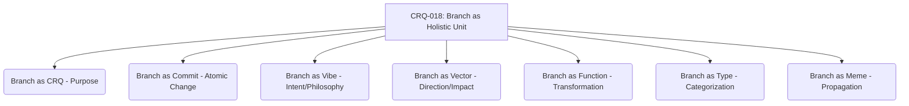

# CRQ-018: The Branch as a Holistic Development Unit - 7-Fold Division

This document elaborates on the concept of a Git branch as a holistic development unit, breaking it down into seven interconnected facets, representing a deeper level of granularity within the project's primordial ontology.

## 1. Branch as CRQ (Purpose)
The branch's existence is intrinsically tied to a specific Change Request Quality (CRQ), defining its core purpose and objective.

## 2. Branch as Commit (Atomic Change)
The entire set of changes within a branch, culminating in its merge, is viewed as a single, cohesive 'mega-commit' that fulfills the CRQ, representing an atomic unit of change.

## 3. Branch as Vibe (Intent/Philosophy)
Each branch carries a unique 'vibe' or intention, reflecting the developer's mindset, the problem's nature, and the solution's elegance, embodying the underlying philosophy.

## 4. Branch as Vector (Direction/Impact)
Conceptually, a branch represents a vector in the project's state space, moving the codebase from one defined state to another, indicating its direction and impact.

## 5. Branch as Function (Transformation)
A branch can be seen as a pure function that takes the base branch's state as input and produces a new, transformed state as output, without side effects outside its defined scope.

## 6. Branch as Type (Categorization)
The changes introduced by a branch can be thought of as defining a new 'type' or category of functionality or improvement within the system, adhering to specific interfaces or contracts.

## 7. Branch as Meme (Propagation)
Upon merging, the core idea, pattern, or solution embodied by the branch becomes a 'meme' – a self-propagating unit of cultural information – influencing future development and architectural decisions.

---

## Visual Representation (Mermaid Diagram)

