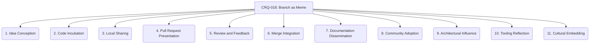

# CRQ-018: Branch as Meme (Propagation) - 11-Fold Division

This document elaborates on the concept of a Git branch as a propagating meme, breaking it down into eleven interconnected facets, representing a deeper level of granularity within the project's primordial ontology.

## 1. Idea Conception
The initial spark of the meme, a new idea or solution emerging in the developer's mind.

## 2. Code Incubation
The meme is translated into tangible code within the branch, taking its first concrete form.

## 3. Local Sharing
The meme is shared with immediate collaborators, often through informal discussions or early code reviews, beginning its initial spread.

## 4. Pull Request Presentation
The meme is formally presented to the wider team through a Pull Request, marking a significant step in its public propagation.

## 5. Review and Feedback
The meme is scrutinized, discussed, and refined through the code review process, adapting and strengthening its form.

## 6. Merge Integration
The meme is integrated into the main codebase, becoming a part of the project's shared reality and expanding its reach.

## 7. Documentation Dissemination
The meme's essence, purpose, and usage are captured in documentation, ensuring its long-term understanding and accessibility.

## 8. Community Adoption
The meme is adopted and used by other developers, either directly through code reuse or indirectly through influence on their own work.

## 9. Architectural Influence
The meme influences future design decisions and architectural patterns within the project, shaping its evolution.

## 10. Tooling Reflection
The meme is reflected in new or updated tools, scripts, or automated processes, further embedding it into the project's infrastructure.

## 11. Cultural Embedding
The meme becomes an ingrained part of the project's culture, its principles and patterns implicitly understood and applied by the team.

---

## Visual Representation (Mermaid Diagram)

