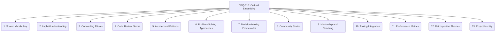

# CRQ-018: Branch as Meme (Cultural Embedding) - 13-Fold Division

This document elaborates on the concept of a Git branch as a culturally embedded meme, breaking it down into thirteen interconnected facets, representing a deeper level of granularity within the project's primordial ontology.

## 1. Shared Vocabulary
The meme introduces new terms or phrases that become common in team discussions, forming a unique linguistic fingerprint.

## 2. Implicit Understanding
The meme's principles are understood and applied without explicit instruction, becoming an intuitive part of the team's collective knowledge.

## 3. Onboarding Rituals
New team members are introduced to the meme as part of their onboarding process, ensuring its propagation across generations of contributors.

## 4. Code Review Norms
The meme influences the criteria and focus of code reviews, shaping how quality and adherence to principles are assessed.

## 5. Architectural Patterns
The meme becomes a recurring pattern in the project's architecture, guiding the design and structure of new components.

## 6. Problem-Solving Approaches
The meme guides the team's approach to solving new problems, providing a consistent framework for innovation and resolution.

## 7. Decision-Making Frameworks
The meme provides a framework for making project decisions, ensuring alignment with its core principles.

## 8. Community Stories
Anecdotes and stories about the meme are shared within the team, reinforcing its significance and historical context.

## 9. Mentorship and Coaching
Experienced team members mentor others in applying the meme, fostering its organic growth and mastery.

## 10. Tooling Integration
The meme is supported and reinforced by the project's tools and infrastructure, making its application seamless and efficient.

## 11. Performance Metrics
The meme influences how success and performance are measured, aligning evaluation with its inherent values.

## 12. Retrospective Themes
The meme becomes a recurring theme in project retrospectives, driving continuous improvement and self-reflection.

## 13. Project Identity
The meme contributes to the unique identity and ethos of the project, shaping its culture and reputation.

---

## Visual Representation (Mermaid Diagram)

