# CRQ-018: Branch as Meme (Project Identity) - 17-Fold Division

This document elaborates on the concept of a Git branch as a meme contributing to Project Identity, breaking it down into seventeen interconnected facets, representing a deeper level of granularity within the project's primordial ontology.

## 1. Mission Statement
The core purpose and guiding principle of the project, articulating its fundamental reason for existence.

## 2. Vision Statement
The aspirational future state the project aims to achieve, painting a picture of its long-term impact and direction.

## 3. Core Values
The fundamental beliefs and principles that guide the project's actions, decisions, and interactions.

## 4. Brand Persona
The personality and tone of voice the project conveys through its communication, design, and overall presence.

## 5. Community Ethos
The shared attitudes, values, and beliefs of the project's community, shaping its collaborative spirit and culture.

## 6. Architectural Style
The distinctive design principles and patterns used in the project's architecture, reflecting its technical philosophy.

## 7. Technological Stack
The unique combination of technologies and tools used in the project, defining its technical capabilities and constraints.

## 8. Naming Conventions
The consistent patterns used for naming files, variables, and components, contributing to code readability and maintainability.

## 9. Coding Style
The distinctive formatting and stylistic rules applied to the project's codebase, ensuring consistency and aesthetic appeal.

## 10. Documentation Voice
The consistent tone and style used in the project's documentation, ensuring clarity and a unified communication approach.

## 11. Release Cadence
The predictable rhythm and frequency of project releases, influencing user expectations and development cycles.

## 12. Feedback Mechanisms
The established channels and processes for receiving and incorporating feedback, demonstrating responsiveness and continuous improvement.

## 13. Contribution Model
The defined approach for how individuals contribute to the project, shaping its openness and collaborative nature.

## 14. Problem-Solving Philosophy
The project's characteristic approach to tackling challenges, reflecting its intellectual rigor and practical orientation.

## 15. Innovation Culture
The degree to which the project encourages and embraces new ideas, experiments, and creative solutions.

## 16. Historical Narrative
The stories and milestones that define the project's journey, shaping its legacy and collective memory.

## 17. External Perception
How the project is viewed and understood by the wider industry, community, and potential users, influencing its reputation and adoption.

---

## Visual Representation (Mermaid Diagram)

```mermaid
graph TD
    A[CRQ-018: Project Identity] --> B(1. Mission Statement)
    A --> C(2. Vision Statement)
    A --> D(3. Core Values)
    A --> E(4. Brand Persona)
    A --> F(5. Community Ethos)
    A --> G(6. Architectural Style)
    A --> H(7. Technological Stack)
    A --> I(8. Naming Conventions)
    A --> J(9. Coding Style)
    A --> K(10. Documentation Voice)
    A --> L(11. Release Cadence)
    A --> M(12. Feedback Mechanisms)
    A --> N(13. Contribution Model)
    A --> O(14. Problem-Solving Philosophy)
    A --> P(15. Innovation Culture)
    A --> Q(16. Historical Narrative)
    A --> R(17. External Perception)
```

