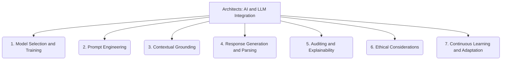

# Architects: AI and LLM Integration - 7-Fold Division

This document applies the 7-fold division of the Heptad to the 'AI and LLM Integration' thematic group under the 'Architects' archetype, providing a deeper level of granularity for how AI and Large Language Models are integrated into the system.

## 1. Model Selection and Training

The process of choosing, fine-tuning, or training appropriate AI/LLM models for specific tasks and data domains.

## 2. Prompt Engineering

The art and science of crafting effective inputs and instructions to guide AI/LLM behavior, elicit desired responses, and optimize performance.

## 3. Contextual Grounding

Mechanisms for providing relevant background information, knowledge bases, or real-world context to AI/LLMs to ensure accurate and relevant understanding and generation.

## 4. Response Generation and Parsing

Handling the output from AI/LLMs, including generating coherent responses and parsing structured information from their free-form text outputs.

## 5. Auditing and Explainability

Ensuring transparency, traceability, and understanding of AI/LLM decision-making processes, including logging interactions and providing explanations for outputs.

## 6. Ethical Considerations

Addressing biases, fairness, privacy, security, and responsible use of AI/LLMs within the system, aligning with ethical guidelines and regulations.

## 7. Continuous Learning and Adaptation

Mechanisms for AI/LLMs to improve over time, including incorporating new data, feedback loops, and adapting to evolving requirements or environments.

---

## Visual Representation (Mermaid Diagram)

