# Architects: AI and LLM Integration - Business Goal - 17-Fold Division

This document applies a 17-fold division to the 'Business Goal' facet of 'Problem Definition' under the 'Architects' archetype, providing a deeper level of granularity for the overarching business objective an AI/LLM solution aims to support.

## 1. Revenue Growth

Increasing sales, market share, customer lifetime value, or average transaction size to boost financial income.

## 2. Cost Reduction

Minimizing operational expenses, waste, resource consumption, or labor costs through automation or optimization.

## 3. Efficiency Improvement

Streamlining processes, reducing cycle times, improving throughput, or automating manual tasks to enhance productivity.

## 4. Customer Satisfaction

Enhancing customer experience, loyalty, retention rates, or net promoter scores (NPS) through improved products or services.

## 5. Product Innovation

Developing new products, features, services, or business models to create new value propositions or enter new markets.

## 6. Market Expansion

Entering new geographical markets, targeting new customer segments, or expanding product reach to new demographics.

## 7. Risk Mitigation

Reducing exposure to financial, operational, cybersecurity, compliance, or reputational risks through proactive measures.

## 8. Compliance

Adhering to legal, regulatory, industry-specific, or internal standards and policies.

## 9. Brand Reputation

Enhancing public perception, trust, and positive sentiment towards the brand or organization.

## 10. Employee Engagement

Improving employee satisfaction, productivity, retention, and overall workplace culture.

## 11. Sustainability

Achieving environmental, social, or governance (ESG) targets, reducing ecological footprint, or promoting ethical practices.

## 12. Competitive Advantage

Differentiating from competitors through unique offerings, superior capabilities, or innovative business models.

## 13. Data-Driven Decision Making

Improving the quality, speed, and accuracy of business decisions through better data collection, analysis, and insights.

## 14. Operational Resilience

Enhancing the ability of business operations to withstand disruptions, adapt to change, and maintain continuity.

## 15. Talent Acquisition/Retention

Attracting, recruiting, developing, and retaining skilled employees and specialized talent.

## 16. Supply Chain Optimization

Improving the efficiency, transparency, and reliability of the supply chain, from sourcing to delivery.

## 17. Strategic Partnerships

Developing and leveraging alliances, collaborations, or joint ventures for mutual benefit and expanded capabilities.

---

## Visual Representation (Mermaid Diagram)

```mermaid
graph TD
    A[Architects: Business Goal] --> B(1. Revenue Growth)
    A --> C(2. Cost Reduction)
    A --> D(3. Efficiency Improvement)
    A --> E(4. Customer Satisfaction)
    A --> F(5. Product Innovation)
    A --> G(6. Market Expansion)
    A --> H(7. Risk Mitigation)
    A --> I(8. Compliance)
    A --> J(9. Brand Reputation)
    A --> K(10. Employee Engagement)
    A --> L(11. Sustainability)
    A --> M(12. Competitive Advantage)
    A --> N(13. Data-Driven Decision Making)
    A --> O(14. Operational Resilience)
    A --> P(15. Talent Acquisition/Retention)
    A --> Q(16. Supply Chain Optimization)
    A --> R(17. Strategic Partnerships)
```

