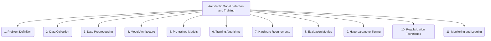

# Architects: AI and LLM Integration - Model Selection and Training - 11-Fold Division

This document applies an 11-fold division to the 'Model Selection and Training' facet of 'AI and LLM Integration' under the 'Architects' archetype, providing a deeper level of granularity for choosing and preparing AI/LLM models.

## 1. Problem Definition

Clearly articulating the specific AI/LLM task to be solved (e.g., text generation, classification, summarization, translation) and its desired outcomes.

## 2. Data Collection

Gathering relevant, diverse, and high-quality datasets for training, ensuring representativeness and sufficient volume.

## 3. Data Preprocessing

Cleaning, transforming, augmenting, and tokenizing data to make it suitable for model input, including handling missing values and noise.

## 4. Model Architecture

Choosing or designing the underlying neural network structure (e.g., Transformer, RNN, CNN, GAN) that best fits the problem and data characteristics.

## 5. Pre-trained Models

Leveraging existing large-scale pre-trained models (e.g., BERT, GPT, Llama, T5) for fine-tuning or transfer learning to accelerate development.

## 6. Training Algorithms

Selecting appropriate optimization algorithms (e.g., Adam, SGD, RMSprop) and learning rate schedules to efficiently update model weights during training.

## 7. Hardware Requirements

Assessing and provisioning the necessary computational resources, such as GPUs, TPUs, or specialized AI accelerators, for efficient model training.

## 8. Evaluation Metrics

Defining quantifiable criteria to measure model performance (e.g., accuracy, F1-score, BLEU, ROUGE, perplexity) and track progress.

## 9. Hyperparameter Tuning

Optimizing parameters that control the training process (e.g., batch size, number of epochs, dropout rate) to achieve the best model performance.

## 10. Regularization Techniques

Applying methods (e.g., dropout, L1/L2 regularization, early stopping) to prevent overfitting and improve the model's generalization capabilities.

## 11. Monitoring and Logging

Tracking training progress, loss curves, evaluation metrics, and other relevant information to diagnose issues and understand model behavior.

---

## Visual Representation (Mermaid Diagram)

