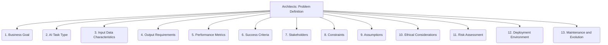

# Architects: AI and LLM Integration - Problem Definition - 13-Fold Division

This document applies a 13-fold division to the 'Problem Definition' facet of 'Model Selection and Training' under the 'Architects' archetype, providing a deeper level of granularity for clearly articulating the AI/LLM task to be solved.

## 1. Business Goal

The overarching business objective or strategic aim that the AI/LLM solution is intended to support or contribute to.

## 2. AI Task Type

Classifying the problem as a specific AI task (e.g., classification, regression, generation, clustering, anomaly detection, recommendation).

## 3. Input Data Characteristics

Describing the nature, format, volume, velocity, variety, and sources of the data available for the model.

## 4. Output Requirements

Specifying the desired format, content, structure, and constraints of the model's output, including any required confidence levels.

## 5. Performance Metrics

Defining quantifiable measures to evaluate the model's success (e.g., accuracy, precision, recall, F1-score, BLEU, ROUGE, perplexity, latency).

## 6. Success Criteria

Non-quantifiable conditions or qualitative assessments that indicate the problem has been adequately solved and the solution is acceptable to stakeholders.

## 7. Stakeholders

Identifying all individuals or groups who are impacted by, interested in, or can influence the problem and its potential AI/LLM solution.

## 8. Constraints

Any limitations or restrictions that the solution must adhere to, such as latency requirements, computational cost, interpretability needs, or ethical boundaries.

## 9. Assumptions

Documenting any underlying beliefs, conditions, or facts that are taken as true for the problem definition, but may need validation.

## 10. Ethical Considerations

Identifying potential biases, fairness issues, privacy concerns, or broader societal impacts related to the problem and its AI/LLM solution.

## 11. Risk Assessment

Anticipating potential challenges, uncertainties, or failures in solving the problem with AI/LLMs, and planning mitigation strategies.

## 12. Deployment Environment

Understanding the operational context, infrastructure, and integration points where the model will be deployed and used.

## 13. Maintenance and Evolution

Considering how the model will be updated, monitored, retrained, and managed over time to ensure its continued performance and relevance.

---

## Visual Representation (Mermaid Diagram)

