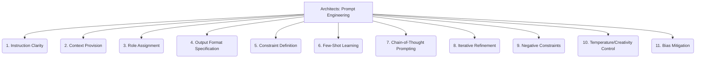

# Architects: AI and LLM Integration - Prompt Engineering - 11-Fold Division

This document applies an 11-fold division to the 'Prompt Engineering' facet of 'AI and LLM Integration' under the 'Architects' archetype, providing a deeper level of granularity for crafting effective inputs to guide LLM behavior.

## 1. Instruction Clarity

Ensuring that prompts are unambiguous, precise, and easy for the LLM to understand, minimizing misinterpretation.

## 2. Context Provision

Supplying relevant background information, data, or examples within the prompt to guide the LLM's response and ensure accuracy.

## 3. Role Assignment

Directing the LLM to adopt a specific persona, role, or tone of voice (e.g., expert, assistant, critic) to influence its output style.

## 4. Output Format Specification

Defining the desired structure or type of the LLM's response (e.g., JSON, Markdown, bullet points, code snippets) for easier parsing and integration.

## 5. Constraint Definition

Setting boundaries, limitations, or specific requirements on the LLM's generation, such as length, content restrictions, or adherence to rules.

## 6. Few-Shot Learning

Providing a small number of input-output examples directly within the prompt to guide the LLM's behavior and demonstrate the desired pattern.

## 7. Chain-of-Thought Prompting

Encouraging the LLM to show its reasoning process, intermediate steps, or thought process before providing a final answer, improving transparency.

## 8. Iterative Refinement

Adjusting and improving prompts based on initial LLM responses, using a feedback loop to enhance the quality and relevance of subsequent outputs.

## 9. Negative Constraints

Explicitly specifying what the LLM should *not* do, include, or generate in its response, guiding it away from undesirable outputs.

## 10. Temperature/Creativity Control

Adjusting parameters (e.g., temperature, top-p) to influence the LLM's output variability, from deterministic to highly creative.

## 11. Bias Mitigation

Designing prompts to reduce or avoid the propagation of biases present in the LLM's training data, promoting fair and equitable responses.

---

## Visual Representation (Mermaid Diagram)

