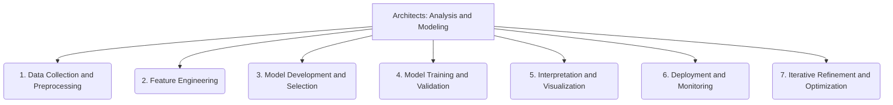

# Architects: Analysis and Modeling - 7-Fold Division

This document applies the 7-fold division of the Heptad to the 'Analysis and Modeling' thematic group under the 'Architects' archetype, providing a deeper level of granularity for how the system is used for analysis and modeling.

## 1. Data Collection and Preprocessing

The systematic gathering, cleaning, transformation, and preparation of raw data to make it suitable for analytical processes.

## 2. Feature Engineering

The process of creating new variables, attributes, or representations from existing data to enhance the predictive power or interpretability of analytical models.

## 3. Model Development and Selection

Choosing, designing, and implementing appropriate analytical models, algorithms, or statistical techniques for specific tasks and objectives.

## 4. Model Training and Validation

Fitting models to historical data, optimizing their parameters, and rigorously assessing their performance, accuracy, and generalization capabilities.

## 5. Interpretation and Visualization

Making sense of model outputs, extracting actionable insights, and presenting complex analytical results in clear, understandable, and visually compelling ways.

## 6. Deployment and Monitoring

Integrating analytical models into operational systems, ensuring their reliable execution, and continuously tracking their performance and behavior in real-world environments.

## 7. Iterative Refinement and Optimization

The continuous process of improving models based on new data, feedback, changing requirements, and evolving understanding of the problem domain.

---

## Visual Representation (Mermaid Diagram)

