# Architects: Analysis and Modeling - Data Collection - 17-Fold Division

This document applies a 17-fold division to the 'Data Collection' facet of 'Training Data Preparation' under the 'Architects' archetype, providing a deeper level of granularity for gathering raw data from various sources.

## 1. Primary Data Collection

Gathering new data directly from its original sources through methods like surveys, experiments, interviews, or direct observation.

## 2. Secondary Data Collection

Utilizing existing data that has already been collected by others, such as public datasets, research reports, government statistics, or commercial databases.

## 3. Manual Data Entry

Human input of data, often from physical documents, forms, or legacy systems, into digital formats.

## 4. Automated Data Capture

Using software or hardware to automatically record data, including web scraping, API calls, IoT device data streams, or automated logging.

## 5. Streaming Data Collection

Continuous ingestion of real-time or near real-time data from sources like social media feeds, financial markets, sensor networks, or clickstreams.

## 6. Batch Data Collection

Gathering data in discrete chunks or at scheduled intervals, often for large volumes of historical or archival data.

## 7. Survey Design

Crafting questionnaires, polls, or interview protocols to systematically collect qualitative or quantitative data from a target audience.

## 8. Experiment Design

Setting up controlled environments and procedures to collect data on specific phenomena, often involving A/B testing or scientific experiments.

## 9. Sensor Data Acquisition

Collecting data from physical sensors (e.g., temperature, pressure, humidity, location, motion) embedded in devices or environments.

## 10. Log Data Collection

Gathering data from system logs, application logs, server logs, security logs, or audit trails to understand system behavior and events.

## 11. Web Analytics Data

Collecting user behavior data from websites or applications, including page views, clicks, session duration, and conversion rates.

## 12. API Data Collection

Programmatically accessing data through various Application Programming Interfaces (APIs) provided by third-party services or internal systems.

## 13. Database Export

Extracting data from existing databases (relational, NoSQL, etc.) through queries, exports, or replication mechanisms.

## 14. Data Licensing and Usage Rights

Ensuring legal permission and proper licensing to collect, use, store, and distribute data, especially for third-party or proprietary datasets.

## 15. Data Privacy and Consent

Obtaining necessary consent from individuals for data collection and ensuring compliance with privacy regulations (e.g., GDPR, CCPA, HIPAA).

## 16. Data Volume and Velocity

Managing the scale (volume) and speed (velocity) of incoming data, requiring robust infrastructure and processing capabilities.

## 17. Data Storage and Archiving

Planning for the initial storage, organization, and long-term retention or archiving of collected raw data.

---

## Visual Representation (Mermaid Diagram)

```mermaid
graph TD
    A[Architects: Data Collection] --> B(1. Primary Data Collection)
    A --> C(2. Secondary Data Collection)
    A --> D(3. Manual Data Entry)
    A --> E(4. Automated Data Capture)
    A --> F(5. Streaming Data Collection)
    A --> G(6. Batch Data Collection)
    A --> H(7. Survey Design)
    A --> I(8. Experiment Design)
    A --> J(9. Sensor Data Acquisition)
    A --> K(10. Log Data Collection)
    A --> L(11. Web Analytics Data)
    A --> M(12. API Data Collection)
    A --> N(13. Database Export)
    A --> O(14. Data Licensing and Usage Rights)
    A --> P(15. Data Privacy and Consent)
    A --> Q(16. Data Volume and Velocity)
    A --> R(17. Data Storage and Archiving)
```

