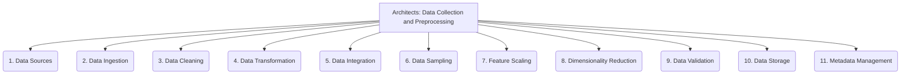

# Architects: Analysis and Modeling - Data Collection and Preprocessing - 11-Fold Division

This document applies an 11-fold division to the 'Data Collection and Preprocessing' facet of 'Analysis and Modeling' under the 'Architects' archetype, providing a deeper level of granularity for gathering, cleaning, and transforming raw data for analysis.

## 1. Data Sources

Identifying and accessing raw data from various origins, including databases, APIs, logs, files, web scraping, or external feeds.

## 2. Data Ingestion

Methods for bringing data into the analytical environment, such as batch processing, streaming, real-time ingestion, or manual uploads.

## 3. Data Cleaning

Handling missing values, outliers, inconsistencies, duplicates, and errors in the data to improve its quality and reliability.

## 4. Data Transformation

Converting data into a suitable format for analysis, including normalization, aggregation, pivoting, parsing, or type conversion.

## 5. Data Integration

Combining data from multiple disparate sources into a unified and coherent dataset, resolving schema differences and entity matching.

## 6. Data Sampling

Selecting a representative subset of data for analysis, especially for very large datasets, to manage computational resources.

## 7. Feature Scaling

Normalizing or standardizing numerical features to a common range or distribution, often required by machine learning algorithms.

## 8. Dimensionality Reduction

Reducing the number of features or variables in a dataset while preserving important information, to simplify models and reduce noise.

## 9. Data Validation

Ensuring the quality, accuracy, integrity, and completeness of the data through various checks and rules.

## 10. Data Storage

Choosing appropriate storage solutions for preprocessed data, considering factors like volume, access patterns, performance, and cost.

## 11. Metadata Management

Documenting data sources, transformations applied, data quality metrics, and other relevant information to ensure data lineage and understanding.

---

## Visual Representation (Mermaid Diagram)

