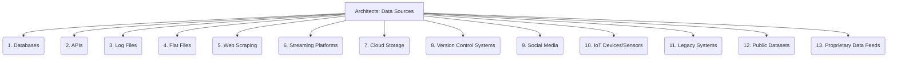

# Architects: Analysis and Modeling - Data Sources - 13-Fold Division

This document applies a 13-fold division to the 'Data Sources' facet of 'Data Collection and Preprocessing' under the 'Architects' archetype, providing a deeper level of granularity for identifying and accessing raw data from various origins.

## 1. Databases

Relational databases (SQL), NoSQL databases (document, key-value, column-family, graph), and time-series databases.

## 2. APIs

RESTful APIs, GraphQL APIs, SOAP APIs, and streaming APIs (e.g., WebSockets, Server-Sent Events) for programmatic data access.

## 3. Log Files

Application logs, server logs, security logs, audit trails, and system event logs, often in various formats (e.g., plain text, JSON, XML).

## 4. Flat Files

Structured or unstructured files such as CSV, TSV, JSON Lines, XML files, text documents, and spreadsheets.

## 5. Web Scraping

Extracting data from websites by parsing HTML, often requiring custom scripts or specialized tools.

## 6. Streaming Platforms

Message queues (e.g., Kafka, RabbitMQ), event hubs, and other platforms designed for real-time data ingestion and processing.

## 7. Cloud Storage

Object storage (e.g., AWS S3, Google Cloud Storage, Azure Blob Storage), file storage, and block storage services in cloud environments.

## 8. Version Control Systems

Git repositories, SVN, Perforce, and other version control systems, from which code, configuration, and other files can be extracted.

## 9. Social Media

Public APIs for platforms like Twitter, Facebook, LinkedIn, and Reddit, allowing access to social data streams and profiles.

## 10. IoT Devices/Sensors

Data streams originating from Internet of Things devices, sensors, industrial equipment, and other connected hardware.

## 11. Legacy Systems

Older, potentially proprietary, or custom-built systems that may require specialized connectors, protocols, or manual extraction methods.

## 12. Public Datasets

Open data portals, government data repositories, academic datasets, and other publicly available data sources.

## 13. Proprietary Data Feeds

Commercial data providers, syndicated data, or internal data feeds that are not publicly accessible.

---

## Visual Representation (Mermaid Diagram)

