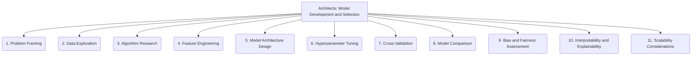

# Architects: Analysis and Modeling - Model Development and Selection - 11-Fold Division

This document applies an 11-fold division to the 'Model Development and Selection' facet of 'Analysis and Modeling' under the 'Architects' archetype, providing a deeper level of granularity for how analytical models are chosen and built.

## 1. Problem Framing

Clearly defining the analytical problem to be solved, including objectives, scope, and desired outcomes.

## 2. Data Exploration

Understanding the characteristics, quality, and limitations of available data, including data cleaning and preprocessing needs.

## 3. Algorithm Research

Investigating and evaluating various algorithms and modeling techniques suitable for the defined problem and data type.

## 4. Feature Engineering

Creating relevant input features or representations from raw data to enhance the predictive power or interpretability of the model.

## 5. Model Architecture Design

Designing the structure, components, and interconnections of the model, especially for complex or deep learning architectures.

## 6. Hyperparameter Tuning

Optimizing the model's hyperparameters (parameters not learned from data) to achieve the best performance on a given dataset.

## 7. Cross-Validation

Techniques for robustly evaluating model performance and generalization capabilities by partitioning data into training and validation sets.

## 8. Model Comparison

Evaluating and selecting the best model among several candidates based on predefined metrics, trade-offs, and business requirements.

## 9. Bias and Fairness Assessment

Identifying and mitigating potential biases in the model's predictions or decisions, ensuring equitable and just outcomes.

## 10. Interpretability and Explainability

Ensuring the model's decisions, predictions, or internal workings can be understood and explained to human users or stakeholders.

## 11. Scalability Considerations

Designing models and their training/inference pipelines to efficiently handle large datasets, high throughput, and increasing demands.

---

## Visual Representation (Mermaid Diagram)

