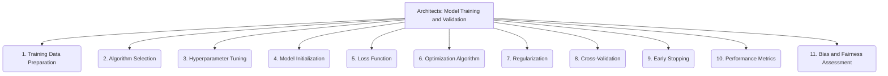

# Architects: Analysis and Modeling - Model Training and Validation - 11-Fold Division

This document applies an 11-fold division to the 'Model Training and Validation' facet of 'Analysis and Modeling' under the 'Architects' archetype, providing a deeper level of granularity for how analytical models are trained and evaluated.

## 1. Training Data Preparation

Cleaning, transforming, and splitting data into appropriate training, validation, and test sets to ensure robust model evaluation.

## 2. Algorithm Selection

Choosing the appropriate machine learning algorithm or model architecture based on the problem type, data characteristics, and desired outcomes.

## 3. Hyperparameter Tuning

Optimizing model parameters that control the training process (e.g., learning rate, batch size, number of layers) to achieve the best performance.

## 4. Model Initialization

Setting initial weights or parameters for the model before training begins, which can impact convergence and final performance.

## 5. Loss Function

Defining the objective function to be minimized during training, which quantifies the difference between predicted and actual values.

## 6. Optimization Algorithm

Selecting the method for updating model weights based on the gradients of the loss function (e.g., gradient descent variants like Adam, SGD, RMSprop).

## 7. Regularization

Techniques (e.g., L1/L2 regularization, dropout, early stopping) applied during training to prevent overfitting and improve model generalization.

## 8. Cross-Validation

Robustly evaluating model performance and generalization capabilities by partitioning data into multiple folds for training and validation.

## 9. Early Stopping

Halt the training process when the model's performance on a validation set stops improving, to prevent overfitting and save computational resources.

## 10. Performance Metrics

Quantifying model performance using relevant metrics (e.g., accuracy, precision, recall, F1-score for classification; RMSE, MAE for regression; BLEU, ROUGE for NLP).

## 11. Bias and Fairness Assessment

Identifying and mitigating potential biases in the model's predictions or decisions, ensuring equitable and just outcomes across different demographic groups.

---

## Visual Representation (Mermaid Diagram)

