# Architects: Analysis and Modeling - Polynomial Features - 17-Fold Division

This document applies a 17-fold division to the 'Polynomial Features' facet of 'Feature Creation' under the 'Architects' archetype, providing a deeper level of granularity for generating new features by raising existing features to a power or multiplying them.

## 1. Degree

The highest power to which individual features are raised (e.g., x^2, x^3), determining the complexity of the polynomial.

## 2. Interaction Terms

Products of two or more distinct features (e.g., x*y, x*y*z), capturing synergistic or interdependent effects.

## 3. Single Feature Expansion

Applying polynomial transformation to individual features independently, creating terms like x, x^2, x^3.

## 4. Multi-Feature Expansion

Applying polynomial transformation to combinations of features, including all possible interaction terms up to a certain degree.

## 5. Bias Term

Including a constant term (intercept) in the polynomial expansion, allowing the model to shift the decision boundary.

## 6. Feature Scaling Impact

How the scaling of original features affects the magnitude and distribution of the generated polynomial features.

## 7. Overfitting Risk

The increased risk of overfitting the training data due to the higher complexity and increased number of features introduced by polynomial expansion.

## 8. Computational Cost

The increased computational resources (memory, CPU) required for generating polynomial features and for training models on the expanded dataset.

## 9. Interpretability

How the introduction of polynomial features affects the interpretability of the model, making it harder to understand the direct impact of original features.

## 10. Non-Linearity Capture

The ability of polynomial features to model and capture non-linear relationships between features and the target variable.

## 11. Feature Selection

The process of selecting relevant polynomial features to avoid noise, multicollinearity, and to improve model generalization.

## 12. Regularization

Using regularization techniques (e.g., L1, L2 regularization) to mitigate overfitting when using high-degree polynomial features.

## 13. Domain Knowledge Guidance

Using domain expertise and understanding of the problem to guide the selection of appropriate polynomial terms or degrees.

## 14. Automated Generation

Tools or algorithms that can automatically generate polynomial features up to a specified degree or based on certain criteria.

## 15. Sparse Representation

Handling the sparsity that can arise from high-dimensional polynomial features, especially when many interaction terms are zero.

## 16. Kernel Methods Connection

The relationship between polynomial features and polynomial kernels in Support Vector Machines (SVMs), where polynomial features are implicitly mapped.

## 17. Visualization

Techniques for visualizing the impact of polynomial features on decision boundaries, regression curves, or data distributions.

---

## Visual Representation (Mermaid Diagram)

```mermaid
graph TD
    A[Architects: Polynomial Features] --> B(1. Degree)
    A --> C(2. Interaction Terms)
    A --> D(3. Single Feature Expansion)
    A --> E(4. Multi-Feature Expansion)
    A --> F(5. Bias Term)
    A --> G(6. Feature Scaling Impact)
    A --> H(7. Overfitting Risk)
    A --> I(8. Computational Cost)
    A --> J(9. Interpretability)
    A --> K(10. Non-Linearity Capture)
    A --> L(11. Feature Selection)
    A --> M(12. Regularization)
    A --> N(13. Domain Knowledge Guidance)
    A --> O(14. Automated Generation)
    A --> P(15. Sparse Representation)
    A --> Q(16. Kernel Methods Connection)
    A --> R(17. Visualization)
```

