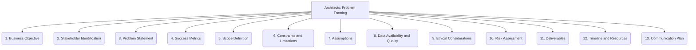

# Architects: Analysis and Modeling - Problem Framing - 13-Fold Division

This document applies a 13-fold division to the 'Problem Framing' facet of 'Model Development and Selection' under the 'Architects' archetype, providing a deeper level of granularity for clearly defining the analytical problem to be solved.

## 1. Business Objective

Clearly defining the overarching business goal or strategic objective that the analysis or model is intended to support.

## 2. Stakeholder Identification

Recognizing all individuals or groups who are impacted by, interested in, or can influence the problem and its solution.

## 3. Problem Statement

Articulating the core issue, question, or challenge to be addressed in a clear, concise, and unambiguous manner.

## 4. Success Metrics

Defining quantifiable criteria or key performance indicators (KPIs) that will be used to evaluate the effectiveness and success of the solution.

## 5. Scope Definition

Establishing clear boundaries for the problem, including what is in scope and what is out of scope for the analysis or solution.

## 6. Constraints and Limitations

Identifying any restrictions, limitations, or external factors (e.g., budget, data availability, time, technology) that might impact the solution.

## 7. Assumptions

Documenting any underlying beliefs, conditions, or facts that are taken as true for the purpose of the analysis, but may need validation.

## 8. Data Availability and Quality

Assessing what data exists, its sources, its relevance, and its quality (e.g., completeness, accuracy, consistency) for solving the problem.

## 9. Ethical Considerations

Identifying potential biases, fairness issues, privacy concerns, or broader societal impacts related to the problem and its potential solutions.

## 10. Risk Assessment

Anticipating potential challenges, uncertainties, or failures in solving the problem, and planning mitigation strategies.

## 11. Deliverables

Specifying the tangible outputs, reports, models, or results expected from the analysis or problem resolution effort.

## 12. Timeline and Resources

Estimating the time, personnel, budget, and other resources required to effectively frame and address the problem.

## 13. Communication Plan

Outlining how the problem definition, progress, insights, and proposed solutions will be communicated to relevant stakeholders.

---

## Visual Representation (Mermaid Diagram)

