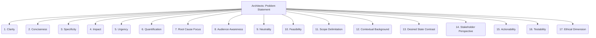

# Architects: Analysis and Modeling - Problem Statement - 17-Fold Division

This document applies a 17-fold division to the 'Problem Statement' facet of 'Problem Framing' under the 'Architects' archetype, providing a deeper level of granularity for clearly articulating the core issue to be addressed.

## 1. Clarity

Is the problem statement easy to understand, unambiguous, and free from jargon or overly complex language?

## 2. Conciseness

Is it brief and to the point, conveying the essential issue without unnecessary words or extraneous details?

## 3. Specificity

Does it clearly define the exact issue, avoiding vague terms and focusing on a precise problem rather than a symptom or a solution?

## 4. Impact

Does it articulate the negative consequences, costs, or missed opportunities that result from the problem if left unaddressed?

## 5. Urgency

Does it convey why this problem needs to be solved now, highlighting any time-sensitive factors or escalating risks?

## 6. Quantification

Where possible, does it include measurable aspects of the problem, using data or metrics to illustrate its scale or frequency?

## 7. Root Cause Focus

Does it hint at or directly address the underlying cause of the problem, rather than just describing its surface effects?

## 8. Audience Awareness

Is it framed in a way that resonates with the intended readers (e.g., business stakeholders, technical teams), using appropriate language and focus?

## 9. Neutrality

Is it stated objectively, without bias, blame, or pre-judging potential solutions, focusing solely on the current problematic state?

## 10. Feasibility

Does it imply that a solution is realistically achievable, given the project's constraints and capabilities?

## 11. Scope Delimitation

Does it clearly define the boundaries of the problem, indicating what is included and excluded from its consideration?

## 12. Contextual Background

Does it provide just enough background information for understanding the problem without overwhelming the reader with irrelevant details?

## 13. Desired State Contrast

Does it implicitly or explicitly contrast the current problematic state with a desired future state, highlighting the gap to be closed?

## 14. Stakeholder Perspective

Does it reflect the perspective and concerns of those most affected by the problem, ensuring relevance and empathy?

## 15. Actionability

Does it lead naturally to potential solutions, further investigation, or a clear path forward for addressing the issue?

## 16. Testability

Can the resolution of the problem be verified or measured once a solution is implemented?

## 17. Ethical Dimension

Does it acknowledge any ethical considerations, societal impacts, or fairness issues inherent in the problem itself or its potential solutions?

---

## Visual Representation (Mermaid Diagram)

