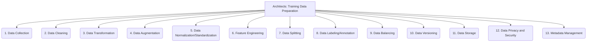

# Architects: Analysis and Modeling - Training Data Preparation - 13-Fold Division

This document applies a 13-fold division to the 'Training Data Preparation' facet of 'Model Training and Validation' under the 'Architects' archetype, providing a deeper level of granularity for preparing data for model training.

## 1. Data Collection

Gathering raw data from various sources, ensuring relevance, diversity, and sufficient volume for the intended model.

## 2. Data Cleaning

Handling missing values, outliers, inconsistencies, duplicates, and errors in the raw data to improve its quality and reliability.

## 3. Data Transformation

Converting data into a suitable format for the model, including parsing, type conversion, and restructuring.

## 4. Data Augmentation

Creating new data from existing data by applying transformations (e.g., rotations, translations for images; synonyms for text) to increase dataset size and diversity.

## 5. Data Normalization/Standardization

Scaling numerical features to a common range or distribution (e.g., min-max scaling, z-score standardization) to prevent features with larger values from dominating.

## 6. Feature Engineering

Creating new features from raw data by combining or transforming existing ones, to improve model performance and interpretability.

## 7. Data Splitting

Dividing the prepared data into appropriate training, validation, and test sets to ensure robust model evaluation and prevent data leakage.

## 8. Data Labeling/Annotation

Assigning labels, categories, or annotations to data instances for supervised learning tasks, often requiring human expertise.

## 9. Data Balancing

Addressing imbalanced datasets (where one class is significantly more frequent than others) through techniques like oversampling, undersampling, or synthetic data generation.

## 10. Data Versioning

Managing different versions of datasets, ensuring reproducibility of experiments and tracking changes to the data over time.

## 11. Data Storage

Choosing appropriate storage solutions for prepared data, considering factors like volume, access patterns, performance, and cost.

## 12. Data Privacy and Security

Implementing measures to protect sensitive data during preparation, including anonymization, encryption, and access controls.

## 13. Metadata Management

Documenting data sources, transformations applied, data quality metrics, and other relevant information to ensure data lineage and understanding.

---

## Visual Representation (Mermaid Diagram)

