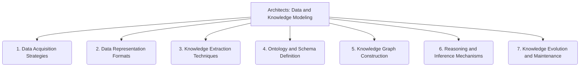

# Architects: Data and Knowledge Modeling - 7-Fold Division

This document applies the 7-fold division of the Heptad to the 'Data and Knowledge Modeling' thematic group under the 'Architects' archetype, providing a deeper level of granularity for how data and knowledge are represented and organized.

## 1. Data Acquisition Strategies

Methods and approaches for collecting, ingesting, and integrating raw data from various sources into the system.

## 2. Data Representation Formats

The structures, encodings, and schemas used to store, organize, and exchange data within the system, ensuring consistency and interoperability.

## 3. Knowledge Extraction Techniques

Approaches and algorithms for deriving meaningful insights, patterns, and explicit knowledge from raw or processed data.

## 4. Ontology and Schema Definition

The formal specification of concepts, entities, attributes, and their relationships, providing a structured vocabulary for the knowledge domain.

## 5. Knowledge Graph Construction

The process of building interconnected networks of entities and their relationships, enabling semantic querying and discovery.

## 6. Reasoning and Inference Mechanisms

Methods and logical frameworks for drawing new conclusions, inferring implicit relationships, and validating consistency within the knowledge base.

## 7. Knowledge Evolution and Maintenance

Strategies and processes for updating, refining, curating, and ensuring the accuracy and relevance of the knowledge base over time.

---

## Visual Representation (Mermaid Diagram)

