# Architects: Data and Knowledge Modeling - Automated Rule Generation - 19-Fold Division

This document applies a 19-fold division to the 'Automated Rule Generation' facet of 'Axioms and Rules' under the 'Architects' archetype, providing a deeper level of granularity for the process of automatically deriving rules.

## 1. Data Source Identification

Locating and selecting relevant and high-quality data sources that contain patterns suitable for rule inference.

## 2. Data Preprocessing

Cleaning, transforming, and preparing raw data for rule mining algorithms, including handling missing values, noise, and inconsistencies.

## 3. Rule Mining Algorithms

Choosing and applying appropriate algorithms (e.g., association rule learning, inductive logic programming, decision tree induction) to discover patterns and relationships.

## 4. Pattern Representation

How discovered patterns are initially represented (e.g., frequent itemsets, logical clauses, decision rules) before being formalized as rules.

## 5. Rule Filtering and Pruning

Removing redundant, trivial, uninteresting, or statistically insignificant rules to reduce complexity and improve quality.

## 6. Rule Evaluation Metrics

Criteria for assessing the quality, significance, and utility of generated rules (e.g., support, confidence, lift, comprehensibility, novelty).

## 7. Domain Expert Feedback Integration

Incorporating human knowledge, validation, and guidance from domain experts to refine, prioritize, or correct automatically generated rules.

## 8. Conflict Detection and Resolution

Identifying and resolving contradictions, overlaps, or inconsistencies among generated rules to ensure a coherent and logical rule set.

## 9. Rule Refinement and Generalization

Improving the precision, recall, and applicability of rules, including generalizing specific patterns to broader contexts.

## 10. Rule Language Translation

Converting discovered patterns into a formal rule language (e.g., OWL, SWRL, Datalog, Prolog) suitable for machine processing and reasoning.

## 11. Performance and Scalability

Optimizing the rule generation process to efficiently handle large datasets, high-dimensional data, and complex rule sets.

## 12. Explainability of Generated Rules

Making the rationale, evidence, and underlying patterns behind automatically generated rules understandable and transparent to human users.

## 13. Version Control and Evolution

Managing changes to automatically generated rule sets over time, including tracking revisions, handling updates, and ensuring consistency.

## 14. Security and Privacy Considerations

Ensuring that rule generation respects data privacy, avoids unintended inferences of sensitive information, and prevents malicious rule creation.

## 15. Real-time Rule Adaptation

Mechanisms for dynamically updating, modifying, or generating new rules based on streaming data or changing environmental conditions.

## 16. Hybrid Approaches

Combining automated rule generation techniques with manual rule crafting, expert systems, or other knowledge engineering methodologies.

## 17. Benchmarking and Validation

Rigorously testing the effectiveness, accuracy, and performance of automatically generated rules against ground truth or established benchmarks.

## 18. User Interface for Rule Management

Tools and interfaces for domain experts to review, modify, deploy, and monitor automatically generated rules, facilitating human-in-the-loop processes.

## 19. Ethical Implications of Automated Rules

Considering the societal impact, potential biases, fairness, and accountability issues embedded in automatically derived rules, especially in critical applications.

---

## Visual Representation (Mermaid Diagram)

```mermaid
graph TD
    A[Architects: Automated Rule Generation] --> B(1. Data Source Identification)
    A --> C(2. Data Preprocessing)
    A --> D(3. Rule Mining Algorithms)
    A --> E(4. Pattern Representation)
    A --> F(5. Rule Filtering and Pruning)
    A --> G(6. Rule Evaluation Metrics)
    A --> H(7. Domain Expert Feedback Integration)
    A --> I(8. Conflict Detection and Resolution)
    A --> J(9. Rule Refinement and Generalization)
    A --> K(10. Rule Language Translation)
    A --> L(11. Performance and Scalability)
    A --> M(12. Explainability of Generated Rules)
    A --> N(13. Version Control and Evolution)
    A --> O(14. Security and Privacy Considerations)
    A --> P(15. Real-time Rule Adaptation)
    A --> Q(16. Hybrid Approaches)
    A --> R(17. Benchmarking and Validation)
    A --> S(18. User Interface for Rule Management)
    A --> T(19. Ethical Implications of Automated Rules)
```

