# Architects: Data and Knowledge Modeling - Axioms and Rules - 17-Fold Division

This document applies a 17-fold division to the 'Axioms and Rules' facet of 'Schema Definition' under the 'Architects' archetype, providing a deeper level of granularity for defining logical statements and constraints within a knowledge graph schema.

## 1. Logical Consistency

Ensuring that the defined rules and axioms do not lead to contradictions or inconsistencies within the knowledge graph, maintaining its integrity.

## 2. Completeness

Covering all necessary logical inferences, constraints, and domain-specific knowledge required for comprehensive reasoning within the schema.

## 3. Expressivity

The power and richness of the rule language to capture complex logical relationships, nuanced conditions, and intricate domain semantics.

## 4. Decidability

Whether it is possible to algorithmically determine if a statement is true, false, or unknown based on the defined rules and the current state of the knowledge graph.

## 5. Computational Complexity

The resources (time and memory) required to process, apply, and evaluate the rules, impacting the feasibility of real-time reasoning.

## 6. Rule Syntax and Semantics

The formal definition of how rules are written (syntax) and how they are interpreted (semantics), ensuring unambiguous understanding and execution.

## 7. Inference Engine Integration

How the rules are processed and utilized by a reasoning engine or rule engine to derive new knowledge and enforce constraints within the graph.

## 8. Conflict Resolution

Strategies and mechanisms for handling situations where multiple rules might lead to conflicting conclusions or actions, ensuring deterministic outcomes.

## 9. Rule Prioritization

Defining the order or precedence in which rules are applied, especially in systems where rule application order impacts the outcome.

## 10. Debugging and Tracing

Tools and methods for understanding how rules are being applied, why certain conclusions are reached, and for identifying errors in rule definitions.

## 11. Version Control and Evolution

Managing changes to the rule set over time, including tracking revisions, handling deprecations, and ensuring compatibility with evolving schemas.

## 12. Modularity and Reusability

Designing rule sets to be composed of independent, self-contained, and reusable modules, facilitating maintenance and extensibility.

## 13. Documentation and Examples

Providing clear explanations, definitions, and illustrative examples of the rules, their intended behavior, and their impact on the knowledge graph.

## 14. Performance Optimization

Techniques and strategies for improving the efficiency and speed of rule processing, especially for large-scale knowledge graphs.

## 15. Scalability

How the rule system performs and maintains its effectiveness with increasing numbers of rules, data instances, and complexity of inferences.

## 16. Human Readability

Ensuring that rules are understandable and interpretable by domain experts and non-logicians, facilitating collaboration and validation.

## 17. Automated Rule Generation

Exploring methods and techniques for automatically deriving new rules from existing data, patterns, or other knowledge sources, reducing manual effort.

---

## Visual Representation (Mermaid Diagram)

```mermaid
graph TD
    A[Architects: Axioms and Rules] --> B(1. Logical Consistency)
    A --> C(2. Completeness)
    A --> D(3. Expressivity)
    A --> E(4. Decidability)
    A --> F(5. Computational Complexity)
    A --> G(6. Rule Syntax and Semantics)
    A --> H(7. Inference Engine Integration)
    A --> I(8. Conflict Resolution)
    A --> J(9. Rule Prioritization)
    A --> K(10. Debugging and Tracing)
    A --> L(11. Version Control and Evolution)
    A --> M(12. Modularity and Reusability)
    A --> N(13. Documentation and Examples)
    A --> O(14. Performance Optimization)
    A --> P(15. Scalability)
    A --> Q(16. Human Readability)
    A --> R(17. Automated Rule Generation)
```

