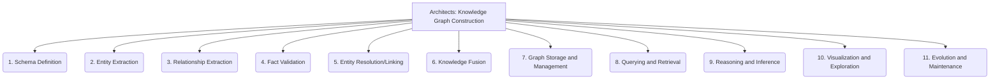

# Architects: Data and Knowledge Modeling - Knowledge Graph Construction - 11-Fold Division

This document applies an 11-fold division to the 'Knowledge Graph Construction' facet of 'Data and Knowledge Modeling' under the 'Architects' archetype, providing a deeper level of granularity for building and managing knowledge graphs.

## 1. Schema Definition

Designing the ontology, vocabulary, and formal structure for the knowledge graph, defining entity types, relationships, and attributes.

## 2. Entity Extraction

Identifying and extracting key entities (e.g., persons, organizations, concepts) from unstructured or semi-structured raw data sources.

## 3. Relationship Extraction

Discovering and extracting connections, associations, and semantic relationships between identified entities from various data sources.

## 4. Fact Validation

Verifying the accuracy, consistency, and truthfulness of extracted facts and relationships before their inclusion in the knowledge graph.

## 5. Entity Resolution/Linking

Identifying and merging duplicate or referring entities across different data sources, ensuring a unified representation of real-world objects.

## 6. Knowledge Fusion

Integrating and harmonizing information from multiple, diverse, and potentially conflicting data sources into a coherent knowledge graph.

## 7. Graph Storage and Management

Choosing and implementing appropriate graph databases or storage solutions for efficient storage, retrieval, and management of the knowledge graph.

## 8. Querying and Retrieval

Developing methods, languages (e.g., SPARQL), and tools for efficiently querying and retrieving specific information or patterns from the knowledge graph.

## 9. Reasoning and Inference

Enabling the knowledge graph to derive new, implicit knowledge, infer logical conclusions, and discover hidden relationships from existing facts.

## 10. Visualization and Exploration

Tools and techniques for visually representing the knowledge graph, allowing users to explore its structure, entities, and relationships interactively.

## 11. Evolution and Maintenance

Strategies and processes for continuously updating, curating, refining, and ensuring the quality and relevance of the knowledge graph over time.

---

## Visual Representation (Mermaid Diagram)

