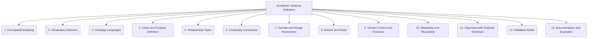

# Architects: Data and Knowledge Modeling - Schema Definition - 13-Fold Division

This document applies a 13-fold division to the 'Schema Definition' facet of 'Knowledge Graph Construction' under the 'Architects' archetype, providing a deeper level of granularity for designing the ontology and vocabulary for a knowledge graph.

## 1. Conceptual Modeling

Identifying the core concepts, entities, and their high-level relationships within the domain, forming the abstract foundation of the schema.

## 2. Vocabulary Selection

Choosing or defining the specific terms, properties, and identifiers to be used in the schema, ensuring clarity and consistency.

## 3. Ontology Languages

Selecting appropriate formal languages (e.g., OWL, RDFS, SHACL) for representing the schema, enabling machine readability and reasoning.

## 4. Class and Property Definition

Specifying the types of entities (classes) and their attributes (properties), including data types, ranges, and characteristics.

## 5. Relationship Types

Defining the various kinds of connections, associations, and semantic relationships that can exist between entities in the graph.

## 6. Cardinality Constraints

Setting rules for the minimum and maximum number of instances or values allowed for properties or relationships.

## 7. Domain and Range Restrictions

Specifying the types of entities that can serve as subjects (domain) and objects (range) for particular properties or relationships.

## 8. Axioms and Rules

Defining logical statements, inferences, and constraints that must hold true within the schema, enabling automated reasoning and validation.

## 9. Version Control and Evolution

Managing changes to the schema over time, including tracking revisions, handling deprecations, and ensuring backward compatibility.

## 10. Modularity and Reusability

Designing the schema to be composed of independent, reusable modules or components, facilitating extensibility and maintainability.

## 11. Alignment with External Schemas

Mapping concepts and properties to existing external ontologies, vocabularies, or industry standards to promote interoperability.

## 12. Validation Rules

Defining criteria and mechanisms for checking the consistency, completeness, and correctness of data instances against the defined schema.

## 13. Documentation and Examples

Providing clear explanations, definitions, and illustrative examples of the schema's structure, usage, and intended semantics.

---

## Visual Representation (Mermaid Diagram)

