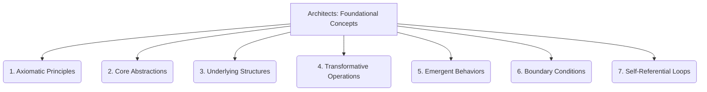

# Architects: Foundational Concepts - 7-Fold Division

This document applies the 7-fold division of the Heptad to the 'Foundational Concepts' thematic group under the 'Architects' archetype, providing a deeper level of granularity for these core ideas.

## 1. Axiomatic Principles

The irreducible truths and self-evident propositions that form the bedrock of the conceptual framework. These are the starting points that require no further proof within the system.

## 2. Core Abstractions

The fundamental conceptual models and representations that simplify complex realities, allowing for reasoning and manipulation at a higher level.

## 3. Underlying Structures

The basic organizational patterns and relationships that provide the skeletal framework for the system, defining how its components are arranged and interact.

## 4. Transformative Operations

The elementary actions or processes that change the state, form, or properties of entities within the system, driving its dynamic behavior.

## 5. Emergent Behaviors

The simple, predictable outcomes or patterns that arise from the interactions of basic components, often revealing properties not inherent in the individual parts.

## 6. Boundary Conditions

The limits, constraints, and defining parameters that delineate the scope and applicability of the foundational concepts, setting the stage for their operation.

## 7. Self-Referential Loops

The mechanisms by which the system reflects upon itself, its own definitions, or its own processes, leading to recursive understanding and meta-cognition.

---

## Visual Representation (Mermaid Diagram)

