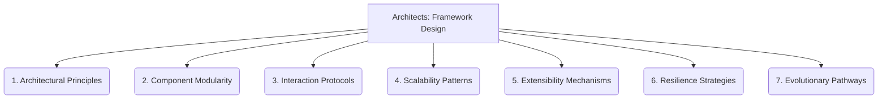

# Architects: Framework Design - 7-Fold Division

This document applies the 7-fold division of the Heptad to the 'Framework Design' thematic group under the 'Architects' archetype, providing a deeper level of granularity for the design principles of the overall system.

## 1. Architectural Principles

The core tenets and guiding philosophies that dictate the overall structure, organization, and behavior of the system.

## 2. Component Modularity

How the system is broken down into independent, self-contained, and reusable parts, promoting isolation and interchangeability.

## 3. Interaction Protocols

The defined rules, standards, and mechanisms governing communication, data exchange, and collaboration between different components.

## 4. Scalability Patterns

Design choices and strategies employed to enable the system to efficiently handle increasing demands, loads, or data volumes.

## 5. Extensibility Mechanisms

The provisions and approaches that allow for the seamless addition of new features, functionalities, or integrations without requiring significant rework of existing components.

## 6. Resilience Strategies

Methods and techniques implemented to ensure the system's robustness, fault tolerance, and ability to recover gracefully from failures or unexpected conditions.

## 7. Evolutionary Pathways

The planned or anticipated future development, adaptation, and transformation of the framework, considering its long-term growth and changing requirements.

---

## Visual Representation (Mermaid Diagram)

