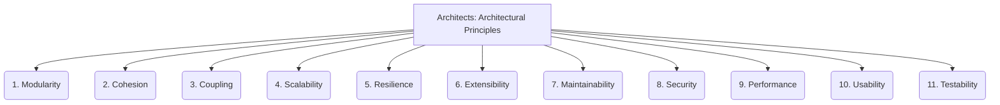

# Architects: Framework Design - Architectural Principles - 11-Fold Division

This document applies an 11-fold division to the 'Architectural Principles' facet of 'Framework Design' under the 'Architects' archetype, providing a deeper level of granularity for the core tenets guiding the overall system structure.

## 1. Modularity

Breaking down a system into independent, interchangeable components, each responsible for a specific function, to simplify design and maintenance.

## 2. Cohesion

The degree to which elements within a module or component belong together, indicating how well they work as a single, focused unit.

## 3. Coupling

The degree of interdependence between software modules, aiming for loose coupling to reduce the impact of changes in one module on others.

## 4. Scalability

The ability of a system to handle a growing amount of work, users, or data by adding resources, without significant performance degradation.

## 5. Resilience

The ability of a system to recover gracefully from failures, adapt to changing conditions, and maintain functionality in the face of disruptions.

## 6. Extensibility

The ease with which new features, functionalities, or components can be added to a system without requiring major changes to existing code.

## 7. Maintainability

The ease with which a system can be modified, understood, repaired, and enhanced over its lifecycle.

## 8. Security

Protecting the system from unauthorized access, use, disclosure, disruption, modification, or destruction, ensuring data integrity and confidentiality.

## 9. Performance

The responsiveness, throughput, and efficiency of the system in executing its tasks, often measured by speed, resource consumption, and latency.

## 10. Usability

The ease with which users can learn to operate, understand, and interact with the system effectively and efficiently.

## 11. Testability

The ease with which a system or its components can be tested to ensure their correctness, reliability, and adherence to requirements.

---

## Visual Representation (Mermaid Diagram)

