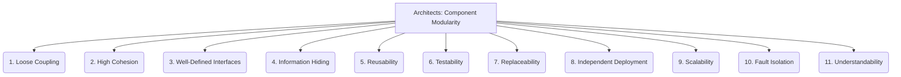

# Architects: Framework Design - Component Modularity - 11-Fold Division

This document applies an 11-fold division to the 'Component Modularity' facet of 'Framework Design' under the 'Architects' archetype, providing a deeper level of granularity for how the system is broken down into independent, reusable parts.

## 1. Loose Coupling

Minimizing dependencies between components, so that changes in one component have minimal impact on others.

## 2. High Cohesion

Grouping related functionalities within a single component, ensuring that elements within it work together for a common purpose.

## 3. Well-Defined Interfaces

Clear, stable, and unambiguous contracts for how components interact with each other, specifying inputs, outputs, and behaviors.

## 4. Information Hiding

Concealing internal implementation details of a component, exposing only necessary interfaces to the outside world.

## 5. Reusability

Designing components that can be easily used in different contexts, applications, or parts of the system without significant modification.

## 6. Testability

Components that are easy to test in isolation, allowing for focused unit testing and simplified debugging.

## 7. Replaceability

Components that can be swapped out or upgraded with new implementations without affecting the rest of the system, provided they adhere to the same interface.

## 8. Independent Deployment

Components that can be deployed independently.

## 9. Scalability

Components that can be scaled independently.

## 10. Fault Isolation

Limiting the impact of failures to a single component.

## 11. Understandability

Components that are easy to comprehend and reason about.

---

## Visual Representation (Mermaid Diagram)

