# Architects: Framework Design - Encapsulation - 17-Fold Division

This document applies a 17-fold division to the 'Encapsulation' facet of 'Modularity' under the 'Architects' archetype, providing a deeper level of granularity for hiding internal implementation details of a module.

## 1. Access Modifiers

Keywords (e.g., `public`, `private`, `protected`, `internal`) that control the visibility and accessibility of class members or module components.

## 2. Information Hiding

Concealing the internal data structures, algorithms, and implementation details of a module from its external users.

## 3. Data Integrity

Protecting data from unauthorized or accidental modification by restricting direct access and enforcing controlled manipulation through methods.

## 4. Reduced Coupling

Minimizing dependencies between modules by hiding their internals, so changes to one module have less impact on others.

## 5. Increased Cohesion

Grouping related data and methods within a single unit, ensuring that elements within a module work together for a common, well-defined purpose.

## 6. Abstraction

Presenting a simplified, high-level view of complex functionality, allowing users to interact with the module without needing to know its intricate details.

## 7. Interface Design

Defining clear, stable, and well-documented contracts (interfaces) for how modules interact, without exposing their underlying implementation.

## 8. Constructor Control

Managing how objects are created and initialized, often through constructors that enforce initial state validity and prevent invalid object creation.

## 9. Getter/Setter Methods

Providing controlled access to private data members through public methods, allowing for validation or transformation during access.

## 10. Immutability

Designing objects or data structures whose state cannot be changed after creation, simplifying concurrency and reasoning about state.

## 11. Encapsulation Boundaries

Clearly defining what belongs inside and outside a module, establishing its responsibilities and interaction points.

## 12. Design Patterns

Utilizing established design patterns (e.g., Facade, Proxy, Builder, Adapter) to enforce or improve encapsulation in complex systems.

## 13. Language Features

Leveraging language-specific features that inherently support encapsulation (e.g., classes, modules, namespaces, private fields).

## 14. Testing Implications

How encapsulation affects the ease of testing individual units, often making it easier to test components in isolation.

## 15. Security Benefits

Reducing the attack surface by limiting direct access to sensitive components or data, thereby enhancing the system's security posture.

## 16. Maintainability Benefits

Making it easier to modify or refactor internal implementation details of a module without breaking external users, as long as the interface remains stable.

## 17. Refactoring Opportunities

Identifying areas in existing code where encapsulation can be improved, leading to cleaner design and better maintainability.

---

## Visual Representation (Mermaid Diagram)

```mermaid
graph TD
    A[Architects: Encapsulation] --> B(1. Access Modifiers)
    A --> C(2. Information Hiding)
    A --> D(3. Data Integrity)
    A --> E(4. Reduced Coupling)
    A --> F(5. Increased Cohesion)
    A --> G(6. Abstraction)
    A --> H(7. Interface Design)
    A --> I(8. Constructor Control)
    A --> J(9. Getter/Setter Methods)
    A --> K(10. Immutability)
    A --> L(11. Encapsulation Boundaries)
    A --> M(12. Design Patterns)
    A --> N(13. Language Features)
    A --> O(14. Testing Implications)
    A --> P(15. Security Benefits)
    A --> Q(16. Maintainability Benefits)
    A --> R(17. Refactoring Opportunities)
```

