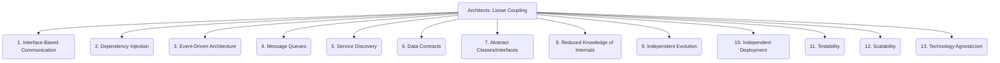

# Architects: Framework Design - Loose Coupling - 13-Fold Division

This document applies a 13-fold division to the 'Loose Coupling' facet of 'Component Modularity' under the 'Architects' archetype, providing a deeper level of granularity for minimizing dependencies between components.

## 1. Interface-Based Communication

Components interact through well-defined interfaces or contracts rather than concrete implementations, allowing for flexibility and interchangeability.

## 2. Dependency Injection

Providing dependencies to a component from an external source rather than having the component create them internally, reducing direct coupling.

## 3. Event-Driven Architecture

Components communicate by publishing and subscribing to events, reducing direct dependencies and enabling asynchronous interactions.

## 4. Message Queues

Using asynchronous messaging systems to decouple producers and consumers of messages, allowing them to operate independently.

## 5. Service Discovery

Components dynamically locate and connect to services at runtime, rather than relying on hardcoded addresses, promoting flexibility in distributed systems.

## 6. Data Contracts

Agreeing on data formats and schemas between components without exposing internal data structures, ensuring compatibility while hiding implementation details.

## 7. Abstract Classes/Interfaces

Defining common behavior or structure through abstract classes or interfaces, allowing different implementations to be swapped in without affecting consumers.

## 8. Reduced Knowledge of Internals

Components have minimal awareness of each other's internal workings, interacting only through their public interfaces.

## 9. Independent Evolution

Changes in one component have minimal impact on other components, allowing them to evolve and be updated independently.

## 10. Independent Deployment

Components can be deployed, updated, or rolled back independently of other parts of the system, facilitating continuous delivery.

## 11. Testability

Components can be tested in isolation without complex setups or reliance on other components, simplifying unit and integration testing.

## 12. Scalability

Components can be scaled independently, allowing for efficient resource allocation and performance optimization in distributed systems.

## 13. Technology Agnosticism

Components are not tied to a specific technology stack or programming language, allowing for greater flexibility and future migration.

---

## Visual Representation (Mermaid Diagram)

