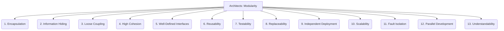

# Architects: Framework Design - Modularity - 13-Fold Division

This document applies a 13-fold division to the 'Modularity' facet of 'Architectural Principles' under the 'Architects' archetype, providing a deeper level of granularity for breaking down a system into independent, interchangeable components.

## 1. Encapsulation

Hiding the internal implementation details of a module, exposing only necessary interfaces to the outside world.

## 2. Information Hiding

Preventing direct access to internal data or logic, ensuring that changes to one part of the system do not inadvertently affect others.

## 3. Loose Coupling

Minimizing dependencies between modules, so that changes in one module have minimal impact on others.

## 4. High Cohesion

Grouping related functionalities and responsibilities within a single module, ensuring that elements within it work together for a common purpose.

## 5. Well-Defined Interfaces

Clear, stable, and unambiguous contracts for how modules interact with each other, specifying inputs, outputs, and behaviors.

## 6. Reusability

Designing modules that can be easily used in different contexts, applications, or parts of the system without significant modification.

## 7. Testability

Modules that are easy to test in isolation, allowing for focused unit testing and simplified debugging.

## 8. Replaceability

Modules that can be swapped out or upgraded with new implementations without affecting the rest of the system, provided they adhere to the same interface.

## 9. Independent Deployment

Modules that can be deployed, updated, or rolled back independently of other parts of the system, facilitating continuous delivery.

## 10. Scalability

Modules that can be scaled independently, allowing for efficient resource allocation and performance optimization.

## 11. Fault Isolation

Limiting the impact of failures or errors to a single module, preventing them from cascading and affecting the entire system.

## 12. Parallel Development

Allowing different teams or developers to work on separate modules concurrently, speeding up development time.

## 13. Understandability

Modules that are easy to comprehend, reason about, and maintain due to their clear boundaries, focused responsibilities, and well-defined interfaces.

---

## Visual Representation (Mermaid Diagram)

