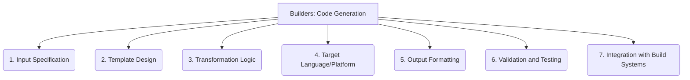

# Builders: Code Generation - 7-Fold Division

This document applies the 7-fold division of the Heptad to the 'Code Generation' thematic group under the 'Builders' archetype, providing a deeper level of granularity for the process of generating code.

## 1. Input Specification

Defining the source, model, or abstract representation from which the code is to be generated, serving as the primary input to the generation process.

## 2. Template Design

Creating reusable patterns, structures, or boilerplate code that serves as the foundation for the generated output, ensuring consistency and adherence to standards.

## 3. Transformation Logic

The rules, algorithms, and mappings that convert the input specification into the desired code structure, implementing the core generation intelligence.

## 4. Target Language/Platform

Specifying the particular programming language, framework, or execution environment for which the code is being generated, influencing syntax and conventions.

## 5. Output Formatting

Ensuring the generated code adheres to specific style guides, formatting rules, and best practices, enhancing readability and maintainability.

## 6. Validation and Testing

Processes for verifying the correctness, functionality, and adherence to requirements of the generated code, often through automated tests.

## 7. Integration with Build Systems

How the generated code is seamlessly incorporated into the overall project's build process, compilation, and deployment pipelines.

---

## Visual Representation (Mermaid Diagram)

