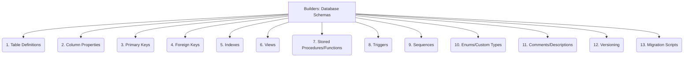

# Builders: Code Generation - Database Schemas - 13-Fold Division

This document applies a 13-fold division to the 'Database Schemas' facet of 'Input Specification' under the 'Builders' archetype, providing a deeper level of granularity for generating code based on database definitions.

## 1. Table Definitions

Specifying table names, their columns, data types, and basic constraints, forming the fundamental structure of the database.

## 2. Column Properties

Details for each column, including nullability, default values, auto-increment settings, and specific data type parameters.

## 3. Primary Keys

Unique identifiers for each row within a table, ensuring data integrity and efficient retrieval.

## 4. Foreign Keys

Defining relationships between tables, ensuring referential integrity and consistency across related data.

## 5. Indexes

Structures created on columns to optimize query performance and speed up data retrieval operations.

## 6. Views

Virtual tables based on the result-set of a SQL query, providing simplified or customized perspectives of the underlying data.

## 7. Stored Procedures/Functions

Pre-compiled SQL code or routines stored in the database, encapsulating business logic and improving performance.

## 8. Triggers

Automated actions or SQL code that execute implicitly in response to specific events (e.g., INSERT, UPDATE, DELETE) on a table.

## 9. Sequences

Database objects used to generate unique numbers, typically for primary keys or other unique identifiers.

## 10. Enums/Custom Types

User-defined data types or enumerations within the database schema, providing more semantic meaning to data.

## 11. Comments/Descriptions

Metadata and explanatory text associated with tables, columns, views, and other database objects for documentation purposes.

## 12. Versioning

Managing changes to the database schema over time, including tracking revisions and ensuring compatibility across different versions.

## 13. Migration Scripts

Scripts or tools used to evolve the database schema from one version to another, ensuring data integrity during updates.

---

## Visual Representation (Mermaid Diagram)

