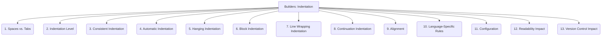

# Builders: Code Generation - Indentation - 13-Fold Division

This document applies a 13-fold division to the 'Indentation' facet of 'Output Formatting' under the 'Builders' archetype, providing a deeper level of granularity for how code is indented to reflect its structure.

## 1. Spaces vs. Tabs

The choice between using space characters or tab characters for indentation, and the implications of each choice.

## 2. Indentation Level

The number of spaces or the width of a tab character used for each level of indentation.

## 3. Consistent Indentation

Maintaining uniform indentation throughout the entire codebase, avoiding mixed indentation styles.

## 4. Automatic Indentation

Utilizing IDE features, code formatters, or linters to automatically apply and enforce indentation rules.

## 5. Hanging Indentation

Indenting subsequent lines of a multi-line statement (e.g., function calls, array literals) to align with the start of the expression.

## 6. Block Indentation

Indenting entire code blocks (e.g., function bodies, loop bodies, conditional statements) to visually represent their scope.

## 7. Line Wrapping Indentation

How lines are indented when they exceed the maximum line length and are wrapped to the next line.

## 8. Continuation Indentation

Indenting lines that are a logical continuation of a previous line, such as chained method calls or long expressions.

## 9. Alignment

Aligning code elements vertically (e.g., variable declarations, function parameters) for improved readability.

## 10. Language-Specific Rules

Adhering to indentation conventions and best practices specific to a particular programming language or community.

## 11. Configuration

How indentation rules are defined, stored, and managed within project settings (e.g., `.editorconfig`, `prettierrc`, `clang-format`).

## 12. Readability Impact

How indentation affects the visual clarity, scannability, and understanding of code structure and logical flow.

## 13. Version Control Impact

How inconsistent indentation can lead to unnecessary diffs, merge conflicts, and difficulties in code collaboration.

---

## Visual Representation (Mermaid Diagram)

