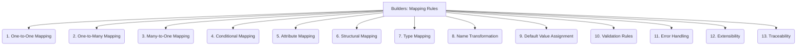

# Builders: Code Generation - Mapping Rules - 13-Fold Division

This document applies a 13-fold division to the 'Mapping Rules' facet of 'Transformation Logic' under the 'Builders' archetype, providing a deeper level of granularity for defining how input elements translate to output code constructs.

## 1. One-to-One Mapping

A single input element or attribute directly translates to a single corresponding output code construct or variable.

## 2. One-to-Many Mapping

A single input element or attribute generates multiple corresponding output code constructs, such as a single model generating multiple files.

## 3. Many-to-One Mapping

Multiple input elements or attributes combine to generate a single output code construct, often through aggregation or synthesis.

## 4. Conditional Mapping

Mapping logic that applies only when specific conditions or criteria in the input data or model are met.

## 5. Attribute Mapping

Rules for translating individual properties, fields, or attributes from the input model to their representation in the generated code.

## 6. Structural Mapping

Rules for transforming complex data structures, hierarchies, or relationships from the input model into corresponding code structures (e.g., classes, nested objects).

## 7. Type Mapping

Rules for converting data types between the input model's type system and the target programming language's type system.

## 8. Name Transformation

Rules for converting names (e.g., from `snake_case` to `camelCase`), ensuring naming conventions are followed in the generated code.

## 9. Default Value Assignment

Rules for providing default values to output code constructs if a corresponding input attribute is missing or not specified.

## 10. Validation Rules

Ensuring that input data conforms to predefined expectations or schemas before applying mapping rules, preventing invalid code generation.

## 11. Error Handling

How the mapping rules manage and report errors (e.g., missing input, invalid types, conflicting rules) during the transformation process.

## 12. Extensibility

How new mapping rules can be added, existing ones modified, or custom mapping logic integrated into the code generation system.

## 13. Traceability

Linking specific output code elements back to the mapping rules and input elements that contributed to their generation, aiding debugging and understanding.

---

## Visual Representation (Mermaid Diagram)

