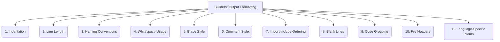

# Builders: Code Generation - Output Formatting - 11-Fold Division

This document applies an 11-fold division to the 'Output Formatting' facet of 'Code Generation' under the 'Builders' archetype, providing a deeper level of granularity for ensuring generated code adheres to style guides and best practices.

## 1. Indentation

Using consistent indentation (e.g., spaces or tabs, and the number of spaces/tabs) to reflect code structure and hierarchy.

## 2. Line Length

Adhering to a maximum number of characters per line to improve readability and prevent horizontal scrolling.

## 3. Naming Conventions

Applying consistent naming styles (e.g., camelCase, snake_case, PascalCase) for variables, functions, classes, and files.

## 4. Whitespace Usage

Consistent use of spaces around operators, parentheses, etc.

## 5. Brace Style

Placement of curly braces (e.g., K&R, Allman).

## 6. Comment Style

Formatting of comments (e.g., single-line, multi-line, Javadoc).

## 7. Import/Include Ordering

Standardizing the order of import or include statements.

## 8. Blank Lines

Consistent use of blank lines to separate code blocks.

## 9. Code Grouping

Grouping related code elements (e.g., fields, constructors, methods).

## 10. File Headers

Including standard headers (e.g., copyright, license, author).

## 11. Language-Specific Idioms

Adhering to common patterns and best practices for the target language.

---

## Visual Representation (Mermaid Diagram)

