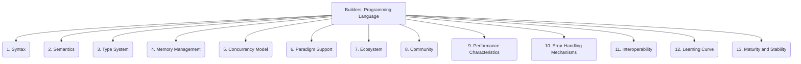

# Builders: Code Generation - Programming Language - 13-Fold Division

This document applies a 13-fold division to the 'Programming Language' facet of 'Target Language/Platform' under the 'Builders' archetype, providing a deeper level of granularity for understanding the characteristics of a programming language.

## 1. Syntax

The set of rules governing the structure and arrangement of code elements, defining how programs are written.

## 2. Semantics

The meaning of code constructs, defining how programs behave and what operations they perform.

## 3. Type System

How the language handles data types, including whether it's static or dynamic, strong or weak, and its support for type inference.

## 4. Memory Management

How memory is allocated, deallocated, and managed during program execution (e.g., garbage collection, manual memory management, ownership models).

## 5. Concurrency Model

How the language supports and manages parallel execution of tasks, including features like threads, async/await, goroutines, or actors.

## 6. Paradigm Support

Whether the language supports or encourages specific programming paradigms (e.g., object-oriented, functional, procedural, declarative, aspect-oriented).

## 7. Ecosystem

The availability and richness of libraries, frameworks, tools, and external resources that support development in the language.

## 8. Community

The size, activity, and supportiveness of the developer community, including forums, open-source contributions, and educational resources.

## 9. Performance Characteristics

Typical execution speed, resource consumption (CPU, memory), and optimization capabilities of programs written in the language.

## 10. Error Handling Mechanisms

How the language manages and propagates errors, exceptions, and unexpected conditions during program execution.

## 11. Interoperability

How easily the language integrates with other languages, systems, platforms, or existing codebases.

## 12. Learning Curve

The difficulty for new developers to learn, understand, and become proficient in the language, including its core concepts and idioms.

## 13. Maturity and Stability

The language's age, reliability, active development, backward compatibility, and the frequency of breaking changes.

---

## Visual Representation (Mermaid Diagram)

