# Builders: Code Generation - Programming Language - Syntax - 17-Fold Division

This document applies a 17-fold division to the 'Syntax' facet of 'Programming Language' under the 'Builders' archetype, providing a deeper level of granularity for the rules governing the structure of code.

## 1. Keywords

Reserved words with special meaning in the language that cannot be used as identifiers (e.g., `if`, `for`, `class`, `func`, `let`).

## 2. Operators

Symbols representing operations on values (e.g., arithmetic `+`, `-`, `*`, `/`; comparison `=`, `==`; logical `AND`, `OR`).

## 3. Delimiters

Characters or character sequences used to separate or enclose code elements (e.g., parentheses `( )`, curly braces `{ }`, square brackets `[ ]`, semicolons `;`).

## 4. Identifiers

Rules for naming variables, functions, classes, modules, and other user-defined entities, including allowed characters and starting rules.

## 5. Literals

How constant values are represented directly in the code (e.g., numbers `123`, strings `"hello"`, booleans `true/false`).

## 6. Comments

Syntax for adding non-executable notes or explanations within the code, ignored by the compiler/interpreter (e.g., `//`, `/* */`, `#`).

## 7. Control Structures

Syntax for conditional statements (`if/else`, `switch`), loops (`for`, `while`, `do-while`), and jump statements (`break`, `continue`, `return`).

## 8. Function/Method Definition

How functions, procedures, or methods are declared, including their name, parameters, and return type.

## 9. Class/Object Definition

How classes, objects, structs, or other composite data types are defined, including their members and methods.

## 10. Module/Package System

Syntax for organizing code into modules, packages, or namespaces, and how to import or export components.

## 11. Error Handling Syntax

How errors or exceptions are handled and propagated within the language (e.g., `try-catch-finally`, `panic-recover`, `Result` types).

## 12. Type Annotation Syntax

How data types are explicitly declared for variables, function parameters, and return values, or how type inference is indicated.

## 13. Whitespace Significance

Whether whitespace (spaces, tabs, newlines) affects the parsing or interpretation of the code (e.g., Python vs. C++).

## 14. Statement Terminators

Characters or conventions that mark the end of a statement or instruction (e.g., semicolon `;`, newline).

## 15. Expression Syntax

Rules for combining values, variables, and operators to produce a result, forming the building blocks of computations.

## 16. Declaration vs. Definition

Distinguishing between declaring an entity (e.g., a function signature) and defining its full implementation.

## 17. Metaprogramming Syntax

Language features for writing code that manipulates code itself (e.g., macros, decorators, reflection, code generation directives).

---

## Visual Representation (Mermaid Diagram)

```mermaid
graph TD
    A[Builders: Syntax] --> B(1. Keywords)
    A --> C(2. Operators)
    A --> D(3. Delimiters)
    A --> E(4. Identifiers)
    A --> F(5. Literals)
    A --> G(6. Comments)
    A --> H(7. Control Structures)
    A --> I(8. Function/Method Definition)
    A --> J(9. Class/Object Definition)
    A --> K(10. Module/Package System)
    A --> L(11. Error Handling Syntax)
    A --> M(12. Type Annotation Syntax)
    A --> N(13. Whitespace Significance)
    A --> O(14. Statement Terminators)
    A --> P(15. Expression Syntax)
    A --> Q(16. Declaration vs. Definition)
    A --> R(17. Metaprogramming Syntax)
```

