# Builders: Code Generation - Table Definitions - 17-Fold Division

This document applies a 17-fold division to the 'Table Definitions' facet of 'Database Schemas' under the 'Builders' archetype, providing a deeper level of granularity for defining the fundamental structure of database tables.

## 1. Table Name

The unique identifier or label assigned to the table within the database schema.

## 2. Column Names

The names of individual attributes or fields within the table, representing distinct pieces of data.

## 3. Data Types

The type of data stored in each column (e.g., INT, VARCHAR, DATE, BOOLEAN), defining its nature and allowed values.

## 4. Constraints

Rules applied to columns or tables to enforce data integrity and business rules (e.g., NOT NULL, UNIQUE, CHECK, DEFAULT).

## 5. Primary Key

The column or set of columns that uniquely identify each row in the table, ensuring data uniqueness and providing a primary access point.

## 6. Foreign Keys

Columns that link to primary keys in other tables, establishing relationships between tables and enforcing referential integrity.

## 7. Default Values

Predefined values that are automatically inserted into a column if no value is explicitly provided during data insertion.

## 8. Nullability

Whether a column can contain NULL values (absence of data) or must always have a value.

## 9. Auto-Increment/Identity

Automatically generated sequential numbers for primary keys, simplifying unique identifier assignment.

## 10. Indexes

Special lookup tables that the database search engine can use to speed up data retrieval operations.

## 11. Storage Engine/Table Type

The underlying mechanism or engine used by the database to store and manage data for the table (e.g., InnoDB, MyISAM in MySQL).

## 12. Collation

Rules for sorting and comparing character data within a column, affecting string comparisons and ordering.

## 13. Character Set

The encoding used for storing character data in the table, determining the range of characters that can be represented.

## 14. Comments/Descriptions

Explanatory text or metadata associated with the table and its columns, providing documentation within the schema itself.

## 15. Partitioning

Dividing a large table into smaller, more manageable pieces based on a defined scheme, often for performance or maintenance.

## 16. Temporal Columns

Columns specifically designed for tracking creation timestamps, modification timestamps, or validity periods of data.

## 17. Table-Level Constraints

Constraints that apply to the entire table rather than just individual columns, often involving relationships between multiple columns.

---

## Visual Representation (Mermaid Diagram)

```mermaid
graph TD
    A[Builders: Table Definitions] --> B(1. Table Name)
    A --> C(2. Column Names)
    A --> D(3. Data Types)
    A --> E(4. Constraints)
    A --> F(5. Primary Key)
    A --> G(6. Foreign Keys)
    A --> H(7. Default Values)
    A --> I(8. Nullability)
    A --> J(9. Auto-Increment/Identity)
    A --> K(10. Indexes)
    A --> L(11. Storage Engine/Table Type)
    A --> M(12. Collation)
    A --> N(13. Character Set)
    A --> O(14. Comments/Descriptions)
    A --> P(15. Partitioning)
    A --> Q(16. Temporal Columns)
    A --> R(17. Table-Level Constraints)
```

