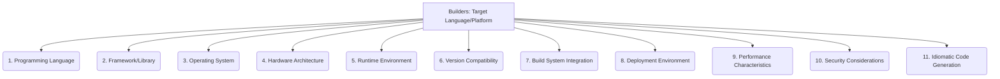

# Builders: Code Generation - Target Language/Platform - 11-Fold Division

This document applies an 11-fold division to the 'Target Language/Platform' facet of 'Code Generation' under the 'Builders' archetype, providing a deeper level of granularity for the specific environment for which code is generated.

## 1. Programming Language

The specific programming language for which the code is generated (e.g., Python, Java, C++, Rust, JavaScript, Go, C#).

## 2. Framework/Library

Specific frameworks or libraries within a language that the generated code will utilize or integrate with (e.g., React, Spring Boot, Django, .NET, Angular, Vue.js).

## 3. Operating System

The target operating system(s) where the generated code is intended to run (e.g., Linux, Windows, macOS, Android, iOS, embedded OS).

## 4. Hardware Architecture

The specific CPU architecture (e.g., x86, ARM, RISC-V) for which the code is optimized or compiled.

## 5. Runtime Environment

The specific runtime environment or virtual machine where the code will execute (e.g., JVM, Node.js, WebAssembly, .NET CLR).

## 6. Version Compatibility

Ensuring the generated code is compatible with specific versions of the target language, framework, or runtime.

## 7. Build System Integration

How the generated code fits into the target's existing build process and tools (e.g., Maven, Gradle, Cargo, npm, CMake, Make).

## 8. Deployment Environment

The specific environment where the code will be deployed and run (e.g., cloud, on-premise servers, containers, serverless, edge device).

## 9. Performance Characteristics

Optimizing generated code for the target's specific performance profile, considering factors like memory usage, CPU cycles, or network latency.

## 10. Security Considerations

Tailoring generated code to adhere to the target's security model, best practices, and common vulnerabilities.

## 11. Idiomatic Code Generation

Ensuring the generated code adheres to the target language's and framework's best practices, conventions, and idiomatic patterns, making it feel natural to developers.

---

## Visual Representation (Mermaid Diagram)

